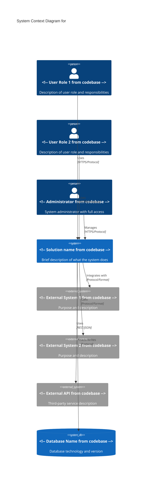
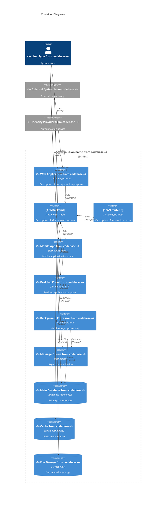
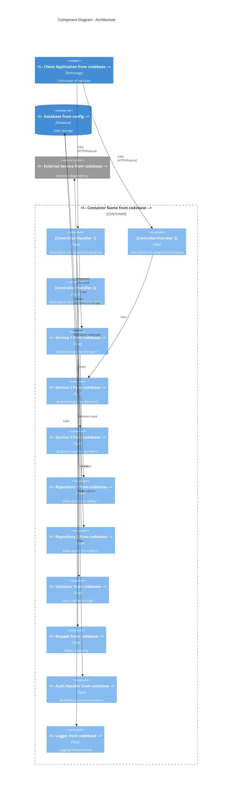
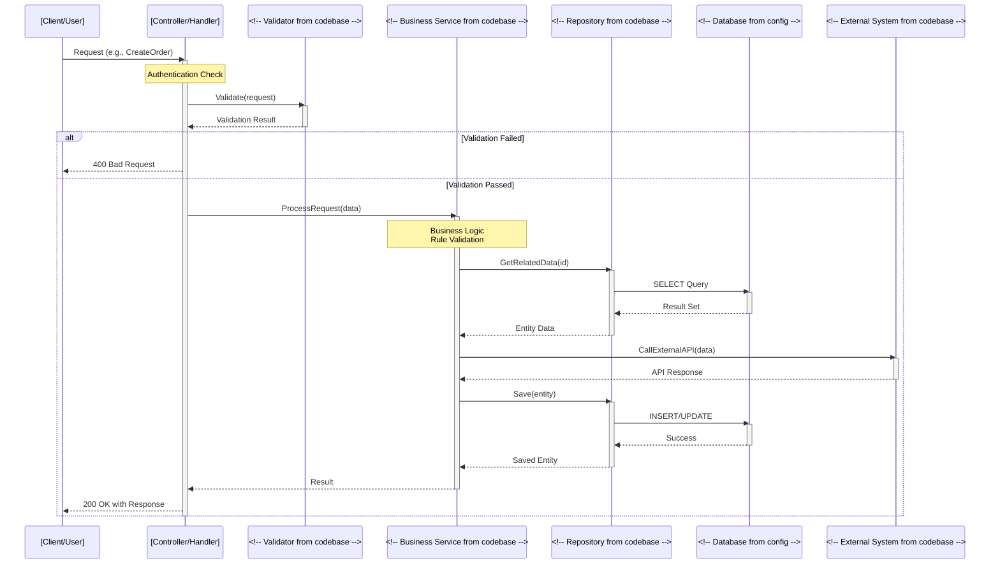

# System Architecture - <!-- Solution name from codebase -->

> This document provides a comprehensive architectural overview using the C4 model (Context, Container, Component, Code), detailing the system's structure, design patterns, quality attributes, and architectural decisions.

## Table of Contents

- [Executive Summary](#executive-summary)
- [C4 Architecture Diagrams](#c4-architecture-diagrams)
  - [Level 1: System Context Diagram](#level-1-system-context-diagram)
  - [Level 2: Container Diagram](#level-2-container-diagram)
  - [Level 3: Component Diagram](#level-3-component-diagram)
  - [Level 4: Code Structure](#level-4-code-structure)
- [Architectural Patterns](#architectural-patterns)
- [Architectural Characteristics](#architectural-characteristics)
- [Technology Stack](#technology-stack)
- [Architectural Decision Records (ADRs)](#architectural-decision-records-adrs)
- [Technical Debt Analysis](#technical-debt-analysis)
- [Appendix](#appendix)

---

## Executive Summary

<!-- Provide a high-level summary of the system architecture - 2-3 paragraphs covering: based on evidence from analysis -->

- System purpose and business context
- Overall architectural approach (e.g., three-tier, microservices, monolith)
- Key technology choices
- Major architectural characteristics

**Technology Stack Summary:**
- **Platform:** [e.g., .NET Framework, .NET Core, Java, Node.js]
- **Language:** [e.g., C#, Java, TypeScript, Python]
- **Architecture Style:** [e.g., Three-tier, Microservices, Event-driven]
- **Database:** [e.g., SQL Server, PostgreSQL, MongoDB]
- **Client Technology:** [e.g., React, Angular, WinForms, Mobile]
- **Integration:** [e.g., REST APIs, GraphQL, SOAP, Message Queues]

---

## C4 Architecture Diagrams

### Level 1: System Context Diagram

> Shows the system's relationship with users and external systems

<!-- Requirements:
- Mermaid diagram showing the system, users, and external systems
- Description of each external dependency
- Integration protocols and data formats
-->



#### External Dependencies Description

##### <!-- External System 1 from codebase -->
- **Purpose:** <!-- Why this integration exists based on evidence from analysis -->
- **Integration Protocol:** [REST, SOAP, File Transfer, Database, etc.]
- **Data Format:** [JSON, XML, CSV, etc.]
- **Frequency:** [Real-time, Batch, On-demand]
- **Authentication:** [API Key, OAuth, Certificate, etc.]
- **Criticality:** [Critical, High, Medium, Low]

##### <!-- External System 2 from codebase -->
- **Purpose:** <!-- Why this integration exists based on evidence from analysis -->
- **Integration Protocol:** <!-- Protocol used from codebase -->
- **Data Format:** <!-- Format used from codebase -->
- **Frequency:** <!-- Communication frequency from codebase -->
- **Authentication:** <!-- Auth method from codebase -->
- **Criticality:** <!-- Impact level from codebase -->

##### [External API/Service]
- **Provider:** <!-- Service provider name based on evidence from analysis -->
- **Purpose:** <!-- Functionality provided from codebase -->
- **Integration Protocol:** <!-- Protocol used from codebase -->
- **Data Format:** <!-- Format used from codebase -->
- **SLA:** <!-- Uptime guarantees from codebase -->
- **Cost Model:** [Per-call, subscription, free tier]

##### <!-- Database from config -->
- **Type:** [Relational, NoSQL, Document, Graph]
- **Purpose:** <!-- Primary data store, cache, analytics, etc. based on evidence from analysis -->
- **Access Pattern:** [Direct, via ORM, stored procedures]
- **Backup Strategy:** <!-- Backup approach from codebase -->

---

### Level 2: Container Diagram

> Shows the high-level technology choices and how containers communicate

<!-- Requirements:
- All applications, databases, and major components
- Technology choices for each container
- Inter-container communication patterns
- Hosting and deployment model
-->



#### Container Details

##### <!-- Web Application Container from codebase -->
- **Technology:** [Framework, version]
- **Purpose:** <!-- What it provides to users based on evidence from analysis -->
- **Hosting:** [IIS, Azure App Service, AWS, Kubernetes]
- **Responsibilities:**
  - <!-- Responsibility 1 from codebase -->
  - <!-- Responsibility 2 from codebase -->
  - <!-- Responsibility 3 from codebase -->

##### [API/Backend Container]
- **Technology:** [Framework, version]
- **Purpose:** <!-- Business logic, data access, integration based on evidence from analysis -->
- **Hosting:** <!-- Hosting environment based on evidence from analysis -->
- **Endpoints:** <!-- Number of endpoints, REST/GraphQL based on evidence from analysis -->
- **Authentication:** <!-- Auth mechanism from codebase -->
- **Responsibilities:**
  - <!-- Responsibility 1 from codebase -->
  - <!-- Responsibility 2 from codebase -->
  - <!-- Responsibility 3 from codebase -->

##### [Frontend/SPA Container]
- **Technology:** [Framework, version]
- **Purpose:** <!-- User interface functionality based on evidence from analysis -->
- **Hosting:** <!-- Static hosting, CDN based on evidence from analysis -->
- **State Management:** [Redux, Vuex, NgRx, etc.]
- **Responsibilities:**
  - <!-- Responsibility 1 from codebase -->
  - <!-- Responsibility 2 from codebase -->

##### <!-- Database Container from codebase -->
- **Technology:** <!-- Database type and version based on evidence from analysis -->
- **Purpose:** <!-- Primary data store, analytics, etc. based on evidence from analysis -->
- **Size:** <!-- Estimated database size based on evidence from analysis -->
- **Key Tables/Collections:** <!-- Major entities stored based on evidence from analysis -->
- **Backup:** <!-- Backup strategy from codebase -->

##### <!-- Additional Containers from codebase -->
<!-- Describe each additional container with similar details based on evidence from analysis -->

#### Inter-Container Communication

**Communication Patterns:**
- **Synchronous:** <!-- Which containers use sync communication based on evidence from analysis -->
- **Asynchronous:** <!-- Which containers use async communication based on evidence from analysis -->
- **Event-Driven:** <!-- Event patterns used based on evidence from analysis -->

**Protocols Used:**
- **HTTP/REST:** <!-- Description from codebase -->
- **GraphQL:** <!-- Description from codebase -->
- **gRPC:** <!-- Description from codebase -->
- **Message Queue:** <!-- Technology and patterns based on evidence from analysis -->

**Hosting and Deployment:**
- **Environment:** [On-premises, Cloud, Hybrid]
- **Orchestration:** [Kubernetes, Docker Swarm, none]
- **Load Balancing:** <!-- Approach used from codebase -->

---

### Level 3: Component Diagram

> Shows the internal components of key containers and their interactions

<!-- Requirements:
- Detailed breakdown of each major container
- Component responsibilities and interfaces
- Design patterns used (MVC, Repository, Factory, etc.)
- Package/namespace organization
-->



#### Component Breakdown

##### Presentation/API Layer Components

###### [Controller/Handler 1]
- **Type:** [Controller, Handler, Endpoint]
- **Responsibilities:**
  - <!-- Responsibility 1 from codebase -->
  - <!-- Responsibility 2 from codebase -->
- **Dependencies:** <!-- Services it depends on based on evidence from analysis -->
- **Endpoints:** <!-- List key endpoints based on evidence from analysis -->

###### [Controller/Handler 2]
- **Type:** <!-- Component type from codebase -->
- **Responsibilities:**
  - <!-- List responsibilities based on evidence from analysis -->
- **Dependencies:** <!-- List dependencies based on evidence from analysis -->

##### Business Logic Layer Components

###### <!-- Service 1 from codebase -->
- **Type:** [Service, Manager, Processor]
- **Purpose:** <!-- Domain logic it handles based on evidence from analysis -->
- **Key Methods:**
  - `MethodName1()` - <!-- Description from codebase -->
  - `MethodName2()` - <!-- Description from codebase -->
- **Dependencies:** [Repositories, external services]
- **Business Rules:**
  - <!-- Rule 1 from codebase -->
  - <!-- Rule 2 from codebase -->

###### <!-- Service 2 from codebase -->
- **Type:** <!-- Component type from codebase -->
- **Purpose:** <!-- Purpose from codebase -->
- **Key Methods:** <!-- List key methods based on evidence from analysis -->
- **Business Rules:** <!-- List rules from codebase -->

##### Data Access Layer Components

###### <!-- Repository 1 from codebase -->
- **Type:** [Repository, DAO]
- **Entity:** [Entity/table it manages]
- **Pattern:** <!-- Pattern used: Repository, Active Record, etc. based on evidence from analysis -->
- **Key Methods:**
  - `GetById(id)` - <!-- Description from codebase -->
  - `GetAll()` - <!-- Description from codebase -->
  - `Insert(entity)` - <!-- Description from codebase -->
  - `Update(entity)` - <!-- Description from codebase -->
  - `Delete(id)` - <!-- Description from codebase -->
- **Query Optimization:** <!-- Strategies used from codebase -->

###### <!-- Repository 2 from codebase -->
- **Type:** <!-- Component type from codebase -->
- **Entity:** <!-- Entity managed from codebase -->
- **Key Methods:** <!-- List methods from codebase -->

##### Cross-Cutting Components

###### <!-- Validator from codebase -->
- **Type:** [Validator, Validation Service]
- **Purpose:** Input validation and business rule checking
- **Validation Rules:**
  - <!-- Rule 1 from codebase -->
  - <!-- Rule 2 from codebase -->
- **Implementation:** [FluentValidation, Data Annotations, Custom]

###### <!-- Mapper from codebase -->
- **Type:** [Mapper, Transformer]
- **Purpose:** Object-to-object mapping
- **Implementation:** [AutoMapper, Mapster, Manual]
- **Mappings:**
  - [Entity → DTO]
  - [DTO → Entity]

###### <!-- Auth Handler from codebase -->
- **Type:** [Middleware, Handler, Service]
- **Purpose:** Authentication and authorization
- **Mechanisms:** [JWT, OAuth, Session-based]
- **Responsibilities:**
  - <!-- Token validation from codebase -->
  - <!-- Permission checking from codebase -->
  - <!-- User context management based on evidence from analysis -->

###### <!-- Logger from codebase -->
- **Type:** [Logger, Logging Service]
- **Purpose:** Application logging
- **Implementation:** [Serilog, NLog, Log4Net, etc.]
- **Log Levels:** [Debug, Info, Warning, Error, Fatal]
- **Destinations:** [File, Database, Cloud service]

---

### Level 4: Code Structure

> Shows typical code flow and interaction patterns



#### Code Flow Description

**Typical Request Flow:**
1. [Step 1: Request entry point]
2. [Step 2: Authentication/Authorization]
3. [Step 3: Input validation]
4. [Step 4: Business logic execution]
5. [Step 5: Data access]
6. [Step 6: Response generation]

**Error Handling:**
- <!-- How errors are caught and handled based on evidence from analysis -->
- <!-- Error response format based on evidence from analysis -->
- <!-- Logging strategy from codebase -->

**Transaction Management:**
- <!-- How transactions are managed based on evidence from analysis -->
- <!-- Isolation levels used based on evidence from analysis -->
- <!-- Rollback strategy from codebase -->

---

## Architectural Patterns

### Primary Architectural Patterns

#### 1. [Pattern Name - e.g., Layered Architecture]

**Description:**
<!-- Describe the pattern and how it's implemented in this system based on evidence from analysis -->

**Structure:**
```
┌─────────────────────────────────────────────┐
│  <!-- Layer 1 Name from codebase -->                             │
│  - <!-- Component 1 from codebase -->                            │
│  - <!-- Component 2 from codebase -->                            │
└─────────────────────────────────────────────┘
                    ↓
┌─────────────────────────────────────────────┐
│  <!-- Layer 2 Name from codebase -->                             │
│  - <!-- Component 1 from codebase -->                            │
│  - <!-- Component 2 from codebase -->                            │
└─────────────────────────────────────────────┘
                    ↓
┌─────────────────────────────────────────────┐
│  <!-- Layer 3 Name from codebase -->                             │
│  - <!-- Component 1 from codebase -->                            │
│  - <!-- Component 2 from codebase -->                            │
└─────────────────────────────────────────────┘
```

**Characteristics:**
- <!-- Characteristic 1 from codebase -->
- <!-- Characteristic 2 from codebase -->
- <!-- Characteristic 3 from codebase -->

**Benefits:**
- ✅ <!-- Benefit 1 from codebase -->
- ✅ <!-- Benefit 2 from codebase -->

**Trade-offs:**
- ⚠️ <!-- Trade-off 1 from codebase -->
- ⚠️ <!-- Trade-off 2 from codebase -->

#### 2. [Pattern Name - e.g., Repository Pattern]

**Description:**
<!-- Describe the pattern implementation based on evidence from analysis -->

**Example Implementation:**
```<!-- language from codebase -->
<!-- Code example showing the pattern based on evidence from analysis -->
```

**Benefits:**
- ✅ <!-- Benefit 1 from codebase -->
- ✅ <!-- Benefit 2 from codebase -->

**Trade-offs:**
- ⚠️ <!-- Trade-off 1 from codebase -->

#### 3. [Pattern Name - e.g., Service Layer Pattern]

<!-- Similar structure as above based on evidence from analysis -->

#### 4. <!-- Additional Patterns from codebase -->

<!-- Document other patterns: MVC, MVVM, CQRS, Event Sourcing, etc. based on evidence from analysis -->

---

## Architectural Characteristics

<!-- Requirements:
- **Scalability**: Horizontal/vertical scaling capabilities
- **Availability**: Uptime requirements and failover mechanisms
- **Performance**: Response time targets and bottlenecks
- **Security**: Authentication, authorization, encryption patterns
- **Maintainability**: Code quality, modularity, documentation level
-->

### Quality Attributes Analysis

| Attribute | Rating | Analysis | Evidence |
|-----------|--------|----------|----------|
| **Performance** | [⚠️/✅/❌] [Low/Medium/High] | <!-- Analysis of performance characteristics based on evidence from analysis --> | [Metrics, benchmarks, or observations] |
| **Scalability** | <!-- Rating from codebase --> | <!-- Analysis of scalability capabilities based on evidence from analysis --> | <!-- Evidence from architecture based on evidence from analysis --> |
| **Availability** | <!-- Rating from codebase --> | <!-- Analysis of availability features based on evidence from analysis --> | [Redundancy, failover mechanisms] |
| **Reliability** | <!-- Rating from codebase --> | <!-- Analysis of reliability based on evidence from analysis --> | <!-- Error handling, resilience patterns based on evidence from analysis --> |
| **Maintainability** | <!-- Rating from codebase --> | <!-- Analysis of maintainability based on evidence from analysis --> | <!-- Code quality, documentation, patterns based on evidence from analysis --> |
| **Security** | <!-- Rating from codebase --> | <!-- Analysis of security posture based on evidence from analysis --> | <!-- Security controls, authentication based on evidence from analysis --> |
| **Testability** | <!-- Rating from codebase --> | <!-- Analysis of testability based on evidence from analysis --> | <!-- Test coverage, mocking capabilities based on evidence from analysis --> |
| **Portability** | <!-- Rating from codebase --> | <!-- Analysis of portability based on evidence from analysis --> | <!-- Platform dependencies based on evidence from analysis --> |
| **Observability** | <!-- Rating from codebase --> | <!-- Analysis of monitoring/logging based on evidence from analysis --> | [Logging, metrics, tracing] |
| **Deployability** | <!-- Rating from codebase --> | <!-- Analysis of deployment ease based on evidence from analysis --> | [CI/CD, automation level] |

### Detailed Quality Attribute Assessment

<!-- Remember to add **Reasoning**: Explain the analysis methodology and how conclusions were reached -->

#### Performance

**Current State:**
- <!-- Response time characteristics based on evidence from analysis -->
- <!-- Throughput capabilities based on evidence from analysis -->
- <!-- Resource utilization based on evidence from analysis -->

**Strengths:**
- <!-- Performance strength 1 from codebase -->
- <!-- Performance strength 2 from codebase -->

**Concerns:**
- <!-- Performance concern 1 from codebase -->
- <!-- Performance concern 2 from codebase -->

**Optimization Opportunities:**
- <!-- Opportunity 1 from codebase -->
- <!-- Opportunity 2 from codebase -->

#### Scalability

**Horizontal Scaling:**
- <!-- Capability assessment from codebase -->
- <!-- Limitations from codebase -->

**Vertical Scaling:**
- <!-- Capability assessment from codebase -->
- <!-- Limitations from codebase -->

**Bottlenecks:**
- <!-- Bottleneck 1 from codebase -->
- <!-- Bottleneck 2 from codebase -->

#### Security

**Authentication:**
- <!-- Mechanism used from codebase -->
- <!-- Strengths and weaknesses based on evidence from analysis -->

**Authorization:**
- <!-- Model used: RBAC, ABAC, etc. based on evidence from analysis -->
- <!-- Implementation quality from codebase -->

**Data Protection:**
- <!-- Encryption at rest from codebase -->
- <!-- Encryption in transit from codebase -->
- <!-- PII handling from codebase -->

**Security Controls:**
- <!-- Input validation from codebase -->
- <!-- Output encoding from codebase -->
- <!-- SQL injection prevention from codebase -->
- <!-- XSS prevention from codebase -->
- <!-- CSRF protection from codebase -->

#### <!-- Additional Quality Attributes from codebase -->

<!-- Provide similar detailed analysis for other key quality attributes based on evidence from analysis -->

---

## Technology Stack

### Development Technologies

#### Backend/Server-Side

| Technology | Version | Purpose | Notes |
|------------|---------|---------|-------|
| <!-- Framework from dependencies --> | <!-- Version from configuration --> | <!-- Purpose from codebase --> | <!-- Additional notes from codebase --> |
| <!-- Language from sources --> | <!-- Version from configuration --> | <!-- Purpose from codebase --> | <!-- Notes from codebase --> |
| <!-- Library 1 from codebase --> | <!-- Version from configuration --> | <!-- Purpose from codebase --> | <!-- Notes from codebase --> |
| <!-- Library 2 from codebase --> | <!-- Version from configuration --> | <!-- Purpose from codebase --> | <!-- Notes from codebase --> |

#### Frontend/Client-Side

| Technology | Version | Purpose | Notes |
|------------|---------|---------|-------|
| <!-- Framework from dependencies --> | <!-- Version from configuration --> | <!-- Purpose from codebase --> | <!-- Notes from codebase --> |
| <!-- Library 1 from codebase --> | <!-- Version from configuration --> | <!-- Purpose from codebase --> | <!-- Notes from codebase --> |
| <!-- Library 2 from codebase --> | <!-- Version from configuration --> | <!-- Purpose from codebase --> | <!-- Notes from codebase --> |

#### Database & Storage

| Technology | Version | Purpose | Notes |
|------------|---------|---------|-------|
| <!-- Database from config --> | <!-- Version from configuration --> | [Primary/Cache/Analytics] | <!-- Notes from codebase --> |
| <!-- Storage from codebase --> | <!-- Version from configuration --> | <!-- Purpose from codebase --> | <!-- Notes from codebase --> |

#### Infrastructure & DevOps

| Technology | Version | Purpose | Notes |
|------------|---------|---------|-------|
| <!-- Container Tech from codebase --> | <!-- Version from configuration --> | <!-- Containerization from codebase --> | <!-- Notes from codebase --> |
| <!-- Orchestration from codebase --> | <!-- Version from configuration --> | <!-- Container orchestration based on evidence from analysis --> | <!-- Notes from codebase --> |
| [CI/CD Tool] | <!-- Version from configuration --> | [Build/Deploy] | <!-- Notes from codebase --> |
| <!-- Monitoring from codebase --> | <!-- Version from configuration --> | <!-- Observability from codebase --> | <!-- Notes from codebase --> |

### Technology Decisions

#### <!-- Technology Choice 1 from codebase -->

**Decision:** <!-- What was chosen from codebase -->

**Rationale:**
- <!-- Reason 1 from codebase -->
- <!-- Reason 2 from codebase -->
- <!-- Reason 3 from codebase -->

**Alternatives Considered:**
- <!-- Alternative 1 from codebase --> - <!-- Why not chosen from codebase -->
- <!-- Alternative 2 from codebase --> - <!-- Why not chosen from codebase -->

**Trade-offs:**
- ✅ <!-- Benefit 1 from codebase -->
- ⚠️ <!-- Trade-off 1 from codebase -->

#### <!-- Technology Choice 2 from codebase -->

<!-- Similar structure from codebase -->

---

## Architectural Decision Records (ADRs)

<!-- Requirements:
For each major architectural decision, document:
- **Context**: What problem needed solving
- **Decision**: What was chosen
- **Alternatives**: What else was considered
- **Consequences**: Trade-offs and implications
- **Status**: Active, deprecated, superseded
-->

### ADR-001: <!-- Decision Title from codebase -->

**Status:** [Accepted/Deprecated/Superseded] (<!-- Date from history -->)

**Context:**
<!-- Describe the problem or situation that required a decision based on evidence from analysis -->

**Decision:**
<!-- Describe what was decided based on evidence from analysis -->

**Consequences:**
- ✅ **Positive:**
  - <!-- Positive consequence 1 based on evidence from analysis -->
  - <!-- Positive consequence 2 based on evidence from analysis -->
- ⚠️ **Neutral/Trade-offs:**
  - <!-- Trade-off 1 from codebase -->
  - <!-- Trade-off 2 from codebase -->
- ❌ **Negative:**
  - <!-- Negative consequence 1 based on evidence from analysis -->
  - <!-- Negative consequence 2 based on evidence from analysis -->

**Alternatives Considered:**
1. **<!-- Alternative 1 from codebase -->:** <!-- Why not chosen from codebase -->
2. **<!-- Alternative 2 from codebase -->:** <!-- Why not chosen from codebase -->

**Implementation Notes:**
<!-- How this decision is implemented in the codebase based on evidence from analysis -->

**Related ADRs:**
- <!-- Link to related ADR based on evidence from analysis -->

---

### ADR-002: <!-- Decision Title from codebase -->

<!-- Same structure as ADR-001 based on evidence from analysis -->

---

### ADR-003: <!-- Decision Title from codebase -->

<!-- Continue for all major architectural decisions based on evidence from analysis -->

---

## Technical Debt Analysis

### Technical Debt Inventory

| Issue | Category | Severity | Impact | Effort | Priority | Location |
|-------|----------|----------|--------|--------|----------|----------|
| <!-- Issue 1 from codebase --> | [Legacy/Dependency/Design/etc.] | Critical, High, Medium, or Low | [Business/technical impact] | [Low/Med/High] | <!-- Priority from impact/risk --> | [File/Component] |
| <!-- Issue 2 from codebase --> | <!-- Category from codebase --> | <!-- Severity from assessment --> | <!-- Impact from codebase --> | <!-- Effort from codebase --> | <!-- Priority from impact/risk --> | <!-- Location from codebase --> |

### Critical Technical Debt

#### Issue 1: <!-- Technical Debt Item from codebase -->

**Description:**
<!-- Detailed description of the technical debt based on evidence from analysis -->

**Impact:**
- **Technical:** <!-- How it affects the system technically based on evidence from analysis -->
- **Business:** <!-- Business consequences based on evidence from analysis -->
- **Risk:** <!-- What could go wrong based on evidence from analysis -->

**Severity:** Critical, High, Medium, or Low

**Estimated Effort:** <!-- Complexity: Low/Medium/High based on code metrics -->

**Recommended Timeline:** [Immediate/Short-term/Medium-term/Long-term]

**Mitigation Strategy:**
<!-- How to address this debt based on evidence from analysis -->

**Dependencies:**
<!-- What needs to happen first based on evidence from analysis -->

#### Issue 2: <!-- Technical Debt Item from codebase -->

<!-- Similar structure from codebase -->

### Modernization Roadmap

#### Phase 1: <!-- Phase Name from codebase --> (<!-- Timeline from codebase -->)

**Goals:**
- <!-- Goal 1 from codebase -->
- <!-- Goal 2 from codebase -->

**Activities:**
1. <!-- Activity 1 from codebase -->
   - **Effort:** <!-- Estimate from codebase -->
   - **Impact:** <!-- Expected benefit from codebase -->
2. <!-- Activity 2 from codebase -->
   - **Effort:** <!-- Estimate from codebase -->
   - **Impact:** <!-- Expected benefit from codebase -->

**Success Criteria:**
- <!-- Criterion 1 from codebase -->
- <!-- Criterion 2 from codebase -->

**Dependencies:**
- <!-- Dependency 1 from codebase -->

**Risks:**
- <!-- Risk 1 from codebase -->
- <!-- Mitigation strategy from codebase -->

#### Phase 2: <!-- Phase Name from codebase --> (<!-- Timeline from codebase -->)

<!-- Similar structure from codebase -->

#### Phase 3: <!-- Phase Name from codebase --> (<!-- Timeline from codebase -->)

<!-- Similar structure from codebase -->

#### Phase 4: <!-- Phase Name from codebase --> (<!-- Timeline from codebase -->)

<!-- Similar structure from codebase -->

---

## Appendix

### A. <!-- Reference Material 1 from codebase -->

<!-- Additional detailed information, tables, diagrams, or reference material based on evidence from analysis -->

### B. <!-- Reference Material 2 from codebase -->

<!-- More reference material as needed based on evidence from analysis -->

### C. Glossary

| Term | Definition |
|------|------------|
| <!-- Term 1 from codebase --> | <!-- Definition from codebase --> |
| <!-- Term 2 from codebase --> | <!-- Definition from codebase --> |
| <!-- Term 3 from codebase --> | <!-- Definition from codebase --> |

### D. References

1. [Reference 1 - documentation, standards, etc.]
2. <!-- Reference 2 from codebase -->
3. <!-- Reference 3 from codebase -->

---

## Document Metadata

- **Document Version:** 1.0
- **Last Updated:** <!-- Date from history -->
- **Author:** [Author/Team name]
- **System:** <!-- System name from codebase -->
- **Status:** Draft, Review, or Approved
- **Next Review:** <!-- Scheduled review date based on evidence from analysis -->
- **Document History:**

| Version | Date | Author | Changes |
|---------|------|--------|---------|
| 1.0 | (To be set upon document creation/update) | <!-- Author from commits --> | Initial creation |

---

## Document Maintenance

**Update Frequency:** <!-- How often this should be reviewed based on evidence from analysis -->

**Review Triggers:**
- Major architectural changes
- Technology stack updates
- Performance issues identified
- Security vulnerabilities discovered

**Stakeholder Review:**
- <!-- Role 1 from codebase -->: <!-- Review responsibility based on evidence from analysis -->
- <!-- Role 2 from codebase -->: <!-- Review responsibility based on evidence from analysis -->

---

**Note:** This document should be updated whenever significant architectural changes are made to the system. All diagrams should be validated for accuracy and updated to reflect the current state of the system.
