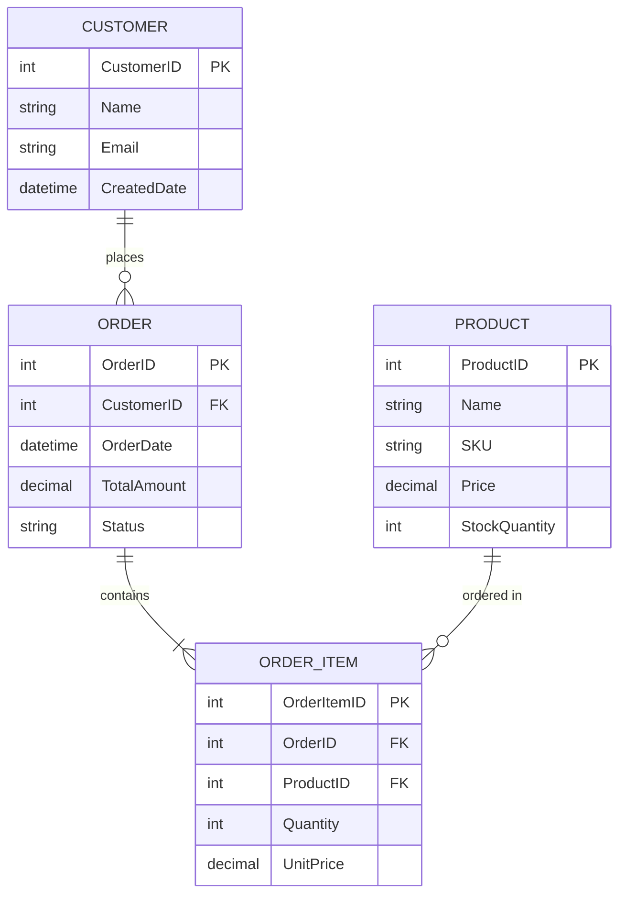
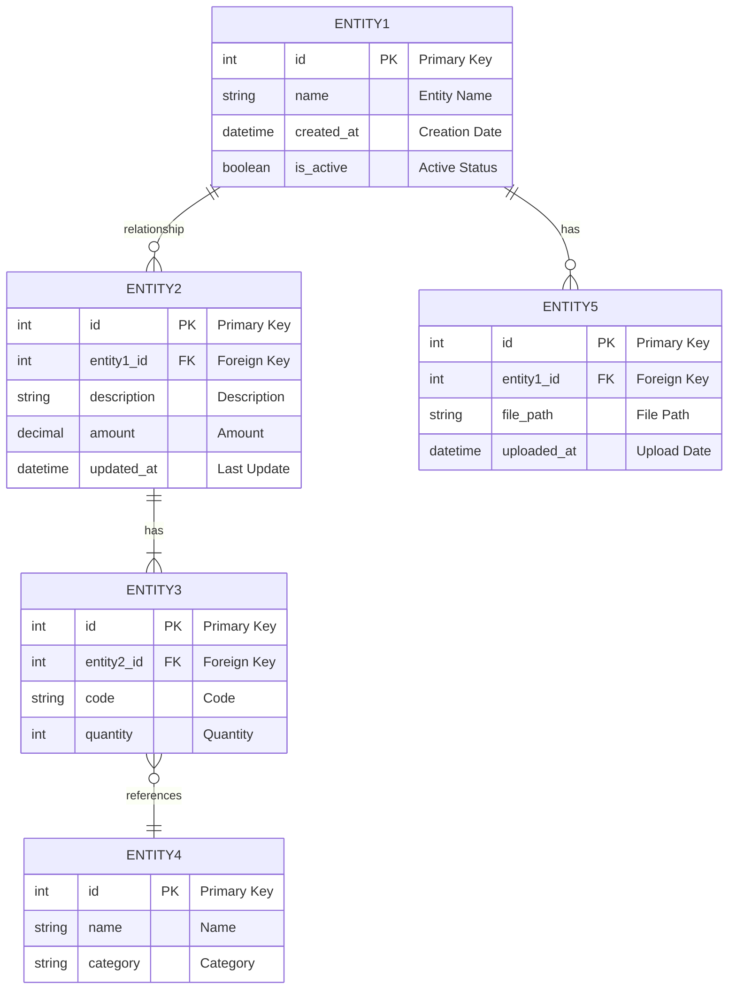

# Data Architecture - <!-- Solution name from codebase -->

> This document provides comprehensive documentation of all data storage systems, database schemas, data flow patterns, access methods, and security considerations within the system.

## Table of Contents

- [Overview](#overview)
- [Data Storage Inventory](#data-storage-inventory)
- [Database Schema Documentation](#database-schema-documentation)
- [Data Flow Diagrams](#data-flow-diagrams)
- [ORM and Data Access Patterns](#orm-and-data-access-patterns)
- [Data Security and Compliance](#data-security-and-compliance)
- [Performance Considerations](#performance-considerations)
- <!-- Backup and Recovery based on evidence from analysis -->(#backup-and-recovery)
- [Data Migration and ETL](#data-migration-and-etl)
- <!-- Monitoring and Diagnostics based on evidence from analysis -->(#monitoring-and-diagnostics)
- [Future Considerations](#future-considerations)

---

## Overview

<!-- Provide a high-level summary of the data architecture - 2-3 paragraphs covering: based on evidence from analysis -->

- Primary data storage technologies used
- Data access patterns and methodologies
- Key architectural characteristics
- Multi-database/storage strategies if applicable
- Overall data management approach

**Data Architecture Summary:**
- **Primary Database:** [e.g., SQL Server 2019, PostgreSQL 14, MongoDB 5.0]
- **Secondary Storage:** [e.g., Redis cache, File storage, Blob storage]
- **Data Access:** [e.g., Entity Framework, Dapper, ADO.NET, Hibernate]
- **Data Volume:** <!-- Approximate database size and growth rate based on evidence from analysis -->
- **Transaction Volume:** <!-- Transactions per day/hour based on evidence from analysis -->

---

## Data Storage Inventory

<!-- Requirements (Section 4.1 - Data Storage Inventory):
- **Databases**: Names, types (SQL Server, MongoDB, etc.), versions, purposes
- **File Storage**: Local files, blob storage, document repositories
- **Caching**: Redis, in-memory, distributed cache configurations
- **Message Queues**: RabbitMQ, Azure Service Bus, MSMQ
-->

### 4.1 Databases

#### Primary Database(s)

| Database Name | Type | Version | Purpose | Size | Location |
|---------------|------|---------|---------|------|----------|
| <!-- Database 1 from codebase --> | [SQL Server/PostgreSQL/etc.] | <!-- Version from configuration --> | <!-- Primary transactional database based on evidence from analysis --> | <!-- Size from codebase --> | [Server/Cloud] |
| <!-- Database 2 from codebase --> | <!-- Type from codebase --> | <!-- Version from configuration --> | <!-- Purpose from codebase --> | <!-- Size from codebase --> | <!-- Location from codebase --> |

**Connection Details:**
```
<!-- Database 1 from codebase -->:
  Server: <!-- Server name or endpoint based on evidence from analysis -->
  Authentication: [Windows/SQL/Token-based]
  Connection String Pattern: <!-- Connection string format based on evidence from analysis -->
  Max Connections: <!-- Pool size from codebase -->
```

#### Secondary Databases

| Database Name | Type | Version | Purpose | Size | Sync Strategy |
|---------------|------|---------|---------|------|---------------|
| <!-- Database 3 from codebase --> | <!-- Type from codebase --> | <!-- Version from configuration --> | [Analytics/Reporting/Archive] | <!-- Size from codebase --> | [Real-time/Batch] |
| <!-- Database 4 from codebase --> | <!-- Type from codebase --> | <!-- Version from configuration --> | <!-- Purpose from codebase --> | <!-- Size from codebase --> | <!-- Strategy from codebase --> |

### 4.2 File Storage

| Storage Type | Technology | Purpose | Size | Access Method |
|--------------|------------|---------|------|---------------|
| <!-- Document Storage from codebase --> | [Blob Storage/File Share/S3] | [Documents, images, PDFs] | <!-- Size from codebase --> | [HTTP/UNC/API] |
| <!-- Media Storage from codebase --> | <!-- Technology from analysis --> | [Videos, large files] | <!-- Size from codebase --> | <!-- Method from codebase --> |
| <!-- Temp Storage from codebase --> | <!-- Technology from analysis --> | <!-- Upload staging, cache based on evidence from analysis --> | <!-- Size from codebase --> | <!-- Method from codebase --> |

**File Storage Structure:**
```
<!-- Root Path from codebase -->/
├── <!-- Folder 1 from codebase -->/
│   ├── <!-- Subfolder 1 from codebase -->/
│   └── <!-- Subfolder 2 from codebase -->/
├── <!-- Folder 2 from codebase -->/
└── <!-- Folder 3 from codebase -->/
```

### 4.3 Caching

| Cache Name | Technology | Purpose | Size | TTL Strategy |
|------------|------------|---------|------|--------------|
| <!-- Cache 1 from codebase --> | [Redis/Memcached/In-Memory] | <!-- Session data, API responses based on evidence from analysis --> | <!-- Size from codebase --> | <!-- TTL duration from codebase --> |
| <!-- Cache 2 from codebase --> | <!-- Technology from analysis --> | <!-- Purpose from codebase --> | <!-- Size from codebase --> | <!-- Strategy from codebase --> |

**Cache Configuration:**
- **Eviction Policy:** [LRU/LFU/etc.]
- **Persistence:** [In-memory only/Persistent]
- **Distribution:** <!-- Single node/Cluster based on evidence from analysis -->

### 4.4 Message Queues

| Queue Name | Technology | Purpose | Message Volume | Retention |
|------------|------------|---------|----------------|-----------|
| <!-- Queue 1 from codebase --> | [RabbitMQ/Azure Service Bus/Kafka] | <!-- Async processing, events based on evidence from analysis --> | [Messages/day] | <!-- Based on complexity --> |
| <!-- Queue 2 from codebase --> | <!-- Technology from analysis --> | <!-- Purpose from codebase --> | <!-- Volume from codebase --> | <!-- Retention from codebase --> |

### 4.5 Configuration Storage

| Storage Type | Location | Purpose | Access Method |
|--------------|----------|---------|---------------|
| <!-- Config files from codebase --> | <!-- File system/Config server based on evidence from analysis --> | <!-- App settings from codebase --> | [File read/API] |
| <!-- Secrets from codebase --> | [Key Vault/Environment vars] | [Credentials, keys] | [SDK/API] |
| <!-- Feature flags from codebase --> | [Service/Database] | <!-- Feature toggles from codebase --> | [API/SDK] |

---

## Database Schema Documentation

<!-- Requirements (Section 4.2 - Database Schema Documentation):
For each database:
- **Entity-Relationship Diagram** (Mermaid)
- Table listing with row counts
- Key relationships and foreign keys
- Indexes and their purposes
- Stored procedures, functions, triggers

**Example Mermaid Template**:

-->

### 4.6 Schema Overview

**Naming Conventions:**

| Prefix/Pattern | Meaning | Example |
|----------------|---------|---------|
| <!-- Prefix 1 from codebase --> | <!-- What it indicates based on evidence from analysis --> | <!-- Example table name from codebase --> |
| <!-- Prefix 2 from codebase --> | <!-- What it indicates based on evidence from analysis --> | <!-- Example from codebase --> |
| <!-- Pattern from codebase --> | <!-- Convention from codebase --> | <!-- Example from codebase --> |

**Schema Organization:**
- <!-- Schema 1 from codebase -->: <!-- Purpose and tables from codebase -->
- <!-- Schema 2 from codebase -->: <!-- Purpose and tables from codebase -->
- <!-- Schema 3 from codebase -->: <!-- Purpose and tables from codebase -->

### 4.7 Entity Relationship Diagram

> **Accessibility Note:** <!-- Describe the diagram structure, key entity groups, and main relationships for users who cannot see the diagram based on evidence from analysis -->



### 4.8 Understanding the Entity Relationship Diagram

**Visual Guide:**

**Color Coding (if applicable):**
- <!-- Description of any color coding used based on evidence from analysis -->

**Key Entity Groups:**

1. **[Entity Group 1 - e.g., Core Business Entities]**
   - <!-- Entity 1 from codebase -->: <!-- Purpose and key attributes based on evidence from analysis -->
   - <!-- Entity 2 from codebase -->: <!-- Purpose and key attributes based on evidence from analysis -->

2. **[Entity Group 2 - e.g., Reference/Master Data]**
   - <!-- Entity 3 from codebase -->: <!-- Purpose from codebase -->
   - <!-- Entity 4 from codebase -->: <!-- Purpose from codebase -->

3. **[Entity Group 3 - e.g., Supporting Tables]**
   - <!-- Entity 5 from codebase -->: <!-- Purpose from codebase -->
   - <!-- Entity 6 from codebase -->: <!-- Purpose from codebase -->

**Key Relationships Explained:**

1. **<!-- Relationship Name from codebase -->**
   ```
   <!-- Entity A from codebase --> → <!-- Entity B from codebase -->
   Cardinality: [One-to-many, many-to-many, etc.]
   Description: <!-- What this relationship represents based on evidence from analysis -->
   ```

2. **<!-- Relationship Name from codebase -->**
   ```
   <!-- Entity C from codebase --> → <!-- Entity D from codebase -->
   Cardinality: <!-- Cardinality from codebase -->
   Description: <!-- Description from codebase -->
   ```

**Critical Design Patterns:**

- **[Pattern 1 - e.g., Soft Delete]**: <!-- How implemented and why based on evidence from analysis -->
- **[Pattern 2 - e.g., Composite Keys]**: <!-- Implementation details from codebase -->
- **[Pattern 3 - e.g., Versioning]**: <!-- Strategy used from codebase -->
- **[Pattern 4 - e.g., Audit Trail]**: <!-- How tracked from codebase -->

### 4.9 Core Tables

#### <!-- Table Name 1 from codebase -->

**Purpose:** <!-- What this table stores based on evidence from analysis -->

**Schema:**
```sql
CREATE TABLE [table_name] (
    <!-- column1 from codebase --> <!-- TYPE from codebase --> PRIMARY KEY,
    <!-- column2 from codebase --> <!-- TYPE from codebase --> NOT NULL,
    <!-- column3 from codebase --> <!-- TYPE from codebase --> NULL,
    <!-- column4 from codebase --> <!-- TYPE from codebase --> DEFAULT <!-- value from codebase -->,
    [created_at] DATETIME DEFAULT GETDATE(),
    [updated_at] DATETIME,
    CONSTRAINT [constraint_name] FOREIGN KEY (<!-- column from codebase -->) REFERENCES [other_table](<!-- column from codebase -->)
);
```

**Columns:**

| Column Name | Type | Nullable | Default | Description |
|-------------|------|----------|---------|-------------|
| <!-- column1 from codebase --> | <!-- Type from codebase --> | Yes or No | <!-- Default from codebase --> | <!-- Purpose and business meaning based on evidence from analysis --> |
| <!-- column2 from codebase --> | <!-- Type from codebase --> | Yes or No | <!-- Default from codebase --> | <!-- Description from codebase --> |
| <!-- column3 from codebase --> | <!-- Type from codebase --> | Yes or No | <!-- Default from codebase --> | <!-- Description from codebase --> |

**Indexes:**
- `PK_<!-- table from codebase -->`: Primary key on <!-- columns from codebase -->
- `IX_<!-- table from codebase -->_<!-- column from codebase -->`: Index on <!-- column from codebase --> for <!-- purpose from codebase -->
- `UQ_<!-- table from codebase -->_<!-- columns from codebase -->`: Unique constraint on <!-- columns from codebase -->

**Key Relationships:**
- Related to <!-- Table A from codebase --> via <!-- foreign key from codebase -->
- Parent of <!-- Table B from codebase --> (one-to-many)
- Referenced by <!-- Table C from codebase -->

**Typical Row Count:** <!-- Estimate from codebase -->

**Growth Rate:** <!-- Records per day/month based on evidence from analysis -->

---

#### <!-- Table Name 2 from codebase -->

<!-- Similar structure as above for each major table based on evidence from analysis -->

---

### 4.10 Reference/Master Tables

#### <!-- Master Table 1 from codebase -->

**Purpose:** [Lookup/reference data for what]

**Sample Data:**
```sql
-- Example records
INSERT INTO [table_name] VALUES (<!-- example values from codebase -->);
```

**Update Frequency:** [Static/Daily/Real-time]

**Data Source:** <!-- Manually maintained/Imported from external system based on evidence from analysis -->

---

### 4.11 Views

#### <!-- View Name 1 from codebase -->

**Purpose:** <!-- What query abstraction this provides based on evidence from analysis -->

**Definition:**
```sql
CREATE VIEW [view_name] AS
SELECT <!-- columns from codebase -->
FROM <!-- tables from codebase -->
WHERE <!-- conditions from codebase -->
JOIN [other_tables] ON [join_conditions];
```

**Usage:** <!-- Where and why used based on evidence from analysis -->

---

### 4.12 Stored Procedures

#### <!-- Procedure Name 1 from codebase -->

**Purpose:** <!-- What operation this performs based on evidence from analysis -->

**Parameters:**
- `@param1` <!-- TYPE from codebase -->: <!-- Description from codebase -->
- `@param2` <!-- TYPE from codebase -->: <!-- Description from codebase -->

**Returns:** <!-- Return type and description based on evidence from analysis -->

**Usage Example:**
```sql
EXEC [procedure_name] @param1 = <!-- value from codebase -->, @param2 = <!-- value from codebase -->;
```

---

### 4.13 Functions

#### <!-- Function Name 1 from codebase -->

**Purpose:** <!-- What calculation or transformation based on evidence from analysis -->

**Signature:**
```sql
CREATE FUNCTION [function_name] (@param TYPE)
RETURNS <!-- TYPE from codebase -->
AS
BEGIN
    -- Implementation
    RETURN <!-- result from codebase -->;
END
```

---

### 4.14 Triggers

#### <!-- Trigger Name 1 from codebase -->

**Purpose:** <!-- What automated action based on evidence from analysis -->

**Table:** <!-- Table name from codebase -->

**Event:** [INSERT/UPDATE/DELETE]

**Timing:** <!-- Team size from organizational structure -->

**Logic:** <!-- What the trigger does based on evidence from analysis -->

---

## Data Flow Diagrams

<!-- Requirements (Section 4.3 - Data Flow Diagrams):
Show how data moves through the system:
- User input → validation → storage flow
- Integration data flows (external APIs → system)
- Reporting and analytics data pipelines
- Batch processing workflows
-->

### 4.15 User Input → Storage Flow

```mermaid
flowchart TD
    Start(<!-- User Input from codebase -->) --> UI<!-- UI Layer from codebase -->
    UI --> Validate{Validation}
    
    Validate -->|Invalid| Error1<!-- Return Error from codebase -->
    Validate -->|Valid| BL<!-- Business Logic Layer from codebase -->
    
    BL --> Transform<!-- Data Transformation from codebase -->
    Transform --> DAL<!-- Data Access Layer from codebase -->
    
    DAL --> Transaction<!-- Begin Transaction from codebase -->
    Transaction --> Insert[Insert/Update Database]
    Insert --> Audit<!-- Log Audit Trail from codebase -->
    Audit --> Cache<!-- Update Cache from codebase -->
    Cache --> Commit<!-- Commit Transaction from codebase -->
    
    Commit --> Success(<!-- Success Response from codebase -->)
    Error1 --> End(<!-- End from codebase -->)
    Success --> End
    
    style Start fill:#e1f5ff
    style End fill:#e1f5ff
    style Validate fill:#fff4e1
    style Transaction fill:#ffe1e1
    style Commit fill:#e1ffe1
```

### 4.16 Integration Data Flow

```mermaid
flowchart LR
    External[(External System)] -->|API Call| Gateway<!-- API Gateway from codebase -->
    Gateway --> Auth{Authentication}
    
    Auth -->|Failed| Reject<!-- Reject Request from codebase -->
    Auth -->|Success| Queue<!-- Message Queue from codebase -->
    
    Queue --> Processor<!-- Background Processor from codebase -->
    Processor --> Validate{Validate Data}
    
    Validate -->|Invalid| DLQ<!-- Dead Letter Queue from codebase -->
    Validate -->|Valid| Transform<!-- Transform Data from codebase -->
    
    Transform --> DB[(Database)]
    DB --> Notify<!-- Send Notification from codebase -->
    Notify --> Complete(<!-- Process Complete from codebase -->)
    
    style External fill:#f0f0f0
    style Gateway fill:#e1f5ff
    style Queue fill:#fff4e1
    style DB fill:#e1ffe1
```

### 4.17 Reporting Data Pipeline

```mermaid
flowchart TD
    Source[(Operational DB)] -->|ETL Batch Job| Staging[(Staging DB)]
    Staging --> Transform<!-- Data Transformation from codebase -->
    Transform --> DW[(Data Warehouse)]
    
    DW --> OLAP<!-- OLAP Cube from codebase -->
    DW --> Reports<!-- Report Database from codebase -->
    
    OLAP --> BI<!-- BI Tools from codebase -->
    Reports --> Dashboard<!-- Dashboards from codebase -->
    
    style Source fill:#e1ffe1
    style Staging fill:#fff4e1
    style DW fill:#e1f5ff
    style OLAP fill:#ffe1f0
```

### 4.18 Batch Processing Workflow

```mermaid
flowchart LR
    Schedule(<!-- Scheduled Job from codebase -->) --> Check{Data Available?}
    Check -->|No| Wait<!-- Wait from codebase -->
    Check -->|Yes| Extract<!-- Extract Data from codebase -->
    
    Extract --> Process<!-- Process Records from codebase -->
    Process --> Validate{Validation}
    
    Validate -->|Failed| Error<!-- Log Error from codebase -->
    Validate -->|Success| Update<!-- Update Database from codebase -->
    
    Update --> Archive<!-- Archive Processed Data from codebase -->
    Archive --> Complete(<!-- Job Complete from codebase -->)
    
    Error --> Retry{Retry?}
    Retry -->|Yes| Process
    Retry -->|No| Complete
```

---

## ORM and Data Access Patterns

<!-- Requirements (Section 4.4 - ORM and Data Access Patterns):
- ORM framework used (Entity Framework, Dapper, ADO.NET)
- Repository pattern implementation
- Unit of Work pattern usage
- Query optimization strategies
- Connection management and pooling
-->

### 4.19 Data Access Technology Stack

**ORM Framework:**
- **Technology:** [Entity Framework Core/Dapper/Hibernate/etc.]
- **Version:** <!-- Version from configuration -->
- **Configuration:** [Code-first/Database-first/Hybrid]

**Alternative Access Methods:**
- [Raw ADO.NET for specific scenarios]
- <!-- Stored procedures for complex queries based on evidence from analysis -->
- [Micro-ORM for performance-critical paths]

### 4.20 Repository Pattern Implementation

**Pattern Type:** [Generic Repository/Specific Repositories/Unit of Work]

**Example Implementation:**

```<!-- language from codebase -->
// Interface
public interface IRepository<TEntity> where TEntity : class
{
    Task<TEntity> GetByIdAsync(int id);
    Task<IEnumerable<TEntity>> GetAllAsync();
    Task<IEnumerable<TEntity>> FindAsync(Expression<Func<TEntity, bool>> predicate);
    Task AddAsync(TEntity entity);
    Task UpdateAsync(TEntity entity);
    Task DeleteAsync(int id);
}

// Implementation
public class Repository<TEntity> : IRepository<TEntity> where TEntity : class
{
    private readonly DbContext _context;
    private readonly DbSet<TEntity> _dbSet;
    
    public Repository(DbContext context)
    {
        _context = context;
        _dbSet = context.Set<TEntity>();
    }
    
    public async Task<TEntity> GetByIdAsync(int id)
    {
        return await _dbSet.FindAsync(id);
    }
    
    // ... other implementations
}
```

### 4.21 Unit of Work Pattern

**Purpose:** <!-- Coordinate transactions across multiple repositories based on evidence from analysis -->

**Implementation:**
```<!-- language from codebase -->
public interface IUnitOfWork : IDisposable
{
    IRepository<Entity1> Entity1Repository { get; }
    IRepository<Entity2> Entity2Repository { get; }
    Task<int> CommitAsync();
    Task RollbackAsync();
}
```

### 4.22 Query Optimization Strategies

**Techniques Used:**

1. **[Strategy 1 - e.g., Eager Loading]**
   ```<!-- language from codebase -->
   // Example of eager loading
   var entities = await _context.Entity1
       .Include(e => e.RelatedEntity)
       .Include(e => e.OtherRelatedEntity)
       .ToListAsync();
   ```

2. **[Strategy 2 - e.g., Projection]**
   ```<!-- language from codebase -->
   // Select only needed columns
   var data = await _context.Entity1
       .Select(e => new { e.Id, e.Name, e.Date })
       .ToListAsync();
   ```

3. **[Strategy 3 - e.g., Pagination]**
   ```<!-- language from codebase -->
   // Paginated queries
   var page = await _context.Entity1
       .OrderBy(e => e.Id)
       .Skip((pageNumber - 1) * pageSize)
       .Take(pageSize)
       .ToListAsync();
   ```

4. **[Strategy 4 - e.g., AsNoTracking]**
   ```<!-- language from codebase -->
   // Read-only queries
   var entities = await _context.Entity1
       .AsNoTracking()
       .ToListAsync();
   ```

### 4.23 Connection Management

**Connection Pooling:**
- **Enabled:** Yes or No
- **Min Pool Size:** <!-- Count from analysis -->
- **Max Pool Size:** <!-- Count from analysis -->
- **Connection Timeout:** <!-- Seconds from codebase -->

**Connection String Pattern:**
```
<!-- Connection string with parameters explained based on evidence from analysis -->
```

**Retry Logic:**
- **Strategy:** <!-- Exponential backoff/Fixed retry/Custom based on evidence from analysis -->
- **Max Retries:** <!-- Count from analysis -->
- **Retry Conditions:** <!-- Transient errors, timeouts, etc. based on evidence from analysis -->

### 4.24 Transaction Management

**Transaction Scope:**
```<!-- language from codebase -->
// Example transaction implementation
using (var transaction = await _context.Database.BeginTransactionAsync())
{
    try
    {
        // Multiple operations
        await _repository1.AddAsync(entity1);
        await _repository2.UpdateAsync(entity2);
        
        await _context.SaveChangesAsync();
        await transaction.CommitAsync();
    }
    catch (Exception ex)
    {
        await transaction.RollbackAsync();
        throw;
    }
}
```

**Isolation Levels:**
- Default: [READ COMMITTED/SERIALIZABLE/etc.]
- Custom scenarios: <!-- Where and why different levels used based on evidence from analysis -->

---

## Data Security and Compliance

<!-- Requirements (Section 4.5 - Data Security and Compliance):
- Encryption at rest and in transit
- PII/sensitive data handling
- Audit logging mechanisms
- Backup and retention policies
- Compliance requirements (GDPR, HIPAA, etc.)
-->

### 4.25 Encryption

#### Encryption at Rest

| Data Type | Encryption Method | Key Management | Status |
|-----------|------------------|----------------|--------|
| <!-- Database from config --> | [TDE/Column-level/etc.] | [Key Vault/Manual] | [Enabled/Planned] |
| <!-- File Storage from codebase --> | <!-- Method from codebase --> | <!-- Management from codebase --> | <!-- Status from analysis --> |
| <!-- Backups from codebase --> | <!-- Method from codebase --> | <!-- Management from codebase --> | <!-- Status from analysis --> |

**Implementation Details:**
- [Technology/approach used]
- <!-- Key rotation policy based on evidence from analysis -->
- <!-- Recovery procedures from codebase -->

#### Encryption in Transit

| Connection Type | Protocol | Certificate | Status |
|-----------------|----------|-------------|--------|
| [Client → API] | [TLS 1.2+] | <!-- Certificate authority from codebase --> | <!-- Enforced from codebase --> |
| [API → Database] | [TLS/SSL] | <!-- Certificate type from codebase --> | <!-- Status from analysis --> |
| [Service → Service] | <!-- Protocol from codebase --> | <!-- Certificate from codebase --> | <!-- Status from analysis --> |

### 4.26 Authentication and Authorization

**Database Authentication:**
- **Method:** [Windows Authentication/SQL Auth/Token-based/etc.]
- **Service Accounts:** <!-- Number and purpose based on evidence from analysis -->
- **Application Identity:** <!-- How applications authenticate based on evidence from analysis -->

**Data Access Authorization:**
- **Row-Level Security:** [Enabled/Not used]
- **Column-Level Security:** <!-- For what data from codebase -->
- **View-Based Security:** <!-- How views restrict access based on evidence from analysis -->
- **Application-Level:** <!-- Role-based filtering from codebase -->

### 4.27 PII and Sensitive Data Handling

**PII Data Identified:**

| Table | Columns | Sensitivity Level | Protection Method |
|-------|---------|-------------------|-------------------|
| <!-- Table 1 from codebase --> | <!-- Column list from codebase --> | High, Medium, or Low | [Encryption/Masking/etc.] |
| <!-- Table 2 from codebase --> | <!-- Columns from codebase --> | <!-- Level from codebase --> | <!-- Method from codebase --> |

**Data Masking:**
- **Dynamic Masking:** <!-- Where used from codebase -->
- **Static Masking:** <!-- For what environments based on evidence from analysis -->
- **Tokenization:** <!-- If applicable from codebase -->

**PII Access Logging:**
- <!-- How access to PII is logged based on evidence from analysis -->
- <!-- Audit retention period based on evidence from analysis -->
- <!-- Compliance requirements met based on evidence from analysis -->

### 4.28 Data Retention and Archival

**Retention Policies:**

| Data Type | Active Retention | Archive Retention | Deletion Policy |
|-----------|------------------|-------------------|-----------------|
| <!-- Transactional Data from codebase --> | <!-- Based on complexity --> | <!-- Based on complexity --> | <!-- Policy from codebase --> |
| <!-- Audit Logs from codebase --> | <!-- Based on complexity --> | <!-- Based on complexity --> | <!-- Policy from codebase --> |
| <!-- User Data from codebase --> | <!-- Based on complexity --> | <!-- Based on complexity --> | <!-- Policy from codebase --> |
| <!-- Backups from codebase --> | <!-- Based on complexity --> | N/A | <!-- Policy from codebase --> |

**Archival Process:**
1. [Step 1 - Identify records for archival]
2. [Step 2 - Move to archive storage]
3. <!-- Step 3 - Update indexes from codebase -->
4. <!-- Step 4 - Verification from codebase -->

### 4.29 Compliance

**Regulatory Requirements:**

| Regulation | Applicable | Compliance Status | Controls Implemented |
|------------|-----------|-------------------|---------------------|
| <!-- GDPR from codebase --> | Yes or No | [Compliant/In Progress] | <!-- List controls from codebase --> |
| <!-- HIPAA from codebase --> | Yes or No | <!-- Status from analysis --> | <!-- Controls from codebase --> |
| <!-- PCI DSS from codebase --> | Yes or No | <!-- Status from analysis --> | <!-- Controls from codebase --> |
| <!-- SOC 2 from codebase --> | Yes or No | <!-- Status from analysis --> | <!-- Controls from codebase --> |

**Right to Erasure (GDPR):**
- <!-- How user data deletion is handled based on evidence from analysis -->
- <!-- What data is permanently deleted vs anonymized based on evidence from analysis -->
- <!-- Timeframe for deletion requests based on evidence from analysis -->

**Data Breach Response:**
- <!-- Detection mechanisms from codebase -->
- <!-- Notification procedures from codebase -->
- <!-- Remediation process from codebase -->

---

## Performance Considerations

### 4.30 Indexing Strategy

**Primary Keys:**
- <!-- Clustered vs non-clustered approach based on evidence from analysis -->
- <!-- Index design philosophy based on evidence from analysis -->

**Foreign Keys:**
- <!-- Default indexing policy based on evidence from analysis -->
- <!-- Specific index exceptions based on evidence from analysis -->

**Composite Indexes:**
```sql
-- Example composite index
CREATE INDEX IX_<!-- table from codebase -->_<!-- columns from codebase --> 
ON <!-- table from codebase --> (<!-- column1 from codebase -->, <!-- column2 from codebase -->, <!-- column3 from codebase -->);
```

**Index Maintenance:**
- **Rebuild Schedule:** <!-- Frequency from codebase -->
- **Statistics Update:** [Automatic/Manual]
- **Fragmentation Monitoring:** <!-- Threshold and action from codebase -->

### 4.31 Query Performance

**Common Performance Patterns:**

1. **[Pattern 1 - e.g., N+1 Query Problem]**
   - **Issue:** <!-- Description from codebase -->
   - **Solution:** <!-- How resolved from codebase -->

2. **[Pattern 2 - e.g., Large Result Sets]**
   - **Issue:** <!-- Description from codebase -->
   - **Solution:** [Pagination, streaming, etc.]

**Slow Query Identification:**
- <!-- Monitoring tool used from codebase -->
- <!-- Threshold for slow queries based on evidence from analysis -->
- <!-- Alerting mechanism from codebase -->

**Query Optimization Examples:**

```sql
-- Before optimization
<!-- Slow query example based on evidence from analysis -->

-- After optimization
<!-- Optimized version with explanation based on evidence from analysis -->
```

### 4.32 Database Size and Growth

**Current Metrics:**

| Database | Current Size | Monthly Growth | Projected Size (1 year) |
|----------|-------------|----------------|-------------------------|
| <!-- DB 1 from codebase --> | <!-- Size from codebase --> | <!-- Growth rate from codebase --> | <!-- Projection from codebase --> |
| <!-- DB 2 from codebase --> | <!-- Size from codebase --> | <!-- Growth from codebase --> | <!-- Projection from codebase --> |

**Largest Tables:**

| Table | Row Count | Size | Growth Rate | Notes |
|-------|-----------|------|-------------|-------|
| <!-- Table 1 from codebase --> | <!-- Rows from codebase --> | <!-- Size from codebase --> | <!-- Rate from codebase --> | <!-- Performance notes from codebase --> |
| <!-- Table 2 from codebase --> | <!-- Rows from codebase --> | <!-- Size from codebase --> | <!-- Rate from codebase --> | <!-- Notes from codebase --> |

**Partitioning Strategy:**
- <!-- Tables partitioned based on evidence from analysis -->
- <!-- Partition key and strategy based on evidence from analysis -->
- <!-- Benefits achieved from codebase -->

### 4.33 Caching Strategy

**Cache Layers:**

1. **[Layer 1 - e.g., Application Memory Cache]**
   - **Purpose:** <!-- What is cached from codebase -->
   - **TTL:** <!-- Based on complexity -->
   - **Invalidation:** <!-- How cache is cleared based on evidence from analysis -->

2. **[Layer 2 - e.g., Distributed Cache]**
   - **Purpose:** <!-- What is cached from codebase -->
   - **Technology:** [Redis/etc.]
   - **TTL:** <!-- Based on complexity -->

**Cache Warming:**
- <!-- How cache is pre-populated based on evidence from analysis -->
- <!-- When warming occurs based on evidence from analysis -->

**Cache-Aside Pattern:**
```<!-- language from codebase -->
// Example implementation
public async Task<Entity> GetEntityAsync(int id)
{
    // Check cache
    var cached = await _cache.GetAsync<Entity>($"entity:{id}");
    if (cached != null) return cached;
    
    // Cache miss - fetch from database
    var entity = await _repository.GetByIdAsync(id);
    
    // Store in cache
    await _cache.SetAsync($"entity:{id}", entity, TimeSpan.FromMinutes(30));
    
    return entity;
}
```

---

## Backup and Recovery

### 4.34 Backup Strategy

**Database Backups:**

| Backup Type | Frequency | Retention | Storage Location | Encryption |
|-------------|-----------|-----------|------------------|------------|
| Full | [Daily/Weekly] | <!-- Based on complexity --> | <!-- Location from codebase --> | Yes or No |
| Differential | <!-- Frequency from codebase --> | <!-- Based on complexity --> | <!-- Location from codebase --> | Yes or No |
| Transaction Log | <!-- Frequency from codebase --> | <!-- Based on complexity --> | <!-- Location from codebase --> | Yes or No |

**File Storage Backups:**
- **Method:** [Incremental/Full/Snapshot]
- **Frequency:** <!-- Schedule from codebase -->
- **Retention:** <!-- Based on complexity -->

**Backup Verification:**
- **Test Frequency:** <!-- How often from codebase -->
- **Validation Method:** <!-- Restore test/Checksum/etc. based on evidence from analysis -->
- **Last Successful Test:** <!-- Date from history -->

### 4.35 Recovery Procedures

**Recovery Time Objective (RTO):** <!-- Target time from codebase -->

**Recovery Point Objective (RPO):** <!-- Maximum data loss acceptable based on evidence from analysis -->

**Disaster Recovery Process:**
1. <!-- Step 1 - Assess the situation from codebase -->
2. [Step 2 - Determine recovery point]
3. [Step 3 - Initiate recovery procedure]
4. <!-- Step 4 - Verify data integrity from codebase -->
5. <!-- Step 5 - Resume operations from codebase -->

**Recovery Testing:**
- **Frequency:** [Quarterly/Annually/etc.]
- **Scope:** [Full/Partial]
- **Last Test Date:** <!-- Date from history -->
- **Results:** <!-- Summary from codebase -->

### 4.36 Point-in-Time Recovery

**Capability:** Yes or No

**Granularity:** <!-- To the second/minute/hour based on evidence from analysis -->

**Process:**
```sql
-- Example recovery command
RESTORE DATABASE [database_name]
FROM [backup_location]
WITH STOPAT = '<!-- datetime from codebase -->';
```

---

## Data Migration and ETL

### 4.37 ETL Processes

**ETL Tools:**
- <!-- Tool 1 from codebase -->: <!-- Purpose from codebase -->
- <!-- Tool 2 from codebase -->: <!-- Purpose from codebase -->

**Common ETL Jobs:**

| Job Name | Source | Destination | Frequency | Transform Logic |
|----------|--------|-------------|-----------|-----------------|
| <!-- Job 1 from codebase --> | <!-- Source system from codebase --> | <!-- Target DB from codebase --> | <!-- Schedule from codebase --> | <!-- Brief description based on evidence from analysis --> |
| <!-- Job 2 from codebase --> | <!-- Source from codebase --> | <!-- Target from codebase --> | <!-- Frequency from codebase --> | <!-- Logic from codebase --> |

### 4.38 Data Import Procedures

**Manual Import Process:**
1. <!-- Step 1 from codebase -->
2. <!-- Step 2 from codebase -->
3. <!-- Step 3 from codebase -->

**Automated Import:**
- <!-- Trigger mechanism from codebase -->
- <!-- Validation rules from codebase -->
- <!-- Error handling from codebase -->

**Import Formats Supported:**
- <!-- CSV from codebase -->
- <!-- Excel from codebase -->
- <!-- JSON from codebase -->
- <!-- XML from codebase -->
- <!-- Other from codebase -->

### 4.39 Schema Migration

**Migration Tool:** [Flyway/Liquibase/EF Migrations/Custom]

**Version Control:**
- <!-- How schema changes are versioned based on evidence from analysis -->
- <!-- Migration script location based on evidence from analysis -->
- <!-- Naming convention from codebase -->

**Migration Process:**
```
<!-- Example migration workflow based on evidence from analysis -->
1. Create migration script
2. Review and test
3. Apply to development
4. Apply to test
5. Apply to production
```

**Rollback Strategy:**
- <!-- How rollbacks are handled based on evidence from analysis -->
- <!-- Rollback script requirements based on evidence from analysis -->

---

## Monitoring and Diagnostics

### 4.40 Performance Monitoring

**Monitoring Tools:**
- <!-- Tool 1 from codebase -->: <!-- What metrics it tracks based on evidence from analysis -->
- <!-- Tool 2 from codebase -->: <!-- Purpose from codebase -->

**Key Metrics Tracked:**

| Metric | Threshold | Alert Action |
|--------|-----------|--------------|
| <!-- CPU Usage from codebase --> | <!-- Percentage from metrics --> | [Alert/Action] |
| <!-- Memory Usage from codebase --> | <!-- Percentage from metrics --> | <!-- Action from codebase --> |
| [Disk I/O] | [IOPS/Latency] | <!-- Action from codebase --> |
| <!-- Connection Count from codebase --> | <!-- Count from analysis --> | <!-- Action from codebase --> |
| <!-- Query Duration from codebase --> | <!-- Milliseconds from codebase --> | <!-- Action from codebase --> |
| <!-- Deadlocks from codebase --> | [Count/Hour] | <!-- Action from codebase --> |
| <!-- Blocking from codebase --> | <!-- Based on complexity --> | <!-- Action from codebase --> |

### 4.41 Logging

**Database Audit Logging:**
- **What is logged:** [DDL changes, DML operations, logins, etc.]
- **Retention:** <!-- Based on complexity -->
- **Storage:** <!-- Where logs are stored based on evidence from analysis -->

**Application Data Access Logging:**
```<!-- language from codebase -->
// Example logging implementation
_logger.LogInformation(
    "Data access: User {UserId} accessed {EntityType} {EntityId}",
    userId, entityType, entityId
);
```

### 4.42 Health Checks

**Database Health Checks:**
- Connection pool status
- Active connections
- Long-running queries
- Blocking chains
- Index fragmentation
- Statistics staleness

**Health Check Endpoint:**
```
<!-- Health check endpoint URL and response format based on evidence from analysis -->
```

---

## Future Considerations

### 4.43 Modernization Opportunities

1. **[Opportunity 1 - e.g., Cloud Migration]**
   - **Current State:** <!-- Description from codebase -->
   - **Target State:** <!-- Vision from codebase -->
   - **Benefits:** <!-- Expected improvements based on evidence from analysis -->
   - **Effort:** <!-- Estimate from codebase -->

2. **[Opportunity 2 - e.g., NoSQL Integration]**
   - **Use Case:** <!-- What scenarios from codebase -->
   - **Technology:** <!-- Proposed solution from codebase -->
   - **Benefits:** <!-- Why from codebase -->

3. **[Opportunity 3 - e.g., Data Lake]**
   - **Purpose:** [Analytics, ML, etc.]
   - **Architecture:** <!-- Proposed design from codebase -->
   - **Benefits:** <!-- Value from measurements -->

### 4.44 Scalability Improvements

**Horizontal Scaling:**
- <!-- Read replicas from codebase -->
- <!-- Sharding strategy from codebase -->
- <!-- Database clustering from codebase -->

**Vertical Scaling:**
- <!-- Current limits from codebase -->
- <!-- Upgrade path from codebase -->

### 4.45 Data Quality Initiatives

1. **Constraint Enforcement**
   - <!-- Add foreign key constraints based on evidence from analysis -->
   - <!-- Add check constraints based on evidence from analysis -->
   - <!-- Implement triggers for validation based on evidence from analysis -->

2. **Data Standardization**
   - <!-- Format consistency based on evidence from analysis -->
   - <!-- Reference data alignment based on evidence from analysis -->
   - <!-- Duplicate detection and merging based on evidence from analysis -->

3. **Automated Testing**
   - <!-- Data validation tests based on evidence from analysis -->
   - <!-- Referential integrity tests based on evidence from analysis -->
   - <!-- Performance regression tests based on evidence from analysis -->

---

## Appendix

### A. Table Reference

<!-- Complete list of all tables with brief descriptions based on evidence from analysis -->

### B. Stored Procedure Reference

<!-- Complete list of all stored procedures based on evidence from analysis -->

### C. Data Dictionary

<!-- Detailed field-level data dictionary if needed based on evidence from analysis -->

### D. Glossary

| Term | Definition |
|------|------------|
| <!-- Term 1 from codebase --> | <!-- Definition from codebase --> |
| <!-- Term 2 from codebase --> | <!-- Definition from codebase --> |

---

## Document Metadata

- **Document Version:** 1.0
- **Last Updated:** <!-- Date from history -->
- **Author:** [Author/Team]
- **System:** <!-- System name from codebase -->
- **Status:** Draft, Review, or Approved
- **Next Review:** <!-- Date from history -->

---

## Document History

| Version | Date | Author | Changes |
|---------|------|--------|---------|
| 1.0 | (To be set upon document creation/update) | <!-- Author from commits --> | Initial creation |

---

**Related Documents:**
- <!-- Link to Architecture Overview based on evidence from analysis -->
- <!-- Link to API Documentation based on evidence from analysis -->
- <!-- Link to Security Architecture based on evidence from analysis -->
- <!-- Link to Operations Guide based on evidence from analysis -->
