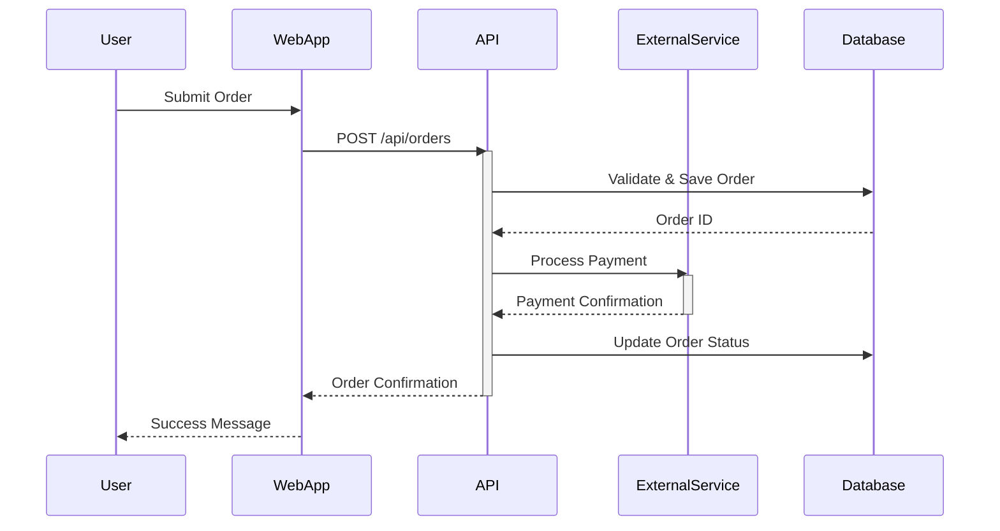
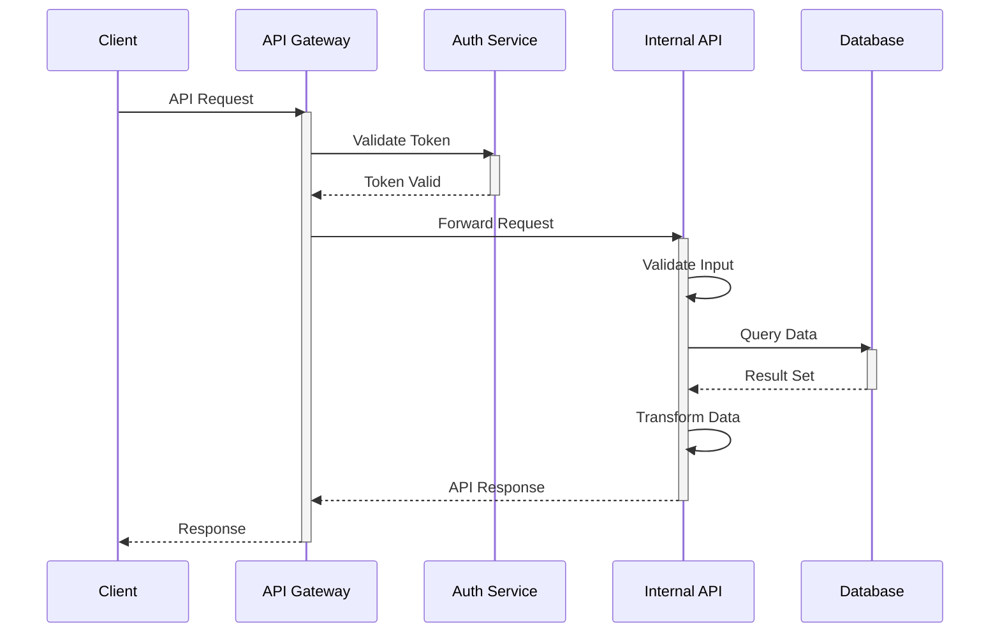
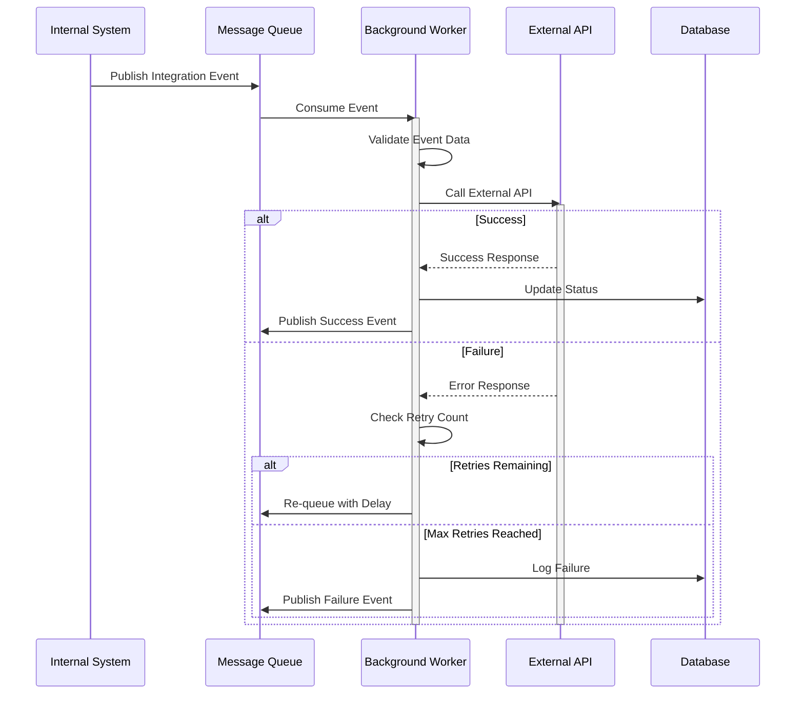
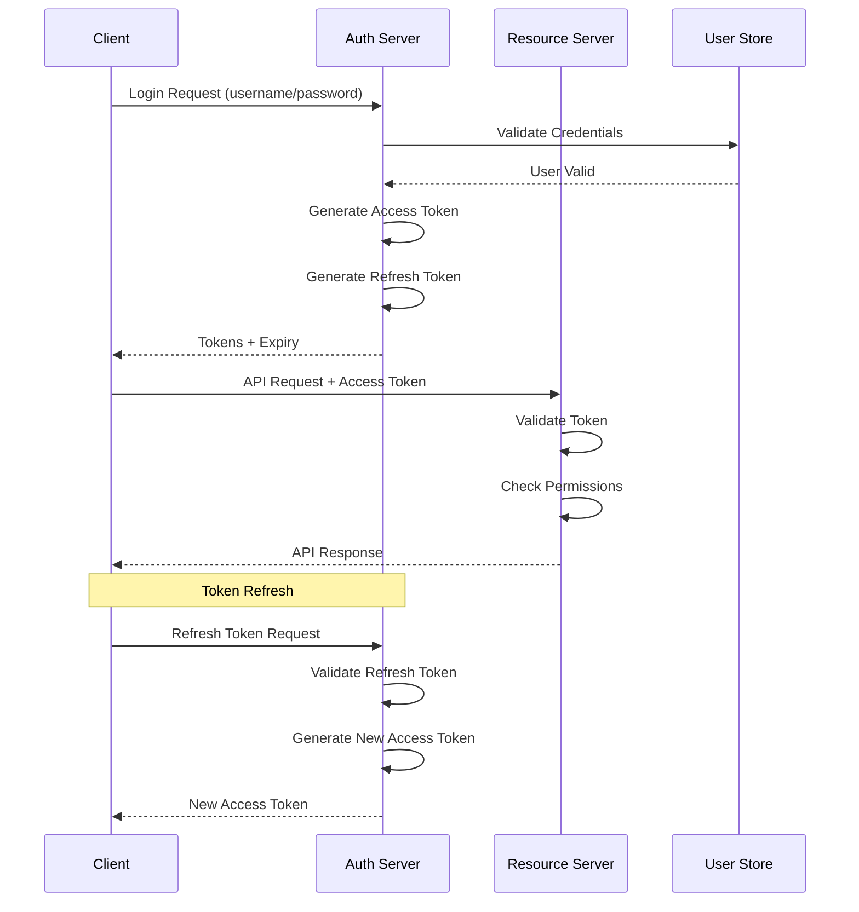
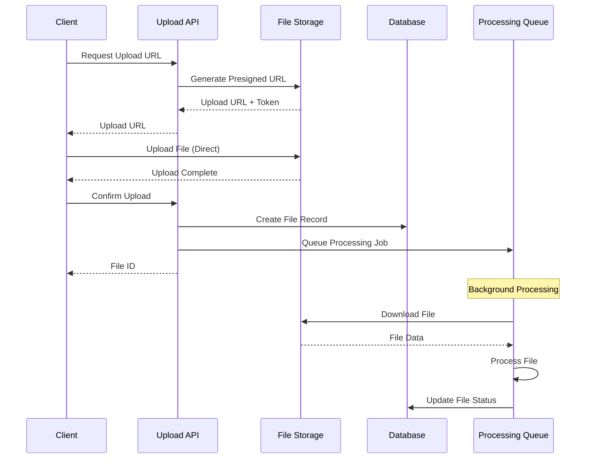
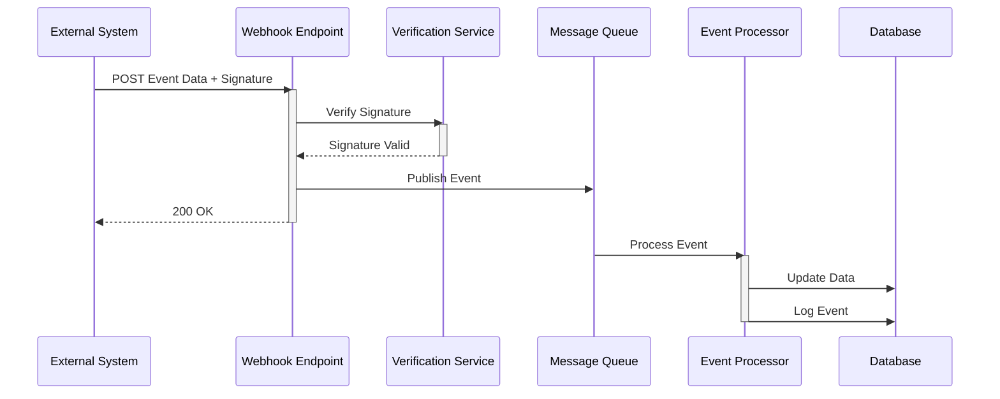

# API Integration Catalog - <!-- Solution name from codebase -->

> This document provides a comprehensive catalog of all internal APIs, external integration points, authentication mechanisms, and integration patterns used within the system.

## Table of Contents

- [Executive Summary](#executive-summary)
- [Internal API Catalog](#internal-api-catalog)
- [External API Dependencies](#external-api-dependencies)
- [Integration Sequence Diagrams](#integration-sequence-diagrams)
- [API Security Analysis](#api-security-analysis)
- [Performance Characteristics](#performance-characteristics)
- [API Limitations and Constraints](#api-limitations-and-constraints)
- <!-- Monitoring and Observability based on evidence from analysis -->(#monitoring-and-observability)
- [Migration Recommendations](#migration-recommendations)
- [Appendices](#appendices)

---

## Executive Summary

### Overview

<!-- Provide 2-3 paragraphs summarizing: based on evidence from codebase analysis -->
- Total number of internal APIs/endpoints
- External integrations count
- Primary API protocols/technologies used
- Key integration patterns
- Overall integration architecture maturity

### Key Statistics

| Metric | Count | Notes |
|--------|-------|-------|
| **Internal API Endpoints** | <!-- Count from analysis --> | [REST/GraphQL/SOAP/gRPC] |
| **External Integrations** | <!-- Count from analysis --> | <!-- Third-party services from codebase --> |
| **Authentication Methods** | <!-- Count from analysis --> | [OAuth, API Key, etc.] |
| **API Protocols** | <!-- List from codebase --> | [HTTP/REST, SOAP, GraphQL, etc.] |
| **Average Response Time** | <!-- Time from codebase --> | <!-- P95 metric from codebase --> |
| **Daily API Calls** | <!-- Count from analysis --> | <!-- Volume from codebase --> |

### Technology Summary

**API Technologies:**
- **Internal APIs:** [REST, GraphQL, SOAP, gRPC]
- **External Protocols:** [REST, SOAP, EDI, File Transfer]
- **Authentication:** [OAuth 2.0, JWT, API Keys, mTLS]
- **API Gateway:** <!-- Technology if used from codebase -->
- **Documentation:** [Swagger/OpenAPI, Postman, etc.]

---

## Internal API Catalog

<!-- Requirements (Section 5.1 - Internal APIs):
For each API endpoint/controller:
- **Endpoint**: Route and HTTP method
- **Purpose**: What it does
- **Request Schema**: Parameters, headers, body
- **Response Schema**: Success and error formats
- **Authentication**: Required auth mechanism
- **Rate Limits**: Throttling policies
- **Dependencies**: What services it calls
-->

### 5.1 API Endpoint Inventory

#### API 1: [API/Service Name]

**Endpoint Base:** `[Base URL/Path]`

**Purpose:** <!-- What this API does based on evidence from analysis -->

**Protocol:** [REST/GraphQL/SOAP/gRPC]

**Authentication:** <!-- Method used from codebase -->

**Rate Limits:** <!-- Requests per time period based on evidence from analysis -->

**Endpoints:**

| Method | Endpoint | Purpose | Request Schema | Response Schema |
|--------|----------|---------|----------------|-----------------|
| <!-- GET from codebase --> | [/path] | <!-- Description from codebase --> | <!-- Parameters from codebase --> | <!-- Response type from codebase --> |
| <!-- POST from codebase --> | [/path] | <!-- Description from codebase --> | <!-- Body schema from codebase --> | <!-- Response type from codebase --> |
| <!-- PUT from codebase --> | [/path] | <!-- Description from codebase --> | <!-- Body schema from codebase --> | <!-- Response type from codebase --> |
| <!-- DELETE from codebase --> | [/path] | <!-- Description from codebase --> | <!-- Parameters from codebase --> | <!-- Response type from codebase --> |

**Request Example:**
```http
<!-- METHOD from codebase --> [/endpoint/path]
<!-- Headers from codebase -->
Content-Type: application/json
Authorization: Bearer <!-- token from codebase -->

<!-- Request Body if applicable from codebase -->
{
  "field1": "value1",
  "field2": "value2"
}
```

**Response Example:**
```json
{
  "status": "success",
  "data": {
    "field1": "value1",
    "field2": "value2"
  }
}
```

**Error Responses:**

| Status Code | Error Code | Description | Resolution |
|-------------|------------|-------------|------------|
| 400 | [ERROR_CODE] | <!-- Description from codebase --> | <!-- How to fix from codebase --> |
| 401 | [ERROR_CODE] | <!-- Description from codebase --> | <!-- How to fix from codebase --> |
| 404 | [ERROR_CODE] | <!-- Description from codebase --> | <!-- How to fix from codebase --> |
| 500 | [ERROR_CODE] | <!-- Description from codebase --> | <!-- How to fix from codebase --> |

**Dependencies:**
- [Service/Database 1]
- [Service/Database 2]

**Performance:**
- Average Response Time: <!-- ms from codebase -->
- P95 Response Time: <!-- ms from codebase -->
- Typical Payload Size: <!-- KB from codebase -->

---

#### API 2: [API/Service Name]

<!-- Similar structure as API 1 based on evidence from analysis -->

---

### 5.2 Internal APIs by Category

#### Category 1: [e.g., User Management APIs]

| API Name | Endpoint | Methods | Purpose | Auth Required |
|----------|----------|---------|---------|---------------|
| <!-- API 1 from codebase --> | [/path] | [GET, POST] | <!-- Purpose from codebase --> | Yes or No |
| <!-- API 2 from codebase --> | [/path] | <!-- Methods from codebase --> | <!-- Purpose from codebase --> | <!-- Status from analysis --> |

#### Category 2: [e.g., Data Management APIs]

<!-- Similar table structure based on evidence from analysis -->

#### Category 3: [e.g., Integration APIs]

<!-- Similar table structure based on evidence from analysis -->

### 5.3 API Versioning Strategy

**Versioning Method:** [URL-based, Header-based, Query parameter]

**Current Versions:**

| API | Version | Status | Deprecation Date | Migration Path |
|-----|---------|--------|------------------|----------------|
| <!-- API 1 from codebase --> | v1 | [Active/Deprecated] | <!-- Date from history --> | <!-- Instructions from codebase --> |
| <!-- API 1 from codebase --> | v2 | Active | N/A | Current version |
| <!-- API 2 from codebase --> | v1 | Active | N/A | Current version |

**Version Format:** [e.g., /api/v{version}/resource]

**Breaking Change Policy:** <!-- How breaking changes are handled based on evidence from analysis -->

**Sunset Policy:** <!-- How old versions are deprecated based on evidence from analysis -->

---

## External API Dependencies

<!-- Requirements (Section 5.2 - External API Dependencies):
For each external API:
- **Provider**: Service name and vendor
- **Purpose**: Why it's used
- **Integration Pattern**: REST, SOAP, GraphQL, gRPC
- **Authentication**: API keys, OAuth, certificates
- **SLA/Uptime**: Expected availability
- **Error Handling**: Retry logic, circuit breakers
- **Cost Structure**: Per-call, subscription, free tier
- **Fallback Strategy**: What happens if unavailable
-->

### 5.4 External Integration Inventory

#### Integration 1: <!-- External Service Name from codebase -->

**Provider:** <!-- Service provider/vendor based on evidence from analysis -->

**Purpose:** <!-- Why this integration exists based on evidence from analysis -->

**Integration Type:** [Real-time API, Batch, File Transfer, Message Queue]

**Protocol:** [REST, SOAP, EDI, FTP, etc.]

**Direction:** [Inbound/Outbound/Bidirectional]

**Frequency:** [Real-time, Hourly, Daily, On-demand]

**Endpoints:**

| Operation | Endpoint | Method | Purpose |
|-----------|----------|--------|---------|
| <!-- Operation 1 from codebase --> | <!-- URL from configuration --> | <!-- Method from codebase --> | <!-- Purpose from codebase --> |
| <!-- Operation 2 from codebase --> | <!-- URL from configuration --> | <!-- Method from codebase --> | <!-- Purpose from codebase --> |

**Authentication:**
- **Method:** [OAuth, API Key, Basic Auth, mTLS]
- **Credentials Storage:** [Key Vault, Environment Variables, Config]
- **Token Refresh:** <!-- Strategy if applicable based on evidence from analysis -->

**Data Format:**
- **Request:** [JSON, XML, CSV, etc.]
- **Response:** <!-- Format from codebase -->
- **Schema:** <!-- Link to schema or description based on evidence from analysis -->

**Error Handling:**
- **Retry Strategy:** <!-- Exponential backoff, Fixed retry, etc. based on evidence from analysis -->
- **Max Retries:** <!-- Count from analysis -->
- **Timeout:** <!-- Seconds from codebase -->
- **Circuit Breaker:** [Yes/No - Configuration]
- **Fallback Strategy:** <!-- What happens if service is unavailable based on evidence from analysis -->

**SLA/Uptime:**
- **Provider SLA:** <!-- Percentage from metrics -->
- **Expected Availability:** <!-- Percentage from metrics -->
- **Support Contact:** <!-- Contact information based on evidence from analysis -->

**Cost Structure:**
- **Model:** [Per-call, Subscription, Free tier]
- **Rate:** <!-- Cost details from codebase -->
- **Monthly Budget:** <!-- Amount from codebase -->

**Monitoring:**
- **Health Check:** [Endpoint/Method]
- **Alerting:** <!-- When alerts trigger based on evidence from analysis -->
- **Dashboard:** <!-- Link to monitoring dashboard based on evidence from analysis -->

**Documentation:**
- <!-- Link to provider API documentation based on evidence from analysis -->
- <!-- Internal integration guide based on evidence from analysis -->

---

#### Integration 2: <!-- External Service Name from codebase -->

<!-- Similar structure as Integration 1 based on evidence from analysis -->

---

### 5.5 External Integrations by Type

#### API Integrations

| Service | Protocol | Purpose | Frequency | Criticality |
|---------|----------|---------|-----------|-------------|
| <!-- Service 1 from codebase --> | <!-- REST from codebase --> | <!-- Purpose from codebase --> | <!-- Real-time from codebase --> | Critical, High, Medium, or Low |
| <!-- Service 2 from codebase --> | <!-- Protocol from codebase --> | <!-- Purpose from codebase --> | <!-- Frequency from codebase --> | <!-- Level from codebase --> |

#### File Transfer Integrations

| Service | Protocol | Purpose | Frequency | Direction |
|---------|----------|---------|-----------|-----------|
| <!-- Service 1 from codebase --> | <!-- SFTP from codebase --> | <!-- Purpose from codebase --> | <!-- Daily from codebase --> | [Inbound/Outbound] |
| <!-- Service 2 from codebase --> | <!-- Protocol from codebase --> | <!-- Purpose from codebase --> | <!-- Frequency from codebase --> | <!-- Direction from codebase --> |

#### Message Queue Integrations

| Queue | Technology | Purpose | Message Volume | Direction |
|-------|------------|---------|----------------|-----------|
| <!-- Queue 1 from codebase --> | [RabbitMQ/Kafka] | <!-- Purpose from codebase --> | [Messages/day] | <!-- Direction from codebase --> |
| <!-- Queue 2 from codebase --> | <!-- Technology from analysis --> | <!-- Purpose from codebase --> | <!-- Volume from codebase --> | <!-- Direction from codebase --> |

---

## Integration Sequence Diagrams

<!-- Requirements (Section 5.3 - Integration Sequence Diagrams):
Show typical integration flows:
- User action → API call → external service → response
- Async message processing flows
- Webhook handling

**Example Mermaid Template**:

-->

### 5.6 Typical API Call Flow



### 5.7 External Integration Flow



### 5.8 Authentication Flow



### 5.9 File Upload/Download Flow



### 5.10 Webhook Integration Flow



---

## API Security Analysis

<!-- Requirements (Section 5.4 - API Security Analysis):
- Authentication mechanisms (JWT, API keys, OAuth)
- Authorization patterns (role-based, claims-based)
- Input validation and sanitization
- Rate limiting and DDoS protection
- CORS policies
-->

### 5.11 Authentication Mechanisms

#### OAuth 2.0 / OpenID Connect

**Implementation:**
- **Grant Types Supported:** [Authorization Code, Client Credentials, etc.]
- **Token Type:** [JWT, Opaque]
- **Token Expiry:** <!-- Based on complexity -->
- **Refresh Token:** [Yes/No - Duration]
- **Scopes:** <!-- List of scopes from codebase -->

**Configuration:**
```json
{
  "issuer": "<!-- Issuer URL from codebase -->",
  "authorization_endpoint": "<!-- URL from configuration -->",
  "token_endpoint": "<!-- URL from configuration -->",
  "jwks_uri": "<!-- URL from configuration -->",
  "scopes_supported": ["scope1", "scope2"]
}
```

#### API Keys

**Implementation:**
- **Key Format:** <!-- Format description based on evidence from analysis -->
- **Key Rotation:** <!-- Policy from codebase -->
- **Key Storage:** <!-- How keys are stored securely based on evidence from analysis -->
- **Key Scoping:** <!-- What keys can access based on evidence from analysis -->

#### Mutual TLS (mTLS)

**Implementation:**
- **Certificate Authority:** <!-- CA information from codebase -->
- **Certificate Validation:** <!-- Process from codebase -->
- **Certificate Rotation:** <!-- Policy from codebase -->

### 5.12 Authorization Patterns

**Authorization Model:** [RBAC, ABAC, Policy-based]

**Role Definitions:**

| Role | Permissions | API Access |
|------|-------------|------------|
| <!-- Role 1 from codebase --> | <!-- Permissions from codebase --> | <!-- APIs accessible from codebase --> |
| <!-- Role 2 from codebase --> | <!-- Permissions from codebase --> | <!-- APIs accessible from codebase --> |

**Permission Checking:**
```<!-- language from codebase -->
// Example authorization check
public async Task<IActionResult> GetResource(int id)
{
    if (!User.HasPermission("resource.read"))
    {
        return Forbidden();
    }
    
    var resource = await _repository.GetByIdAsync(id);
    
    if (resource.OwnerId != User.UserId && !User.HasPermission("resource.read.all"))
    {
        return Forbidden();
    }
    
    return Ok(resource);
}
```

### 5.13 Input Validation

**Validation Strategy:**
- <!-- Validation framework/library used based on evidence from analysis -->
- <!-- Where validation occurs - Gateway, API, both based on evidence from analysis -->
- <!-- Validation rules enforcement based on evidence from analysis -->

**Common Validation Rules:**
```<!-- language from codebase -->
// Example validation
public class CreateUserRequest
{
    <!-- Required from codebase -->
    <!-- EmailAddress from codebase -->
    public string Email { get; set; }
    
    <!-- Required from codebase -->
    [MinLength(8)]
    [MaxLength(100)]
    public string Password { get; set; }
    
    <!-- Required from codebase -->
    [RegularExpression(@"^[a-zA-Z\s]+$")]
    public string Name { get; set; }
}
```

### 5.14 Rate Limiting and Throttling

**Rate Limit Configuration:**

| API/Endpoint | Limit | Window | Scope |
|--------------|-------|--------|-------|
| <!-- Endpoint 1 from codebase --> | <!-- Requests from codebase --> | <!-- Time period from codebase --> | <!-- Per user/IP/API key based on evidence from analysis --> |
| <!-- Endpoint 2 from codebase --> | <!-- Requests from codebase --> | <!-- Period from codebase --> | <!-- Scope from codebase --> |

**Implementation:**
- **Technology:** <!-- Rate limiting solution based on evidence from analysis -->
- **Storage:** [Redis, In-memory, Database]
- **Response Headers:** [X-RateLimit-* headers]
- **Exceeded Behavior:** [Return 429, Queue, etc.]

**Rate Limit Response:**
```http
HTTP/1.1 429 Too Many Requests
X-RateLimit-Limit: 1000
X-RateLimit-Remaining: 0
X-RateLimit-Reset: 1640000000
Retry-After: 60

{
  "error": "rate_limit_exceeded",
  "message": "Rate limit exceeded. Try again in 60 seconds."
}
```

### 5.15 API Security Controls

| Control | Implementation | Status |
|---------|----------------|--------|
| **HTTPS Enforcement** | [TLS 1.2+] | [Enabled/Partial/Not Implemented] |
| **Input Validation** | <!-- Framework from dependencies --> | <!-- Status from analysis --> |
| **Output Encoding** | <!-- Method from codebase --> | <!-- Status from analysis --> |
| **CORS Policy** | <!-- Configuration from codebase --> | <!-- Status from analysis --> |
| **CSRF Protection** | [Token-based/Other] | <!-- Status from analysis --> |
| **SQL Injection Prevention** | <!-- Parameterized queries/ORM based on evidence from analysis --> | <!-- Status from analysis --> |
| **XSS Prevention** | <!-- Sanitization from codebase --> | <!-- Status from analysis --> |
| **API Versioning** | <!-- Strategy from codebase --> | <!-- Status from analysis --> |
| **Request Signing** | [HMAC/Other] | <!-- Status from analysis --> |
| **Audit Logging** | <!-- What is logged from codebase --> | <!-- Status from analysis --> |

### 5.16 Security Vulnerabilities

| Vulnerability | Severity | Impact | Mitigation |
|---------------|----------|--------|------------|
| <!-- Vulnerability 1 from codebase --> | Critical, High, Medium, or Low | <!-- Description from codebase --> | <!-- Action plan from codebase --> |
| <!-- Vulnerability 2 from codebase --> | <!-- Severity from assessment --> | <!-- Impact from codebase --> | <!-- Mitigation from codebase --> |

---

## Performance Characteristics

### 5.17 Response Time Metrics

| API/Endpoint | Average | P50 | P95 | P99 | Max |
|--------------|---------|-----|-----|-----|-----|
| <!-- Endpoint 1 from codebase --> | <!-- ms from codebase --> | <!-- ms from codebase --> | <!-- ms from codebase --> | <!-- ms from codebase --> | <!-- ms from codebase --> |
| <!-- Endpoint 2 from codebase --> | <!-- ms from codebase --> | <!-- ms from codebase --> | <!-- ms from codebase --> | <!-- ms from codebase --> | <!-- ms from codebase --> |

### 5.18 Throughput Metrics

| API/Service | Requests/Second | Daily Volume | Peak Volume |
|-------------|----------------|--------------|-------------|
| <!-- API 1 from codebase --> | <!-- RPS from codebase --> | <!-- Number from metrics --> | <!-- Count at peak from codebase --> |
| <!-- API 2 from codebase --> | <!-- RPS from codebase --> | <!-- Number from metrics --> | <!-- Peak from codebase --> |

### 5.19 Payload Size Analysis

| API/Endpoint | Avg Request Size | Avg Response Size | Max Payload |
|--------------|------------------|-------------------|-------------|
| <!-- Endpoint 1 from codebase --> | <!-- KB from codebase --> | <!-- KB from codebase --> | <!-- MB from codebase --> |
| <!-- Endpoint 2 from codebase --> | <!-- Size from codebase --> | <!-- Size from codebase --> | <!-- Max from codebase --> |

### 5.20 Performance Bottlenecks

**Identified Issues:**

1. **<!-- Issue 1 from codebase -->**
   - **Description:** <!-- What the bottleneck is based on evidence from analysis -->
   - **Impact:** <!-- Performance impact from codebase -->
   - **Root Cause:** <!-- Why it occurs from codebase -->
   - **Recommendation:** <!-- How to fix from codebase -->

2. **<!-- Issue 2 from codebase -->**
   - **Description:** <!-- Description from codebase -->
   - **Impact:** <!-- Impact from codebase -->
   - **Root Cause:** <!-- Cause from codebase -->
   - **Recommendation:** <!-- Solution from codebase -->

---

## API Limitations and Constraints

### 5.21 Technical Limitations

| Limitation | Description | Impact | Workaround |
|-----------|-------------|--------|-----------|
| <!-- Limitation 1 from codebase --> | <!-- Description from codebase --> | <!-- Impact from codebase --> | <!-- Workaround from codebase --> |
| <!-- Limitation 2 from codebase --> | <!-- Description from codebase --> | <!-- Impact from codebase --> | <!-- Workaround from codebase --> |

### 5.22 Business Constraints

- <!-- Constraint 1 from codebase -->: <!-- Description and impact from codebase -->
- <!-- Constraint 2 from codebase -->: <!-- Description and impact from codebase -->
- <!-- Constraint 3 from codebase -->: <!-- Description and impact from codebase -->

### 5.23 Scalability Limits

**Current Capacity:**
- **Max Concurrent Requests:** <!-- Count from analysis -->
- **Max Connections:** <!-- Count from analysis -->
- **Max File Size:** <!-- Size from codebase -->
- **Max Request Size:** <!-- Size from codebase -->
- **Max Response Size:** <!-- Size from codebase -->

**Scaling Strategy:**
- **Horizontal Scaling:** [Supported/Limited/Not Supported]
- **Vertical Scaling:** <!-- Current limits from codebase -->
- **Auto-scaling:** [Configured/Not configured]

---

## Monitoring and Observability

### 5.24 API Monitoring

**Monitoring Tools:**
- <!-- Tool 1 from codebase -->: <!-- Purpose from codebase -->
- <!-- Tool 2 from codebase -->: <!-- Purpose from codebase -->

**Key Metrics:**

| Metric | Description | Threshold | Alert |
|--------|-------------|-----------|-------|
| <!-- Metric 1 from codebase --> | <!-- Description from codebase --> | <!-- Value from measurements --> | <!-- Alert condition from codebase --> |
| <!-- Metric 2 from codebase --> | <!-- Description from codebase --> | <!-- Value from measurements --> | <!-- Alert condition from codebase --> |

### 5.25 Logging Standards

**Log Levels:**
- **DEBUG:** <!-- When used from codebase -->
- **INFO:** <!-- When used from codebase -->
- **WARN:** <!-- When used from codebase -->
- **ERROR:** <!-- When used from codebase -->
- **FATAL:** <!-- When used from codebase -->

**Structured Logging Format:**
```json
{
  "timestamp": "2025-01-01T12:00:00Z",
  "level": "INFO",
  "service": "api-service",
  "endpoint": "/api/v1/resource",
  "method": "GET",
  "status_code": 200,
  "duration_ms": 150,
  "user_id": "user123",
  "correlation_id": "abc-def-ghi",
  "message": "Request processed successfully"
}
```

**Log Retention:**
- **Application Logs:** <!-- Based on complexity -->
- **Access Logs:** <!-- Based on complexity -->
- **Audit Logs:** <!-- Based on complexity -->

### 5.26 Distributed Tracing

**Tracing Implementation:**
- **Technology:** [Jaeger, Zipkin, Application Insights, etc.]
- **Trace ID Propagation:** <!-- How trace IDs are passed based on evidence from analysis -->
- **Span Collection:** <!-- What operations create spans based on evidence from analysis -->

**Trace Example:**
```
Trace ID: abc123
├─ Span: API Gateway [200ms]
│  ├─ Span: Auth Service [50ms]
│  └─ Span: Resource API [150ms]
│     ├─ Span: Database Query [100ms]
│     └─ Span: Cache Lookup [10ms]
```

### 5.27 Health Checks

**Health Check Endpoints:**

| Service | Endpoint | Check Type | Frequency |
|---------|----------|------------|-----------|
| <!-- Service 1 from codebase --> | [/health] | [Liveness/Readiness] | <!-- Interval from codebase --> |
| <!-- Service 2 from codebase --> | <!-- Endpoint from API definition --> | <!-- Type from codebase --> | <!-- Frequency from codebase --> |

**Health Check Response:**
```json
{
  "status": "healthy",
  "version": "1.2.3",
  "checks": {
    "database": "healthy",
    "cache": "healthy",
    "external_api": "degraded"
  },
  "timestamp": "2025-01-01T12:00:00Z"
}
```

---

## Migration Recommendations

**Note**: The following recommendations are based on industry best practices and standards. They should be evaluated against the specific context of your organization and codebase.
<!-- Source: Cite specific standards, frameworks, or publications -->


### 5.28 API Modernization Strategy

**Note**: The following recommendations are based on industry best practices and standards. They should be evaluated against the specific context of your organization and codebase.
<!-- Source: Cite specific standards, frameworks, or publications -->


#### Phase 1: Assessment (<!-- Timeline from codebase -->)

<!-- Remember to add **Reasoning**: Explain the analysis methodology and how conclusions were reached -->

**Activities:**
1. <!-- Activity 1 from codebase -->
2. <!-- Activity 2 from codebase -->
3. <!-- Activity 3 from codebase -->

**Deliverables:**
- <!-- Deliverable 1 from codebase -->
- <!-- Deliverable 2 from codebase -->

#### Phase 2: Design (<!-- Timeline from codebase -->)

**Activities:**
1. <!-- Activity 1 from codebase -->
2. <!-- Activity 2 from codebase -->

**Deliverables:**
- <!-- Deliverable 1 from codebase -->
- <!-- Deliverable 2 from codebase -->

#### Phase 3: Implementation (<!-- Timeline from codebase -->)

**Activities:**
1. <!-- Activity 1 from codebase -->
2. <!-- Activity 2 from codebase -->

**Deliverables:**
- <!-- Deliverable 1 from codebase -->
- <!-- Deliverable 2 from codebase -->

#### Phase 4: Migration (<!-- Timeline from codebase -->)

**Activities:**
1. <!-- Activity 1 from codebase -->
2. <!-- Activity 2 from codebase -->

**Deliverables:**
- <!-- Deliverable 1 from codebase -->
- <!-- Deliverable 2 from codebase -->

### 5.29 Recommended Improvements

#### Improvement 1: <!-- Title from codebase -->

**Current State:** <!-- Description from codebase -->

**Target State:** <!-- Vision from codebase -->

**Benefits:**
- <!-- Benefit 1 from codebase -->
- <!-- Benefit 2 from codebase -->

**Implementation Approach:**
1. <!-- Step 1 from codebase -->
2. <!-- Step 2 from codebase -->
3. <!-- Step 3 from codebase -->

**Effort:** [Low/Medium/High]

**Priority:** Critical, High, Medium, or Low

---

#### Improvement 2: <!-- Title from codebase -->

<!-- Similar structure from codebase -->

---

## Appendices

### Appendix A: API Request/Response Examples

<!-- Detailed examples for complex APIs based on evidence from analysis -->

### Appendix B: Error Code Reference

| Error Code | HTTP Status | Description | Resolution |
|------------|-------------|-------------|------------|
| [CODE_001] | <!-- Status from analysis --> | <!-- Description from codebase --> | <!-- How to fix from codebase --> |
| [CODE_002] | <!-- Status from analysis --> | <!-- Description from codebase --> | <!-- How to fix from codebase --> |

### Appendix C: Integration Code Samples

<!-- Sample code for consuming APIs in various languages based on evidence from analysis -->

### Appendix D: Postman Collection

<!-- Link to or embed Postman collection for API testing based on evidence from analysis -->

### Appendix E: OpenAPI/Swagger Specifications

<!-- Link to or embed API specifications based on evidence from analysis -->

---

## Glossary

| Term | Definition |
|------|------------|
| <!-- Term 1 from codebase --> | <!-- Definition from codebase --> |
| <!-- Term 2 from codebase --> | <!-- Definition from codebase --> |
| <!-- Term 3 from codebase --> | <!-- Definition from codebase --> |

---

## Document Metadata

- **Document Version:** 1.0
- **Last Updated:** <!-- Date from history -->
- **Author:** [Author/Team]
- **System:** <!-- System name from codebase -->
- **Status:** Draft, Review, or Approved
- **Next Review:** <!-- Date from history -->

---

## Document History

| Version | Date | Author | Changes |
|---------|------|--------|---------|
| 1.0 | (To be set upon document creation/update) | <!-- Author from commits --> | Initial creation |

---

**Related Documents:**
- <!-- Link to Architecture Overview based on evidence from analysis -->
- <!-- Link to Security Architecture based on evidence from analysis -->
- <!-- Link to Developer Guide based on evidence from analysis -->
- <!-- Link to Operations Guide based on evidence from analysis -->

---

**Note:** This catalog should be updated whenever new APIs are added, existing APIs are modified, or external integrations change. API versioning and deprecation policies should be strictly followed.
