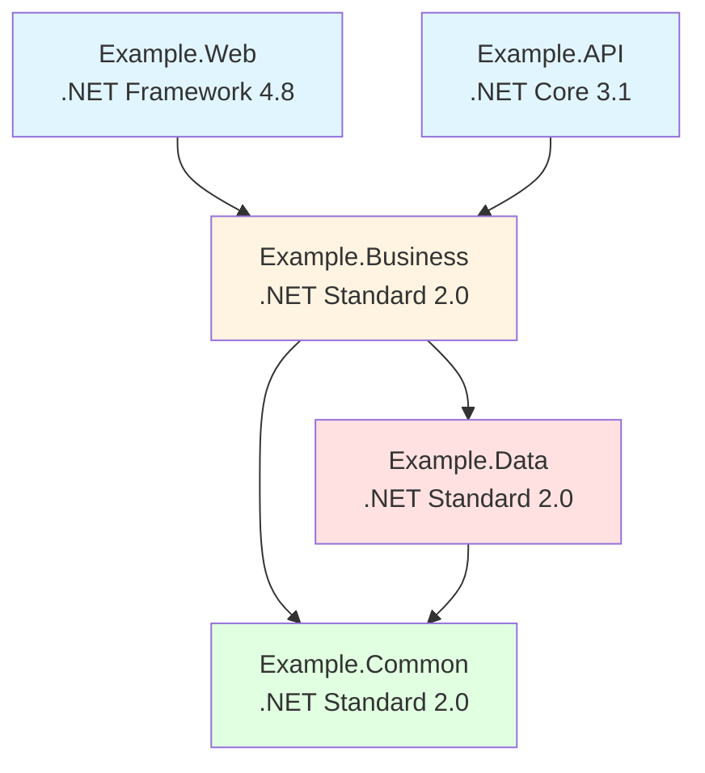

# Project Inventory - <!-- Solution name from codebase -->

> This document provides a comprehensive catalog of all projects, solutions, modules, and packages within the system, including their dependencies, frameworks, and compatibility analysis.

## Table of Contents

- [Overview](#overview)
- [Solution Catalog](#solution-catalog)
- [Project Catalog](#project-catalog)
- [Project Dependency Graph](#project-dependency-graph)
- [External Package Dependencies](#external-package-dependencies)
- [Framework Compatibility Matrix](#framework-compatibility-matrix)
- [Code Duplication Analysis](#code-duplication-analysis)
- [Migration Recommendations](#migration-recommendations)

---

## Overview

### Summary Statistics

| Metric | Count | Notes |
|--------|-------|-------|
| **Total Solutions** | <!-- Count from analysis --> | <!-- Additional context from codebase --> |
| **Total Projects** | <!-- Count from analysis --> | <!-- Additional context from codebase --> |
| **Web Applications** | <!-- Count from analysis --> | <!-- Technology stack from codebase --> |
| **API/Service Projects** | <!-- Count from analysis --> | <!-- Technology stack from codebase --> |
| **Desktop Applications** | <!-- Count from analysis --> | <!-- Technology stack from codebase --> |
| **Mobile Applications** | <!-- Count from analysis --> | <!-- Technology stack from codebase --> |
| **Class Libraries** | <!-- Count from analysis --> | <!-- Purpose summary from codebase --> |
| **Test Projects** | <!-- Count from analysis --> | <!-- Coverage info from codebase --> |
| **Database Projects** | <!-- Count from analysis --> | <!-- Database type from codebase --> |
| **External Dependencies** | <!-- Count from analysis --> | <!-- Major packages from codebase --> |

### Code Metrics Summary

| Metric | Value | Notes |
|--------|-------|-------|
| **Total Lines of Code (LOC)** | <!-- Count from analysis --> | <!-- Excludes comments and blank lines based on evidence from analysis --> |
| **Total Lines (including comments)** | <!-- Count from analysis --> | <!-- All lines in source files based on evidence from analysis --> |
| **Lines of Comments** | <!-- Count from analysis --> | <!-- Documentation coverage from codebase --> |
| **Comment Ratio** | <!-- Percentage from metrics --> | [Comments / Total LOC] |
| **Average File Size** | <!-- Count from analysis --> lines | <!-- Mean LOC per file from codebase --> |
| **Largest File** | <!-- Count from analysis --> lines | <!-- File name and size based on evidence from analysis --> |
| **Code Coverage** | <!-- Percentage from metrics --> | <!-- Test coverage across codebase based on evidence from analysis --> |
| **Unit Test Count** | <!-- Count from analysis --> | <!-- Total number of unit tests based on evidence from analysis --> |
| **Cyclomatic Complexity** | <!-- Average from codebase --> | <!-- Code complexity measure based on evidence from analysis --> |
| **Maintainability Index** | <!-- Score from assessment --> | [0-100 scale, higher is better] |
| **Technical Debt Hours** | <!-- Count from analysis --> | <!-- Estimated time to fix issues based on evidence from analysis --> |
| **Code Duplication** | <!-- Percentage from metrics --> | <!-- Duplicate code blocks based on evidence from analysis --> |

### Technology Summary

**Primary Technologies:**
- **Framework:** [e.g., .NET 8, .NET Framework 4.8, Java 17, Node.js 20]
- **Languages:** [e.g., C#, TypeScript, Python, Java]
- **Web Frameworks:** [e.g., ASP.NET Core, React, Angular, Spring Boot]
- **Database:** [e.g., SQL Server, PostgreSQL, MongoDB]
- **Build System:** [e.g., MSBuild, Maven, Gradle, npm]

### Repository Structure

```
<!-- Repository Root from codebase -->/
├── <!-- Folder 1 from codebase -->/
│   ├── <!-- Subfolder 1 from codebase -->/
│   └── <!-- Subfolder 2 from codebase -->/
├── <!-- Folder 2 from codebase -->/
│   ├── <!-- Subfolder 1 from codebase -->/
│   └── <!-- Subfolder 2 from codebase -->/
├── <!-- Solution Files from codebase -->/
└── <!-- Configuration Files from codebase -->/
```

---

## Solution Catalog

### Solution 1: <!-- Solution name from codebase -->

**Location:** `<!-- Path to solution file based on evidence from analysis -->`  
**Purpose:** <!-- Brief description of what this solution encompasses based on evidence from analysis -->  
**Status:** [Active/Legacy/Archived]

| Project | Type | Framework | Purpose |
|---------|------|-----------|---------|
| <!-- Project Name 1 from codebase --> | <!-- Type from codebase --> | <!-- Framework from dependencies --> | <!-- Purpose from codebase --> |
| <!-- Project Name 2 from codebase --> | <!-- Type from codebase --> | <!-- Framework from dependencies --> | <!-- Purpose from codebase --> |
| <!-- Project Name 3 from codebase --> | <!-- Type from codebase --> | <!-- Framework from dependencies --> | <!-- Purpose from codebase --> |

**Solution Dependencies:**
- <!-- Dependency 1 from codebase -->
- <!-- Dependency 2 from codebase -->

**Build Configuration:**
- **Build Tool:** <!-- Tool name from codebase -->
- **Target Configurations:** [Debug, Release, etc.]
- **Output Path:** <!-- Path from codebase -->

---

### Solution 2: <!-- Solution name from codebase -->

**Location:** `<!-- Path from codebase -->`  
**Purpose:** <!-- Description from codebase -->  
**Status:** <!-- Status from analysis -->

| Project | Type | Framework | Purpose |
|---------|------|-----------|---------|
| <!-- Project Name 1 from codebase --> | <!-- Type from codebase --> | <!-- Framework from dependencies --> | <!-- Purpose from codebase --> |
| <!-- Project Name 2 from codebase --> | <!-- Type from codebase --> | <!-- Framework from dependencies --> | <!-- Purpose from codebase --> |

---

### Solution 3: <!-- Solution name from codebase -->

<!-- Continue for all solutions in the codebase based on evidence from analysis -->

---

## Project Catalog

<!-- Requirements (Section 3.1 - Project Catalog Table):
| Project Name | Type | Framework | Purpose | Dependencies |
|--------------|------|-----------|---------|------------|
| Example.Web | ASP.NET MVC | .NET Framework 4.8 | User interface | Example.Business |
| Example.Business | Class Library | .NET Standard 2.0 | Business logic | Example.Data |
-->

### 3.1 Project Catalog Table

| Project Name | Type | Framework | Purpose | Solution | Dependencies |
|--------------|------|-----------|---------|----------|--------------|
| <!-- Project 1 from codebase --> | [Web App/API/Library] | [Framework & Version] | <!-- Brief purpose from codebase --> | <!-- Solution name from codebase --> | <!-- Comma-separated from codebase --> |
| <!-- Project 2 from codebase --> | <!-- Type from codebase --> | [Framework & Version] | <!-- Brief purpose from codebase --> | <!-- Solution name from codebase --> | <!-- Dependencies from codebase --> |
| <!-- Project 3 from codebase --> | <!-- Type from codebase --> | [Framework & Version] | <!-- Brief purpose from codebase --> | <!-- Solution name from codebase --> | <!-- Dependencies from codebase --> |

### 3.2 Projects by Type

#### Web Applications

| Project Name | Framework | Hosting | Purpose | Status |
|--------------|-----------|---------|---------|--------|
| <!-- Web App 1 from codebase --> | <!-- Framework from dependencies --> | [IIS/Azure/etc.] | <!-- Purpose from codebase --> | [Active/Legacy] |
| <!-- Web App 2 from codebase --> | <!-- Framework from dependencies --> | <!-- Hosting from codebase --> | <!-- Purpose from codebase --> | <!-- Status from analysis --> |

#### API/Service Projects

| Project Name | Framework | API Type | Purpose | Endpoints |
|--------------|-----------|----------|---------|-----------|
| <!-- API 1 from codebase --> | <!-- Framework from dependencies --> | [REST/GraphQL/SOAP] | <!-- Purpose from codebase --> | <!-- Number from metrics --> |
| <!-- API 2 from codebase --> | <!-- Framework from dependencies --> | <!-- Type from codebase --> | <!-- Purpose from codebase --> | <!-- Number from metrics --> |

#### Desktop Applications

| Project Name | Framework | UI Technology | Deployment | Purpose |
|--------------|-----------|---------------|------------|---------|
| <!-- Desktop App 1 from codebase --> | <!-- Framework from dependencies --> | [WinForms/WPF/etc.] | [ClickOnce/MSI/etc.] | <!-- Purpose from codebase --> |
| <!-- Desktop App 2 from codebase --> | <!-- Framework from dependencies --> | <!-- Technology from analysis --> | <!-- Deployment from codebase --> | <!-- Purpose from codebase --> |

#### Mobile Applications

| Project Name | Framework | Platform | Purpose | Status |
|--------------|-----------|----------|---------|--------|
| <!-- Mobile App 1 from codebase --> | <!-- Framework from dependencies --> | [iOS/Android/Both] | <!-- Purpose from codebase --> | <!-- Status from analysis --> |
| <!-- Mobile App 2 from codebase --> | <!-- Framework from dependencies --> | <!-- Platform from deployment --> | <!-- Purpose from codebase --> | <!-- Status from analysis --> |

#### Class Libraries / Shared Components

| Project Name | Framework | Purpose | Used By |
|--------------|-----------|---------|---------|
| <!-- Library 1 from codebase --> | <!-- Framework from dependencies --> | <!-- Purpose from codebase --> | <!-- Number from metrics --> projects |
| <!-- Library 2 from codebase --> | <!-- Framework from dependencies --> | <!-- Purpose from codebase --> | <!-- Number from metrics --> projects |

**Common Library Categories:**
- **Business Logic:** <!-- List libraries from codebase -->
- **Data Access:** <!-- List libraries from codebase -->
- **Utilities/Helpers:** <!-- List libraries from codebase -->
- **Infrastructure:** <!-- List libraries from codebase -->
- **Domain Models:** <!-- List libraries from codebase -->

#### Test Projects

| Project Name | Framework | Test Type | Coverage | Target Project |
|--------------|-----------|-----------|----------|----------------|
| <!-- Test 1 from codebase --> | <!-- Framework from dependencies --> | [Unit/Integration/E2E] | <!-- Percentage from metrics --> | <!-- Target from codebase --> |
| <!-- Test 2 from codebase --> | <!-- Framework from dependencies --> | <!-- Type from codebase --> | <!-- Percentage from metrics --> | <!-- Target from codebase --> |

#### Database Projects

| Project Name | Database Type | Purpose | Status |
|--------------|---------------|---------|--------|
| <!-- DB Project 1 from codebase --> | [SQL Server/etc.] | [Schema/Migration] | <!-- Status from analysis --> |
| <!-- DB Project 2 from codebase --> | <!-- Type from codebase --> | <!-- Purpose from codebase --> | <!-- Status from analysis --> |

---

## Project Dependency Graph

<!-- Requirements (Section 3.2 - Project Dependency Graph):
- Mermaid diagram showing project references
- Circular dependencies (if any)
- Layer violations (if any)

**Example Mermaid Template**:

-->

### 3.3 Overall Dependency Graph

> **Accessibility Note:** This diagram shows dependencies between all major projects. <!-- Describe the flow and key relationships based on evidence from analysis -->

```mermaid
graph TD
    subgraph "Presentation Layer"
        WebApp1<!-- Web Application 1 from codebase -->
        WebApp2<!-- Web Application 2 from codebase -->
        Desktop1<!-- Desktop App 1 from codebase -->
        Mobile1<!-- Mobile App 1 from codebase -->
    end
    
    subgraph "API/Service Layer"
        API1<!-- API Project 1 from codebase -->
        API2<!-- API Project 2 from codebase -->
        Service1<!-- Service 1 from codebase -->
    end
    
    subgraph "Business Logic Layer"
        BizLib1<!-- Business Library 1 from codebase -->
        BizLib2<!-- Business Library 2 from codebase -->
        DomainLib<!-- Domain Models from codebase -->
    end
    
    subgraph "Data Access Layer"
        DataLib1<!-- Data Access Library 1 from codebase -->
        DataLib2<!-- Data Access Library 2 from codebase -->
        RepoLib<!-- Repository Library from codebase -->
    end
    
    subgraph "Infrastructure Layer"
        Utils<!-- Utilities from codebase -->
        Common<!-- Common Library from codebase -->
        Logging<!-- Logging Library from codebase -->
    end
    
    subgraph "External Dependencies"
        Framework<!-- Framework from dependencies -->
        ORM[ORM/Data Library]
        Cache<!-- Cache Library from codebase -->
        ExternalAPI<!-- External APIs from codebase -->
    end
    
    %% Connections
    WebApp1 --> API1
    WebApp2 --> API2
    Desktop1 --> API1
    Mobile1 --> API1
    
    API1 --> BizLib1
    API2 --> BizLib2
    Service1 --> BizLib1
    
    BizLib1 --> DataLib1
    BizLib1 --> DomainLib
    BizLib2 --> DataLib2
    
    DataLib1 --> RepoLib
    DataLib2 --> RepoLib
    DataLib1 --> Utils
    
    RepoLib --> ORM
    BizLib1 --> Logging
    Utils --> Framework
    
    API1 --> ExternalAPI
    DataLib1 --> Cache
    
    style WebApp1 fill:#e1f5ff
    style WebApp2 fill:#e1f5ff
    style Desktop1 fill:#e1f5ff
    style Mobile1 fill:#e1f5ff
    style API1 fill:#fff4e1
    style API2 fill:#fff4e1
    style Service1 fill:#fff4e1
    style BizLib1 fill:#ffe1e1
    style BizLib2 fill:#ffe1e1
    style DataLib1 fill:#e1ffe1
    style DataLib2 fill:#e1ffe1
    style Utils fill:#ffe1f0
    style Common fill:#ffe1f0
```

### 3.4 Understanding the Dependency Graph

**Color Coding:**
- **Blue (#e1f5ff):** User-facing applications (Web, Desktop, Mobile)
- **Orange (#fff4e1):** API and Service projects
- **Red (#ffe1e1):** Business logic and domain models
- **Green (#e1ffe1):** Data access components
- **Pink (#ffe1f0):** Infrastructure and utilities

**Key Observations:**

1. **Dependency Direction:** <!-- Describe the flow - e.g., top-down, outside-in based on evidence from analysis -->

2. **Shared Components:** <!-- List most-referenced libraries based on evidence from analysis -->
   - <!-- Library 1 from codebase -->: Used by [X] projects
   - <!-- Library 2 from codebase -->: Used by [Y] projects

3. **Circular Dependencies:** <!-- List any circular dependencies found based on evidence from analysis -->
   - <!-- If none from codebase -->: ✅ No circular dependencies detected
   - <!-- If found from codebase -->: ⚠️ <!-- Describe circular dependency and impact based on evidence from analysis -->

4. **Layer Violations:** <!-- Any components that skip layers based on evidence from analysis -->
   - <!-- If none from codebase -->: ✅ Clean layer separation maintained
   - <!-- If found from codebase -->: ⚠️ <!-- Describe violations from codebase -->

5. **Critical Path Dependencies:** <!-- Projects that many others depend on based on evidence from analysis -->
   - <!-- Project 1 from codebase -->: Critical because <!-- reason from codebase -->
   - <!-- Project 2 from codebase -->: Critical because <!-- reason from codebase -->

---

## External Package Dependencies

<!-- Requirements (Section 3.3 - External Package Dependencies):
For each project, list:
- NuGet packages or similar with versions
- Purpose of each package
- Security vulnerabilities (if known)
- Upgrade recommendations
-->

### 3.5 External Package Dependencies by Project

#### <!-- Project Name 1 from codebase -->

| Package Name | Version | Purpose | License | Security Vulnerabilities |
|--------------|---------|---------|---------|--------------------------|
| <!-- Package 1 from codebase --> | <!-- Version from configuration --> | <!-- Purpose from codebase --> | <!-- License from codebase --> | [None/CVE-XXXX] |
| <!-- Package 2 from codebase --> | <!-- Version from configuration --> | <!-- Purpose from codebase --> | <!-- License from codebase --> | <!-- Status from analysis --> |

#### <!-- Project Name 2 from codebase -->

| Package Name | Version | Purpose | License | Security Vulnerabilities |
|--------------|---------|---------|---------|--------------------------|
| <!-- Package 1 from codebase --> | <!-- Version from configuration --> | <!-- Purpose from codebase --> | <!-- License from codebase --> | <!-- Status from analysis --> |

### 3.6 Consolidated External Dependencies

#### Most Used Packages

| Package Name | Version(s) | Used By | Purpose | Latest Version | Update Recommended |
|--------------|-----------|---------|---------|----------------|-------------------|
| <!-- Package 1 from codebase --> | <!-- Versions from codebase --> | <!-- Number from metrics --> projects | <!-- Purpose from codebase --> | <!-- Latest from codebase --> | [Yes/No/Why] |
| <!-- Package 2 from codebase --> | <!-- Versions from codebase --> | <!-- Number from metrics --> projects | <!-- Purpose from codebase --> | <!-- Latest from codebase --> | <!-- Status from analysis --> |

#### Outdated Dependencies

| Package Name | Current Version | Latest Version | Projects Affected | Security Risk | Priority |
|--------------|----------------|----------------|-------------------|---------------|----------|
| <!-- Package 1 from codebase --> | <!-- Current from codebase --> | <!-- Latest from codebase --> | [Count/Names] | High, Medium, or Low | <!-- Priority from impact/risk --> |
| <!-- Package 2 from codebase --> | <!-- Current from codebase --> | <!-- Latest from codebase --> | [Count/Names] | <!-- Risk level from codebase --> | <!-- Priority from impact/risk --> |

#### Security Vulnerabilities

| Package Name | Version | CVE/Issue | Severity | Affected Projects | Remediation |
|--------------|---------|-----------|----------|-------------------|-------------|
| <!-- Package 1 from codebase --> | <!-- Version from configuration --> | <!-- CVE-XXXX from codebase --> | Critical, High, Medium, or Low | <!-- List from codebase --> | [Update to X.X.X] |
| <!-- Package 2 from codebase --> | <!-- Version from configuration --> | <!-- Issue from codebase --> | <!-- Severity from assessment --> | <!-- List from codebase --> | <!-- Action from codebase --> |

**Security Summary:**
- 🔴 **Critical:** <!-- Number from metrics --> vulnerabilities
- 🟠 **High:** <!-- Number from metrics --> vulnerabilities
- 🟡 **Medium:** <!-- Number from metrics --> vulnerabilities
- 🟢 **Low:** <!-- Number from metrics --> vulnerabilities

#### Deprecated Packages

| Package Name | Version | Deprecated Since | Replacement | Effort to Replace |
|--------------|---------|------------------|-------------|-------------------|
| <!-- Package 1 from codebase --> | <!-- Version from configuration --> | [Date/Version] | <!-- Alternative from codebase --> | [Low/Medium/High] |
| <!-- Package 2 from codebase --> | <!-- Version from configuration --> | <!-- Date from history --> | <!-- Alternative from codebase --> | <!-- Effort from codebase --> |

#### License Compliance

| License Type | Package Count | Packages | Compliance Status |
|--------------|---------------|----------|-------------------|
| MIT | <!-- Number from metrics --> | <!-- List from codebase --> | ✅ Compatible |
| Apache 2.0 | <!-- Number from metrics --> | <!-- List from codebase --> | ✅ Compatible |
| GPL | <!-- Number from metrics --> | <!-- List from codebase --> | ⚠️ Review Required |
| Commercial | <!-- Number from metrics --> | <!-- List from codebase --> | <!-- Status from analysis --> |

---

## Framework Compatibility Matrix

<!-- Requirements (Section 3.4 - Framework Compatibility Matrix):
- Target frameworks for each project
- Migration path to modern frameworks
- Compatibility issues identified
-->

### 3.7 Current Framework Versions

| Project | Current Framework | Language Version | Runtime | EOL Date |
|---------|------------------|------------------|---------|----------|
| <!-- Project 1 from codebase --> | [Framework & Version] | <!-- Language Version from codebase --> | <!-- Runtime from codebase --> | <!-- Date from history --> |
| <!-- Project 2 from codebase --> | [Framework & Version] | <!-- Language Version from codebase --> | <!-- Runtime from codebase --> | <!-- Date from history --> |

### 3.8 Framework Support Status

| Framework | Version | Release Date | Support Status | End of Life | Notes |
|-----------|---------|--------------|----------------|-------------|-------|
| <!-- Framework 1 from codebase --> | <!-- Version from configuration --> | <!-- Date from history --> | [Active/Maintenance/EOL] | <!-- Date from history --> | <!-- Notes from codebase --> |
| <!-- Framework 2 from codebase --> | <!-- Version from configuration --> | <!-- Date from history --> | <!-- Status from analysis --> | <!-- Date from history --> | <!-- Notes from codebase --> |

**Support Status Legend:**
- ✅ **Active Support:** Currently supported with updates and security patches
- ⚠️ **Maintenance:** Security patches only, no new features
- ❌ **End of Life:** No support, security vulnerabilities unpatched

### 3.9 Migration Target Compatibility

#### Target Framework: [e.g., .NET 8, Java 21, Node.js 20]

| Current Project | Current Framework | Target Framework | Compatibility | Effort | Blockers |
|----------------|-------------------|------------------|---------------|--------|----------|
| <!-- Project 1 from codebase --> | <!-- Current from codebase --> | <!-- Target from codebase --> | ✅/⚠️/❌ | [Low/Medium/High] | [None/List] |
| <!-- Project 2 from codebase --> | <!-- Current from codebase --> | <!-- Target from codebase --> | <!-- Status from analysis --> | <!-- Effort from codebase --> | <!-- Blockers from codebase --> |

**Compatibility Legend:**
- ✅ **Fully Compatible:** Direct upgrade path
- ⚠️ **Partial Compatibility:** Some changes required
- ❌ **Incompatible:** Significant rework needed

#### Multi-Platform Target Support

| Target Platform | Web Apps | APIs | Desktop | Mobile | Libraries | Notes |
|-----------------|----------|------|---------|--------|-----------|-------|
| **Windows** | ✅ | ✅ | ✅ | ⚠️ | ✅ | <!-- Notes from codebase --> |
| **Linux** | ✅ | ✅ | ❌ | ⚠️ | ✅ | <!-- Notes from codebase --> |
| **macOS** | ✅ | ✅ | ❌ | ✅ | ✅ | <!-- Notes from codebase --> |
| **Containers** | ✅ | ✅ | ⚠️ | N/A | ✅ | <!-- Notes from codebase --> |
| **Cloud (Azure)** | ✅ | ✅ | ⚠️ | N/A | ✅ | <!-- Notes from codebase --> |
| **Cloud (AWS)** | ✅ | ✅ | ⚠️ | N/A | ✅ | <!-- Notes from codebase --> |

### 3.10 Breaking Changes and Migration Impact

| Framework Upgrade | Breaking Changes | Projects Affected | Migration Effort | Risk Level |
|-------------------|------------------|-------------------|------------------|------------|
| <!-- From X to Y from codebase --> | [Count/Description] | <!-- Number from metrics --> projects | [Days/Weeks] | High, Medium, or Low |
| <!-- Upgrade 2 from codebase --> | <!-- Changes from codebase --> | <!-- Number from metrics --> | <!-- Effort from codebase --> | <!-- Risk from codebase --> |

**Common Breaking Changes:**
1. <!-- Change 1 from codebase -->: Affects [projects/components]
2. <!-- Change 2 from codebase -->: Affects [projects/components]
3. <!-- Change 3 from codebase -->: Affects [projects/components]

---

## Code Duplication Analysis

### 3.11 Duplicate Projects/Components

| Functionality | Project 1 | Project 2 | Duplication Level | Reason | Recommendation |
|---------------|-----------|-----------|-------------------|--------|----------------|
| <!-- Function from codebase --> | <!-- Project A from codebase --> | <!-- Project B from codebase --> | <!-- Percentage from metrics --> | <!-- Why duplicated from codebase --> | [Consolidate/Keep] |
| <!-- Function 2 from codebase --> | <!-- Project C from codebase --> | <!-- Project D from codebase --> | <!-- Percentage from metrics --> | <!-- Reason from codebase --> | <!-- Action from codebase --> |

### 3.12 Duplicate Code Patterns

**High Duplication Areas:**
1. **[Pattern/Area 1]**
   - **Locations:** <!-- List files/projects based on evidence from analysis -->
   - **Duplication Level:** <!-- Percentage from metrics -->
   - **Reason:** <!-- Why code is duplicated based on evidence from analysis -->
   - **Impact:** <!-- Maintenance burden, bug risk based on evidence from analysis -->
   - **Recommendation:** <!-- Extract to shared library, etc. based on evidence from analysis -->

2. **[Pattern/Area 2]**
   - **Locations:** <!-- List from codebase -->
   - **Duplication Level:** <!-- Percentage from metrics -->
   - **Reason:** <!-- Why from codebase -->
   - **Impact:** <!-- Impact from codebase -->
   - **Recommendation:** <!-- Action from codebase -->

### 3.13 Folder/Solution Duplication

| Folder/Solution | Status | Reason | Action Needed |
|-----------------|--------|--------|---------------|
| <!-- Folder 1 from codebase --> | [Active/Archive/Unknown] | <!-- Why it exists from codebase --> | [Archive/Merge/Keep] |
| <!-- Folder 2 from codebase --> | <!-- Status from analysis --> | <!-- Reason from codebase --> | <!-- Action from codebase --> |

### 3.14 Shared vs Duplicated Components

**Properly Shared Components:**
- <!-- Component 1 from codebase -->: Used by [X] projects
- <!-- Component 2 from codebase -->: Used by [Y] projects

**Components That Should Be Shared:**
- <!-- Component A from codebase -->: Duplicated in <!-- list projects from codebase -->
- <!-- Component B from codebase -->: Duplicated in <!-- list projects from codebase -->

**Consolidation Opportunities:**
1. <!-- Opportunity 1 from codebase -->
   - **Current State:** <!-- Description from codebase -->
   - **Proposed State:** <!-- How to consolidate based on evidence from analysis -->
   - **Benefit:** <!-- Reduced maintenance, bug reduction based on evidence from analysis -->
   - **Effort:** <!-- Estimate from codebase -->

---

## Migration Recommendations

**Note**: The following recommendations are based on industry best practices and standards. They should be evaluated against the specific context of your organization and codebase.
<!-- Source: Cite specific standards, frameworks, or publications -->


### 3.15 Migration Strategy by Mode

**Note**: The following recommendations are based on industry best practices and standards. They should be evaluated against the specific context of your organization and codebase.
<!-- Source: Cite specific standards, frameworks, or publications -->


#### Mode 1: Rehost (Lift & Shift)

**Target:** <!-- Target environment - e.g., Cloud VMs, Containers based on evidence from analysis -->

**Complexity:** Low  
**Timeline:** <!-- Estimate from codebase -->  
**Risk:** Low

| Project Type | Approach | Changes Required | Notes |
|--------------|----------|------------------|-------|
| <!-- Web Apps from codebase --> | <!-- Strategy from codebase --> | <!-- Minimal changes from codebase --> | <!-- Notes from codebase --> |
| <!-- APIs from codebase --> | <!-- Strategy from codebase --> | <!-- Changes from codebase --> | <!-- Notes from codebase --> |
| <!-- Desktop from codebase --> | <!-- Strategy from codebase --> | <!-- Changes from codebase --> | <!-- Notes from codebase --> |
| <!-- Libraries from codebase --> | <!-- Strategy from codebase --> | <!-- Changes from codebase --> | <!-- Notes from codebase --> |

**Pros:**
- ✅ <!-- Pro 1 from codebase -->
- ✅ <!-- Pro 2 from codebase -->

**Cons:**
- ⚠️ <!-- Con 1 from codebase -->
- ⚠️ <!-- Con 2 from codebase -->

---

#### Mode 2: Replatform (Minimal Modernization)

**Target:** [e.g., Modern framework version + PaaS]

**Complexity:** Medium  
**Timeline:** <!-- Estimate from codebase -->  
**Risk:** Medium

| Project Type | Target Platform | Changes Required | Benefits |
|--------------|-----------------|------------------|----------|
| <!-- Web Apps from codebase --> | <!-- Platform from deployment --> | <!-- Changes needed from codebase --> | <!-- Benefits from codebase --> |
| <!-- APIs from codebase --> | <!-- Platform from deployment --> | <!-- Changes from codebase --> | <!-- Benefits from codebase --> |
| <!-- Desktop from codebase --> | <!-- Platform from deployment --> | <!-- Changes from codebase --> | <!-- Benefits from codebase --> |
| <!-- Libraries from codebase --> | <!-- Platform from deployment --> | <!-- Changes from codebase --> | <!-- Benefits from codebase --> |

**Package Updates Required:**
- <!-- Old Package 1 from codebase --> → <!-- New Package 1 from codebase -->
- <!-- Old Package 2 from codebase --> → <!-- New Package 2 from codebase -->

**Pros:**
- ✅ <!-- Pro 1 from codebase -->
- ✅ <!-- Pro 2 from codebase -->

**Cons:**
- ⚠️ <!-- Con 1 from codebase -->
- ⚠️ <!-- Con 2 from codebase -->

---

#### Mode 3: Refactor (Significant Modernization)

**Target:** [e.g., Latest framework + modern architecture]

**Complexity:** High  
**Timeline:** <!-- Estimate from codebase -->  
**Risk:** High

| Project Type | Target Platform | Modernization Approach | Benefits |
|--------------|-----------------|------------------------|----------|
| <!-- Web Apps from codebase --> | <!-- Platform from deployment --> | <!-- Approach from codebase --> | <!-- Benefits from codebase --> |
| <!-- APIs from codebase --> | <!-- Platform from deployment --> | <!-- Approach from codebase --> | <!-- Benefits from codebase --> |
| <!-- Desktop from codebase --> | <!-- Platform from deployment --> | <!-- Approach from codebase --> | <!-- Benefits from codebase --> |
| <!-- Libraries from codebase --> | <!-- Platform from deployment --> | <!-- Approach from codebase --> | <!-- Benefits from codebase --> |

**Architecture Changes:**
- <!-- Change 1 from codebase -->: <!-- Description from codebase -->
- <!-- Change 2 from codebase -->: <!-- Description from codebase -->
- <!-- Change 3 from codebase -->: <!-- Description from codebase -->

**Modernization Benefits:**
- ✅ <!-- Benefit 1 from codebase -->
- ✅ <!-- Benefit 2 from codebase -->
- ✅ <!-- Benefit 3 from codebase -->

**Challenges:**
- ⚠️ <!-- Challenge 1 from codebase -->
- ⚠️ <!-- Challenge 2 from codebase -->

---

#### Mode 4: Rearchitect (Cloud-Native Rebuild)

**Target:** [e.g., Microservices, serverless, modern SPA]

**Complexity:** Very High  
**Timeline:** <!-- Estimate from codebase -->  
**Risk:** Very High

| Current Project | Target Architecture | Approach | Rationale |
|----------------|---------------------|----------|-----------|
| <!-- Project 1 from codebase --> | <!-- New architecture based on evidence from analysis --> | <!-- Complete rewrite/etc. based on evidence from analysis --> | <!-- Why from codebase --> |
| <!-- Project 2 from codebase --> | <!-- Architecture from codebase --> | <!-- Approach from codebase --> | <!-- Rationale from codebase --> |

**Modern Architecture Patterns:**
- <!-- Pattern 1 from codebase -->: <!-- Description and benefits based on evidence from analysis -->
- <!-- Pattern 2 from codebase -->: <!-- Description and benefits based on evidence from analysis -->
- <!-- Pattern 3 from codebase -->: <!-- Description and benefits based on evidence from analysis -->

**Technology Stack:**
- **Frontend:** <!-- Technology from analysis -->
- **Backend:** <!-- Technology from analysis -->
- **Data:** <!-- Technology from analysis -->
- **Infrastructure:** <!-- Technology from analysis -->
- **DevOps:** <!-- Technology from analysis -->

**Consolidation Strategy:**
1. <!-- Strategy 1 from codebase -->
2. <!-- Strategy 2 from codebase -->
3. <!-- Strategy 3 from codebase -->

---

### 3.16 Migration Priority Matrix

#### High Priority (Critical)

| Project | Current Issues | Migration Mode | Timeline | Priority |
|---------|---------------|----------------|----------|----------|
| <!-- Project 1 from codebase --> | [Security/EOL/etc.] | <!-- Mode from codebase --> | <!-- Timeline from codebase --> | 🔴 Critical |
| <!-- Project 2 from codebase --> | <!-- Issues from codebase --> | <!-- Mode from codebase --> | <!-- Timeline from codebase --> | 🔴 Critical |

#### Medium Priority (Important)

| Project | Current Issues | Migration Mode | Timeline | Priority |
|---------|---------------|----------------|----------|----------|
| <!-- Project 3 from codebase --> | <!-- Technical debt from codebase --> | <!-- Mode from codebase --> | <!-- Timeline from codebase --> | 🟡 High |
| <!-- Project 4 from codebase --> | <!-- Issues from codebase --> | <!-- Mode from codebase --> | <!-- Timeline from codebase --> | 🟠 Medium |

#### Low Priority (Functional)

| Project | Current Issues | Migration Mode | Timeline | Priority |
|---------|---------------|----------------|----------|----------|
| <!-- Project 5 from codebase --> | <!-- Minor issues from codebase --> | <!-- Mode from codebase --> | <!-- Timeline from codebase --> | 🟢 Low |
| <!-- Project 6 from codebase --> | <!-- Issues from codebase --> | <!-- Mode from codebase --> | <!-- Timeline from codebase --> | 🟢 Low |

---

### 3.17 Recommended Migration Roadmap

#### Phase 1: <!-- Phase Name from codebase --> (<!-- Timeline from codebase -->)

**Goals:**
- <!-- Goal 1 from codebase -->
- <!-- Goal 2 from codebase -->
- <!-- Goal 3 from codebase -->

**Activities:**
1. <!-- Activity 1 from codebase -->
   - **Projects affected:** <!-- List from codebase -->
   - **Effort:** <!-- Estimate from codebase -->
   - **Expected outcome:** <!-- Outcome from codebase -->

2. <!-- Activity 2 from codebase -->
   - **Projects affected:** <!-- List from codebase -->
   - **Effort:** <!-- Estimate from codebase -->
   - **Expected outcome:** <!-- Outcome from codebase -->

**Success Criteria:**
- <!-- Criterion 1 from codebase -->
- <!-- Criterion 2 from codebase -->

**Dependencies:**
- <!-- Dependency 1 from codebase -->
- <!-- Dependency 2 from codebase -->

---

#### Phase 2: <!-- Phase Name from codebase --> (<!-- Timeline from codebase -->)

<!-- Similar structure to Phase 1 based on evidence from analysis -->

---

#### Phase 3: <!-- Phase Name from codebase --> (<!-- Timeline from codebase -->)

<!-- Continue for all phases based on evidence from analysis -->

---

### 3.18 Risk Assessment

<!-- Remember to add **Reasoning**: Explain the analysis methodology and how conclusions were reached -->

#### High-Risk Components

| Component | Risk Factor | Impact | Mitigation Strategy |
|-----------|-------------|--------|---------------------|
| <!-- Component 1 from codebase --> | <!-- Risk description based on evidence from analysis --> | <!-- Impact if fails from codebase --> | <!-- How to mitigate based on evidence from analysis --> |
| <!-- Component 2 from codebase --> | <!-- Risk from codebase --> | <!-- Impact from codebase --> | <!-- Mitigation from codebase --> |

#### Dependencies Requiring Replacement

| Current Dependency | Reason for Replacement | Recommended Alternative | Migration Effort |
|-------------------|------------------------|------------------------|------------------|
| <!-- Package 1 from codebase --> | <!-- Reason from codebase --> | <!-- Alternative from codebase --> | <!-- Effort from codebase --> |
| <!-- Package 2 from codebase --> | <!-- Reason from codebase --> | <!-- Alternative from codebase --> | <!-- Effort from codebase --> |

#### Critical Decision Points

1. **<!-- Decision 1 from codebase -->**
   - **Question:** <!-- What needs to be decided based on evidence from analysis -->
   - **Options:** [Option A, Option B]
   - **Recommendation:** <!-- Recommended option from codebase -->
   - **Rationale:** <!-- Why from codebase -->

2. **<!-- Decision 2 from codebase -->**
   - **Question:** <!-- What needs to be decided based on evidence from analysis -->
   - **Options:** <!-- Options from codebase -->
   - **Recommendation:** <!-- Recommendation from codebase -->
   - **Rationale:** <!-- Why from codebase -->

---

## Conclusion

### Key Findings

1. **<!-- Key Finding 1 from codebase -->:** <!-- Description and implications based on evidence from analysis -->
2. **<!-- Key Finding 2 from codebase -->:** <!-- Description and implications based on evidence from analysis -->
3. **<!-- Key Finding 3 from codebase -->:** <!-- Description and implications based on evidence from analysis -->

### Summary Statistics

- **Total Projects:** <!-- Count from analysis -->
- **Framework Versions:** [Range/List]
- **Code Duplication:** [Percentage/Assessment]
- **Critical Dependencies:** <!-- Number from metrics --> need replacement
- **Recommended Migration Mode:** <!-- Mode X for most projects from codebase -->

### Next Steps

1. <!-- Next step 1 from codebase -->
2. <!-- Next step 2 from codebase -->
3. <!-- Next step 3 from codebase -->
4. <!-- Next step 4 from codebase -->

### Related Documents

- [Document 1: Link to related documentation]
- [Document 2: Link to related documentation]
- [Document 3: Link to related documentation]

---

## Document Metadata

- **Document Version:** 1.0
- **Last Updated:** <!-- Date from history -->
- **Author:** [Author/Team]
- **System:** <!-- System name from codebase -->
- **Status:** Draft, Review, or Approved
- **Next Review:** <!-- Date from history -->

---

## Document History

| Version | Date | Author | Changes |
|---------|------|--------|---------|
| 1.0 | (To be set upon document creation/update) | <!-- Author from commits --> | Initial creation |

---

**Note:** This inventory should be updated whenever projects are added, removed, or significantly modified. Regular reviews (quarterly recommended) ensure accuracy and help track technical debt trends.
