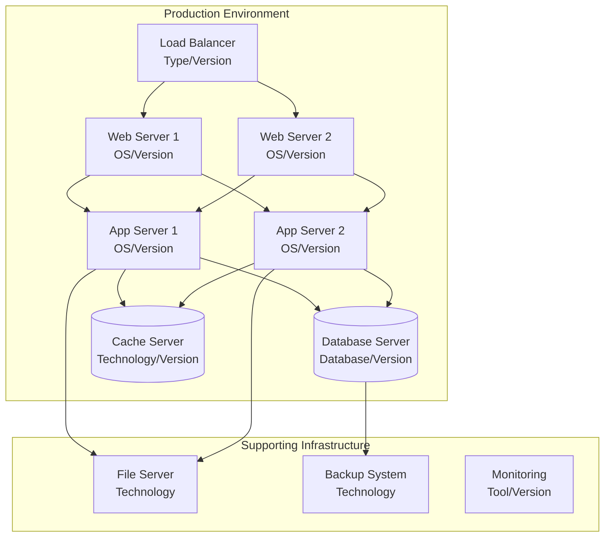

# Infrastructure Architecture - <!-- Solution name from codebase -->

> This document describes the current infrastructure setup including hosting environments, deployment procedures, networking configuration, and operational tooling **as it exists today**.

## Table of Contents

- [Executive Summary](#executive-summary)
- [Infrastructure Overview](#infrastructure-overview)
- [Hosting Environment](#hosting-environment)
- [Network Architecture](#network-architecture)
- [Deployment Infrastructure](#deployment-infrastructure)
- [Scalability Configuration](#scalability-configuration)
- <!-- Backup and Recovery based on evidence from analysis -->(#backup-and-recovery)
- [Evidence Sources](#evidence-sources)

---

## Executive Summary

**Current Infrastructure Profile:**
- **Hosting Model:** [On-premises / Cloud / Hybrid / Colocation]
- **Primary Platform:** [Windows Server / Linux / Container-based / Serverless]
- **Deployment Model:** [Manual / Semi-automated / Fully automated]
- **High Availability:** [Yes/No - describe current setup]
- **Disaster Recovery:** [Yes/No - describe current setup]

**Key Observations:**
[2-3 paragraphs summarizing the current infrastructure state, major components, and notable characteristics based on evidence]

**Source:** <!-- Configuration files, deployment scripts, infrastructure diagrams reviewed on (To be set upon document creation/update) based on evidence from analysis -->

---

## Infrastructure Overview

### Current Architecture Diagram



**Evidence:** [Source: Infrastructure diagram from `docs/infrastructure.vsdx`, validated against actual environment (To be set upon document creation/update)]

### Infrastructure Components Inventory

| Component Type | Technology | Version | Quantity | Purpose | Location/Details |
|----------------|------------|---------|----------|---------|------------------|
| Web Server | [IIS/Apache/Nginx] | <!-- Version from configuration --> | <!-- Number from metrics --> | <!-- Purpose from codebase --> | [Server names, IPs] |
| Application Server | <!-- Technology from analysis --> | <!-- Version from configuration --> | <!-- Number from metrics --> | <!-- Purpose from codebase --> | <!-- Details from codebase --> |
| Database Server | [SQL Server/PostgreSQL/etc.] | <!-- Version from configuration --> | <!-- Number from metrics --> | <!-- Purpose from codebase --> | <!-- Details from codebase --> |
| Cache Server | [Redis/Memcached/etc.] | <!-- Version from configuration --> | <!-- Number from metrics --> | <!-- Purpose from codebase --> | <!-- Details from codebase --> |
| Load Balancer | <!-- Technology from analysis --> | <!-- Version from configuration --> | <!-- Number from metrics --> | <!-- Purpose from codebase --> | <!-- Details from codebase --> |
| File Storage | <!-- Technology from analysis --> | <!-- Version from configuration --> | <!-- Number from metrics --> | <!-- Purpose from codebase --> | <!-- Details from codebase --> |

**Evidence:** [Source: Server inventory spreadsheet `IT/server-inventory.xlsx`, Configuration Management Database, last verified (To be set upon document creation/update)]

---

## Hosting Environment

### Production Environment

**Environment Details:**
- **Provider:** [On-premises datacenter / AWS / Azure / GCP / Hosting provider name]
- **Region/Location:** <!-- Physical location or cloud region based on evidence from analysis -->
- **Network Configuration:** <!-- Network setup details based on evidence from analysis -->
- **Access Control:** <!-- How access is controlled and managed based on evidence from analysis -->

**Server Specifications:**

#### Web Servers
- **Count:** <!-- Count from analysis -->
- **OS:** <!-- Operating system and version based on evidence from analysis -->
- **Specs:** [CPU, RAM, Storage]
- **Software:** <!-- Web server software and version based on evidence from analysis -->
- **Configuration:** <!-- Key configuration details based on evidence from analysis -->
  
**Evidence:** [Source: Server configuration files at `config/web-servers/`, verified via remote access on (To be set upon document creation/update)]

#### Application Servers
- **Count:** <!-- Count from analysis -->
- **OS:** <!-- Operating system and version based on evidence from analysis -->
- **Specs:** [CPU, RAM, Storage]
- **Runtime:** [.NET Framework/Java/Node.js version]
- **Configuration:** <!-- Key configuration details based on evidence from analysis -->

**Evidence:** [Source: `config/app-servers/machine.config`, environment variables documented in `docs/app-server-setup.md`]

#### Database Servers
- **Count:** <!-- Count from analysis -->
- **DBMS:** <!-- Database management system and version based on evidence from analysis -->
- **Specs:** [CPU, RAM, Storage]
- **Storage:** <!-- Storage type: SSD/HDD, capacity based on evidence from analysis -->
- **Configuration:** <!-- Key settings: memory allocation, connection limits, etc. based on evidence from analysis -->

**Evidence:** [Source: Database configuration query `SELECT @@VERSION`, `sp_configure` output captured on (To be set upon document creation/update)]

### Non-Production Environments

| Environment | Purpose | Configuration | Parity with Prod |
|-------------|---------|---------------|------------------|
| Development | <!-- Purpose from codebase --> | <!-- Key differences from prod based on evidence from analysis --> | [% parity] |
| Testing/QA | <!-- Purpose from codebase --> | <!-- Key differences from prod based on evidence from analysis --> | [% parity] |
| Staging | <!-- Purpose from codebase --> | <!-- Key differences from prod based on evidence from analysis --> | [% parity] |
| UAT | <!-- Purpose from codebase --> | <!-- Key differences from prod based on evidence from analysis --> | [% parity] |

**Evidence:** [Source: Environment comparison document `docs/environment-comparison.xlsx`, configuration files in `config/` folders]

---

## Network Architecture

### Current Network Topology

```mermaid
graph LR
    INTERNET<!-- Internet from codebase -->
    FW[Firewall<br/>Make/Model]
    DMZ<!-- DMZ from codebase -->
    LB<!-- Load Balancer from codebase -->
    WEBNET[Web Tier Network<br/>Subnet]
    APPNET[App Tier Network<br/>Subnet]
    DBNET[Data Tier Network<br/>Subnet]
    
    INTERNET --> FW
    FW --> DMZ
    DMZ --> LB
    LB --> WEBNET
    WEBNET --> APPNET
    APPNET --> DBNET
```

**Evidence:** [Source: Network diagram `infrastructure/network-topology.vsdx`, firewall rules export `fw-rules-(To be set upon document creation/update).csv`]

### Network Configuration

**Segmentation:**
- **Web Tier:** [Subnet/VLAN details]
- **Application Tier:** [Subnet/VLAN details]
- **Database Tier:** [Subnet/VLAN details]
- **Management Network:** [Subnet/VLAN details]

**Firewall Rules Summary:**
- **Public to DMZ:** <!-- Allowed ports/protocols based on evidence from analysis -->
- **DMZ to Web Tier:** <!-- Allowed ports/protocols based on evidence from analysis -->
- **Web to App Tier:** <!-- Allowed ports/protocols based on evidence from analysis -->
- **App to Database Tier:** <!-- Allowed ports/protocols based on evidence from analysis -->

**Evidence:** [Source: Firewall configuration export from [Firewall Make/Model] on (To be set upon document creation/update), located at `infrastructure/firewall-config/`]

### DNS Configuration

**Domains:**
- **Production:** [domain.com]
- **Staging:** [staging.domain.com]
- **Internal:** <!-- internal domain from codebase -->

**DNS Records:** [Key A, CNAME, MX records documented]

**Evidence:** [Source: DNS zone file export, DNS management console screenshots in `infrastructure/dns/`]

---

## Deployment Infrastructure

### Current Deployment Process

**Deployment Method:**
- **Type:** [Manual / Script-based / CI/CD]
- **Frequency:** <!-- How often deployments occur based on evidence from analysis -->
- **Downtime Required:** [Yes/No, duration if applicable]
- **Rollback Capability:** [Yes/No, how it's performed]

**Evidence:** [Source: Deployment runbook `operations/deployment-procedure.md`, deployment logs from last 5 deployments]

### Deployment Procedure (Current)

**Step-by-Step Process:**
1. [Step 1 - as actually performed today]
2. <!-- Step 2 from codebase -->
3. <!-- Step 3 from codebase -->
4. <!-- Step 4 from codebase -->
5. <!-- Step 5 from codebase -->

**Deployment Script Locations:**
- [Script 1: `path/to/script.ps1` or `path/to/script.sh`]
- [Script 2: `path/to/script`]

**Evidence:** [Source: Actual deployment scripts reviewed, deployment logs analysis, interview with deployment team on (To be set upon document creation/update)]

### CI/CD Pipeline (if applicable)

**Current State:**
- **Build Tool:** [Jenkins / Azure DevOps / GitLab CI / GitHub Actions / None]
- **Version Control:** [Git / SVN / TFS]
- **Artifact Repository:** [Nexus / Artifactory / Azure Artifacts / None]
- **Deployment Automation:** <!-- Level of automation 0-100% based on evidence from analysis -->

**Pipeline Stages:**
1. [Stage 1: e.g., Source checkout]
2. [Stage 2: e.g., Build]
3. [Stage 3: e.g., Unit tests]
4. [Stage 4: e.g., Package]
5. [Stage 5: e.g., Deploy to environment]

**Evidence:** [Source: CI/CD pipeline configuration files `azure-pipelines.yml`, `Jenkinsfile`, or equivalent]

---

## Scalability Configuration

### Current Scaling Capabilities

**Horizontal Scaling:**
- **Current Capability:** Yes or No
- **Implementation:** <!-- How it's implemented if applicable based on evidence from analysis -->
- **Constraints:** <!-- What prevents or limits horizontal scaling based on evidence from analysis -->

**Evidence:** [Source: Load balancer configuration, application architecture analysis]

**Vertical Scaling:**
- **Current Practice:** <!-- How servers are upgraded based on evidence from analysis -->
- **Downtime Required:** [Yes/No, duration]
- **Maximum Capacity:** <!-- Hardware limitations based on evidence from analysis -->

**Evidence:** [Source: Hardware specifications, upgrade history logs]

### Load Balancing

**Current Configuration:**
- **Technology:** [HAProxy / F5 / Azure Load Balancer / AWS ELB / None]
- **Algorithm:** [Round-robin / Least connections / IP hash / etc.]
- **Health Checks:** <!-- How health is monitored based on evidence from analysis -->
- **Session Persistence:** [Yes/No, method if yes]

**Evidence:** [Source: Load balancer configuration file `config/lb.conf` or management console export]

---

## Backup and Recovery

### Current Backup Strategy

**Database Backups:**
- **Frequency:** [Daily / Weekly / Continuous]
- **Type:** [Full / Incremental / Differential]
- **Retention:** <!-- How long backups are kept based on evidence from analysis -->
- **Location:** <!-- Where backups are stored based on evidence from analysis -->
- **Tested:** <!-- When last restore test was performed based on evidence from analysis -->

**Evidence:** [Source: Backup job configurations from `scripts/backup/`, backup logs, backup verification reports]

**Application/File Backups:**
- **Frequency:** <!-- Schedule from codebase -->
- **Scope:** <!-- What is backed up based on evidence from analysis -->
- **Retention:** <!-- Retention policy from codebase -->
- **Location:** <!-- Storage location from codebase -->

**Evidence:** [Source: Backup scripts, backup service configuration]

### Disaster Recovery

**Current DR Plan:**
- **RTO (Recovery Time Objective):** <!-- Current target from codebase -->
- **RPO (Recovery Point Objective):** <!-- Current target from codebase -->
- **DR Site:** [Yes/No, location if yes]
- **Last DR Test:** <!-- Date of last test, results based on evidence from analysis -->

**Evidence:** [Source: DR plan document `operations/disaster-recovery-plan.md`, DR test reports]

**Recovery Procedures:**
<!-- Document the actual current procedures, with references to runbooks based on evidence from analysis -->

**Evidence:** [Source: Recovery runbooks in `operations/recovery/`, incident reports from past recovery scenarios]

---

## Evidence Sources

### Configuration Files Reviewed

| File Path | Purpose | Last Modified | Reviewed Date |
|-----------|---------|---------------|---------------|
| <!-- Path to config from codebase --> | <!-- Purpose from codebase --> | <!-- Date from history --> | <!-- Review date from codebase --> |
| <!-- Path to config from codebase --> | <!-- Purpose from codebase --> | <!-- Date from history --> | <!-- Review date from codebase --> |

### Infrastructure Documentation

| Document | Location | Version | Last Updated |
|----------|----------|---------|--------------|
| <!-- Doc name from codebase --> | [Path/URL] | <!-- Version from configuration --> | <!-- Date from history --> |
| <!-- Doc name from codebase --> | [Path/URL] | <!-- Version from configuration --> | <!-- Date from history --> |

### Interviews Conducted

| Person | Role | Date | Topics Covered |
|--------|------|------|----------------|
| <!-- Name from documentation --> | <!-- Role from codebase --> | (To be set upon document creation/update) | <!-- Topics from codebase --> |
| <!-- Name from documentation --> | <!-- Role from codebase --> | (To be set upon document creation/update) | <!-- Topics from codebase --> |

### Tools Used for Analysis

| Tool | Version | Purpose | Date Used |
|------|---------|---------|-----------|
| <!-- Tool name from codebase --> | <!-- Version from configuration --> | <!-- What it was used for based on evidence from analysis --> | (To be set upon document creation/update) |
| <!-- Tool name from codebase --> | <!-- Version from configuration --> | <!-- What it was used for based on evidence from analysis --> | (To be set upon document creation/update) |

---

## Document Metadata

- **Document Version:** 1.0
- **Last Updated:** (To be set upon document creation/update)
- **Author:** [Author/Team name]
- **Infrastructure Analyzed:** <!-- Environment name from codebase -->
- **Analysis Date:** (To be set upon document creation/update)
- **Status:** Draft, Review, or Approved
- **Next Review:** (To be set upon document creation/update)

---

**Note:** This document captures the infrastructure **as it currently exists**. All information is based on evidence from configuration files, actual system inspection, and verified documentation. Any assumptions are explicitly stated in the relevant sections.
