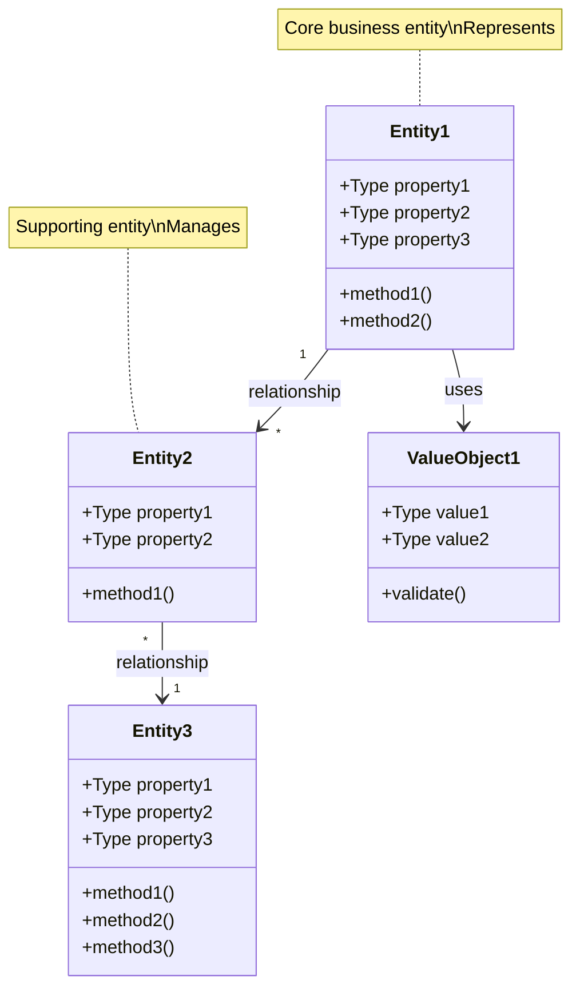
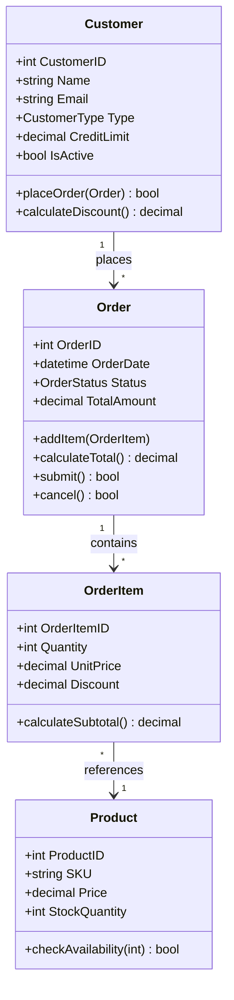
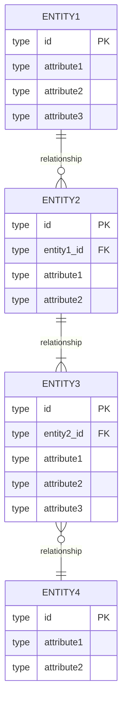
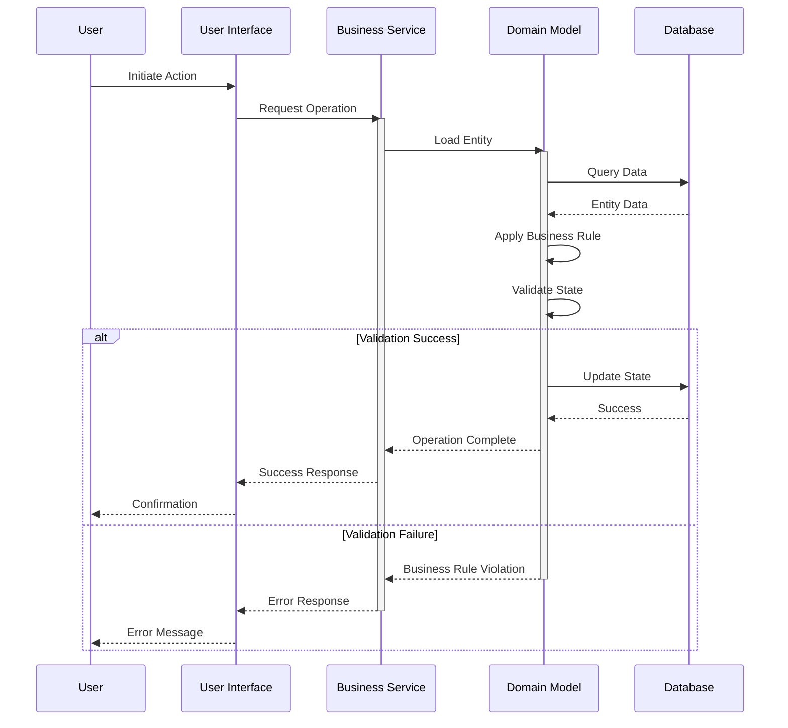
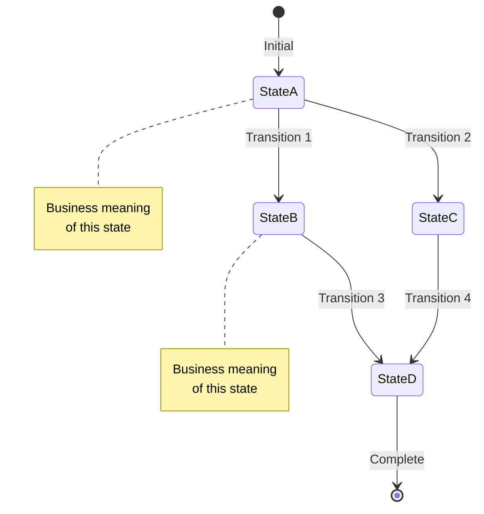

# Business Domain Model - <!-- Solution name from codebase -->

> This document defines the business domain model, including core entities, their relationships, business workflows, business rules, and the underlying business logic that drives the system.

## Table of Contents

- [Executive Summary](#executive-summary)
- [Domain Model Overview](#domain-model-overview)
- [Core Domain Entities](#core-domain-entities)
- [Entity Relationships](#entity-relationships)
- [Business Workflows](#business-workflows)
- [Business Rules Catalog](#business-rules-catalog)
- [Domain Invariants](#domain-invariants)
- [Business Process Patterns](#business-process-patterns)
- [State Machines](#state-machines)
- [Domain-Driven Design Elements](#domain-driven-design-elements)
- [Glossary](#glossary)

---

## Executive Summary

### Domain Overview

<!-- Provide 2-3 paragraphs describing: based on evidence from codebase analysis -->
- Business purpose of the system
- Core business capabilities
- Primary business entities
- Key business processes
- Domain complexity level

### Key Statistics

| Metric | Count/Value | Notes |
|--------|-------------|-------|
| **Core Entities** | <!-- Count from analysis --> | <!-- Primary business objects based on evidence from analysis --> |
| **Business Processes** | <!-- Count from analysis --> | <!-- Major workflows from codebase --> |
| **Business Rules** | <!-- Count from analysis --> | <!-- Documented rules from codebase --> |
| **Value Objects** | <!-- Count from analysis --> | <!-- Immutable domain objects based on evidence from analysis --> |
| **Domain Events** | <!-- Count from analysis --> | <!-- Significant business events based on evidence from analysis --> |
| **Business Transactions** | <!-- Volume from codebase --> | [Daily/monthly] |

### Business Context

**Industry:** [Industry/sector]

**Business Model:** [B2B, B2C, B2B2C, etc.]

**Primary Users:**
- <!-- User Type 1 from codebase -->: <!-- Description from codebase -->
- <!-- User Type 2 from codebase -->: <!-- Description from codebase -->
- <!-- User Type 3 from codebase -->: <!-- Description from codebase -->

**Key Business Drivers:**
- <!-- Driver 1 from codebase -->
- <!-- Driver 2 from codebase -->
- <!-- Driver 3 from codebase -->

---

## Domain Model Overview

### 6.1 Business Domain Structure

<!-- Describe the overall structure of the business domain based on evidence from analysis -->

**Primary Business Areas:**
1. <!-- Area 1 from codebase -->: <!-- Description from codebase -->
2. <!-- Area 2 from codebase -->: <!-- Description from codebase -->
3. <!-- Area 3 from codebase -->: <!-- Description from codebase -->

**Supporting Business Areas:**
1. <!-- Area 1 from codebase -->: <!-- Description from codebase -->
2. <!-- Area 2 from codebase -->: <!-- Description from codebase -->

### 6.2 Domain Model Diagram

<!-- 
DOCUMENTATION REQUIREMENTS:
- Core domain entities and their relationships
- Value objects and aggregates
- Bounded contexts (if using DDD)
-->



**Example Domain Model (Reference):**



### 6.3 Bounded Contexts

<!-- If using Domain-Driven Design based on evidence from analysis -->

**Context 1: <!-- Context Name from codebase -->**
- **Purpose:** <!-- What this context handles based on evidence from analysis -->
- **Entities:** <!-- List of entities based on evidence from analysis -->
- **Responsibilities:** <!-- What it's responsible for based on evidence from analysis -->

**Context 2: <!-- Context Name from codebase -->**
- **Purpose:** <!-- What this context handles based on evidence from analysis -->
- **Entities:** <!-- List of entities based on evidence from analysis -->
- **Responsibilities:** <!-- What it's responsible for based on evidence from analysis -->

**Context Map:**
```mermaid
graph LR
    Context1<!-- Context 1 from codebase --> -->|Shared Kernel| Context2<!-- Context 2 from codebase -->
    Context1 -->|Customer/Supplier| Context3<!-- Context 3 from codebase -->
    Context2 -->|Conformist| Context4<!-- Context 4 from codebase -->
    Context3 -->|Anti-Corruption Layer| ExternalSystem<!-- External System from codebase -->
    
    style Context1 fill:#e1f5ff
    style Context2 fill:#fff4e1
    style Context3 fill:#ffe1e1
    style Context4 fill:#e1ffe1
```

---

## Core Domain Entities

### 6.4 Entity Catalog

<!-- 
DOCUMENTATION REQUIREMENTS - For each entity document:
- **Name**: Entity name
- **Purpose**: Business meaning
- **Attributes**: Properties with business descriptions
- **Validation Rules**: Business constraints
- **State Lifecycle**: Valid states and transitions
- **Business Rules**: Logic and calculations
- **Related Entities**: Associations and dependencies
-->

#### Entity 1: <!-- Entity Name from codebase -->

**Business Name:** <!-- Business term used from codebase -->

**Business Purpose:** <!-- What this entity represents in business terms based on evidence from analysis -->

**Lifecycle:** [Creation → Active states → Completion/Archival]

**Key Attributes:**

| Attribute | Type | Required | Business Meaning | Validation Rules |
|-----------|------|----------|------------------|------------------|
| <!-- attribute1 from codebase --> | <!-- Type from codebase --> | Yes or No | <!-- Business meaning from codebase --> | <!-- Validation rules from codebase --> |
| <!-- attribute2 from codebase --> | <!-- Type from codebase --> | Yes or No | <!-- Business meaning from codebase --> | <!-- Validation rules from codebase --> |
| <!-- attribute3 from codebase --> | <!-- Type from codebase --> | Yes or No | <!-- Business meaning from codebase --> | <!-- Validation rules from codebase --> |

**Business Rules:**
1. **<!-- Rule Name from codebase -->**: <!-- Description of business rule based on evidence from analysis -->
   - **Validation:** <!-- How it's validated based on evidence from analysis -->
   - **Consequence:** <!-- What happens if violated based on evidence from analysis -->

2. **<!-- Rule Name from codebase -->**: <!-- Description from codebase -->
   - **Validation:** <!-- Validation method from codebase -->
   - **Consequence:** <!-- What happens from codebase -->

**State Transitions:**
- <!-- State 1 from codebase --> → <!-- State 2 from codebase -->: [Trigger/condition]
- <!-- State 2 from codebase --> → <!-- State 3 from codebase -->: [Trigger/condition]
- <!-- State 3 from codebase --> → <!-- Terminal State from codebase -->: [Trigger/condition]

**Key Methods/Operations:**

| Method | Purpose | Pre-conditions | Post-conditions |
|--------|---------|----------------|-----------------|
| [method1()] | <!-- What it does from codebase --> | <!-- Required state from codebase --> | <!-- Result state from codebase --> |
| [method2()] | <!-- What it does from codebase --> | <!-- Required state from codebase --> | <!-- Result state from codebase --> |

**Business Constraints:**
- <!-- Constraint 1 from codebase -->
- <!-- Constraint 2 from codebase -->
- <!-- Constraint 3 from codebase -->

**Related Entities:**
- <!-- Entity A from codebase -->: <!-- Relationship description based on evidence from analysis -->
- <!-- Entity B from codebase -->: <!-- Relationship description based on evidence from analysis -->

**Implementation Notes:**
<!-- Technical implementation details, database table, etc. based on evidence from analysis -->

---

#### Entity 2: <!-- Entity Name from codebase -->

<!-- Similar structure as Entity 1 based on evidence from analysis -->

---

### 6.5 Value Objects

#### Value Object 1: <!-- Name from documentation -->

**Purpose:** <!-- What this represents based on evidence from analysis -->

**Immutability:** <!-- Yes - explain why from codebase -->

**Attributes:**

| Attribute | Type | Description | Validation |
|-----------|------|-------------|------------|
| <!-- attribute1 from codebase --> | <!-- Type from codebase --> | <!-- Description from codebase --> | <!-- Rules from codebase --> |
| <!-- attribute2 from codebase --> | <!-- Type from codebase --> | <!-- Description from codebase --> | <!-- Rules from codebase --> |

**Validation Rules:**
```<!-- language from codebase -->
// Example validation code
public class <!-- ValueObjectName from codebase -->
{
    public <!-- Type from codebase --> <!-- Property from codebase --> { get; }
    
    public [ValueObjectName](<!-- parameters from codebase -->)
    {
        if (<!-- validation condition from codebase -->)
            throw new ValidationException("<!-- message from codebase -->");
            
        <!-- Property from codebase --> = <!-- parameter from codebase -->;
    }
    
    public override bool Equals(object obj)
    {
        // Value equality implementation
    }
}
```

**Usage Examples:**
- [Where/how it's used in the domain]

---

### 6.6 Aggregates

<!-- If using DDD aggregates based on evidence from analysis -->

#### Aggregate 1: <!-- Aggregate Name from codebase -->

**Aggregate Root:** <!-- Root entity from codebase -->

**Members:**
- <!-- Entity 1 from codebase -->
- <!-- Entity 2 from codebase -->
- <!-- Value Object 1 from codebase -->

**Consistency Boundary:**
<!-- What must remain consistent within this aggregate based on evidence from analysis -->

**Invariants:**
1. <!-- Invariant 1 from codebase -->
2. <!-- Invariant 2 from codebase -->

**Operations:**

| Operation | Description | Validation |
|-----------|-------------|------------|
| <!-- operation1 from codebase --> | <!-- What it does from codebase --> | <!-- Business rules from codebase --> |
| <!-- operation2 from codebase --> | <!-- What it does from codebase --> | <!-- Business rules from codebase --> |

---

## Entity Relationships

### 6.7 Relationship Matrix

| Entity 1 | Relationship | Entity 2 | Cardinality | Business Meaning |
|----------|--------------|----------|-------------|------------------|
| <!-- Entity A from codebase --> | [has/owns/manages] | <!-- Entity B from codebase --> | [1:1, 1:*, *:*] | <!-- Business context from codebase --> |
| <!-- Entity B from codebase --> | <!-- belongs to from codebase --> | <!-- Entity C from codebase --> | <!-- Cardinality from codebase --> | <!-- Business context from codebase --> |
| <!-- Entity C from codebase --> | <!-- references from codebase --> | <!-- Entity D from codebase --> | <!-- Cardinality from codebase --> | <!-- Business context from codebase --> |

### 6.8 Entity Relationship Diagram



### 6.9 Relationship Rules

**Rule 1: <!-- Entity A from codebase --> → <!-- Entity B from codebase -->**
- **Cardinality:** <!-- Description from codebase -->
- **Business Rule:** <!-- Why this relationship exists based on evidence from analysis -->
- **Referential Integrity:** <!-- How it's enforced based on evidence from analysis -->
- **Cascade Behavior:** <!-- What happens on delete/update based on evidence from analysis -->

**Rule 2: <!-- Entity C from codebase --> → <!-- Entity D from codebase -->**
<!-- Similar structure from codebase -->

---

## Business Workflows

### 6.10 Core Business Process 1: <!-- Process Name from codebase -->

<!-- 
DOCUMENTATION REQUIREMENTS - For each workflow document:
- **Process Name**: Clear business name
- **Trigger**: What initiates the process
- **Steps**: Sequence of activities
- **Decision Points**: Business rules applied
- **Outcomes**: Possible end states
- **Exception Handling**: Error scenarios
- **Implementation**: Which components handle each step
- **Flow Diagrams**: Mermaid sequence or activity diagrams
-->

**Business Purpose:** <!-- What business goal this achieves based on evidence from analysis -->

**Participants:**
- <!-- User Role 1 from codebase -->: <!-- Responsibilities from codebase -->
- <!-- User Role 2 from codebase -->: <!-- Responsibilities from codebase -->
- [System/Service]: <!-- What it does from codebase -->

**Triggers:**
- <!-- Trigger 1 from codebase -->: <!-- What initiates the process based on evidence from analysis -->
- <!-- Trigger 2 from codebase -->: <!-- Alternative trigger from codebase -->

**Process Flow:**

```mermaid
flowchart TD
    Start([Start: Trigger Event]) --> Step1[Step 1: Action]
    Step1 --> Decision1{Business Decision?}
    
    Decision1 -->|Option A| Step2A[Step 2A: Action]
    Decision1 -->|Option B| Step2B[Step 2B: Alternative]
    
    Step2A --> Validate{Validation<br/>Passed?}
    Step2B --> Validate
    
    Validate -->|No| ErrorHandler<!-- Handle Error from codebase -->
    ErrorHandler --> Step1
    
    Validate -->|Yes| Step3[Step 3: Process]
    Step3 --> Step4[Step 4: Update State]
    Step4 --> Notify<!-- Notify Stakeholders from codebase -->
    Notify --> End([End: Complete])
    
    style Step1 fill:#e1f5ff
    style Step3 fill:#fff4e1
    style Step4 fill:#e1ffe1
    style Notify fill:#ffe1e1
```

**Step Details:**

**Step 1: <!-- Step Name from codebase -->**
- **Action:** <!-- What happens from codebase -->
- **Business Rule:** <!-- Rules applied from codebase -->
- **Validation:** <!-- Checks performed from codebase -->
- **Data Changes:** <!-- What data is modified based on evidence from analysis -->
- **Responsible:** [Who/what performs this]

**Step 2: <!-- Step Name from codebase -->**
<!-- Similar structure from codebase -->

**Decision Points:**

**Decision 1: <!-- Decision Name from codebase -->**
- **Question:** <!-- What is being decided based on evidence from analysis -->
- **Criteria:** <!-- Decision criteria from codebase -->
- **Option A:** <!-- Outcome and next steps based on evidence from analysis -->
- **Option B:** <!-- Outcome and next steps based on evidence from analysis -->
- **Business Impact:** <!-- Why this matters based on evidence from analysis -->

**Outcomes:**
- **Success:** <!-- End state description based on evidence from analysis -->
- **Failure:** <!-- Error handling approach based on evidence from analysis -->
- **Partial:** <!-- Incomplete state handling based on evidence from analysis -->

**Business Rules Applied:**
1. <!-- Rule 1 from codebase -->
2. <!-- Rule 2 from codebase -->
3. <!-- Rule 3 from codebase -->

**Performance Metrics:**
- Average Duration: <!-- Time from codebase -->
- Success Rate: <!-- Percentage from metrics -->
- Volume: <!-- Transactions per period from codebase -->

---

### 6.11 Core Business Process 2: <!-- Process Name from codebase -->

<!-- Similar structure as Process 1 based on evidence from analysis -->

---

### 6.12 Sequence Diagrams

#### Workflow 1: <!-- Workflow Name from codebase -->



---

## Business Rules Catalog

### 6.13 Business Rules by Category

<!-- 
DOCUMENTATION REQUIREMENTS - Catalog all business rules with:
- **Rule ID**: Unique identifier
- **Description**: Plain language statement
- **Category**: Validation, calculation, workflow, etc.
- **Implementation**: Where in code it's enforced
- **Business Owner**: Who defines/maintains it
- **Examples**: Test cases demonstrating the rule
-->

#### Category 1: Validation Rules

**Rule 1.1: <!-- Rule Name from codebase -->**
- **Rule ID:** BR-VAL-001
- **Description:** <!-- Plain language description of the rule based on evidence from analysis -->
- **Applies To:** <!-- Which entities/processes based on evidence from analysis -->
- **Condition:** <!-- When this rule is checked based on evidence from analysis -->
- **Validation:** <!-- How to verify compliance based on evidence from analysis -->
- **Example:** <!-- Concrete example from codebase -->
- **Implementation:** <!-- Where in code/database based on evidence from analysis -->
- **Business Owner:** <!-- Who defined this rule based on evidence from analysis -->
- **Last Updated:** <!-- Date from history -->

**Rule 1.2: <!-- Rule Name from codebase -->**
<!-- Similar structure from codebase -->

#### Category 2: Calculation Rules

**Rule 2.1: <!-- Rule Name from codebase -->**
- **Rule ID:** BR-CALC-001
- **Description:** <!-- What is calculated based on evidence from analysis -->
- **Formula:** <!-- Mathematical or logical formula based on evidence from analysis -->
- **Inputs:** <!-- Required data from codebase -->
- **Output:** <!-- Result from codebase -->
- **Example:** <!-- Sample calculation based on evidence from analysis -->
- **Edge Cases:** <!-- Special scenarios from codebase -->
- **Implementation:** <!-- Code location from codebase -->

**Rule 2.2: <!-- Rule Name from codebase -->**
<!-- Similar structure from codebase -->

#### Category 3: Workflow Rules

**Rule 3.1: <!-- Rule Name from codebase -->**
- **Rule ID:** BR-FLOW-001
- **Description:** <!-- Process rule description based on evidence from analysis -->
- **Trigger:** <!-- What initiates this based on evidence from analysis -->
- **Condition:** <!-- When it applies from codebase -->
- **Action:** <!-- What happens from codebase -->
- **Example:** <!-- Scenario from codebase -->
- **Exceptions:** <!-- When rule doesn't apply based on evidence from analysis -->
- **Implementation:** <!-- Where enforced from codebase -->

**Rule 3.2: <!-- Rule Name from codebase -->**
<!-- Similar structure from codebase -->

#### Category 4: Authorization Rules

**Rule 4.1: <!-- Rule Name from codebase -->**
- **Rule ID:** BR-AUTH-001
- **Description:** <!-- Permission rule from codebase -->
- **Roles:** <!-- Which roles from codebase -->
- **Permissions:** <!-- What they can do based on evidence from analysis -->
- **Restrictions:** <!-- What they cannot do based on evidence from analysis -->
- **Context:** <!-- When this applies based on evidence from analysis -->
- **Implementation:** <!-- Security layer from codebase -->

**Rule 4.2: <!-- Rule Name from codebase -->**
<!-- Similar structure from codebase -->

### 6.14 Business Rule Dependency Matrix

| Rule ID | Depends On | Impacts | Priority |
|---------|------------|---------|----------|
| <!-- BR-001 from codebase --> | [BR-002, BR-003] | <!-- BR-005 from codebase --> | High, Medium, or Low |
| <!-- BR-002 from codebase --> | <!-- None from codebase --> | [BR-001, BR-004] | <!-- Priority from impact/risk --> |

---

## Domain Invariants

### 6.15 Critical Invariants

**These rules must NEVER be violated**

**Invariant 1: <!-- Name from documentation -->**
- **Description:** <!-- What must always be true based on evidence from analysis -->
- **Entities Involved:** <!-- Which entities from codebase -->
- **Expression:** <!-- Formal or pseudo-code expression based on evidence from analysis -->
- **Enforcement:** <!-- How it's guaranteed based on evidence from analysis -->
- **Consequence of Violation:** <!-- What breaks from codebase -->

**Example:**
```<!-- language from codebase -->
// Example invariant check
public bool ValidateInvariant()
{
    // Invariant: Total must equal sum of line items
    return this.Total == this.LineItems.Sum(item => item.Amount);
}
```

**Invariant 2: <!-- Name from documentation -->**
<!-- Similar structure from codebase -->

### 6.16 Soft Invariants

**These are business preferences, not hard requirements**

**Soft Invariant 1: <!-- Name from documentation -->**
- **Description:** <!-- Preferred state from codebase -->
- **Tolerance:** <!-- Acceptable deviation from codebase -->
- **Alert Threshold:** <!-- When to notify from codebase -->
- **Corrective Action:** <!-- How to fix from codebase -->

---

## Business Process Patterns

### 6.17 Common Patterns

#### Pattern 1: <!-- Pattern Name from codebase -->

**Problem:** <!-- Business problem this solves based on evidence from analysis -->

**Solution:** <!-- How this pattern addresses it based on evidence from analysis -->

**Structure:**
```mermaid
graph TB
    A<!-- Component A from codebase --> --> B<!-- Component B from codebase -->
    B --> C<!-- Component C from codebase -->
    C --> D<!-- Component D from codebase -->
    D --> A
```

**When to Use:**
- <!-- Scenario 1 from codebase -->
- <!-- Scenario 2 from codebase -->

**Example Usage:**
<!-- Concrete example from the system based on evidence from analysis -->

**Benefits:**
- <!-- Benefit 1 from codebase -->
- <!-- Benefit 2 from codebase -->

**Trade-offs:**
- <!-- Trade-off 1 from codebase -->
- <!-- Trade-off 2 from codebase -->

---

## State Machines

### 6.18 Entity State Machines

#### State Machine 1: <!-- Entity Name from codebase --> States

**Purpose:** <!-- What states represent based on evidence from analysis -->

**States:**

| State | Description | Valid Transitions | Business Meaning |
|-------|-------------|-------------------|------------------|
| <!-- State A from codebase --> | <!-- Description from codebase --> | [State B, State C] | <!-- What it means from codebase --> |
| <!-- State B from codebase --> | <!-- Description from codebase --> | [State C, State D] | <!-- What it means from codebase --> |
| <!-- State C from codebase --> | <!-- Description from codebase --> | <!-- State D from codebase --> | <!-- What it means from codebase --> |
| <!-- State D from codebase --> | <!-- Terminal from codebase --> | <!-- None from codebase --> | <!-- Final state from codebase --> |

**State Diagram:**



**Transition Rules:**

**Transition: State A → State B**
- **Trigger:** <!-- What causes this based on evidence from analysis -->
- **Guard Condition:** <!-- What must be true based on evidence from analysis -->
- **Action:** <!-- What happens during transition based on evidence from analysis -->
- **Business Rule:** <!-- Business justification based on evidence from analysis -->

**Transition: State B → State C**
<!-- Similar structure from codebase -->

---

## Domain-Driven Design Elements

<!-- Include this section if using DDD based on evidence from analysis -->

### 6.19 Domain Services

#### Service 1: <!-- Service from configuration -->

**Purpose:** <!-- What business operation this performs based on evidence from analysis -->

**Why Not in Entity:** <!-- Rationale for service vs entity method based on evidence from analysis -->

**Operations:**

| Operation | Input | Output | Business Rule |
|-----------|-------|--------|---------------|
| <!-- operation1 from codebase --> | <!-- Parameters from codebase --> | <!-- Return type from codebase --> | <!-- Rules applied from codebase --> |
| <!-- operation2 from codebase --> | <!-- Parameters from codebase --> | <!-- Return type from codebase --> | <!-- Rules applied from codebase --> |

**Example:**
```<!-- language from codebase -->
public interface I<!-- ServiceName from codebase -->
{
    <!-- ReturnType from codebase --> [OperationName](<!-- Parameters from codebase -->);
}

public class <!-- ServiceName from codebase --> : I<!-- ServiceName from codebase -->
{
    public <!-- ReturnType from codebase --> [OperationName](<!-- Parameters from codebase -->)
    {
        // Business logic
        // Apply business rules
        // Return result
    }
}
```

### 6.20 Domain Events

#### Event 1: <!-- Event Name from codebase -->

**Trigger:** <!-- When this event occurs based on evidence from analysis -->

**Payload:**
- <!-- Property 1 from codebase -->: <!-- Description from codebase -->
- <!-- Property 2 from codebase -->: <!-- Description from codebase -->

**Subscribers:**
- <!-- Subscriber 1 from codebase -->: <!-- What it does with event based on evidence from analysis -->
- <!-- Subscriber 2 from codebase -->: <!-- What it does with event based on evidence from analysis -->

**Business Impact:** <!-- Why this event matters based on evidence from analysis -->

**Example:**
```<!-- language from codebase -->
public class <!-- EventName from codebase --> : IDomainEvent
{
    public DateTime OccurredOn { get; }
    public <!-- Type from codebase --> <!-- Property1 from codebase --> { get; }
    public <!-- Type from codebase --> <!-- Property2 from codebase --> { get; }
    
    public [EventName](<!-- parameters from codebase -->)
    {
        OccurredOn = DateTime.UtcNow;
        // Set properties
    }
}
```

### 6.21 Repositories

#### Repository 1: <!-- Repository Name from codebase -->

**Purpose:** <!-- What this repository manages based on evidence from analysis -->

**Aggregate Root:** <!-- Root entity from codebase -->

**Operations:**

| Operation | Purpose | Returns |
|-----------|---------|---------|
| GetById(id) | <!-- Description from codebase --> | <!-- Entity from codebase --> |
| FindBy<!-- Criteria from codebase --> | <!-- Description from codebase --> | <!-- Collection from codebase --> |
| Add(entity) | <!-- Description from codebase --> | [void/id] |
| Update(entity) | <!-- Description from codebase --> | <!-- void from codebase --> |
| Delete(entity) | <!-- Description from codebase --> | <!-- void from codebase --> |

**Example:**
```<!-- language from codebase -->
public interface I<!-- RepositoryName from codebase -->
{
    <!-- Entity from codebase --> GetById(<!-- IdType from codebase --> id);
    IEnumerable<<!-- Entity from codebase -->> FindBy[Criteria](<!-- Parameters from codebase -->);
    void Add(<!-- Entity from codebase --> entity);
    void Update(<!-- Entity from codebase --> entity);
    void Delete(<!-- Entity from codebase --> entity);
}
```

---

## Business Calculations and Formulas

### 6.22 Key Calculations

#### Calculation 1: <!-- Calculation Name from codebase -->

**Business Purpose:** <!-- What is being calculated and why based on evidence from analysis -->

**Formula:**
```
<!-- Mathematical formula or algorithm based on evidence from analysis -->
```

**Inputs:**
- <!-- Input 1 from codebase -->: <!-- Description and type from codebase -->
- <!-- Input 2 from codebase -->: <!-- Description and type from codebase -->

**Output:**
- <!-- Output from codebase -->: <!-- Description and type from codebase -->

**Business Rules:**
- <!-- Rule 1 from codebase -->
- <!-- Rule 2 from codebase -->

**Example:**
```
Input 1: <!-- Value from measurements -->
Input 2: <!-- Value from measurements -->
Result: <!-- Calculated value from codebase -->
```

**Edge Cases:**
- <!-- Edge Case 1 from codebase -->: <!-- How handled from codebase -->
- <!-- Edge Case 2 from codebase -->: <!-- How handled from codebase -->

**Implementation:**
```<!-- language from codebase -->
public <!-- OutputType from codebase --> Calculate<!-- Name from documentation -->(<!-- InputType from codebase --> input1, <!-- InputType from codebase --> input2)
{
    // Validation
    if (<!-- validation condition from codebase -->)
        throw new BusinessRuleException("<!-- message from codebase -->");
    
    // Calculation
    var result = <!-- formula from codebase -->;
    
    return result;
}
```

---

## User Roles and Permissions

### 6.23 Role Definitions

| Role | Description | Typical User | Key Permissions |
|------|-------------|--------------|-----------------|
| <!-- Role 1 from codebase --> | <!-- Description from codebase --> | <!-- User type from codebase --> | <!-- Permissions list from codebase --> |
| <!-- Role 2 from codebase --> | <!-- Description from codebase --> | <!-- User type from codebase --> | <!-- Permissions list from codebase --> |
| <!-- Role 3 from codebase --> | <!-- Description from codebase --> | <!-- User type from codebase --> | <!-- Permissions list from codebase --> |

### 6.24 Permission Matrix

| Operation | <!-- Role 1 from codebase --> | <!-- Role 2 from codebase --> | <!-- Role 3 from codebase --> | <!-- Role 4 from codebase --> |
|-----------|----------|----------|----------|----------|
| View <!-- Entity from codebase --> | ✅ | ✅ | ✅ | ❌ |
| Create <!-- Entity from codebase --> | ✅ | ✅ | ❌ | ❌ |
| Update <!-- Entity from codebase --> | ✅ | ⚠️ Own Only | ❌ | ❌ |
| Delete <!-- Entity from codebase --> | ✅ | ❌ | ❌ | ❌ |
| Approve <!-- Process from codebase --> | ✅ | ❌ | ❌ | ❌ |

**Legend:**
- ✅ Full Access
- ⚠️ Conditional Access
- ❌ No Access

---

## Data Lifecycle Management

### 6.25 Entity Lifecycles

#### Entity 1: <!-- Entity Name from codebase -->

**Creation:**
- **Trigger:** <!-- What causes creation based on evidence from analysis -->
- **Required Data:** <!-- Minimum data needed based on evidence from analysis -->
- **Initial State:** <!-- Starting state from codebase -->
- **Validation:** <!-- Creation rules from codebase -->

**Active States:**
- <!-- State 1 from codebase -->: <!-- Description and duration based on evidence from analysis -->
- <!-- State 2 from codebase -->: <!-- Description and duration based on evidence from analysis -->

**Modification:**
- **Who Can Modify:** <!-- Roles from codebase -->
- **When Modifiable:** <!-- Conditions from codebase -->
- **Audit Trail:** <!-- How changes tracked based on evidence from analysis -->

**Archival:**
- **Trigger:** <!-- When archived from codebase -->
- **Retention Period:** <!-- Based on complexity -->
- **Archived State:** <!-- What happens from codebase -->

**Deletion:**
- **Soft Delete:** [Yes/No - approach]
- **Hard Delete:** <!-- Conditions if allowed from codebase -->
- **Cascade Rules:** <!-- What happens to related entities based on evidence from analysis -->

---

## Business Metrics and KPIs

### 6.26 Key Performance Indicators

| KPI | Definition | Calculation | Target | Current |
|-----|------------|-------------|--------|---------|
| <!-- KPI 1 from codebase --> | <!-- What it measures based on evidence from analysis --> | <!-- Formula from codebase --> | <!-- Goal from codebase --> | <!-- Value from measurements --> |
| <!-- KPI 2 from codebase --> | <!-- What it measures based on evidence from analysis --> | <!-- Formula from codebase --> | <!-- Goal from codebase --> | <!-- Value from measurements --> |
| <!-- KPI 3 from codebase --> | <!-- What it measures based on evidence from analysis --> | <!-- Formula from codebase --> | <!-- Goal from codebase --> | <!-- Value from measurements --> |

### 6.27 Business Metrics

**Volume Metrics:**
- <!-- Metric 1 from codebase -->: <!-- Description and value from codebase -->
- <!-- Metric 2 from codebase -->: <!-- Description and value from codebase -->

**Quality Metrics:**
- <!-- Metric 1 from codebase -->: <!-- Description and value from codebase -->
- <!-- Metric 2 from codebase -->: <!-- Description and value from codebase -->

**Efficiency Metrics:**
- <!-- Metric 1 from codebase -->: <!-- Description and value from codebase -->
- <!-- Metric 2 from codebase -->: <!-- Description and value from codebase -->

---

## Exception Handling and Edge Cases

### 6.28 Business Exceptions

#### Exception 1: <!-- Exception Name from codebase -->

**Scenario:** <!-- When this occurs based on evidence from analysis -->

**Business Impact:** <!-- What this means for the business based on evidence from analysis -->

**Resolution Strategy:**
1. <!-- Step 1 from codebase -->
2. <!-- Step 2 from codebase -->
3. <!-- Step 3 from codebase -->

**Responsible Party:** <!-- Who handles this based on evidence from analysis -->

**Example:**
<!-- Concrete example scenario based on evidence from analysis -->

### 6.29 Edge Cases

#### Edge Case 1: <!-- Case Name from codebase -->

**Description:** <!-- What makes this unusual based on evidence from analysis -->

**Frequency:** <!-- How often it occurs based on evidence from analysis -->

**Business Rule:** <!-- How it's handled based on evidence from analysis -->

**Implementation:** <!-- Technical handling from codebase -->

---

## Glossary

### 6.30 Business Terms

| Term | Business Definition | Technical Mapping | Example |
|------|---------------------|-------------------|---------|
| <!-- Term 1 from codebase --> | <!-- Business meaning from codebase --> | [Code/DB element] | <!-- Usage example from codebase --> |
| <!-- Term 2 from codebase --> | <!-- Business meaning from codebase --> | [Code/DB element] | <!-- Usage example from codebase --> |
| <!-- Term 3 from codebase --> | <!-- Business meaning from codebase --> | [Code/DB element] | <!-- Usage example from codebase --> |

### 6.31 Domain-Specific Acronyms

| Acronym | Full Name | Context | Meaning |
|---------|-----------|---------|---------|
| <!-- ABC from codebase --> | <!-- Full name from codebase --> | <!-- Where used from codebase --> | <!-- Definition from codebase --> |
| <!-- DEF from codebase --> | <!-- Full name from codebase --> | <!-- Where used from codebase --> | <!-- Definition from codebase --> |

---

## Appendices

### Appendix A: Business Rule Test Cases

| Rule ID | Test Scenario | Input | Expected Output | Status |
|---------|---------------|-------|-----------------|--------|
| <!-- BR-001 from codebase --> | <!-- Scenario from codebase --> | <!-- Input data from codebase --> | <!-- Expected result from codebase --> | [Pass/Fail] |

### Appendix B: Domain Model Evolution

| Version | Date | Changes | Rationale |
|---------|------|---------|-----------|
| 1.0 | <!-- Date from history --> | Initial domain model | <!-- Reason from codebase --> |
| 1.1 | <!-- Date from history --> | Added [entity/rule] | <!-- Business need from codebase --> |

### Appendix C: Business Process Metrics

<!-- Detailed metrics and analytics for business processes based on evidence from analysis -->

---

## Document Metadata

- **Document Version:** 1.0
- **Last Updated:** <!-- Date from history -->
- **Business Owner:** [Name/Department]
- **Technical Owner:** [Name/Team]
- **Status:** Draft, Review, or Approved
- **Next Review:** <!-- Date from history -->

---

## Document History

| Version | Date | Author | Changes |
|---------|------|--------|---------|
| 1.0 | (To be set upon document creation/update) | <!-- Author from commits --> | Initial creation |

---

**Related Documents:**
- <!-- Link to Architecture Overview based on evidence from analysis -->
- <!-- Link to Data Architecture based on evidence from analysis -->
- <!-- Link to API Documentation based on evidence from analysis -->
- <!-- Link to User Guide based on evidence from analysis -->

---

**Note:** This domain model should be reviewed and updated whenever business processes change, new business rules are identified, or the business requirements evolve. Regular collaboration with business stakeholders is essential to keep this document accurate and relevant.
