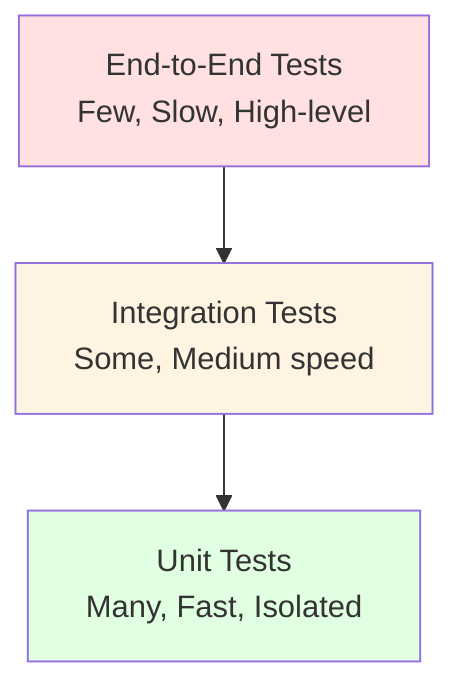
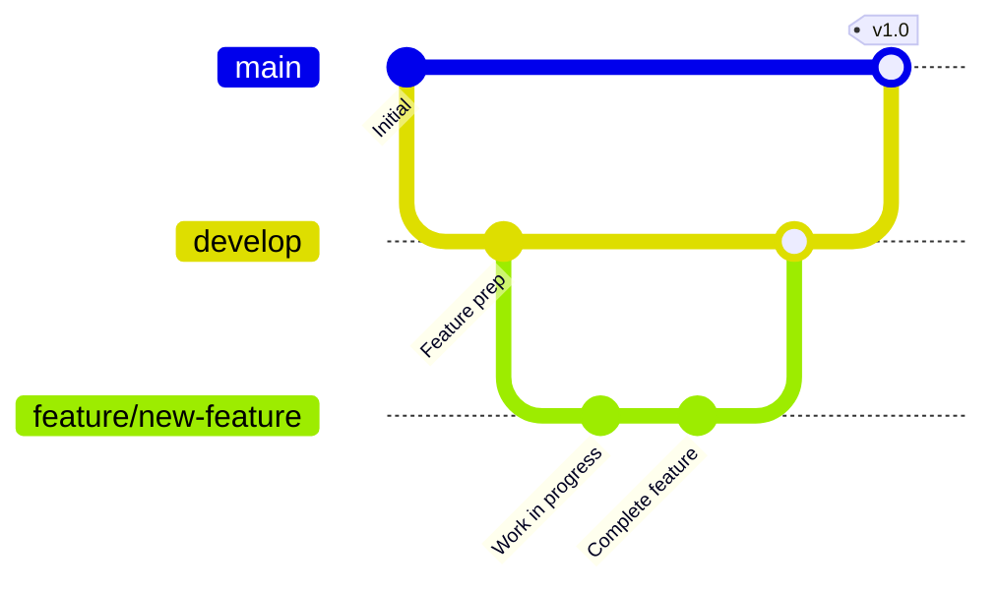

# Developer Onboarding Guide - <!-- Solution name from codebase -->

> Welcome to the development team! This guide will help you set up your development environment, understand the codebase structure, and become a productive contributor.

## Table of Contents

- [Getting Started](#getting-started)
- [Development Environment Setup](#development-environment-setup)
- [Solution Structure Guide](#solution-structure-guide)
- [Coding Standards](#coding-standards)
- [Testing Strategy](#testing-strategy)
- [Contribution Workflow](#contribution-workflow)
- [Common Development Tasks](#common-development-tasks)
- <!-- Debugging and Troubleshooting based on evidence from analysis -->(#debugging-and-troubleshooting)
- <!-- Resources and References based on evidence from analysis -->(#resources-and-references)

---

## Getting Started

### Quick Start Checklist

**Day 1:**
- [ ] Complete development environment setup
- [ ] Clone repository and build solution
- [ ] Run application locally
- [ ] Review architecture documentation
- [ ] Join team communication channels

**Week 1:**
- [ ] Complete first code review
- [ ] Fix a starter bug or small task
- [ ] Attend team standup meetings
- [ ] Set up local database with test data

**Month 1:**
- [ ] Deliver first feature
- [ ] Understand deployment process
- [ ] Shadow experienced developer

### Team Culture

**Communication Channels:**
- [Slack/Teams channel]
- <!-- Email list from codebase -->
- <!-- Stand-up schedule from codebase -->

**Working Hours:** <!-- Core hours / Flexible schedule based on evidence from analysis -->

**Code Review Expectations:**
- Response time: [24 hours]
- Review thoroughness: <!-- Checklist-based from codebase -->

---

## Development Environment Setup

<!-- Requirements (Section 10.1 - Development Environment Setup):
- Prerequisites (SDKs, tools, IDE versions)
- Repository clone instructions
- Database setup (scripts, seed data)
- Configuration for local development
- Build and run instructions
-->

### 10.1 Prerequisites

**Required Software:**

| Software | Version | Purpose | Download Link |
|----------|---------|---------|---------------|
| <!-- IDE from codebase --> | <!-- Version from configuration --> | Primary development environment | <!-- URL from configuration --> |
| [Runtime/SDK] | <!-- Version from configuration --> | Application runtime | <!-- URL from configuration --> |
| <!-- Database from config --> | <!-- Version from configuration --> | Database server | <!-- URL from configuration --> |
| <!-- Version Control from codebase --> | <!-- Version from configuration --> | Source control | <!-- URL from configuration --> |
| <!-- Build Tool from codebase --> | <!-- Version from configuration --> | Build automation | <!-- URL from configuration --> |

**Optional but Recommended:**
- <!-- Tool 1 from codebase -->: <!-- Purpose from codebase -->
- <!-- Tool 2 from codebase -->: <!-- Purpose from codebase -->
- <!-- Tool 3 from codebase -->: <!-- Purpose from codebase -->

**Hardware Requirements:**
- **CPU**: <!-- Requirements from codebase -->
- **RAM**: [Minimum/Recommended]
- **Storage**: <!-- Free space needed based on evidence from analysis -->
- **OS**: <!-- Supported operating systems based on evidence from analysis -->

### 10.2 Installation Steps

#### Step 1: Install <!-- Primary Tool from codebase -->

```bash
# Example installation commands
<!-- installation commands from codebase -->
```

**Configuration:**
```[language/config]
# Configuration settings
<!-- configuration details from codebase -->
```

---

#### Step 2: Install <!-- Database from config -->

```bash
# Database installation
<!-- installation commands from codebase -->
```

**Create Development Database:**

```sql
-- Create database
CREATE DATABASE [database_name];

-- Create application user
CREATE USER <!-- username from codebase --> WITH PASSWORD '<!-- password from codebase -->';

-- Grant permissions
GRANT ALL PRIVILEGES ON DATABASE [database_name] TO <!-- username from codebase -->;
```

---

#### Step 3: Clone Repository

```bash
# Clone repository
git clone <!-- repository-url from codebase --> <!-- local-path from codebase -->
cd <!-- local-path from codebase -->

# Install dependencies
<!-- dependency installation command from codebase -->

# Create feature branch
git checkout -b feature/your-feature-name
```

---

#### Step 4: Configure Application

**Update Configuration Files:**

```[language/config]
# Example: config file for local development
<!-- configuration content from codebase -->
```

**Environment Variables:**

```bash
# Set required environment variables
export DATABASE_URL="<!-- connection-string from codebase -->"
export API_KEY="<!-- your-api-key from codebase -->"
export DEBUG=true
```

---

### 10.3 Database Setup

#### Option 1: Restore from Backup

```sql
-- Restore database backup
RESTORE DATABASE [database_name]
FROM DISK = '<!-- backup-path from codebase -->'
WITH REPLACE;
```

#### Option 2: Run Migrations

```bash
# Run database migrations
<!-- migration command from codebase -->
```

#### Seed Test Data

```sql
-- Insert test data
INSERT INTO <!-- table from codebase --> (<!-- columns from codebase -->) VALUES (<!-- values from codebase -->);

-- Or run seed script
<!-- seed script command from codebase -->
```

**Test Data Accounts:**

| Username | Password | Role | Description |
|----------|----------|------|-------------|
| <!-- user1 from codebase --> | <!-- password from codebase --> | <!-- role from codebase --> | <!-- Description from codebase --> |
| <!-- user2 from codebase --> | <!-- password from codebase --> | <!-- role from codebase --> | <!-- Description from codebase --> |

### 10.4 Build and Run

#### Build Application

```bash
# Build solution
<!-- build command from codebase -->

# Expected output:
# <!-- success message from codebase -->
```

**Troubleshooting Build Issues:**
- <!-- Common issue 1 from codebase -->: <!-- Solution from codebase -->
- <!-- Common issue 2 from codebase -->: <!-- Solution from codebase -->

---

#### Run Application

**Development Server:**

```bash
# Start development server
<!-- run command from codebase -->

# Application will be available at:
# <!-- URL from configuration -->
```

**Expected Output:**
```
<!-- example console output from codebase -->
```

**First-Time Login:**
- Navigate to <!-- URL from configuration -->
- Login with test credentials
- Verify <!-- functionality from codebase -->

---

### 10.5 Verify Setup

**Checklist:**
- [ ] Application builds successfully
- [ ] Development server starts without errors
- [ ] Can access application in browser
- [ ] Database connection works
- [ ] Can login with test account
- [ ] Sample data loads correctly
- [ ] Tests run successfully

**Run Tests:**

```bash
# Run unit tests
<!-- test command from codebase -->

# Expected: All tests pass
```

---

## Solution Structure Guide

<!-- Requirements (Section 10.2 - Solution Structure Guide):
- Folder organization explanation
- Project responsibilities
- Naming conventions
- Where to add new features
-->

### 10.6 Project Organization

```
<!-- solution-root from codebase -->/
├── <!-- project1 from codebase -->/              # <!-- Purpose from codebase -->
│   ├── <!-- folder1 from codebase -->/           # <!-- Purpose from codebase -->
│   ├── <!-- folder2 from codebase -->/           # <!-- Purpose from codebase -->
│   └── <!-- config-file from codebase -->        # <!-- Purpose from codebase -->
├── <!-- project2 from codebase -->/              # <!-- Purpose from codebase -->
├── <!-- tests from codebase -->/                 # Test projects
├── <!-- docs from codebase -->/                  # Documentation
├── <!-- scripts from codebase -->/               # Build/deployment scripts
├── .gitignore               # Git ignore rules
├── README.md                # Project overview
└── <!-- solution-file from codebase -->          # Solution/workspace file
```

**Key Directories:**

| Directory | Purpose | Important Files |
|-----------|---------|-----------------|
| <!-- dir1 from codebase --> | <!-- Purpose from codebase --> | <!-- Files from codebase --> |
| <!-- dir2 from codebase --> | <!-- Purpose from codebase --> | <!-- Files from codebase --> |
| <!-- dir3 from codebase --> | <!-- Purpose from codebase --> | <!-- Files from codebase --> |

### 10.7 Project Responsibilities

#### <!-- Project Name 1 from codebase -->
**Purpose**: <!-- Description from codebase -->

**Key Components:**
- <!-- Component 1 from codebase -->: <!-- Description from codebase -->
- <!-- Component 2 from codebase -->: <!-- Description from codebase -->

**Dependencies:**
- <!-- Dependency 1 from codebase -->
- <!-- Dependency 2 from codebase -->

**Entry Points:**
- <!-- Entry point description based on evidence from analysis -->

---

#### <!-- Project Name 2 from codebase -->
**Purpose**: <!-- Description from codebase -->

<!-- Similar structure as above based on evidence from analysis -->

---

### 10.8 Architectural Layers

```mermaid
graph TD
    Presentation<!-- Presentation Layer from codebase -->
    Business<!-- Business Logic Layer from codebase -->
    Data<!-- Data Access Layer from codebase -->
    Database[(Database)]
    
    Presentation --> Business
    Business --> Data
    Data --> Database
    
    style Presentation fill:#e1f5ff
    style Business fill:#fff4e1
    style Data fill:#ffe1e1
    style Database fill:#e1ffe1
```

**Layer Responsibilities:**

| Layer | Technologies | Purpose | Rules |
|-------|--------------|---------|-------|
| **Presentation** | <!-- Tech from codebase --> | User interface | <!-- Rules from codebase --> |
| **Business Logic** | <!-- Tech from codebase --> | Business rules | <!-- Rules from codebase --> |
| **Data Access** | <!-- Tech from codebase --> | Data operations | <!-- Rules from codebase --> |
| **Database** | <!-- Tech from codebase --> | Data storage | <!-- Rules from codebase --> |

### 10.9 Key Design Patterns

**Patterns Used:**

1. **<!-- Pattern Name from codebase -->**
   - **Purpose**: <!-- Why used from codebase -->
   - **Location**: <!-- Where implemented based on evidence from analysis -->
   - **Example**:
     ```<!-- language from codebase -->
     // Example code
     <!-- code example from codebase -->
     ```

2. **<!-- Pattern Name 2 from codebase -->**
   <!-- Similar structure from codebase -->

### 10.10 Naming Conventions

**Files and Folders:**
- <!-- Convention 1 from codebase -->
- <!-- Convention 2 from codebase -->

**Classes:**
```<!-- language from codebase -->
// Class naming examples
<!-- examples from codebase -->
```

**Variables:**
```<!-- language from codebase -->
// Variable naming examples
<!-- examples from codebase -->
```

**Functions/Methods:**
```<!-- language from codebase -->
// Function naming examples
<!-- examples from codebase -->
```

**Database Objects:**
- Tables: <!-- Convention from codebase -->
- Columns: <!-- Convention from codebase -->
- Stored Procedures: <!-- Convention from codebase -->

---

## Coding Standards

<!-- Requirements (Section 10.3 - Coding Standards):
- Language-specific guidelines
- Design patterns to follow
- Error handling conventions
- Logging best practices
- Comment and documentation requirements
-->

### 10.11 Language-Specific Guidelines

**Note**: The following recommendations are based on industry best practices and standards. They should be evaluated against the specific context of your organization and codebase.
<!-- Source: Cite specific standards, frameworks, or publications -->


**<!-- Language from sources --> Style Guide:**

**Formatting:**
```<!-- language from codebase -->
// Indentation: [spaces/tabs]
// Line length: <!-- max characters from codebase -->
// Brace style: <!-- style from codebase -->

<!-- example formatted code from codebase -->
```

**Imports/Using:**
```<!-- language from codebase -->
// Order: <!-- ordering rules from codebase -->
<!-- example imports from codebase -->
```

**Comments:**
```<!-- language from codebase -->
// Single-line comments
<!-- example from codebase -->

/*
 * Multi-line comments
 */
<!-- example from codebase -->

/// <summary>
/// Documentation comments
/// </summary>
<!-- example from codebase -->
```

### 10.12 Code Structure

**Class Structure:**

```<!-- language from codebase -->
// Recommended class organization
[class template with proper ordering]
```

**Method Structure:**

```<!-- language from codebase -->
// Method template
<!-- method template from codebase -->
```

**Maximum Complexity:**
- Cyclomatic Complexity: <!-- Limit from codebase -->
- Lines per method: <!-- Limit from codebase -->
- Parameters per method: <!-- Limit from codebase -->
- Nesting depth: <!-- Limit from codebase -->

### 10.13 Error Handling

**Exception Handling Pattern:**

```<!-- language from codebase -->
// Standard error handling
<!-- error handling example from codebase -->
```

**Logging:**

```<!-- language from codebase -->
// Logging pattern
<!-- logging example from codebase -->
```

**Error Messages:**
- User-facing errors: <!-- Guidelines from codebase -->
- Developer errors: <!-- Guidelines from codebase -->
- Log levels: <!-- When to use each based on evidence from analysis -->

### 10.14 Security Best Practices

**Note**: The following recommendations are based on industry best practices and standards. They should be evaluated against the specific context of your organization and codebase.
<!-- Source: Cite specific standards, frameworks, or publications -->


**Input Validation:**
```<!-- language from codebase -->
// Input validation example
<!-- validation code from codebase -->
```

**SQL Injection Prevention:**
```<!-- language from codebase -->
// Parameterized queries
<!-- safe query example from codebase -->
```

**XSS Prevention:**
```<!-- language from codebase -->
// Output encoding
<!-- encoding example from codebase -->
```

**Authentication/Authorization:**
```<!-- language from codebase -->
// Auth check example
<!-- auth code from codebase -->
```

**Secrets Management:**
- [ ] No hardcoded credentials
- [ ] Use configuration/secrets management
- [ ] Environment-specific configs
- [ ] Encrypt sensitive data

### 10.15 Performance Guidelines

**Note**: The following recommendations are based on industry best practices and standards. They should be evaluated against the specific context of your organization and codebase.
<!-- Source: Cite specific standards, frameworks, or publications -->


**Database Queries:**
- Use indexes appropriately
- Avoid N+1 queries
- Batch operations when possible
- Monitor query performance

**Caching:**
```<!-- language from codebase -->
// Caching pattern
<!-- caching example from codebase -->
```

**Resource Management:**
```<!-- language from codebase -->
// Proper resource disposal
<!-- disposal example from codebase -->
```

### 10.16 Documentation Requirements

**Code Documentation:**

```<!-- language from codebase -->
/// <summary>
/// <!-- Method description based on evidence from analysis -->
/// </summary>
/// <param name="param1"><!-- Parameter description based on evidence from analysis --></param>
/// <returns><!-- Return value description based on evidence from analysis --></returns>
/// <exception cref="ExceptionType"><!-- When thrown from codebase --></exception>
<!-- example from codebase -->
```

**README Files:**
- Each major component should have README
- Include: Purpose, setup, usage, examples

**API Documentation:**
- <!-- Documentation tool/format based on evidence from analysis -->
- <!-- How to generate/update based on evidence from analysis -->

---

## Testing Strategy

<!-- Requirements (Section 10.4 - Testing Strategy):
- Unit testing framework and patterns
- Integration testing approach
- Test data management
- Code coverage requirements
- Running tests locally
-->

### 10.17 Testing Pyramid



**Test Coverage Goals:**
- Unit Tests: [Target %]
- Integration Tests: [Target %]
- E2E Tests: [Target %]

### 10.18 Unit Testing

**Testing Framework**: <!-- Framework name from codebase -->

**Test Structure:**

```<!-- language from codebase -->
// Arrange-Act-Assert pattern
<!-- test example from codebase -->
```

**Naming Convention:**
```
<!-- MethodName from codebase -->_<!-- Scenario from codebase -->_<!-- ExpectedResult from codebase -->
```

**Example:**

```<!-- language from codebase -->
<!-- complete test example from codebase -->
```

**Mocking:**

```<!-- language from codebase -->
// Mocking dependencies
<!-- mocking example from codebase -->
```

**Test Data:**
- Use test fixtures
- Keep tests isolated
- Clean up after tests

### 10.19 Integration Testing

**Setup:**

```<!-- language from codebase -->
// Integration test setup
<!-- setup example from codebase -->
```

**Testing Database Operations:**

```<!-- language from codebase -->
// Database integration test
<!-- database test example from codebase -->
```

**Testing APIs:**

```<!-- language from codebase -->
// API integration test
<!-- API test example from codebase -->
```

### 10.20 End-to-End Testing

**E2E Framework**: <!-- Framework name from codebase -->

**Test Scenario:**

```<!-- language from codebase -->
// E2E test example
<!-- E2E test example from codebase -->
```

**Running E2E Tests:**

```bash
# Run E2E tests
<!-- E2E test command from codebase -->
```

### 10.21 Running Tests

**Run All Tests:**
```bash
<!-- run all tests command from codebase -->
```

**Run Specific Tests:**
```bash
<!-- run specific tests command from codebase -->
```

**Test Coverage Report:**
```bash
<!-- coverage command from codebase -->
```

**Continuous Testing:**
- Tests run on every commit
- CI/CD pipeline integration
- Quality gates enforced

---

## Contribution Workflow

<!-- Requirements (Section 10.5 - Contribution Workflow):
- Branching strategy (GitFlow, trunk-based)
- Pull request process
- Code review checklist
- CI/CD pipeline overview
- Definition of Done
-->

### 10.22 Git Workflow

**Branching Strategy**: [Git Flow / Trunk-Based / Other]



**Branch Naming:**
- `feature/<!-- feature-name from codebase -->` - New features
- `bugfix/<!-- bug-description from codebase -->` - Bug fixes
- `hotfix/<!-- critical-fix from codebase -->` - Production hotfixes
- `refactor/<!-- component from codebase -->` - Code refactoring
- `docs/<!-- doc-update from codebase -->` - Documentation

### 10.23 Development Process

#### Step 1: Create Branch

```bash
# Update main branch
git checkout <!-- main-branch from codebase -->
git pull origin <!-- main-branch from codebase -->

# Create feature branch
git checkout -b feature/add-user-export

# Push to remote
git push -u origin feature/add-user-export
```

#### Step 2: Make Changes

- Write code following coding standards
- Add tests for new functionality
- Update documentation

#### Step 3: Commit Changes

```bash
# Stage changes
git add <!-- files from codebase -->

# Commit with descriptive message
git commit -m "feat: Add user export functionality

- Implemented CSV export service
- Added export button to user list
- Added unit tests for export logic

Closes #123"
```

**Commit Message Format:**

```
<type>(<scope>): <subject>

<body>

<footer>
```

**Types:**
- `feat`: New feature
- `fix`: Bug fix
- `docs`: Documentation
- `style`: Formatting
- `refactor`: Code refactoring
- `test`: Tests
- `chore`: Maintenance

**Example:**
```
feat(api): Add pagination to user list endpoint

Implemented cursor-based pagination to improve performance
for large user lists. Added page_size and cursor parameters.

Breaking Change: Response format changed to include pagination metadata.
Closes #456
```

#### Step 4: Push and Create Pull Request

```bash
# Push commits
git push origin feature/add-user-export

# Create Pull Request via web interface
```

**Pull Request Template:**

```markdown
## Description
<!-- Brief description of changes based on evidence from analysis -->

## Type of Change
- [ ] New feature
- [ ] Bug fix
- [ ] Breaking change
- [ ] Documentation update

## Related Issues
Closes #<!-- issue number from codebase -->

## Changes Made
- <!-- Change 1 from codebase -->
- <!-- Change 2 from codebase -->

## Testing
- [ ] Unit tests added/updated
- [ ] Integration tests pass
- [ ] Manual testing completed

## Screenshots
<!-- If applicable from codebase -->

## Checklist
- [ ] Code follows style guidelines
- [ ] Self-reviewed code
- [ ] Comments added for complex logic
- [ ] Documentation updated
- [ ] No new warnings
- [ ] All tests pass
```

#### Step 5: Code Review

**Reviewer Checklist:**
- [ ] Code quality and readability
- [ ] Follows coding standards
- [ ] Proper error handling
- [ ] Security considerations
- [ ] Performance implications
- [ ] Test coverage adequate
- [ ] Documentation updated

**Addressing Feedback:**

```bash
# Make requested changes
git add <!-- files from codebase -->
git commit -m "fix: Address code review feedback"
git push origin feature/add-user-export
```

#### Step 6: Merge

```bash
# After approval, merge via PR
# Delete feature branch after merge
git branch -d feature/add-user-export
```

### 10.24 Code Review Guidelines

**Note**: The following recommendations are based on industry best practices and standards. They should be evaluated against the specific context of your organization and codebase.
<!-- Source: Cite specific standards, frameworks, or publications -->


**For Authors:**
- Keep PRs small (< 400 lines)
- Provide context and reasoning
- Self-review before requesting review
- Respond to feedback promptly

**For Reviewers:**
- Review within <!-- timeframe from codebase -->
- Be constructive and specific
- Ask questions, suggest improvements
- Approve when satisfied

**Review Focus Areas:**
- Correctness
- Readability
- Maintainability
- Performance
- Security
- Testing

---

## Common Development Tasks

<!-- Requirements (Section 10.6 - Common Development Tasks):
- Adding a new API endpoint
- Creating a new database entity
- Adding a new UI page
- Integrating a new external service
- Adding configuration settings
-->

### 10.25 Task: Add New API Endpoint

**Scenario**: <!-- Description from codebase -->

**Step 1: Define Route**

```<!-- language from codebase -->
// Add route
<!-- code example from codebase -->
```

**Step 2: Create Controller/Handler**

```<!-- language from codebase -->
// Controller implementation
<!-- code example from codebase -->
```

**Step 3: Add Business Logic**

```<!-- language from codebase -->
// Business logic
<!-- code example from codebase -->
```

**Step 4: Add Tests**

```<!-- language from codebase -->
// Unit test
<!-- test example from codebase -->
```

**Step 5: Update Documentation**

```<!-- language from codebase -->
// API documentation
<!-- documentation example from codebase -->
```

---

### 10.26 Task: Add New Database Table

**Scenario**: <!-- Description from codebase -->

**Step 1: Create Migration**

```bash
# Generate migration
<!-- migration command from codebase -->
```

**Step 2: Define Schema**

```sql
-- Migration script
<!-- SQL schema from codebase -->
```

**Step 3: Create Model/Entity**

```<!-- language from codebase -->
// Model class
<!-- model code from codebase -->
```

**Step 4: Add Repository/Data Access**

```<!-- language from codebase -->
// Data access code
<!-- data access example from codebase -->
```

**Step 5: Run Migration**

```bash
# Apply migration
<!-- apply migration command from codebase -->
```

---

### 10.27 Task: Add New Feature Module

**Scenario**: <!-- Description from codebase -->

**Step 1: Create Module Structure**

```bash
# Create directories
<!-- directory structure commands from codebase -->
```

**Step 2: Implement Core Logic**

```<!-- language from codebase -->
// Core implementation
<!-- code example from codebase -->
```

**Step 3: Add Tests**

```<!-- language from codebase -->
// Test suite
<!-- test example from codebase -->
```

**Step 4: Integrate with Application**

```<!-- language from codebase -->
// Integration code
<!-- integration example from codebase -->
```

**Step 5: Update Configuration**

```[language/config]
// Configuration updates
<!-- config example from codebase -->
```

---

### 10.28 Task: Fix a Bug

**Process:**

1. **Reproduce the Bug**
   - Create test case that fails
   - Document reproduction steps

2. **Identify Root Cause**
   - Debug with breakpoints
   - Review error logs
   - Check related code

3. **Implement Fix**
   - Write failing test first (TDD)
   - Fix the issue
   - Verify test passes

4. **Regression Testing**
   - Run full test suite
   - Manual testing if needed

5. **Document Fix**
   - Update changelog
   - Reference issue number
   - Add comments if complex

**Example:**

```<!-- language from codebase -->
// Bug fix example
<!-- before and after code from codebase -->
```

---

### 10.29 Task: Refactor Code

**When to Refactor:**
- Code duplication
- Long methods
- Complex conditionals
- Poor naming
- Violations of SOLID principles

**Safe Refactoring Steps:**

1. Ensure tests exist and pass
2. Make small incremental changes
3. Run tests after each change
4. Commit frequently

**Example Refactoring:**

```<!-- language from codebase -->
// Before refactoring
<!-- original code from codebase -->

// After refactoring
<!-- improved code from codebase -->
```

---

## Debugging and Troubleshooting

### 10.30 Debugging Techniques

**Using Debugger:**

1. Set breakpoints
2. Start debugging session
3. Inspect variables
4. Step through code
5. Evaluate expressions

**IDE Shortcuts:**

| Action | Shortcut |
|--------|----------|
| Start Debugging | <!-- Shortcut from codebase --> |
| Toggle Breakpoint | <!-- Shortcut from codebase --> |
| Step Over | <!-- Shortcut from codebase --> |
| Step Into | <!-- Shortcut from codebase --> |
| Step Out | <!-- Shortcut from codebase --> |

**Conditional Breakpoints:**

```<!-- language from codebase -->
// Break when condition is true
<!-- example from codebase -->
```

**Logging:**

```<!-- language from codebase -->
// Strategic logging
<!-- logging example from codebase -->
```

### 10.31 Common Issues and Solutions

#### Issue 1: <!-- Common Issue from codebase -->

**Symptoms:**
- <!-- Symptom 1 from codebase -->
- <!-- Symptom 2 from codebase -->

**Cause:** <!-- Root cause from codebase -->

**Solution:**
```bash
# Fix commands
<!-- solution steps from codebase -->
```

---

#### Issue 2: <!-- Common Issue from codebase -->

<!-- Similar structure from codebase -->

---

### 10.32 Performance Profiling

**Profiling Tools:**
- <!-- Tool 1 from codebase -->: <!-- Purpose from codebase -->
- <!-- Tool 2 from codebase -->: <!-- Purpose from codebase -->

**Profiling Process:**

1. Identify performance bottleneck
2. Run profiler
3. Analyze results
4. Optimize hot paths
5. Verify improvement

**Example:**

```bash
# Run profiler
<!-- profiler command from codebase -->
```

### 10.33 Database Debugging

**Query Analysis:**

```sql
-- Explain query plan
<!-- explain command from codebase -->
```

**Slow Query Log:**

```bash
# View slow queries
<!-- log viewing command from codebase -->
```

**Connection Pool Monitoring:**

```<!-- language from codebase -->
// Monitor connections
<!-- monitoring code from codebase -->
```

### 10.34 Network Debugging

**Inspect HTTP Requests:**

```bash
# Use curl or similar
<!-- curl command from codebase -->
```

**Monitor API Calls:**

```<!-- language from codebase -->
// Log API calls
<!-- logging code from codebase -->
```

**Proxy Tools:**
- <!-- Tool name from codebase -->: <!-- Purpose from codebase -->

---

## Resources and References

### 10.35 Internal Documentation

**Key Documents:**
- [Architecture Overview](./02-system-architecture.md)
- [API Documentation](./05-api-integration-catalog.md)
- [Database Schema](./04-data-architecture.md)
- [Security Guidelines](./09-security-architecture.md)
- [Deployment Guide](./08-deployment-operations.md)

### 10.36 External Resources

**Official Documentation:**
- <!-- Technology 1 from codebase -->: <!-- URL from configuration -->
- <!-- Technology 2 from codebase -->: <!-- URL from configuration -->

**Tutorials and Guides:**
- <!-- Resource 1 from codebase -->: <!-- URL from configuration -->
- <!-- Resource 2 from codebase -->: <!-- URL from configuration -->

**Community:**
- [Forum/Chat]: <!-- URL from configuration -->
- <!-- Stack Overflow tag from codebase -->: <!-- Tag from codebase -->

### 10.37 Development Tools

**IDE Plugins:**
- <!-- Plugin 1 from codebase -->: <!-- Purpose from codebase -->
- <!-- Plugin 2 from codebase -->: <!-- Purpose from codebase -->

**Command Line Tools:**
- <!-- Tool 1 from codebase -->: <!-- Purpose from codebase -->
- <!-- Tool 2 from codebase -->: <!-- Purpose from codebase -->

**Browser Extensions:**
- <!-- Extension 1 from codebase -->: <!-- Purpose from codebase -->
- <!-- Extension 2 from codebase -->: <!-- Purpose from codebase -->

### 10.38 Learning Path

**Week 1-2:**
- [ ] Complete environment setup
- [ ] Review architecture docs
- [ ] Fix starter bugs
- [ ] Attend team meetings

**Month 1:**
- [ ] Deliver first feature
- [ ] Understand deployment process
- [ ] Complete code reviews

**Month 2-3:**
- [ ] Take ownership of module
- [ ] Mentor new developers
- [ ] Contribute to architecture decisions

### 10.39 Team Contacts

| Role | Name | Email | Slack/Teams |
|------|------|-------|-------------|
| Tech Lead | <!-- Name from documentation --> | <!-- Email from codebase --> | [@handle] |
| Senior Developer | <!-- Name from documentation --> | <!-- Email from codebase --> | [@handle] |
| DevOps | <!-- Name from documentation --> | <!-- Email from codebase --> | [@handle] |
| QA Lead | <!-- Name from documentation --> | <!-- Email from codebase --> | [@handle] |

### 10.40 Getting Help

**When Stuck:**
1. Check documentation
2. Search internal wiki/knowledge base
3. Ask in team chat
4. Pair with senior developer
5. Create detailed issue/question

**How to Ask Good Questions:**
- Provide context
- Show what you've tried
- Include error messages
- Share relevant code snippets
- Specify environment details

---

## Appendices

### Appendix A: Keyboard Shortcuts

**<!-- IDE Name from codebase --> Shortcuts:**

| Action | Windows/Linux | macOS |
|--------|---------------|-------|
| <!-- Action 1 from codebase --> | <!-- Shortcut from codebase --> | <!-- Shortcut from codebase --> |
| <!-- Action 2 from codebase --> | <!-- Shortcut from codebase --> | <!-- Shortcut from codebase --> |

### Appendix B: Useful Scripts

**Development Scripts:**

```bash
# Script 1: <!-- Purpose from codebase -->
<!-- script content from codebase -->
```

```bash
# Script 2: <!-- Purpose from codebase -->
<!-- script content from codebase -->
```

### Appendix C: Configuration Templates

**<!-- Config File Name from codebase -->:**

```[language/config]
# Template configuration
<!-- configuration template from codebase -->
```

### Appendix D: Glossary

| Term | Definition |
|------|------------|
| <!-- Term 1 from codebase --> | <!-- Definition from codebase --> |
| <!-- Term 2 from codebase --> | <!-- Definition from codebase --> |

---

## Document Metadata

- **Document Version:** 1.0
- **Last Updated:** <!-- Date from history -->
- **Author:** [Author/Team]
- **Status:** Draft, Review, or Approved
- **Next Review:** <!-- Date from history -->
- **Maintained By:** <!-- Team from docs -->

---

## Document History

| Version | Date | Author | Changes |
|---------|------|--------|---------|
| 1.0 | (To be set upon document creation/update) | <!-- Author from commits --> | Initial developer guide |

---

**Related Documents:**
- <!-- Link to Architecture Documentation based on evidence from analysis -->
- <!-- Link to Coding Standards based on evidence from analysis -->
- <!-- Link to Deployment Guide based on evidence from analysis -->
- <!-- Link to API Documentation based on evidence from analysis -->

---

**Feedback:** We welcome feedback on this guide! Please submit improvements via <!-- process from codebase -->.

**Questions?** Contact <!-- team lead from codebase --> or ask in <!-- team channel from codebase -->.
