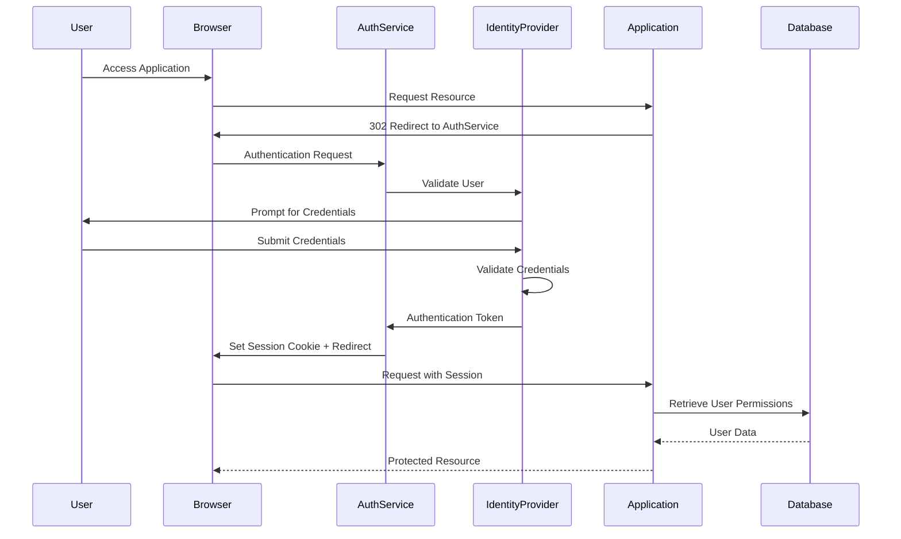
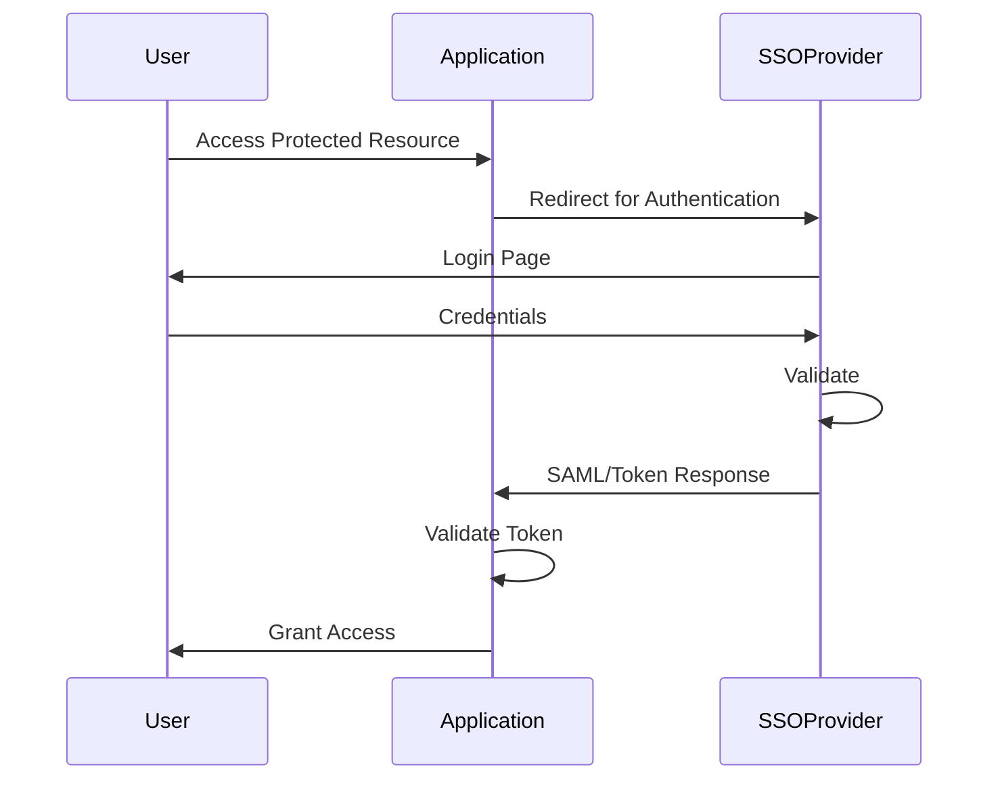
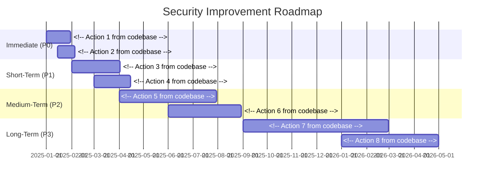

# Security Architecture - <!-- Solution name from codebase -->

> This document details the security implementation, controls, threat model, vulnerabilities, and security recommendations for the system.

## Table of Contents

- [Executive Summary](#executive-summary)
- [Security Overview](#security-overview)
- [Authentication Architecture](#authentication-architecture)
- [Authorization Model](#authorization-model)
- [Data Protection](#data-protection)
- [Security Controls Inventory](#security-controls-inventory)
- [Vulnerability Assessment](#vulnerability-assessment)
- [Security Testing](#security-testing)
- <!-- Compliance and Regulations based on evidence from analysis -->(#compliance-and-regulations)
- [Security Operations](#security-operations)
- [Incident Response](#incident-response)
- [Security Recommendations](#security-recommendations)

---

## Executive Summary

### Security Posture Summary

**Overall Security Rating**: [🔴 High Risk / 🟠 Medium Risk / 🟡 Low Risk / 🟢 Secure]

<!-- Provide 2-3 paragraphs describing: based on evidence from codebase analysis -->
- Current security posture and maturity level
- Critical security concerns identified
- Key security strengths
- Overall risk exposure

### Critical Security Findings

| Severity | Finding | Impact | Priority |
|----------|---------|--------|----------|
| 🔴 Critical | <!-- Finding 1 from codebase --> | <!-- Impact from codebase --> | P0 |
| 🔴 Critical | <!-- Finding 2 from codebase --> | <!-- Impact from codebase --> | P0 |
| 🟠 High | <!-- Finding 3 from codebase --> | <!-- Impact from codebase --> | P1 |
| 🟠 High | <!-- Finding 4 from codebase --> | <!-- Impact from codebase --> | P1 |

### Security Metrics

| Metric | Current | Target | Status |
|--------|---------|--------|--------|
| **Known Vulnerabilities** | <!-- Number from metrics --> | 0 | [🔴/🟠/🟡/🟢] |
| **Critical Vulnerabilities** | <!-- Number from metrics --> | 0 | <!-- Status from analysis --> |
| **Security Test Coverage** | <!-- Percentage --> | >80% | <!-- Status from analysis --> |
| **Patch Currency** | <!-- Days behind from codebase --> | <30 days | <!-- Status from analysis --> |
| **Compliance Score** | <!-- Percentage --> | 100% | <!-- Status from analysis --> |
| **Security Incidents (30d)** | <!-- Number from metrics --> | 0 | <!-- Status from analysis --> |

---

## Security Overview

### 9.1 Security Architecture Overview

```mermaid
graph TB
    subgraph "External Zone"
        Internet<!-- Internet from codebase -->
        Users<!-- End Users from codebase -->
    end
    
    subgraph "DMZ"
        WAF<!-- Web Application Firewall from codebase -->
        LoadBalancer<!-- Load Balancer from codebase -->
        ReverseProxy<!-- Reverse Proxy from codebase -->
    end
    
    subgraph "Application Zone"
        WebApp<!-- Web Application from codebase -->
        API<!-- API Services from codebase -->
        Auth<!-- Authentication Service from codebase -->
    end
    
    subgraph "Data Zone"
        Database[(Database)]
        FileStore<!-- File Storage from codebase -->
        Cache<!-- Cache from codebase -->
    end
    
    subgraph "Security Services"
        IAM[Identity & Access Management]
        KeyVault<!-- Secrets Management from codebase -->
        SIEM<!-- Security Monitoring from codebase -->
        IDS<!-- Intrusion Detection from codebase -->
    end
    
    Users --> Internet
    Internet --> WAF
    WAF --> LoadBalancer
    LoadBalancer --> ReverseProxy
    ReverseProxy --> WebApp
    ReverseProxy --> API
    
    WebApp --> Auth
    API --> Auth
    Auth --> IAM
    
    WebApp --> Database
    API --> Database
    WebApp --> FileStore
    API --> Cache
    
    WebApp --> KeyVault
    API --> KeyVault
    
    WAF --> SIEM
    WebApp --> SIEM
    API --> SIEM
    Database --> SIEM
    
    style WAF fill:#f96,stroke:#333
    style Database fill:#f96,stroke:#333
    style KeyVault fill:#9cf,stroke:#333
    style SIEM fill:#9cf,stroke:#333
```

### 9.2 Security Principles

**Security by Design:**
- <!-- Principle 1 from codebase -->
- <!-- Principle 2 from codebase -->
- <!-- Principle 3 from codebase -->

**Defense in Depth Layers:**
1. **Perimeter Security**: <!-- Controls from codebase -->
2. **Network Security**: <!-- Controls from codebase -->
3. **Application Security**: <!-- Controls from codebase -->
4. **Data Security**: <!-- Controls from codebase -->
5. **Identity Security**: <!-- Controls from codebase -->

### 9.3 Threat Model

#### Assets

| Asset | Classification | Location | Threat Level |
|-------|----------------|----------|--------------|
| <!-- Asset 1 from codebase --> | [Highly Sensitive/Sensitive/Confidential/Public] | <!-- Location from codebase --> | High, Medium, or Low |
| <!-- Asset 2 from codebase --> | <!-- Classification from codebase --> | <!-- Location from codebase --> | <!-- Level from codebase --> |

#### Threat Actors

| Actor Type | Motivation | Capability | Likelihood |
|------------|------------|------------|------------|
| External Attackers | <!-- Motivation from codebase --> | <!-- Skill level from codebase --> | High, Medium, or Low |
| Malicious Insiders | <!-- Motivation from codebase --> | <!-- Skill level from codebase --> | <!-- Likelihood from codebase --> |
| Supply Chain | <!-- Motivation from codebase --> | <!-- Skill level from codebase --> | <!-- Likelihood from codebase --> |
| Accidental | [N/A] | [N/A] | <!-- Likelihood from codebase --> |

#### Attack Vectors

```mermaid
graph LR
    Attacker<!-- Threat Actor from codebase -->
    
    Attacker --> Web<!-- Web Application Attacks from codebase -->
    Attacker --> API<!-- API Exploitation from codebase -->
    Attacker --> Creds<!-- Credential Theft from codebase -->
    Attacker --> Network<!-- Network Attacks from codebase -->
    Attacker --> Social<!-- Social Engineering from codebase -->
    
    Web --> SQLi<!-- SQL Injection from codebase -->
    Web --> XSS<!-- Cross-Site Scripting from codebase -->
    Web --> CSRF<!-- CSRF from codebase -->
    
    API --> AuthBypass<!-- Auth Bypass from codebase -->
    API --> APIAbuse<!-- API Abuse from codebase -->
    
    Creds --> Phishing<!-- Phishing from codebase -->
    Creds --> BruteForce<!-- Brute Force from codebase -->
    
    Network --> MITM<!-- Man-in-the-Middle from codebase -->
    Network --> DDoS<!-- DDoS from codebase -->
    
    style SQLi fill:#ffe1e1
    style XSS fill:#ffe1e1
    style AuthBypass fill:#ffe1e1
```

### 9.4 Security Assumptions

**Assumptions Made:**
- <!-- Assumption 1 from codebase -->
- <!-- Assumption 2 from codebase -->
- <!-- Assumption 3 from codebase -->

**Dependencies:**
- <!-- Dependency 1 from codebase -->
- <!-- Dependency 2 from codebase -->

---

## Authentication Architecture

<!-- Requirements (Section 9.1 - Authentication Architecture):
- Authentication mechanisms (Forms, Windows, OAuth, SAML)
- Identity provider integration
- Session management
- Multi-factor authentication setup
- Password policies
-->

### 9.5 Authentication Mechanisms

**Supported Authentication Types:**

| Type | Use Case | Implementation | Status |
|------|----------|----------------|--------|
| <!-- Type 1 from codebase --> | <!-- Use case from codebase --> | <!-- Technology from analysis --> | [✅ Implemented / 🟡 Partial / ❌ Missing] |
| <!-- Type 2 from codebase --> | <!-- Use case from codebase --> | <!-- Technology from analysis --> | <!-- Status from analysis --> |

### 9.6 Authentication Flow

#### Primary Authentication Flow



**Implementation Details:**
- **Protocol**: [OAuth 2.0 / SAML / OpenID Connect / Windows Auth / Custom]
- **Token Type**: [JWT / SAML Assertion / Session Cookie / API Key]
- **Token Lifetime**: <!-- Based on complexity -->
- **Refresh Mechanism**: <!-- How tokens are refreshed based on evidence from analysis -->

---

#### Multi-Factor Authentication (MFA)

**MFA Status**: [✅ Implemented / 🟡 Partial / ❌ Not Implemented]

**Supported MFA Methods:**
- [ ] SMS/Text Message
- [ ] Authenticator App (TOTP)
- [ ] Email Verification
- [ ] Biometric
- [ ] Hardware Token (FIDO2/U2F)
- [ ] Backup Codes

**MFA Enforcement:**
- **Required for**: <!-- User roles/scenarios based on evidence from analysis -->
- **Optional for**: <!-- User roles/scenarios based on evidence from analysis -->
- **Exempt**: <!-- User roles/scenarios with justification based on evidence from analysis -->

---

### 9.7 Session Management

**Session Configuration:**

| Setting | Value | Security Impact |
|---------|-------|-----------------|
| **Session Storage** | [InProc/StateServer/SQL/Redis/Distributed] | <!-- Impact from codebase --> |
| **Session Timeout** | <!-- Minutes from codebase --> | <!-- Impact from codebase --> |
| **Idle Timeout** | <!-- Minutes from codebase --> | <!-- Impact from codebase --> |
| **Cookie Name** | <!-- Name from documentation --> | <!-- Impact from codebase --> |
| **Cookie Attributes** | [HttpOnly/Secure/SameSite] | <!-- Impact from codebase --> |
| **Session Fixation Protection** | Yes or No | <!-- Impact from codebase --> |

**Session Security Features:**

```<!-- language from codebase -->
// Example session configuration
<!-- session configuration code from codebase -->
```

**Session Lifecycle:**

1. **Creation**: <!-- When session is created based on evidence from analysis -->
2. **Validation**: <!-- How session is validated based on evidence from analysis -->
3. **Renewal**: <!-- When session is renewed based on evidence from analysis -->
4. **Termination**: <!-- When session expires based on evidence from analysis -->

**Security Concerns:**
- ✅ <!-- Positive security control based on evidence from analysis -->
- ❌ <!-- Missing security control based on evidence from analysis -->
- 🟡 <!-- Partial implementation based on evidence from analysis -->

---

### 9.8 Password Management

**Password Policy:**

| Requirement | Configuration | Enforcement |
|-------------|---------------|-------------|
| **Minimum Length** | <!-- Characters from codebase --> | [System/Policy] |
| **Complexity** | <!-- Requirements from codebase --> | <!-- Enforcement from codebase --> |
| **Password History** | <!-- Number from metrics --> | <!-- Enforcement from codebase --> |
| **Max Age** | <!-- Days from codebase --> | <!-- Enforcement from codebase --> |
| **Lockout Threshold** | <!-- Attempts from codebase --> | <!-- Enforcement from codebase --> |
| **Lockout Duration** | <!-- Minutes from codebase --> | <!-- Enforcement from codebase --> |

**Password Storage:**
- **Hashing Algorithm**: [bcrypt / PBKDF2 / Argon2 / SHA-256 / MD5 ⚠️]
- **Salt**: [Per-user / Global / None ⚠️]
- **Iterations**: <!-- Number from metrics -->
- **Storage Location**: <!-- Database table/column based on evidence from analysis -->

**Example Implementation:**

```<!-- language from codebase -->
// Password hashing example
<!-- code example from codebase -->
```

**Security Status:**
- ✅ <!-- Strong hashing with salt based on evidence from analysis -->
- ❌ <!-- Weak hashing or plain text ⚠️ based on evidence from analysis -->
- 🟡 <!-- Acceptable but could be improved based on evidence from analysis -->

---

### 9.9 Single Sign-On (SSO)

<!-- If applicable from codebase -->

**SSO Provider**: [Azure AD / Okta / Google Workspace / Custom / None]

**SSO Protocol**: [SAML 2.0 / OAuth 2.0 / OpenID Connect / Custom]

**SSO Configuration:**

```<!-- language from codebase -->
// SSO configuration
<!-- configuration details from codebase -->
```

**SSO Flow Diagram:**



**Security Features:**
- [ ] Token Validation
- [ ] Certificate Validation
- [ ] Token Encryption
- [ ] Logout Propagation

---

## Authorization Model

<!-- Requirements (Section 9.2 - Authorization Model):
- Authorization strategy (RBAC, ABAC, Claims-based)
- Role definitions and permissions
- Resource access control
- Delegation patterns
- Privilege escalation controls
-->

### 9.10 Authorization Strategy

**Authorization Model**: [RBAC / ABAC / Claims-Based / Custom]

**Authorization Layers:**

```mermaid
graph TD
    User<!-- Authenticated User from codebase -->
    
    User --> Role{Role Assignment}
    Role -->|Role 1| Permissions1<!-- Permission Set 1 from codebase -->
    Role -->|Role 2| Permissions2<!-- Permission Set 2 from codebase -->
    Role -->|Role 3| Permissions3<!-- Permission Set 3 from codebase -->
    
    Permissions1 --> Resource1<!-- Resource Access from codebase -->
    Permissions2 --> Resource2<!-- Resource Access from codebase -->
    Permissions3 --> Resource3<!-- Resource Access from codebase -->
    
    Resource1 --> DataScope1<!-- Data Scope from codebase -->
    Resource2 --> DataScope2<!-- Data Scope from codebase -->
    Resource3 --> DataScope3<!-- Data Scope from codebase -->
    
    style User fill:#e1f5ff
    style Role fill:#fff4e1
    style Resource1 fill:#ffe1e1
    style DataScope1 fill:#e1ffe1
```

### 9.11 Role-Based Access Control (RBAC)

**Role Definitions:**

| Role | Description | User Count | Permissions |
|------|-------------|------------|-------------|
| <!-- Role 1 from codebase --> | <!-- Description from codebase --> | <!-- Number from metrics --> | <!-- High-level permissions from codebase --> |
| <!-- Role 2 from codebase --> | <!-- Description from codebase --> | <!-- Number from metrics --> | <!-- Permissions from codebase --> |

**Role Hierarchy:**

```mermaid
graph TB
    SuperAdmin<!-- Super Administrator from codebase -->
    Admin<!-- Administrator from codebase -->
    Manager<!-- Manager from codebase -->
    User<!-- Standard User from codebase -->
    ReadOnly<!-- Read-Only User from codebase -->
    
    SuperAdmin --> Admin
    Admin --> Manager
    Manager --> User
    User --> ReadOnly
    
    style SuperAdmin fill:#f96,stroke:#333
```

### 9.12 Permission Model

**Permission Structure:**

```<!-- language from codebase -->
// Example permission structure
[permission code/schema]
```

**Permission Matrix:**

| Function/Resource | Super Admin | Admin | Manager | User | Guest |
|-------------------|-------------|-------|---------|------|-------|
| User Management | ✅ | ✅ | 🟡 View Only | ❌ | ❌ |
| <!-- Resource 2 from codebase --> | ✅ | ✅ | ✅ | 🟡 Limited | ❌ |
| <!-- Resource 3 from codebase --> | ✅ | ✅ | ✅ | ✅ | 🟡 Read |

**Legend:**
- ✅ Full Access (CRUD)
- 🟡 Partial Access
- ❌ No Access

### 9.13 Data Access Control

**Row-Level Security:**

<!-- Description of how data access is scoped based on evidence from analysis -->

**Example Implementation:**

```sql
-- Example row-level security
<!-- SQL or code example from codebase -->
```

**Column-Level Security:**

| Table | Sensitive Columns | Access Control |
|-------|-------------------|----------------|
| <!-- Table 1 from codebase --> | <!-- Columns from codebase --> | <!-- Who can access from codebase --> |
| <!-- Table 2 from codebase --> | <!-- Columns from codebase --> | <!-- Access rules from codebase --> |

### 9.14 Privilege Escalation Controls

**Elevation Process:**
- **Temporary Elevation**: [Yes/No - How implemented]
- **Approval Required**: [Yes/No - Process]
- **Time-Bound**: [Yes/No - Duration]
- **Audit Trail**: [Yes/No - Details]

**Just-in-Time (JIT) Access:**
<!-- If implemented, describe the process based on evidence from analysis -->

---

## Data Protection

<!-- Requirements (Section 9.3 - Data Protection):
- Encryption at rest (databases, files)
- Encryption in transit (TLS versions, certificate management)
- PII data handling
- Data masking and anonymization
- Key management strategy
-->

### 9.15 Data Classification

**Classification Scheme:**

| Classification | Definition | Examples | Controls Required |
|----------------|------------|----------|-------------------|
| 🔴 **Highly Sensitive** | <!-- Definition from codebase --> | <!-- Examples from codebase --> | <!-- Controls from codebase --> |
| 🟠 **Sensitive** | <!-- Definition from codebase --> | <!-- Examples from codebase --> | <!-- Controls from codebase --> |
| 🟡 **Confidential** | <!-- Definition from codebase --> | <!-- Examples from codebase --> | <!-- Controls from codebase --> |
| 🟢 **Public** | <!-- Definition from codebase --> | <!-- Examples from codebase --> | <!-- Controls from codebase --> |

**Data Inventory:**

| Data Type | Classification | Storage Location | Protection Status |
|-----------|----------------|------------------|-------------------|
| <!-- Type 1 from codebase --> | <!-- Level from codebase --> | <!-- Location from codebase --> | [✅/🟡/❌] |
| <!-- Type 2 from codebase --> | <!-- Level from codebase --> | <!-- Location from codebase --> | <!-- Status from analysis --> |

### 9.16 Encryption in Transit

**Network Encryption:**

| Layer | Protocol | Configuration | Status |
|-------|----------|---------------|--------|
| **Web Traffic** | [TLS 1.2/1.3] | <!-- Cipher suites from codebase --> | [✅/🟡/❌] |
| **API Traffic** | <!-- Protocol from codebase --> | <!-- Configuration from codebase --> | <!-- Status from analysis --> |
| **Database** | <!-- Protocol from codebase --> | <!-- Configuration from codebase --> | <!-- Status from analysis --> |
| **File Transfer** | <!-- Protocol from codebase --> | <!-- Configuration from codebase --> | <!-- Status from analysis --> |
| **Internal Services** | <!-- Protocol from codebase --> | <!-- Configuration from codebase --> | <!-- Status from analysis --> |

**TLS Configuration:**

```[language/config]
// TLS configuration example
<!-- configuration details from codebase -->
```

**Cipher Suites:**
- <!-- Cipher suite 1 from codebase -->
- <!-- Cipher suite 2 from codebase -->
- <!-- Cipher suite 3 from codebase -->

**Certificate Management:**
- **Certificate Authority**: <!-- CA name from codebase -->
- **Certificate Type**: [DV/OV/EV/Self-signed]
- **Key Length**: [2048/4096 bits]
- **Expiration Monitoring**: [Yes/No - How]
- **Renewal Process**: <!-- Process description based on evidence from analysis -->

### 9.17 Encryption at Rest

**Database Encryption:**

| Database | Encryption Method | Key Management | Status |
|----------|-------------------|----------------|--------|
| <!-- Database 1 from codebase --> | [TDE/Column-level/None] | <!-- Method from codebase --> | [✅/🟡/❌] |
| <!-- Database 2 from codebase --> | <!-- Method from codebase --> | <!-- Method from codebase --> | <!-- Status from analysis --> |

**File Storage Encryption:**

| Storage | Encryption Method | Key Management | Status |
|---------|-------------------|----------------|--------|
| <!-- Storage 1 from codebase --> | [BitLocker/EFS/None] | <!-- Method from codebase --> | [✅/🟡/❌] |
| <!-- Storage 2 from codebase --> | <!-- Method from codebase --> | <!-- Method from codebase --> | <!-- Status from analysis --> |

**Configuration File Encryption:**

```<!-- language from codebase -->
// Example: Encrypting configuration sections
<!-- encryption code example from codebase -->
```

### 9.18 Key Management

**Key Management System**: [Azure Key Vault / AWS KMS / HashiCorp Vault / Custom / None]

**Key Hierarchy:**

```mermaid
graph TD
    MEK<!-- Master Encryption Key from codebase -->
    DEK1<!-- Data Encryption Key 1 from codebase -->
    DEK2<!-- Data Encryption Key 2 from codebase -->
    DEK3<!-- Data Encryption Key 3 from codebase -->
    
    MEK --> DEK1
    MEK --> DEK2
    MEK --> DEK3
    
    DEK1 --> Data1<!-- Encrypted Data 1 from codebase -->
    DEK2 --> Data2<!-- Encrypted Data 2 from codebase -->
    DEK3 --> Data3<!-- Encrypted Data 3 from codebase -->
    
    style MEK fill:#f96,stroke:#333
```

**Key Rotation Policy:**

| Key Type | Rotation Frequency | Automated | Last Rotation |
|----------|-------------------|-----------|---------------|
| <!-- Key Type 1 from codebase --> | <!-- Frequency from codebase --> | Yes or No | <!-- Date from history --> |
| <!-- Key Type 2 from codebase --> | <!-- Frequency from codebase --> | Yes or No | <!-- Date from history --> |

### 9.19 Secrets Management

**Secrets Storage**: [Key Vault / Secrets Manager / Environment Variables / Configuration Files ⚠️]

**Secrets Inventory:**

| Secret Type | Storage Method | Rotation Policy | Access Control |
|-------------|----------------|-----------------|----------------|
| Database Passwords | <!-- Method from codebase --> | <!-- Policy from codebase --> | <!-- Who has access from codebase --> |
| API Keys | <!-- Method from codebase --> | <!-- Policy from codebase --> | <!-- Access control from codebase --> |
| Certificates | <!-- Method from codebase --> | <!-- Policy from codebase --> | <!-- Access control from codebase --> |
| Encryption Keys | <!-- Method from codebase --> | <!-- Policy from codebase --> | <!-- Access control from codebase --> |

**⚠️ Critical Issues:**
- [ ] Secrets in source code
- [ ] Secrets in configuration files (plain text)
- [ ] Hard-coded credentials
- [ ] No secret rotation

### 9.20 Data Retention and Disposal

**Data Retention Policy:**

| Data Type | Retention Period | Legal Requirement | Disposal Method |
|-----------|------------------|-------------------|-----------------|
| <!-- Type 1 from codebase --> | <!-- Period from codebase --> | [Yes/No - Regulation] | <!-- Method from codebase --> |
| <!-- Type 2 from codebase --> | <!-- Period from codebase --> | <!-- Requirement from codebase --> | <!-- Method from codebase --> |

**Secure Deletion:**
- **Method**: <!-- Secure wipe / Overwrite / Destruction based on evidence from analysis -->
- **Verification**: <!-- How disposal is verified based on evidence from analysis -->
- **Audit Trail**: <!-- How disposal is logged based on evidence from analysis -->

---

## Security Controls Inventory

<!-- Requirements (Section 9.4 - Security Controls Inventory):
- Input validation mechanisms
- Output encoding practices
- SQL injection prevention
- XSS prevention
- CSRF protection
- Dependency vulnerability scanning
-->

### 9.21 Preventive Controls

**Application Security Controls:**

| Control | Implementation | Status | Evidence |
|---------|----------------|--------|----------|
| Input Validation | [Method/Framework] | [✅/🟡/❌] | <!-- Location from codebase --> |
| Output Encoding | [Method/Framework] | <!-- Status from analysis --> | <!-- Location from codebase --> |
| SQL Injection Prevention | [Parameterized Queries/ORM] | <!-- Status from analysis --> | <!-- Location from codebase --> |
| XSS Prevention | <!-- Method from codebase --> | <!-- Status from analysis --> | <!-- Location from codebase --> |
| CSRF Protection | [Anti-forgery Tokens/SameSite] | <!-- Status from analysis --> | <!-- Location from codebase --> |
| Authentication | <!-- Method from codebase --> | <!-- Status from analysis --> | <!-- Location from codebase --> |
| Authorization | <!-- Method from codebase --> | <!-- Status from analysis --> | <!-- Location from codebase --> |
| Session Security | <!-- Method from codebase --> | <!-- Status from analysis --> | <!-- Location from codebase --> |
| Error Handling | <!-- Method from codebase --> | <!-- Status from analysis --> | <!-- Location from codebase --> |
| File Upload Security | <!-- Method from codebase --> | <!-- Status from analysis --> | <!-- Location from codebase --> |

**Implementation Examples:**

```<!-- language from codebase -->
// Input validation example
<!-- code example from codebase -->
```

```<!-- language from codebase -->
// Output encoding example
<!-- code example from codebase -->
```

```<!-- language from codebase -->
// CSRF protection example
<!-- code example from codebase -->
```

### 9.22 Detective Controls

**Monitoring and Detection:**

| Control | Implementation | Coverage | Status |
|---------|----------------|----------|--------|
| Audit Logging | [System/Framework] | <!-- Percentage --> | [✅/🟡/❌] |
| Security Event Monitoring | [SIEM/Tool] | <!-- Coverage from codebase --> | <!-- Status from analysis --> |
| Intrusion Detection | [IDS/IPS] | <!-- Coverage from codebase --> | <!-- Status from analysis --> |
| Anomaly Detection | [Tool/System] | <!-- Coverage from codebase --> | <!-- Status from analysis --> |
| Vulnerability Scanning | <!-- Tool from build scripts --> | <!-- Frequency from codebase --> | <!-- Status from analysis --> |
| Log Aggregation | [Tool/System] | <!-- Coverage from codebase --> | <!-- Status from analysis --> |

**Audit Logging:**

**Events Logged:**
- [ ] Authentication events (success/failure)
- [ ] Authorization failures
- [ ] Data access (sensitive data)
- [ ] Data modifications (CRUD)
- [ ] Configuration changes
- [ ] Privilege escalations
- [ ] Security events (suspicious activity)

**Log Format:**

```json
{
  "timestamp": "ISO-8601 format",
  "event_type": "authentication|authorization|data_access|etc",
  "user_id": "user identifier",
  "ip_address": "source IP",
  "action": "specific action taken",
  "resource": "resource accessed",
  "result": "success|failure",
  "details": {}
}
```

### 9.23 Corrective Controls

**Incident Response:**

| Control | Implementation | Testing | Status |
|---------|----------------|---------|--------|
| Incident Response Plan | Yes or No | <!-- Last tested from codebase --> | [✅/🟡/❌] |
| Backup & Recovery | <!-- System from codebase --> | <!-- Last tested from codebase --> | <!-- Status from analysis --> |
| Disaster Recovery | <!-- Plan from codebase --> | <!-- Last tested from codebase --> | <!-- Status from analysis --> |
| Patch Management | <!-- Process from codebase --> | <!-- Currency from codebase --> | <!-- Status from analysis --> |
| Account Lockout | <!-- Mechanism from codebase --> | <!-- Configured from codebase --> | <!-- Status from analysis --> |

---

## Vulnerability Assessment

### 9.24 Known Vulnerabilities

#### Critical Vulnerabilities (CVSS 9.0-10.0)

##### 🔴 VULN-001: <!-- Vulnerability Name from codebase -->

**Description**: <!-- Detailed description of the vulnerability based on evidence from analysis -->

**CVSS Score**: <!-- Score from assessment --> (Critical)
**CWE**: <!-- CWE ID and name from codebase -->
**CVE**: <!-- CVE ID if applicable from codebase -->

**Affected Components:**
- <!-- Component 1 from codebase -->
- <!-- Component 2 from codebase -->

**Impact:**
- <!-- Impact description based on evidence from analysis -->

**Exploit Scenario:**
```<!-- language from codebase -->
// Example exploit or attack vector
<!-- example from codebase -->
```

**Evidence:**
- **File**: <!-- File path from codebase -->
- **Line**: <!-- Line number from codebase -->
- **Code**:
  ```<!-- language from codebase -->
  <!-- vulnerable code snippet from codebase -->
  ```

**Remediation:**
1. <!-- Step 1 from codebase -->
2. <!-- Step 2 from codebase -->
3. <!-- Step 3 from codebase -->

**Priority**: P0 (Fix immediately)

---

##### 🔴 VULN-002: <!-- Second Critical Vulnerability from codebase -->

<!-- Similar structure as above based on evidence from analysis -->

---

### High Vulnerabilities (CVSS 7.0-8.9)

##### 🟠 VULN-003: <!-- Vulnerability Name from codebase -->

**Description**: <!-- Description from codebase -->

**CVSS Score**: <!-- Score from assessment --> (High)
**CWE**: <!-- CWE ID from codebase -->

**Affected Components:**
- <!-- Components from codebase -->

**Impact:**
- <!-- Impact from codebase -->

**Remediation:**
- <!-- Remediation steps from codebase -->

**Priority**: P1

---

### Medium Vulnerabilities (CVSS 4.0-6.9)

##### 🟡 VULN-004: <!-- Vulnerability Name from codebase -->

<!-- Similar structure from codebase -->

**Priority**: P2

---

### 9.25 Vulnerability Summary

**Vulnerability Distribution:**


**Vulnerability Table:**

| ID | Severity | Description | CVSS | CWE | Priority | Status |
|----|----------|-------------|------|-----|----------|--------|
| VULN-001 | 🔴 Critical | <!-- Description from codebase --> | <!-- Score from assessment --> | <!-- CWE from codebase --> | P0 | [Open/Fixed] |
| VULN-002 | 🔴 Critical | <!-- Description from codebase --> | <!-- Score from assessment --> | <!-- CWE from codebase --> | P0 | <!-- Status from analysis --> |
| VULN-003 | 🟠 High | <!-- Description from codebase --> | <!-- Score from assessment --> | <!-- CWE from codebase --> | P1 | <!-- Status from analysis --> |
| VULN-004 | 🟡 Medium | <!-- Description from codebase --> | <!-- Score from assessment --> | <!-- CWE from codebase --> | P2 | <!-- Status from analysis --> |

---

## Security Testing

<!-- Requirements (Section 9.5 - Security Testing Results):
- Last penetration test date and findings
- Vulnerability scan results
- Security code review findings
- Compliance audit status
-->

### 9.26 Security Testing Strategy

**Testing Types:**

| Test Type | Frequency | Last Performed | Next Scheduled | Status |
|-----------|-----------|----------------|----------------|--------|
| SAST (Static Analysis) | <!-- Frequency from codebase --> | <!-- Date from history --> | <!-- Date from history --> | [✅/🟡/❌] |
| DAST (Dynamic Analysis) | <!-- Frequency from codebase --> | <!-- Date from history --> | <!-- Date from history --> | <!-- Status from analysis --> |
| SCA (Dependency Scanning) | <!-- Frequency from codebase --> | <!-- Date from history --> | <!-- Date from history --> | <!-- Status from analysis --> |
| Penetration Testing | <!-- Frequency from codebase --> | <!-- Date from history --> | <!-- Date from history --> | <!-- Status from analysis --> |
| Security Code Review | <!-- Frequency from codebase --> | <!-- Date from history --> | <!-- Date from history --> | <!-- Status from analysis --> |

### 9.27 Static Application Security Testing (SAST)

**Tool**: [SonarQube / Veracode / Checkmarx / Other / None]

**Scan Configuration:**
- **Scope**: <!-- What is scanned from codebase -->
- **Rules**: <!-- Rule sets applied based on evidence from analysis -->
- **Frequency**: <!-- How often from codebase -->

**Recent Results:**

| Category | Count | Trend |
|----------|-------|-------|
| Critical | <!-- Number from metrics --> | [↑/↓/→] |
| High | <!-- Number from metrics --> | <!-- Trend from codebase --> |
| Medium | <!-- Number from metrics --> | <!-- Trend from codebase --> |
| Low | <!-- Number from metrics --> | <!-- Trend from codebase --> |

### 9.28 Dynamic Application Security Testing (DAST)

**Tool**: [OWASP ZAP / Burp Suite / Acunetix / Other / None]

**Test Scenarios:**
- [ ] SQL Injection
- [ ] Cross-Site Scripting (XSS)
- [ ] CSRF
- [ ] Authentication Bypass
- [ ] Authorization Bypass
- [ ] Session Management
- [ ] File Upload
- [ ] API Security

**Recent Results:**
<!-- Summary of findings based on evidence from analysis -->

### 9.29 Software Composition Analysis (SCA)

**Tool**: [Snyk / WhiteSource / Black Duck / OWASP Dependency-Check / None]

**Dependencies Scanned:**
- <!-- Dependency type 1 from codebase -->: <!-- Number from metrics --> packages
- <!-- Dependency type 2 from codebase -->: <!-- Number from metrics --> packages

**Vulnerability Summary:**

| Severity | Vulnerable Dependencies | Remediation Available |
|----------|-------------------------|----------------------|
| Critical | <!-- Number from metrics --> | <!-- Number from metrics --> |
| High | <!-- Number from metrics --> | <!-- Number from metrics --> |
| Medium | <!-- Number from metrics --> | <!-- Number from metrics --> |
| Low | <!-- Number from metrics --> | <!-- Number from metrics --> |

**Notable Vulnerable Dependencies:**

| Package | Version | CVE | Severity | Fixed Version |
|---------|---------|-----|----------|---------------|
| <!-- Package 1 from codebase --> | <!-- Version from configuration --> | <!-- CVE from codebase --> | <!-- Severity from assessment --> | <!-- Version from configuration --> |
| <!-- Package 2 from codebase --> | <!-- Version from configuration --> | <!-- CVE from codebase --> | <!-- Severity from assessment --> | <!-- Version from configuration --> |

### 9.30 Penetration Testing

**Last Test Date**: <!-- Date from history -->
**Testing Company**: <!-- Company name from codebase -->
**Test Scope**: <!-- Scope description based on evidence from analysis -->

**Key Findings:**

| Finding | Severity | Status | Remediation |
|---------|----------|--------|-------------|
| <!-- Finding 1 from codebase --> | <!-- Severity from assessment --> | [Open/Fixed] | <!-- Action taken from codebase --> |
| <!-- Finding 2 from codebase --> | <!-- Severity from assessment --> | <!-- Status from analysis --> | <!-- Action from codebase --> |

**Next Test**: <!-- Scheduled date from codebase -->

### 9.31 Security Code Review

**Review Process:**
- <!-- Process description based on evidence from analysis -->

**Recent Reviews:**

| Component | Date | Reviewer | Issues Found | Status |
|-----------|------|----------|--------------|--------|
| <!-- Component 1 from codebase --> | <!-- Date from history --> | <!-- Name from documentation --> | <!-- Number from metrics --> | [Complete/In Progress] |
| <!-- Component 2 from codebase --> | <!-- Date from history --> | <!-- Name from documentation --> | <!-- Number from metrics --> | <!-- Status from analysis --> |

---

## Compliance and Regulations

### 9.32 Applicable Regulations

**Regulatory Requirements:**

| Regulation | Applicability | Compliance Status | Last Audit |
|------------|---------------|-------------------|------------|
| <!-- Regulation 1 from codebase --> | [Yes/No/Partial] | [Compliant/Non-compliant/In Progress] | <!-- Date from history --> |
| <!-- Regulation 2 from codebase --> | <!-- Applicability from codebase --> | <!-- Status from analysis --> | <!-- Date from history --> |

**Examples:**
- GDPR (General Data Protection Regulation)
- HIPAA (Health Insurance Portability and Accountability Act)
- PCI DSS (Payment Card Industry Data Security Standard)
- SOC 2
- ISO 27001
- NIST Cybersecurity Framework

### 9.33 OWASP Top 10 Mapping

**OWASP Top 10 2021 Compliance:**

| Risk | Description | Status | Findings |
|------|-------------|--------|----------|
| **A01:2021** – Broken Access Control | <!-- Impact on system from codebase --> | [🔴/🟠/🟡/🟢] | <!-- Findings from codebase --> |
| **A02:2021** – Cryptographic Failures | <!-- Impact from codebase --> | <!-- Status from analysis --> | <!-- Findings from codebase --> |
| **A03:2021** – Injection | <!-- Impact from codebase --> | <!-- Status from analysis --> | <!-- Findings from codebase --> |
| **A04:2021** – Insecure Design | <!-- Impact from codebase --> | <!-- Status from analysis --> | <!-- Findings from codebase --> |
| **A05:2021** – Security Misconfiguration | <!-- Impact from codebase --> | <!-- Status from analysis --> | <!-- Findings from codebase --> |
| **A06:2021** – Vulnerable Components | <!-- Impact from codebase --> | <!-- Status from analysis --> | <!-- Findings from codebase --> |
| **A07:2021** – Authentication Failures | <!-- Impact from codebase --> | <!-- Status from analysis --> | <!-- Findings from codebase --> |
| **A08:2021** – Software/Data Integrity | <!-- Impact from codebase --> | <!-- Status from analysis --> | <!-- Findings from codebase --> |
| **A09:2021** – Logging & Monitoring | <!-- Impact from codebase --> | <!-- Status from analysis --> | <!-- Findings from codebase --> |
| **A10:2021** – Server-Side Request Forgery | <!-- Impact from codebase --> | <!-- Status from analysis --> | <!-- Findings from codebase --> |

**Legend:**
- 🔴 Critical issues identified
- 🟠 Some issues identified
- 🟡 Minor issues or improvements needed
- 🟢 Compliant

### 9.34 Industry Standards

**Security Frameworks:**

| Framework | Adoption Level | Compliance Score | Notes |
|-----------|----------------|------------------|-------|
| NIST CSF | [None/Partial/Full] | <!-- Percentage --> | <!-- Notes from codebase --> |
| CIS Controls | <!-- Level from codebase --> | <!-- Percentage --> | <!-- Notes from codebase --> |
| ISO 27001 | <!-- Level from codebase --> | <!-- Percentage --> | <!-- Notes from codebase --> |

### 9.35 Compliance Gaps

**Critical Gaps:**

| Gap | Impact | Priority | Remediation Plan |
|-----|--------|----------|------------------|
| <!-- Gap 1 from codebase --> | <!-- Impact description based on evidence from analysis --> | P0 | <!-- Plan from codebase --> |
| <!-- Gap 2 from codebase --> | <!-- Impact from codebase --> | P1 | <!-- Plan from codebase --> |

---

## Security Operations

### 9.36 Security Monitoring

**Monitoring Tools:**

| Tool | Purpose | Coverage | Status |
|------|---------|----------|--------|
| <!-- Tool 1 from codebase --> | <!-- Purpose from codebase --> | [What's monitored] | [Active/Inactive] |
| <!-- Tool 2 from codebase --> | <!-- Purpose from codebase --> | <!-- Coverage from codebase --> | <!-- Status from analysis --> |

**Security Events Monitored:**

- [ ] Failed login attempts
- [ ] Privilege escalation attempts
- [ ] Unusual data access patterns
- [ ] Configuration changes
- [ ] Security policy violations
- [ ] Malware detection
- [ ] Network anomalies
- [ ] Vulnerability exploits

**Alerting:**

| Alert | Threshold | Severity | Action |
|-------|-----------|----------|--------|
| <!-- Alert 1 from codebase --> | <!-- Threshold from codebase --> | Critical, High, Medium, or Low | <!-- Automated action from codebase --> |
| <!-- Alert 2 from codebase --> | <!-- Threshold from codebase --> | <!-- Severity from assessment --> | <!-- Action from codebase --> |

### 9.37 Security Information and Event Management (SIEM)

**SIEM Solution**: [Splunk / Azure Sentinel / ELK / Other / None]

**Log Sources Integrated:**
- <!-- Source 1 from codebase -->
- <!-- Source 2 from codebase -->
- <!-- Source 3 from codebase -->

**Use Cases:**
- <!-- Use case 1 from codebase -->
- <!-- Use case 2 from codebase -->

**Retention**: <!-- Based on complexity -->

### 9.38 Vulnerability Management

**Vulnerability Management Process:**

```mermaid
flowchart LR
    Discover<!-- Discover from codebase --> --> Assess<!-- Assess from codebase -->
    Assess --> Prioritize<!-- Prioritize from codebase -->
    Prioritize --> Remediate<!-- Remediate from codebase -->
    Remediate --> Verify<!-- Verify from codebase -->
    Verify --> Report<!-- Report from codebase -->
    Report --> Discover
    
    style Discover fill:#e1f5ff
    style Remediate fill:#e1ffe1
```

**Remediation SLA:**

| Severity | Target Remediation Time | Escalation |
|----------|------------------------|------------|
| Critical (CVSS 9.0-10.0) | <!-- Days from codebase --> | <!-- Process from codebase --> |
| High (CVSS 7.0-8.9) | <!-- Days from codebase --> | <!-- Process from codebase --> |
| Medium (CVSS 4.0-6.9) | <!-- Days from codebase --> | <!-- Process from codebase --> |
| Low (CVSS 0.1-3.9) | <!-- Days from codebase --> | <!-- Process from codebase --> |

### 9.39 Patch Management

**Patching Schedule:**

| Component Type | Frequency | Window | Process |
|----------------|-----------|--------|---------|
| Operating System | <!-- Frequency from codebase --> | <!-- Window from codebase --> | <!-- Process from codebase --> |
| Application | <!-- Frequency from codebase --> | <!-- Window from codebase --> | <!-- Process from codebase --> |
| Database | <!-- Frequency from codebase --> | <!-- Window from codebase --> | <!-- Process from codebase --> |
| Third-Party Libraries | <!-- Frequency from codebase --> | <!-- Window from codebase --> | <!-- Process from codebase --> |

**Emergency Patches:**
<!-- Process for critical security patches based on evidence from analysis -->

### 9.40 Access Reviews

**Access Review Schedule:**

| Review Type | Frequency | Last Review | Next Review |
|-------------|-----------|-------------|-------------|
| User Access Rights | <!-- Frequency from codebase --> | <!-- Date from history --> | <!-- Date from history --> |
| Privileged Accounts | <!-- Frequency from codebase --> | <!-- Date from history --> | <!-- Date from history --> |
| Service Accounts | <!-- Frequency from codebase --> | <!-- Date from history --> | <!-- Date from history --> |
| API Keys/Tokens | <!-- Frequency from codebase --> | <!-- Date from history --> | <!-- Date from history --> |

---

## Incident Response

### 9.41 Security Incident Response Plan

**Incident Response Team:**

| Role | Name | Contact | Backup |
|------|------|---------|--------|
| Incident Commander | <!-- Name from documentation --> | <!-- Contact from codebase --> | <!-- Backup from codebase --> |
| Security Lead | <!-- Name from documentation --> | <!-- Contact from codebase --> | <!-- Backup from codebase --> |
| Technical Lead | <!-- Name from documentation --> | <!-- Contact from codebase --> | <!-- Backup from codebase --> |
| Communications | <!-- Name from documentation --> | <!-- Contact from codebase --> | <!-- Backup from codebase --> |

### 9.42 Incident Response Process

```mermaid
flowchart TD
    Detect<!-- Detect Incident from codebase --> --> Triage[Triage & Classify]
    Triage --> Notify<!-- Notify IR Team from codebase -->
    Notify --> Contain<!-- Contain Threat from codebase -->
    Contain --> Investigate<!-- Investigate from codebase -->
    Investigate --> Eradicate<!-- Eradicate Threat from codebase -->
    Eradicate --> Recover<!-- Recover Systems from codebase -->
    Recover --> PostMortem<!-- Post-Incident Review from codebase -->
    PostMortem --> Lessons<!-- Lessons Learned from codebase -->
    
    style Detect fill:#ffe1e1
    style Contain fill:#fff4e1
    style Recover fill:#e1ffe1
```

### 9.43 Incident Classification

| Severity | Definition | Response Time | Escalation |
|----------|------------|---------------|------------|
| **P0 - Critical** | <!-- Definition from codebase --> | <!-- Minutes from codebase --> | Immediate |
| **P1 - High** | <!-- Definition from codebase --> | <!-- Hours from codebase --> | <!-- Process from codebase --> |
| **P2 - Medium** | <!-- Definition from codebase --> | <!-- Hours from codebase --> | <!-- Process from codebase --> |
| **P3 - Low** | <!-- Definition from codebase --> | <!-- Days from codebase --> | <!-- Process from codebase --> |

### 9.44 Incident Response Procedures

**Containment Actions:**
- <!-- Action 1 from codebase -->
- <!-- Action 2 from codebase -->
- <!-- Action 3 from codebase -->

**Communication Plan:**
- **Internal**: <!-- Process from codebase -->
- **External**: <!-- Process from codebase -->
- **Regulatory**: <!-- Process if applicable based on evidence from analysis -->

**Forensics:**
- **Evidence Collection**: <!-- Process from codebase -->
- **Chain of Custody**: <!-- Process from codebase -->
- **Analysis Tools**: <!-- Tools available from codebase -->

### 9.45 Breach Notification

**Notification Requirements:**

| Stakeholder | Timeframe | Method | Responsible Party |
|-------------|-----------|--------|-------------------|
| Users/Customers | [Hours/Days] | [Email/Portal/etc] | <!-- Role from codebase --> |
| Management | <!-- Hours from codebase --> | <!-- Method from codebase --> | <!-- Role from codebase --> |
| Regulators | [Hours/Days] | <!-- Method from codebase --> | <!-- Role from codebase --> |
| Law Enforcement | <!-- As needed from codebase --> | <!-- Method from codebase --> | <!-- Role from codebase --> |

---

## Security Recommendations

**Note**: The following recommendations are based on industry best practices and standards. They should be evaluated against the specific context of your organization and codebase.
<!-- Source: Cite specific standards, frameworks, or publications -->


<!-- Requirements (Section 9.6 - Security Recommendations):
Prioritized list of security improvements needed.
-->

### 9.46 Immediate Actions (P0 - 30 Days)

#### 1. <!-- Critical Recommendation 1 from codebase -->

**Effort**: [Low/Medium/High/Very High]
**Impact**: [Low/Medium/High/Critical]
**Cost**: <!-- Estimate from codebase -->

**Problem:**
<!-- Description of the security issue based on evidence from analysis -->

**Recommendation:**
<!-- Detailed recommendation based on evidence from analysis -->

**Implementation Steps:**
1. <!-- Step 1 from codebase -->
2. <!-- Step 2 from codebase -->
3. <!-- Step 3 from codebase -->

**Success Criteria:**
- <!-- Criterion 1 from codebase -->
- <!-- Criterion 2 from codebase -->

---

#### 2. <!-- Critical Recommendation 2 from codebase -->

<!-- Similar structure from codebase -->

---

### 9.47 Short-Term Actions (P1 - 90 Days)

#### 3. <!-- High Priority Recommendation from codebase -->

<!-- Similar structure from codebase -->

---

### 9.48 Medium-Term Actions (P2 - 6 Months)

#### 4. <!-- Medium Priority Recommendation from codebase -->

<!-- Similar structure from codebase -->

---

### 9.49 Long-Term Actions (P3 - 12+ Months)

#### 5. [Long-term Strategic Recommendation]

<!-- Similar structure from codebase -->

---

### 9.50 Security Improvement Roadmap



### 9.51 Cost-Benefit Analysis

| Initiative | Estimated Cost | Risk Reduction | ROI Timeline | Priority |
|------------|----------------|----------------|--------------|----------|
| <!-- Initiative 1 from codebase --> | <!-- Cost from codebase --> | High, Medium, or Low | <!-- Timeframe from codebase --> | P0 |
| <!-- Initiative 2 from codebase --> | <!-- Cost from codebase --> | <!-- Risk Reduction from codebase --> | <!-- Timeline from codebase --> | P1 |
| <!-- Initiative 3 from codebase --> | <!-- Cost from codebase --> | <!-- Risk Reduction from codebase --> | <!-- Timeline from codebase --> | P2 |

**Total Investment**: <!-- Total cost over planned period based on evidence from analysis -->
**Expected Outcomes**: <!-- Description of security improvement based on evidence from analysis -->

---

## Appendices

### Appendix A: Security Assessment Methodology

<!-- Remember to add **Reasoning**: Explain the analysis methodology and how conclusions were reached -->

**Assessment Approach:**
<!-- Describe how this security assessment was conducted based on evidence from analysis -->

**Tools Used:**
- <!-- Tool 1 from codebase -->
- <!-- Tool 2 from codebase -->

**Scope:**
- <!-- What was included based on evidence from analysis -->
- <!-- What was excluded based on evidence from analysis -->

**Limitations:**
- <!-- Limitation 1 from codebase -->
- <!-- Limitation 2 from codebase -->

### Appendix B: Security Checklist

#### Authentication & Authorization
- [ ] Strong password policy enforced
- [ ] MFA implemented for privileged accounts
- [ ] Account lockout policy configured
- [ ] Session timeout configured appropriately
- [ ] RBAC implemented correctly
- [ ] Privilege escalation monitored

#### Data Protection
- [ ] TLS 1.2+ enforced
- [ ] Database encryption at rest
- [ ] Sensitive data encrypted
- [ ] Key management system implemented
- [ ] Secrets not in source code
- [ ] Data retention policy implemented

#### Application Security
- [ ] Input validation on all inputs
- [ ] Output encoding implemented
- [ ] Parameterized queries used
- [ ] CSRF protection enabled
- [ ] XSS protection enabled
- [ ] File upload restrictions
- [ ] Error handling secure

#### Monitoring & Logging
- [ ] Security events logged
- [ ] Logs centralized
- [ ] Alerting configured
- [ ] Log retention policy
- [ ] SIEM implemented
- [ ] Audit trail immutable

#### Operations
- [ ] Patch management process
- [ ] Vulnerability scanning
- [ ] Penetration testing schedule
- [ ] Incident response plan
- [ ] Disaster recovery tested
- [ ] Access reviews conducted

### Appendix C: Security Contacts

| Role | Name | Email | Phone | Availability |
|------|------|-------|-------|--------------|
| CISO | <!-- Name from documentation --> | <!-- Email from codebase --> | <!-- Phone from codebase --> | <!-- Hours from codebase --> |
| Security Architect | <!-- Name from documentation --> | <!-- Email from codebase --> | <!-- Phone from codebase --> | <!-- Hours from codebase --> |
| Security Engineer | <!-- Name from documentation --> | <!-- Email from codebase --> | <!-- Phone from codebase --> | <!-- Hours from codebase --> |
| SOC Lead | <!-- Name from documentation --> | <!-- Email from codebase --> | <!-- Phone from codebase --> | 24/7 |

### Appendix D: Security Standards and References

**Standards:**
- <!-- Standard 1 with URL from codebase -->
- <!-- Standard 2 with URL from codebase -->

**Tools:**
- <!-- Tool 1 with URL from codebase -->
- <!-- Tool 2 with URL from codebase -->

**Best Practices:**
- <!-- Reference 1 with URL from codebase -->
- <!-- Reference 2 with URL from codebase -->

### Appendix E: Glossary

| Term | Definition |
|------|------------|
| <!-- Term 1 from codebase --> | <!-- Definition from codebase --> |
| <!-- Term 2 from codebase --> | <!-- Definition from codebase --> |

---

## Document Metadata

- **Document Version:** 1.0
- **Last Security Assessment:** <!-- Date from history -->
- **Last Updated:** <!-- Date from history -->
- **Author:** [Author/Team]
- **Status:** Draft, Review, or Approved
- **Next Review:** <!-- Date from history -->
- **Review Schedule:** <!-- Frequency from codebase -->
- **Classification:** [Confidential/Internal/Public]

---

## Document History

| Version | Date | Author | Changes |
|---------|------|--------|---------|
| 1.0 | (To be set upon document creation/update) | <!-- Author from commits --> | Initial security architecture documentation |

---

**Related Documents:**
- <!-- Link to Architecture Documentation based on evidence from analysis -->
- <!-- Link to Compliance Documentation based on evidence from analysis -->
- <!-- Link to Incident Response Plan based on evidence from analysis -->
- <!-- Link to Disaster Recovery Plan based on evidence from analysis -->

---

**Note:** This security architecture documentation contains sensitive information about system vulnerabilities and security controls. Access should be restricted to authorized security personnel only. Security findings should be remediated according to priority levels before broader distribution of this document.
