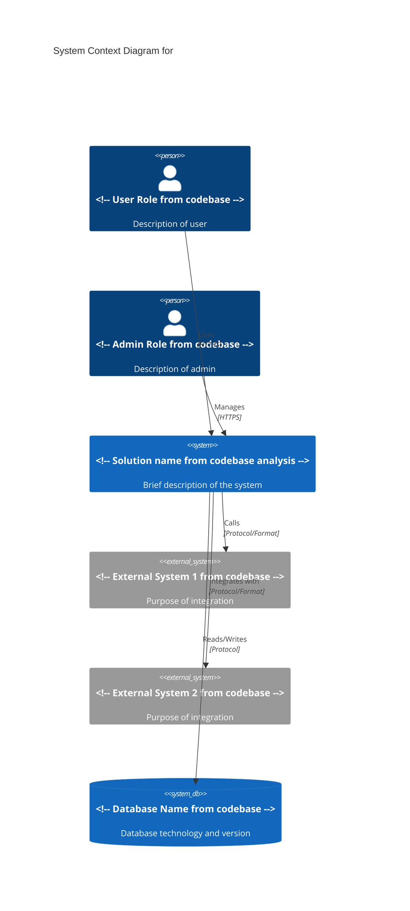

# Executive Summary

> This document provides a high-level overview of the solution, including business value, technology stack, current state assessment, and strategic recommendations for business and technical leadership.

## Table of Contents
- [Solution Overview](#solution-overview)
- [Key Stakeholders](#key-stakeholders)
- [Technology Stack Summary](#technology-stack-summary)
- [Current State Assessment](#current-state-assessment)
- [Critical Findings](#critical-findings)
- [Strategic Recommendations](#strategic-recommendations)
- [Success Metrics](#success-metrics)
- [System Context Diagram](#system-context-diagram)

---

## Solution Overview

<!-- Requirements (Solution Overview):
- Name, purpose, business value proposition
-->

### Solution Name
<!-- Enter solution name based on evidence from project files and configuration -->

### Purpose
<!-- Describe the primary purpose and what problem the solution solves based on evidence from analysis -->

### Business Value Proposition
<!-- Explain the business value and benefits this solution provides to the organization based on evidence from analysis -->

---

## Key Stakeholders

<!-- Requirements (Key Stakeholders):
- Primary users, business owners, technical teams
-->

### Primary Users
<!-- Describe the main users of the system - roles, departments, or user types based on evidence from analysis -->

### Business Owners
<!-- List the business owners or sponsors - who has authority and accountability based on evidence from analysis -->

### Technical Teams
<!-- Identify the technical teams involved - development, operations, support, etc. based on evidence from analysis -->

---

## Technology Stack Summary

<!-- Requirements (Technology Stack Summary):
- Major frameworks, databases, cloud services
-->

### Major Frameworks
<!-- List the primary frameworks used - e.g., .NET Framework, ASP.NET MVC, etc. based on evidence from analysis -->

### Databases
<!-- List database technologies - e.g., SQL Server, MongoDB, etc. based on evidence from analysis -->

### Cloud Services
<!-- List cloud services and platforms - e.g., Azure, AWS, on-premises based on evidence from analysis -->

### Key Technologies
<!-- Any other significant technologies - message queues, caching, APIs, etc. based on evidence from analysis -->

---

## Current State Assessment

<!-- Requirements (Current State Assessment):
- Version, maturity, active development status
-->

### Version Information
<!-- Current version number and release information based on evidence from analysis -->

### Maturity Level
<!-- Describe the maturity: Early stage, Stable, Mature, Legacy based on evidence from analysis -->

### Active Development Status
<!-- Indicate if actively developed, maintenance mode, or end-of-life based on evidence from analysis -->

### Deployment Status
<!-- Current deployment state - production, staging, development environments based on evidence from analysis -->

### Usage Statistics
<!-- If available, include user counts, transaction volumes, uptime, etc. based on evidence from analysis -->

---

## Critical Findings

<!-- Requirements (Critical Findings):
- Top 3-5 architectural strengths and concerns
-->

### Architectural Strengths

#### Strength 1: <!-- Title from codebase -->
<!-- Description of architectural strength and why it's beneficial based on evidence from analysis -->

#### Strength 2: <!-- Title from codebase -->
<!-- Description of architectural strength and why it's beneficial based on evidence from analysis -->

#### Strength 3: <!-- Title from codebase -->
<!-- Description of architectural strength and why it's beneficial based on evidence from analysis -->

### Architectural Concerns

#### Concern 1: <!-- Title from codebase -->
<!-- Description of concern, impact, and risk level based on evidence from analysis -->

#### Concern 2: <!-- Title from codebase -->
<!-- Description of concern, impact, and risk level based on evidence from analysis -->

#### Concern 3: <!-- Title from codebase -->
<!-- Description of concern, impact, and risk level based on evidence from analysis -->

### Key Risks
<!-- Summarize the top risks to business continuity, security, performance, or scalability based on evidence from analysis -->

---

## Strategic Recommendations

**Note**: The following recommendations are based on industry best practices and standards. They should be evaluated against the specific context of your organization and codebase.
<!-- Source: Cite specific standards, frameworks, or publications -->

<!-- Requirements (Strategic Recommendations):
- Prioritized list with business impact
-->

> Prioritized list of recommendations with business impact assessment

### High Priority

#### Recommendation 1: <!-- Title from codebase -->
- **Description**: <!-- What should be done based on evidence from analysis -->
- **Business Impact**: <!-- How this affects the business - risk reduction, efficiency, capability enablement based on evidence from analysis -->
- **Technical Impact**: <!-- Technical benefits or changes required based on evidence from analysis -->
- **Complexity**: <!-- Based on code analysis: Low/Medium/High complexity with justification based on evidence from analysis -->
- **Dependencies**: <!-- Any prerequisites or blockers identified from codebase based on evidence from analysis -->
- **Evidence**: [Source: specific analysis results, tool outputs, or code locations]

#### Recommendation 2: <!-- Title from codebase -->
- **Description**: <!-- What should be done based on evidence from analysis -->
- **Business Impact**: <!-- How this affects the business based on evidence from analysis -->
- **Technical Impact**: <!-- Technical benefits or changes required based on evidence from analysis -->
- **Complexity**: <!-- Based on code analysis with evidence based on evidence from analysis -->
- **Dependencies**: <!-- Prerequisites identified from dependency analysis based on evidence from analysis -->
- **Evidence**: [Source: analysis results with tool/version]

### Medium Priority

#### Recommendation 3: <!-- Title from codebase -->
- **Description**: <!-- What should be done based on evidence from analysis -->
- **Business Impact**: <!-- How this affects the business based on evidence from analysis -->
- **Technical Impact**: <!-- Technical benefits or changes required based on evidence from analysis -->
- **Complexity**: <!-- Based on code analysis with evidence based on evidence from analysis -->
- **Dependencies**: <!-- Prerequisites identified from codebase -->
- **Evidence**: [Source: analysis results]

### Low Priority

#### Recommendation 4: <!-- Title from codebase -->
- **Description**: <!-- What should be done based on evidence from analysis -->
- **Business Impact**: <!-- How this affects the business based on evidence from analysis -->
- **Technical Impact**: <!-- Technical benefits or changes required based on evidence from analysis -->
- **Complexity**: <!-- Based on code analysis with evidence based on evidence from analysis -->
- **Dependencies**: <!-- Prerequisites identified from codebase -->
- **Evidence**: [Source: analysis results]

**Note**: No time or cost estimates are provided as they cannot be accurately derived from code analysis alone. Complexity ratings are based on observable code characteristics such as dependency counts, coupling metrics, and architectural patterns identified during analysis.

---

## Success Metrics

<!-- Requirements (Success Metrics):
- KPIs for solution effectiveness
-->

### Key Performance Indicators (KPIs)

#### Operational Metrics
- **System Availability**: <!-- Target uptime percentage based on evidence from analysis -->
- **Response Time**: <!-- Target response time for key operations based on evidence from analysis -->
- **Throughput**: <!-- Transactions per second/hour/day based on evidence from analysis -->
- **Error Rate**: <!-- Acceptable error rate percentage based on evidence from analysis -->

#### Business Metrics
- **User Adoption**: <!-- Active users, engagement metrics based on evidence from analysis -->
- **Business Process Efficiency**: <!-- Time savings, automation rate based on evidence from analysis -->
- **Cost Efficiency**: <!-- Operating costs, cost per transaction based on evidence from analysis -->
- **Customer Satisfaction**: <!-- Survey scores, feedback metrics based on evidence from analysis -->

#### Technical Metrics
- **Code Quality**: <!-- Test coverage, defect density, technical debt ratio based on evidence from analysis -->
- **Deployment Frequency**: <!-- Release cadence from codebase -->
- **Mean Time to Recovery (MTTR)**: <!-- Target recovery time based on evidence from analysis -->
- **Security Posture**: <!-- Vulnerability count, compliance score based on evidence from analysis -->

---

## System Context Diagram

<!-- Requirements (Diagrams Required):
- High-level system context (C4 Level 1)
-->

> High-level C4 Level 1 diagram showing the system, users, and external systems

### External Dependencies Description

#### <!-- External System 1 from codebase -->
<!-- Description of what this system does and why the solution depends on it based on evidence from analysis -->

#### <!-- External System 2 from codebase -->
<!-- Description of what this system does and why the solution depends on it based on evidence from analysis -->

#### <!-- Database from connection strings and configuration -->
<!-- Description of the database role and criticality based on evidence from analysis -->

---

## Document History

| Version | Date | Author | Changes |
|---------|------|--------|---------|
| 1.0 | (To be set upon document creation/update) | <!-- Author Name from codebase --> | Initial creation |

---

## Next Steps

<!-- Recommended next actions for stakeholders after reviewing this document based on evidence from analysis -->

1. <!-- Action item 1 from codebase -->
2. <!-- Action item 2 from codebase -->
3. <!-- Action item 3 from codebase -->
