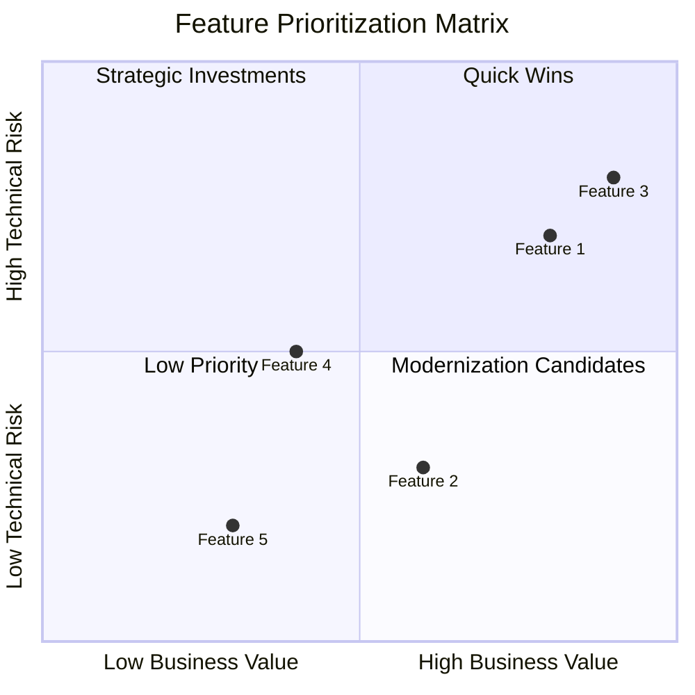
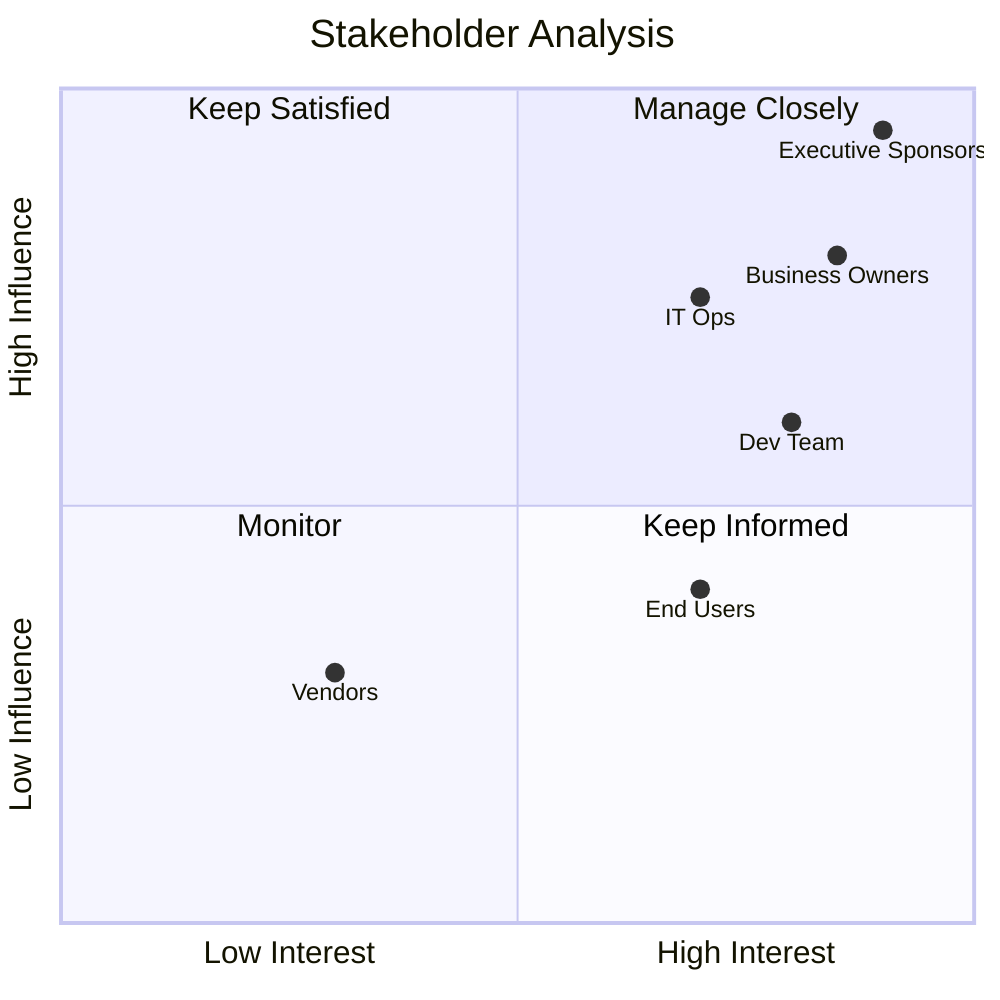
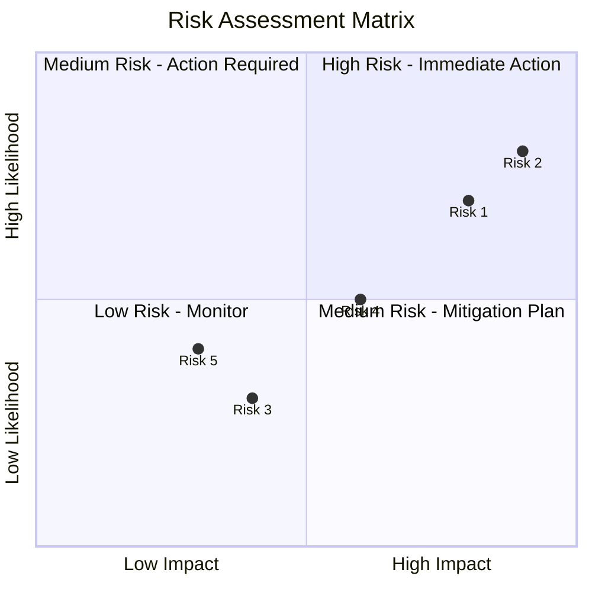
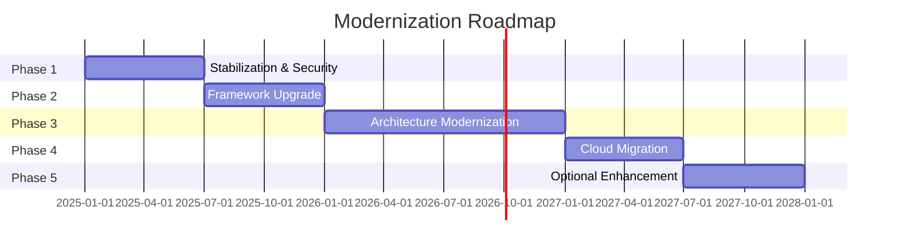

# Stakeholder Matrix & Impact Analysis - <!-- Solution name from codebase -->

> This document provides a comprehensive view of stakeholders, business value assessment, risk analysis, and modernization roadmap. It serves as a strategic planning tool for prioritizing improvements and managing organizational change.

## Table of Contents

- [Executive Summary](#executive-summary)
- [Feature Prioritization Matrix](#feature-prioritization-matrix)
- [Stakeholder Map](#stakeholder-map)
- [Business Capabilities](#business-capabilities)
- [Risk Assessment](#risk-assessment)
- [Modernization Roadmap](#modernization-roadmap)
- [Investment & ROI Analysis](#investment-roi-analysis)
- [Success Criteria & KPIs](#success-criteria-kpis)
- [Governance & Decision Framework](#governance-decision-framework)
- [Communication Plan](#communication-plan)

---

## Executive Summary

### Document Purpose

This stakeholder matrix and impact analysis document identifies:
- **Who** is affected by the system (stakeholders)
- **What** value each feature provides (business capabilities)
- **Why** changes are needed (risks and opportunities)
- **When** and **How** to implement improvements (roadmap)

### Key Findings

**Business Impact:**
- <!-- Count from analysis --> features supporting <!-- Count from analysis --> users
- (Cost data excluded per project requirements) annual revenue impact
- <!-- Count from analysis --> critical business processes supported

**Stakeholder Landscape:**
- <!-- Count from analysis --> primary stakeholder groups
- <!-- Count from analysis --> total end users
- <!-- Count from analysis --> executive sponsors

**Risk Profile:**
- <!-- Count from analysis --> critical risks requiring immediate attention
- <!-- Count from analysis --> high-priority risks
- <!-- Risk category from codebase --> poses greatest threat to business continuity

**Modernization Investment:**
- Investment and ROI analysis excluded as financial data is not available from codebase analysis

---

## Feature Prioritization Matrix

<!-- 
DOCUMENTATION REQUIREMENTS (11.1 Feature Inventory):
| Feature | Business Value | User Personas | Technical Components | Maturity Level |
|---------|----------------|---------------|----------------------|----------------|
| User Registration | High | End Users | Auth, Database, Email | Stable |

Target Audience: Business stakeholders, product managers, executives
-->

### 1.1 Feature Inventory Overview

```mermaid
graph TB
    subgraph "High Business Value"
        F1<!-- Feature 1 from codebase -->
        F2<!-- Feature 2 from codebase -->
        F3<!-- Feature 3 from codebase -->
    end
    
    subgraph "Medium Business Value"
        F4<!-- Feature 4 from codebase -->
        F5<!-- Feature 5 from codebase -->
    end
    
    subgraph "Low Business Value"
        F6<!-- Feature 6 from codebase -->
        F7<!-- Feature 7 from codebase -->
    end
    
    style F1 fill:#e1ffe1
    style F2 fill:#e1ffe1
    style F3 fill:#e1ffe1
    style F4 fill:#fff4e1
    style F5 fill:#fff4e1
    style F6 fill:#ffe1e1
    style F7 fill:#ffe1e1
```

### 1.2 Feature Details

#### Feature 1: <!-- Feature Name from codebase -->

**Business Value:** [Critical / High / Medium / Low]  
**Primary Stakeholders:** <!-- Stakeholder groups from codebase -->  
**Maturity Level:** [Mature / Stable / Developing / Legacy]  
**Technical Complexity:** [High / Medium / Low]

**Description:**  
<!-- Detailed description of what this feature does and why it exists based on evidence from analysis -->

**Impact Analysis:**
- **Revenue Impact:** [Direct / Indirect / None] - <!-- Explanation from codebase -->
- **User Base:** <!-- Count from analysis --> users (<!-- breakdown by type from codebase -->)
- **Transaction Volume:** <!-- Count from analysis --> transactions/<!-- period from codebase -->
- **Criticality:** [Mission-critical / Critical / Important / Nice-to-have]

**Business Metrics:**
| Metric | Current | Target | Impact |
|--------|---------|--------|--------|
| <!-- Metric 1 from codebase --> | <!-- Value from measurements --> | <!-- Value from measurements --> | <!-- Description from codebase --> |
| <!-- Metric 2 from codebase --> | <!-- Value from measurements --> | <!-- Value from measurements --> | <!-- Description from codebase --> |

**Technical Components:**
- <!-- Component 1 from codebase -->: <!-- Purpose from codebase -->
- <!-- Component 2 from codebase -->: <!-- Purpose from codebase -->
- <!-- Component 3 from codebase -->: <!-- Purpose from codebase -->

**Dependencies:**
- Upstream: [Systems/features that feed into this]
- Downstream: [Systems/features that depend on this]
- External: <!-- Third-party integrations from codebase -->

**Current Pain Points:**
- <!-- Pain point 1 from codebase -->
- <!-- Pain point 2 from codebase -->
- <!-- Pain point 3 from codebase -->

**Modernization Priority:** Phase [N]

**Recommended Actions:**
- [ ] <!-- Action 1 from codebase -->
- [ ] <!-- Action 2 from codebase -->
- [ ] <!-- Action 3 from codebase -->

---

#### Feature 2: <!-- Feature Name from codebase -->

<!-- Repeat structure from Feature 1 based on evidence from analysis -->

---

### 1.3 Feature Prioritization Matrix

| Feature | Business Value | User Impact | Technical Risk | Strategic Importance | Priority Score |
|---------|----------------|-------------|----------------|---------------------|----------------|
| <!-- Feature 1 from codebase --> | <!-- Score 1-10 from codebase --> | <!-- Score 1-10 from codebase --> | <!-- Score 1-10 from codebase --> | <!-- Score 1-10 from codebase --> | <!-- Total from calculation --> |
| <!-- Feature 2 from codebase --> | <!-- Score 1-10 from codebase --> | <!-- Score 1-10 from codebase --> | <!-- Score 1-10 from codebase --> | <!-- Score 1-10 from codebase --> | <!-- Total from calculation --> |

**Scoring Legend:**
- **Business Value:** 10 = Critical revenue driver, 1 = Nice-to-have
- **User Impact:** 10 = Affects all users daily, 1 = Rarely used by few
- **Technical Risk:** 10 = High technical debt/risk, 1 = Well-maintained
- **Strategic Importance:** 10 = Core differentiator, 1 = Commodity feature

**Priority Visualization:**



---

## Stakeholder Map

### 2.1 Stakeholder Overview

```mermaid
graph TD
    System<!-- Solution System from codebase -->
    
    Exec<!-- Executive Sponsors from codebase -->
    Business<!-- Business Owners from codebase -->
    Users<!-- End Users from codebase -->
    Tech<!-- Technical Teams from codebase -->
    External<!-- External Partners from codebase -->
    
    System --> Exec
    System --> Business
    System --> Users
    System --> Tech
    System --> External
    
    style System fill:#e1f5ff
    style Exec fill:#ffe1e1
    style Business fill:#fff4e1
    style Users fill:#e1ffe1
    style Tech fill:#ffe1f0
    style External fill:#f0e1ff
```

### 2.2 Primary Stakeholders

#### Executive Sponsors

**Role:** [Executive title(s)]  
**Count:** <!-- Count from analysis --> individuals

**Interests:**
- <!-- Interest 1 from codebase -->
- <!-- Interest 2 from codebase -->
- <!-- Interest 3 from codebase -->

**Influence Level:** High / Critical  
**Engagement Level:** [Current / Desired]

**Communication Preferences:**
- **Method:** [Email / Dashboard / Presentations]
- **Frequency:** [Monthly / Quarterly]
- **Content Focus:** [ROI / Risk / Strategic alignment]

**Key Concerns:**
- <!-- Concern 1 from codebase -->
- <!-- Concern 2 from codebase -->

**Success Criteria:**
- <!-- Criterion 1 from codebase -->
- <!-- Criterion 2 from codebase -->

**Engagement Strategy:**
- <!-- Strategy 1 from codebase -->
- <!-- Strategy 2 from codebase -->

---

#### Business Owners

**Role:** <!-- Department heads, Product owners based on evidence from analysis -->  
**Count:** <!-- Count from analysis --> individuals

**Interests:**
- <!-- Interest 1 from codebase -->
- <!-- Interest 2 from codebase -->
- <!-- Interest 3 from codebase -->

**Influence Level:** High  
**Engagement Level:** [Current / Desired]

**Communication Preferences:**
- **Method:** <!-- Status reports / Demos based on evidence from analysis -->
- **Frequency:** [Weekly / Bi-weekly]
- **Content Focus:** [Features / Timelines]

**Key Concerns:**
- <!-- Concern 1 from codebase -->
- <!-- Concern 2 from codebase -->

**Success Criteria:**
- <!-- Criterion 1 from codebase -->
- <!-- Criterion 2 from codebase -->

**Engagement Strategy:**
- <!-- Strategy 1 from codebase -->
- <!-- Strategy 2 from codebase -->

---

#### End Users - <!-- User Group 1 from codebase -->

**Role:** <!-- Job title/function based on evidence from analysis -->  
**Count:** <!-- Count from analysis --> users  
**Location:** <!-- Geographic distribution based on evidence from analysis -->

**Interests:**
- <!-- Interest 1 from codebase -->
- <!-- Interest 2 from codebase -->
- <!-- Interest 3 from codebase -->

**Influence Level:** Medium  
**Engagement Level:** [Current / Desired]

**Usage Patterns:**
- **Frequency:** [Daily / Weekly / Monthly]
- **Duration:** <!-- Average session length based on evidence from analysis -->
- **Peak Times:** <!-- When they use the system based on evidence from analysis -->

**Pain Points:**
- <!-- Pain point 1 from codebase -->
- <!-- Pain point 2 from codebase -->
- <!-- Pain point 3 from codebase -->

**Feature Priorities:**
- <!-- Priority 1 from codebase -->
- <!-- Priority 2 from codebase -->

**Training Needs:**
- <!-- Training need 1 from codebase -->
- <!-- Training need 2 from codebase -->

**Engagement Strategy:**
- <!-- Strategy 1 from codebase -->
- <!-- Strategy 2 from codebase -->

---

#### End Users - <!-- User Group 2 from codebase -->

<!-- Repeat structure from User Group 1 based on evidence from analysis -->

---

### 2.3 Technical Stakeholders

#### Development Team

**Role:** <!-- Software engineers, QA engineers, etc. based on evidence from analysis -->  
**Count:** <!-- Count from analysis --> team members

**Interests:**
- <!-- Interest 1 from codebase -->
- <!-- Interest 2 from codebase -->
- <!-- Interest 3 from codebase -->

**Influence Level:** Medium-High  
**Engagement Level:** [Current / Desired]

**Key Concerns:**
- <!-- Concern 1 from codebase -->
- <!-- Concern 2 from codebase -->

**Engagement Strategy:**
- <!-- Strategy 1 from codebase -->
- <!-- Strategy 2 from codebase -->

---

#### IT Operations

**Role:** [Infrastructure, DBA, Security, etc.]  
**Count:** <!-- Count from analysis --> team members

**Interests:**
- <!-- Interest 1 from codebase -->
- <!-- Interest 2 from codebase -->
- <!-- Interest 3 from codebase -->

**Influence Level:** High  
**Engagement Level:** [Current / Desired]

**Key Concerns:**
- <!-- Concern 1 from codebase -->
- <!-- Concern 2 from codebase -->

**Engagement Strategy:**
- <!-- Strategy 1 from codebase -->
- <!-- Strategy 2 from codebase -->

---

#### Enterprise Architecture

**Role:** [Architects, Standards teams]  
**Count:** <!-- Count from analysis --> team members

**Interests:**
- <!-- Interest 1 from codebase -->
- <!-- Interest 2 from codebase -->

**Influence Level:** High  
**Engagement Level:** [Current / Desired]

**Key Concerns:**
- <!-- Concern 1 from codebase -->
- <!-- Concern 2 from codebase -->

**Engagement Strategy:**
- <!-- Strategy 1 from codebase -->
- <!-- Strategy 2 from codebase -->

---

### 2.4 External Stakeholders

#### Vendors & Partners

**Organizations:**
- <!-- Vendor 1 from codebase -->: <!-- Relationship type from codebase -->
- <!-- Vendor 2 from codebase -->: <!-- Relationship type from codebase -->

**Interests:**
- <!-- Interest 1 from codebase -->
- <!-- Interest 2 from codebase -->

**Influence Level:** Low-Medium  
**Engagement Level:** <!-- As needed from codebase -->

---

#### Compliance & Audit

**Organizations:**
- <!-- Internal audit from codebase -->
- <!-- Regulatory bodies from codebase -->

**Interests:**
- <!-- Interest 1 from codebase -->
- <!-- Interest 2 from codebase -->

**Influence Level:** High  
**Engagement Level:** <!-- Periodic from codebase -->

**Requirements:**
- <!-- Requirement 1 from codebase -->
- <!-- Requirement 2 from codebase -->

---

### 2.5 Stakeholder Influence-Interest Matrix



**Engagement Strategies by Quadrant:**

- **Manage Closely (High Interest, High Influence):**
  - Frequent updates
  - Active involvement in decision-making
  - Regular face-to-face meetings

- **Keep Satisfied (Low Interest, High Influence):**
  - Periodic updates
  - Seek input on key decisions
  - Keep informed of major changes

- **Keep Informed (High Interest, Low Influence):**
  - Regular communication
  - Training and support
  - Feedback channels

- **Monitor (Low Interest, Low Influence):**
  - Minimal communication
  - General announcements
  - Available resources

---

## Business Capabilities

<!-- 
DOCUMENTATION REQUIREMENTS (11.2 Business Capability Map):
- Core capabilities the system provides
- Supporting capabilities
- Mapping to system components
-->

### 3.1 Business Capability Map

```mermaid
graph TB
    subgraph "Core Capabilities"
        C1<!-- Capability 1 from codebase -->
        C2<!-- Capability 2 from codebase -->
        C3<!-- Capability 3 from codebase -->
    end
    
    subgraph "Supporting Capabilities"
        S1<!-- Capability 4 from codebase -->
        S2<!-- Capability 5 from codebase -->
        S3<!-- Capability 6 from codebase -->
    end
    
    subgraph "Enabling Capabilities"
        E1[Security & Access Control]
        E2<!-- Data Management from codebase -->
        E3<!-- Integration from codebase -->
    end
    
    C1 --> S1
    C1 --> S2
    C2 --> S3
    C3 --> S1
    
    C1 --> E1
    C2 --> E2
    C3 --> E3
    
    style C1 fill:#e1ffe1
    style C2 fill:#e1ffe1
    style C3 fill:#e1ffe1
    style S1 fill:#fff4e1
    style S2 fill:#fff4e1
    style S3 fill:#fff4e1
    style E1 fill:#e1f5ff
    style E2 fill:#e1f5ff
    style E3 fill:#e1f5ff
```

### 3.2 Capability Details

#### Capability 1: <!-- Capability Name from codebase -->

**Category:** [Core / Supporting / Enabling]  
**Business Value:** [Critical / High / Medium / Low]  
**Maturity Level:** <!-- Rating 1-5 from codebase -->

**Description:**  
<!-- What this capability enables the business to do based on evidence from analysis -->

**Current State:**
- <!-- Current implementation details based on evidence from analysis -->
- <!-- Limitations from codebase -->
- <!-- Pain points from codebase -->

**Target State:**
- <!-- Desired future state based on evidence from analysis -->
- <!-- Expected improvements based on evidence from analysis -->
- <!-- New capabilities based on evidence from analysis -->

**Supporting Systems:**
- [System/component 1]
- [System/component 2]

**Key Metrics:**
| Metric | Current | Target | Improvement |
|--------|---------|--------|-------------|
| <!-- Metric 1 from codebase --> | <!-- Value from measurements --> | <!-- Value from measurements --> | <!-- Percentage --> |
| <!-- Metric 2 from codebase --> | <!-- Value from measurements --> | <!-- Value from measurements --> | <!-- Percentage --> |

**Business Value:**
- **Quantifiable:** [$Amount/year or %improvement]
- **Strategic:** <!-- Alignment with business strategy based on evidence from analysis -->
- **Competitive:** <!-- Market differentiation based on evidence from analysis -->

**Risks if Not Improved:**
- <!-- Risk 1 from codebase -->
- <!-- Risk 2 from codebase -->

**Dependencies:**
- <!-- Dependency 1 from codebase -->
- <!-- Dependency 2 from codebase -->

**Modernization Phase:** Phase [N]

---

#### Capability 2: <!-- Capability Name from codebase -->

<!-- Repeat structure from Capability 1 based on evidence from analysis -->

---

### 3.3 Capability-Feature Mapping

| Business Capability | Supporting Features | System Components | Stakeholders |
|---------------------|---------------------|-------------------|--------------|
| <!-- Capability 1 from codebase --> | [Feature 1, Feature 2] | [Component 1, Component 2] | <!-- Stakeholder groups from codebase --> |
| <!-- Capability 2 from codebase --> | [Feature 3, Feature 4] | [Component 3, Component 4] | <!-- Stakeholder groups from codebase --> |

---

## Risk Assessment

<!-- 
DOCUMENTATION REQUIREMENTS (11.3 Risk Assessment):
For each identified risk:
- **Risk Description**: What could go wrong
- **Impact**: Business consequences
- **Probability**: Likelihood
- **Mitigation**: How to reduce or avoid
- **Owner**: Who's responsible
-->

### 4.1 Risk Overview

**Risk Categories:**
- Technical Risks
- Organizational Risks
- Business Risks
- Compliance Risks
- Financial Risks

**Risk Heat Map:**



### 4.2 Technical Risks

#### Risk TR-1: <!-- Risk Title from codebase -->

**Category:** Technical  
**Impact:** [Critical / High / Medium / Low]  
**Likelihood:** [High / Medium / Low]  
**Severity Score:** [1-10]  
**Overall Risk Rating:** 🔴 Critical / 🟠 High / 🟡 Medium / 🟢 Low

**Description:**  
<!-- Detailed description of the risk based on evidence from analysis -->

**Impact Analysis:**
- **Technical Impact:**
  - <!-- Impact point 1 from codebase -->
  - <!-- Impact point 2 from codebase -->
  
- **Business Impact:**
  - <!-- Impact point 1 from codebase -->
  - <!-- Impact point 2 from codebase -->
  
- **Financial Impact:**
  - <!-- Estimated cost if risk materializes based on evidence from analysis -->

**Root Causes:**
- <!-- Cause 1 from codebase -->
- <!-- Cause 2 from codebase -->

**Indicators:**
- <!-- Warning sign 1 from codebase -->
- <!-- Warning sign 2 from codebase -->

**Mitigation Strategy:**

**Immediate Actions (0-30 days):**
- [ ] <!-- Action 1 from codebase -->
- [ ] <!-- Action 2 from codebase -->

**Short-term Actions (1-6 months):**
- [ ] <!-- Action 1 from codebase -->
- [ ] <!-- Action 2 from codebase -->

**Long-term Actions (6+ months):**
- [ ] <!-- Action 1 from codebase -->
- [ ] <!-- Action 2 from codebase -->

**Contingency Plan:**
- <!-- What to do if risk materializes based on evidence from analysis -->

**Owner:** [Role/Person]

**Success Metrics:**
- <!-- How we know risk is mitigated based on evidence from analysis -->

---

#### Risk TR-2: <!-- Risk Title from codebase -->

<!-- Repeat structure from TR-1 based on evidence from analysis -->

---

### 4.3 Organizational Risks

#### Risk OR-1: <!-- Risk Title from codebase -->

**Category:** Organizational  
**Impact:** [Critical / High / Medium / Low]  
**Likelihood:** [High / Medium / Low]  
**Severity Score:** [1-10]  
**Overall Risk Rating:** 🔴 Critical / 🟠 High / 🟡 Medium / 🟢 Low

<!-- Use similar structure as Technical Risks based on evidence from analysis -->

---

### 4.4 Business Risks

#### Risk BR-1: <!-- Risk Title from codebase -->

**Category:** Business  
**Impact:** [Critical / High / Medium / Low]  
**Likelihood:** [High / Medium / Low]  
**Severity Score:** [1-10]  
**Overall Risk Rating:** 🔴 Critical / 🟠 High / 🟡 Medium / 🟢 Low

<!-- Use similar structure as Technical Risks based on evidence from analysis -->

---

### 4.5 Risk Summary

| Risk ID | Category | Title | Impact | Likelihood | Severity | Status |
|---------|----------|-------|--------|------------|----------|--------|
| TR-1 | Technical | <!-- Title from codebase --> | <!-- Level from codebase --> | <!-- Level from codebase --> | <!-- Score from assessment --> | <!-- Status from analysis --> |
| TR-2 | Technical | <!-- Title from codebase --> | <!-- Level from codebase --> | <!-- Level from codebase --> | <!-- Score from assessment --> | <!-- Status from analysis --> |
| OR-1 | Organizational | <!-- Title from codebase --> | <!-- Level from codebase --> | <!-- Level from codebase --> | <!-- Score from assessment --> | <!-- Status from analysis --> |
| BR-1 | Business | <!-- Title from codebase --> | <!-- Level from codebase --> | <!-- Level from codebase --> | <!-- Score from assessment --> | <!-- Status from analysis --> |

**Status Legend:**
- 🔴 Active - Requires immediate attention
- 🟠 Monitoring - Mitigation in progress
- 🟡 Managed - Under control
- 🟢 Closed - Resolved

---

## Modernization Roadmap

<!-- 
DOCUMENTATION REQUIREMENTS (11.4 Modernization Roadmap):
If applicable:
- Current pain points
- Target state vision
- Migration strategy (Rehost, Refactor, Rebuild)
- Phased approach with milestones
- ROI estimation
-->

### 5.1 Roadmap Overview

**Note**: Cost estimates, timelines, ROI calculations, and savings projections are excluded as this data is not available from codebase analysis.



### 5.2 Phase 1: <!-- Phase Name from codebase -->

**Risk Level:** [Low / Medium / High]  
**Business Disruption:** [Minimal / Low / Medium / High]

#### Objectives
- <!-- Objective 1 from codebase -->
- <!-- Objective 2 from codebase -->
- <!-- Objective 3 from codebase -->

#### Key Activities

**<!-- Milestone 1 from codebase -->:**
- <!-- Activity 1 from codebase -->
- <!-- Activity 2 from codebase -->
- **Deliverable:** <!-- Deliverable description based on evidence from analysis -->

**<!-- Milestone 2 from codebase -->:**
- <!-- Activity 1 from codebase -->
- <!-- Activity 2 from codebase -->
- **Deliverable:** <!-- Deliverable description based on evidence from analysis -->

**<!-- Milestone 3 from codebase -->:**
- <!-- Activity 1 from codebase -->
- <!-- Activity 2 from codebase -->
- **Deliverable:** <!-- Deliverable description based on evidence from analysis -->

#### Success Metrics
- <!-- Metric 1 from codebase -->: <!-- Target from codebase -->
- <!-- Metric 2 from codebase -->: <!-- Target from codebase -->
- <!-- Metric 3 from codebase -->: <!-- Target from codebase -->

#### Risks & Mitigation
- **Risk:** <!-- Risk description based on evidence from analysis -->
  - **Mitigation:** <!-- Mitigation strategy from codebase -->
- **Risk:** <!-- Risk description based on evidence from analysis -->
  - **Mitigation:** <!-- Mitigation strategy from codebase -->

#### Dependencies
- <!-- Dependency 1 from codebase -->
- <!-- Dependency 2 from codebase -->

#### Stakeholder Impact
- **Executive Sponsors:** <!-- Impact description based on evidence from analysis -->
- **Business Users:** <!-- Impact description based on evidence from analysis -->
- **Technical Teams:** <!-- Impact description based on evidence from analysis -->

---

### 5.3 Phase 2: <!-- Phase Name from codebase -->

<!-- Repeat structure from Phase 1 based on evidence from analysis -->

---

### 5.4 Phase 3: <!-- Phase Name from codebase -->

<!-- Repeat structure from Phase 1 based on evidence from analysis -->

---

### 5.5 Phase 4: <!-- Phase Name from codebase -->

<!-- Repeat structure from Phase 1 based on evidence from analysis -->

---

### 5.6 Phase 5: <!-- Phase Name from codebase --> (Optional)

<!-- Repeat structure from Phase 1 based on evidence from analysis -->

**Decision Point:**  
<!-- Criteria for determining whether to proceed with this phase based on evidence from analysis -->

---

### 5.7 Roadmap Dependencies

```mermaid
graph LR
    P1<!-- Phase 1 from codebase --> --> P2<!-- Phase 2 from codebase -->
    P2 --> P3<!-- Phase 3 from codebase -->
    P3 --> P4<!-- Phase 4 from codebase -->
    P4 --> P5[Phase 5<br/>Optional]
    
    P1 -.->|Enables| P3
    P2 -.->|Required for| P4
    
    style P1 fill:#e1ffe1
    style P2 fill:#fff4e1
    style P3 fill:#e1f5ff
    style P4 fill:#ffe1e1
    style P5 fill:#f0e1ff
```

---

## Investment & ROI Analysis

### 6.1 Total Investment Summary

| Phase | Duration | Budget | Risk Level | Business Disruption |
|-------|----------|--------|------------|---------------------|
| Phase 1: <!-- Name from documentation --> | <!-- Based on complexity --> | (Cost data excluded per project requirements) | <!-- Level from codebase --> | <!-- Level from codebase --> |
| Phase 2: <!-- Name from documentation --> | <!-- Based on complexity --> | (Cost data excluded per project requirements) | <!-- Level from codebase --> | <!-- Level from codebase --> |
| Phase 3: <!-- Name from documentation --> | <!-- Based on complexity --> | (Cost data excluded per project requirements) | <!-- Level from codebase --> | <!-- Level from codebase --> |
| Phase 4: <!-- Name from documentation --> | <!-- Based on complexity --> | (Cost data excluded per project requirements) | <!-- Level from codebase --> | <!-- Level from codebase --> |
| Phase 5: <!-- Name from documentation --> (Optional) | <!-- Based on complexity --> | (Cost data excluded per project requirements) | <!-- Level from codebase --> | <!-- Level from codebase --> |
| **Total (Core Phases)** | **<!-- Based on complexity -->** | **(Cost data excluded per project requirements)** | - | - |
| **Total (All Phases)** | **<!-- Based on complexity -->** | **(Cost data excluded per project requirements)** | - | - |

### 6.2 Cost Breakdown

#### Development Costs (<!-- XX from codebase -->% of total)
- <!-- Role 1 from codebase --> (<!-- Count from analysis --> FTE x <!-- Based on complexity -->): (Cost data excluded per project requirements)
- <!-- Role 2 from codebase --> (<!-- Count from analysis --> FTE x <!-- Based on complexity -->): (Cost data excluded per project requirements)
- <!-- Role 3 from codebase --> (<!-- Count from analysis --> FTE x <!-- Based on complexity -->): (Cost data excluded per project requirements)
- **Subtotal:** (Cost data excluded per project requirements)

#### Infrastructure & Licensing (<!-- XX from codebase -->% of total)
- <!-- Infrastructure component 1 based on evidence from analysis -->: (Cost data excluded per project requirements)
- <!-- Infrastructure component 2 based on evidence from analysis -->: (Cost data excluded per project requirements)
- <!-- Licensing costs from codebase -->: (Cost data excluded per project requirements)
- **Subtotal:** (Cost data excluded per project requirements)

#### Professional Services (<!-- XX from codebase -->% of total)
- <!-- Service 1 from codebase -->: (Cost data excluded per project requirements)
- <!-- Service 2 from codebase -->: (Cost data excluded per project requirements)
- <!-- Service 3 from codebase -->: (Cost data excluded per project requirements)
- **Subtotal:** (Cost data excluded per project requirements)

#### Contingency (<!-- XX from codebase -->% of total)
- Risk buffer: (Cost data excluded per project requirements)

**Total Investment:** (Cost data excluded per project requirements)

---

### 6.3 Annual Cost Savings

#### Infrastructure Savings: [$Amount/year]
- <!-- Savings source 1 from codebase -->: (Cost data excluded per project requirements)
- <!-- Savings source 2 from codebase -->: (Cost data excluded per project requirements)
- <!-- Savings source 3 from codebase -->: (Cost data excluded per project requirements)

#### Operational Efficiency: [$Amount/year]
- <!-- Efficiency gain 1 from codebase -->: (Cost data excluded per project requirements)
- <!-- Efficiency gain 2 from codebase -->: (Cost data excluded per project requirements)
- <!-- Efficiency gain 3 from codebase -->: (Cost data excluded per project requirements)

#### Risk Reduction: [$Amount/year] (estimated)
- <!-- Risk-related savings 1 from codebase -->: (Cost data excluded per project requirements)
- <!-- Risk-related savings 2 from codebase -->: (Cost data excluded per project requirements)

#### **Total Annual Savings: [$Amount/year]**

---

### 6.4 ROI Calculation

**Conservative Scenario:**
- Total Investment: (Cost data excluded per project requirements)
- Annual Savings: (Cost data excluded per project requirements)
- **Payback Period:** [Months/Years]
- **[X]-Year ROI:** <!-- Percentage --> ((Cost data excluded per project requirements) savings - (Cost data excluded per project requirements) investment) / (Cost data excluded per project requirements) investment

**Expected Scenario:**
- Total Investment: (Cost data excluded per project requirements)
- Annual Savings: (Cost data excluded per project requirements)
- **Payback Period:** [Months/Years]
- **[X]-Year ROI:** <!-- Percentage -->

**Optimistic Scenario:**
- Total Investment: (Cost data excluded per project requirements)
- Annual Savings: (Cost data excluded per project requirements)
- **Payback Period:** [Months/Years]
- **[X]-Year ROI:** <!-- Percentage -->

**ROI Visualization:**

```mermaid
xychart-beta
    title "Cumulative Cash Flow Analysis"
    x-axis ["Year 0", "Year 1", "Year 2", "Year 3", "Year 4", "Year 5"]
    y-axis "Cash Flow ($M)" -3 --> 3
    line "Conservative" ["-2.0", "-1.5", "-0.5", "0.5", "1.5", "2.5"]
    line "Expected" ["-1.8", "-1.0", "0.2", "1.2", "2.2", "3.2"]
    line "Optimistic" ["-1.5", "-0.3", "0.8", "1.8", "2.8", "3.8"]
```

---

### 6.5 Intangible Benefits

**Business Benefits:**
- <!-- Benefit 1 from codebase -->: <!-- Description and estimated value based on evidence from analysis -->
- <!-- Benefit 2 from codebase -->: <!-- Description and estimated value based on evidence from analysis -->
- <!-- Benefit 3 from codebase -->: <!-- Description and estimated value based on evidence from analysis -->

**Strategic Benefits:**
- <!-- Benefit 1 from codebase -->: <!-- Description from codebase -->
- <!-- Benefit 2 from codebase -->: <!-- Description from codebase -->

**Organizational Benefits:**
- <!-- Benefit 1 from codebase -->: <!-- Description from codebase -->
- <!-- Benefit 2 from codebase -->: <!-- Description from codebase -->

**Customer Benefits:**
- <!-- Benefit 1 from codebase -->: <!-- Description from codebase -->
- <!-- Benefit 2 from codebase -->: <!-- Description from codebase -->

---

### 6.6 Cost-Benefit Summary

| Benefit Category | Annual Value | 5-Year Value | Notes |
|------------------|--------------|--------------|-------|
| Infrastructure Savings | (Cost data excluded per project requirements) | (Cost data excluded per project requirements) | <!-- Notes from codebase --> |
| Operational Efficiency | (Cost data excluded per project requirements) | (Cost data excluded per project requirements) | <!-- Notes from codebase --> |
| Risk Reduction | (Cost data excluded per project requirements) | (Cost data excluded per project requirements) | <!-- Notes from codebase --> |
| Revenue Growth | (Cost data excluded per project requirements) | (Cost data excluded per project requirements) | <!-- Notes from codebase --> |
| **Total Tangible Benefits** | **(Cost data excluded per project requirements)** | **(Cost data excluded per project requirements)** | - |
| Intangible Benefits | <!-- Estimated value from codebase --> | <!-- Estimated value from codebase --> | <!-- Notes from codebase --> |

---

## Success Criteria & KPIs

### 7.1 Technical KPIs

**System Performance:**
- **System Availability:** <!-- Current from codebase -->% → <!-- Target from codebase -->%
- **Response Time (95th percentile):** <!-- Current from codebase -->ms → <!-- Target from codebase -->ms
- **Error Rate:** <!-- Current from codebase -->% → <!-- Target from codebase -->%
- **API Latency:** <!-- Current from codebase -->ms → <!-- Target from codebase -->ms

**Code Quality:**
- **Test Coverage:** <!-- Current from codebase -->% → <!-- Target from codebase -->%
- **Code Duplication:** <!-- Current from codebase -->% → <!-- Target from codebase -->%
- **Technical Debt Ratio:** <!-- Current from codebase -->% → <!-- Target from codebase -->%
- **Cyclomatic Complexity:** <!-- Current from codebase --> → <!-- Target from codebase -->

**Security:**
- **Critical Vulnerabilities:** <!-- Current from codebase --> → <!-- Target from codebase -->
- **High Vulnerabilities:** <!-- Current from codebase --> → <!-- Target from codebase -->
- **Security Test Coverage:** <!-- Current from codebase -->% → <!-- Target from codebase -->%
- **Patch Currency:** <!-- Current days behind based on evidence from analysis --> → <!-- Target from codebase -->

**DevOps:**
- **Deployment Frequency:** <!-- Current from codebase --> → <!-- Target from codebase -->
- **Lead Time for Changes:** <!-- Current from codebase --> → <!-- Target from codebase -->
- **Mean Time to Recovery (MTTR):** <!-- Current from codebase --> → <!-- Target from codebase -->
- **Change Failure Rate:** <!-- Current from codebase -->% → <!-- Target from codebase -->%

---

### 7.2 Business KPIs

**User Experience:**
- **User Satisfaction Score:** <!-- Current from codebase -->/10 → <!-- Target from codebase -->/10
- **Net Promoter Score (NPS):** <!-- Current from codebase --> → <!-- Target from codebase -->
- **Task Completion Rate:** <!-- Current from codebase -->% → <!-- Target from codebase -->%
- **Time to Complete Task:** <!-- Current from codebase --> → <!-- Target from codebase -->

**Operational Efficiency:**
- **<!-- Process from codebase --> Cycle Time:** <!-- Current from codebase --> → <!-- Target from codebase -->
- **Support Ticket Volume:** <!-- Current from codebase -->/month → <!-- Target from codebase -->/month
- **Manual Effort Hours:** <!-- Current from codebase -->/month → <!-- Target from codebase -->/month
- **Process Automation Rate:** <!-- Current from codebase -->% → <!-- Target from codebase -->%

**Business Outcomes:**
- **Revenue per User:** <!-- Current from codebase --> → <!-- Target from codebase -->
- **Cost per Transaction:** <!-- Current from codebase --> → <!-- Target from codebase -->
- **Customer Retention Rate:** <!-- Current from codebase -->% → <!-- Target from codebase -->%
- **Market Share:** <!-- Current from codebase -->% → <!-- Target from codebase -->%

---

### 7.3 Organizational KPIs

**Team Productivity:**
- **Developer Velocity:** <!-- Current from codebase --> → <!-- Target from codebase --> [story points/sprint]
- **Feature Delivery Rate:** <!-- Current from codebase --> → <!-- Target from codebase --> [features/quarter]
- **Onboarding Time:** <!-- Current from codebase --> → <!-- Target from codebase --> <!-- days from codebase -->
- **Employee Satisfaction:** <!-- Current from codebase -->% → <!-- Target from codebase -->%

**Knowledge & Skills:**
- **Team Skill Level:** <!-- Current from codebase --> → <!-- Target from codebase --> <!-- assessment score from codebase -->
- **Training Completion Rate:** <!-- Current from codebase -->% → <!-- Target from codebase -->%
- **Certification Attainment:** <!-- Current from codebase --> → <!-- Target from codebase --> <!-- certifications from codebase -->

---

### 7.4 KPI Dashboard Structure

**Executive Dashboard:**
- Overall project status (RAG)
- Budget vs. Actual
- Timeline vs. Plan
- Top risks
- Key business metrics

**Operational Dashboard:**
- Technical KPIs
- Sprint progress
- Deployment metrics
- Issue tracking

**Business Dashboard:**
- User adoption metrics
- Business value delivered
- ROI tracking
- Stakeholder satisfaction

---

## Governance & Decision Framework

### 8.1 Governance Structure

```mermaid
graph TD
    SC<!-- Steering Committee from codebase -->
    PMO<!-- Project Management Office from codebase -->
    CAB<!-- Change Advisory Board from codebase -->
    TT<!-- Technical Team from codebase -->
    BT<!-- Business Team from codebase -->
    
    SC --> PMO
    SC --> CAB
    PMO --> TT
    PMO --> BT
    CAB --> TT
    
    style SC fill:#ffe1e1
    style PMO fill:#fff4e1
    style CAB fill:#e1ffe1
    style TT fill:#e1f5ff
    style BT fill:#f0e1ff
```

### 8.2 Steering Committee

**Members:**
- <!-- Role 1 from codebase --> (Chair)
- <!-- Role 2 from codebase -->
- <!-- Role 3 from codebase -->
- <!-- Role 4 from codebase -->

**Meeting Cadence:** <!-- Frequency from codebase -->

**Responsibilities:**
- Approve phase transitions
- Review budget and timeline
- Resolve escalated issues
- Assess strategic alignment
- Make go/no-go decisions

**Decision Authority:**
- Budget changes > <!-- Amount from codebase -->
- Scope changes affecting <!-- criteria from codebase -->
- Timeline extensions > <!-- duration from codebase -->
- Risk acceptance decisions

---

### 8.3 Project Management Office (PMO)

**Members:**
- <!-- Role 1 from codebase -->
- <!-- Role 2 from codebase -->

**Meeting Cadence:** <!-- Frequency from codebase -->

**Responsibilities:**
- Day-to-day project management
- Resource allocation
- Risk management
- Status reporting
- Stakeholder communication

---

### 8.4 Change Advisory Board (CAB)

**Members:**
- <!-- Role 1 from codebase -->
- <!-- Role 2 from codebase -->
- <!-- Role 3 from codebase -->

**Meeting Cadence:** <!-- Frequency from codebase -->

**Responsibilities:**
- Approve production changes
- Review deployment readiness
- Assess rollback procedures
- Manage production incidents

---

### 8.5 Decision Rights Matrix (RACI)

| Decision | Responsible | Accountable | Consulted | Informed |
|----------|-------------|-------------|-----------|----------|
| Phase approval | <!-- Role from codebase --> | <!-- Role from codebase --> | <!-- Roles from codebase --> | <!-- Roles from codebase --> |
| Budget allocation | <!-- Role from codebase --> | <!-- Role from codebase --> | <!-- Roles from codebase --> | <!-- Roles from codebase --> |
| Architecture decisions | <!-- Role from codebase --> | <!-- Role from codebase --> | <!-- Roles from codebase --> | <!-- Roles from codebase --> |
| Technology selection | <!-- Role from codebase --> | <!-- Role from codebase --> | <!-- Roles from codebase --> | <!-- Roles from codebase --> |
| Feature prioritization | <!-- Role from codebase --> | <!-- Role from codebase --> | <!-- Roles from codebase --> | <!-- Roles from codebase --> |
| Production deployment | <!-- Role from codebase --> | <!-- Role from codebase --> | <!-- Roles from codebase --> | <!-- Roles from codebase --> |
| Security controls | <!-- Role from codebase --> | <!-- Role from codebase --> | <!-- Roles from codebase --> | <!-- Roles from codebase --> |
| Vendor selection | <!-- Role from codebase --> | <!-- Role from codebase --> | <!-- Roles from codebase --> | <!-- Roles from codebase --> |

**RACI Legend:**
- **R (Responsible):** Does the work
- **A (Accountable):** Makes final decision, owns outcome
- **C (Consulted):** Provides input before decision
- **I (Informed):** Notified after decision

---

### 8.6 Escalation Path

```mermaid
graph TB
    Issue[Issue/Risk Identified]
    TL<!-- Technical Lead from codebase -->
    PM<!-- Project Manager from codebase -->
    PMO<!-- PMO from codebase -->
    SC<!-- Steering Committee from codebase -->
    
    Issue --> TL
    TL -->|Unresolved| PM
    PM -->|Unresolved| PMO
    PMO -->|Unresolved| SC
    
    style Issue fill:#ffe1e1
    style TL fill:#fff4e1
    style PM fill:#e1ffe1
    style PMO fill:#e1f5ff
    style SC fill:#f0e1ff
```

**Escalation Criteria:**
- Impact on timeline > <!-- duration from codebase -->
- Budget variance > <!-- Percentage -->
- Critical risk identified
- Scope change request
- Resource conflicts

**Escalation Process:**
1. Identify issue requiring escalation
2. Document issue with impact analysis
3. Escalate to next level within <!-- timeframe from codebase -->
4. Decision made within <!-- timeframe from codebase -->
5. Communicate decision to stakeholders

---

## Communication Plan

### 9.1 Stakeholder Communication Matrix

| Stakeholder Group | Frequency | Method | Content | Owner |
|-------------------|-----------|--------|---------|-------|
| Executive Sponsors | <!-- Frequency from codebase --> | <!-- Method from codebase --> | <!-- Content from codebase --> | <!-- Role from codebase --> |
| Business Owners | <!-- Frequency from codebase --> | <!-- Method from codebase --> | <!-- Content from codebase --> | <!-- Role from codebase --> |
| End Users | <!-- Frequency from codebase --> | <!-- Method from codebase --> | <!-- Content from codebase --> | <!-- Role from codebase --> |
| Development Team | <!-- Frequency from codebase --> | <!-- Method from codebase --> | <!-- Content from codebase --> | <!-- Role from codebase --> |
| IT Operations | <!-- Frequency from codebase --> | <!-- Method from codebase --> | <!-- Content from codebase --> | <!-- Role from codebase --> |
| External Partners | <!-- Frequency from codebase --> | <!-- Method from codebase --> | <!-- Content from codebase --> | <!-- Role from codebase --> |

---

### 9.2 Communication Templates

#### Executive Status Report

**Frequency:** [Monthly/Quarterly]

**Template Structure:**
- **RAG Status:** [Red/Amber/Green]
- **Key Achievements:** <!-- Bullets from codebase -->
- **Top 3 Risks:** <!-- List with mitigation based on evidence from analysis -->
- **Decisions Needed:** <!-- List from codebase -->
- **Next Period Focus:** <!-- Bullets from codebase -->

---

#### User Newsletter

**Frequency:** <!-- Monthly from codebase -->

**Template Structure:**
- **What's New:** <!-- Feature highlights from codebase -->
- **Coming Soon:** <!-- Upcoming changes from codebase -->
- **Tips & Tricks:** <!-- Usage tips from codebase -->
- **Training:** <!-- Available training from codebase -->
- **Success Stories:** <!-- User testimonials based on evidence from analysis -->
- **Support:** <!-- How to get help based on evidence from analysis -->

---

#### Technical Status Report

**Frequency:** <!-- Weekly from codebase -->

**Template Structure:**
- **Sprint Progress:** [Completed / Planned]
- **Blockers:** <!-- List with owners based on evidence from analysis -->
- **Technical Risks:** <!-- List from codebase -->
- **Deployments:** <!-- Scheduled deployments based on evidence from analysis -->
- **Incidents:** <!-- Production issues from codebase -->
- **Metrics:** <!-- Key technical KPIs based on evidence from analysis -->

---

### 9.3 Change Management Communication

**Communication Phases:**

1. **Awareness Phase:**
   - Announce upcoming changes
   - Explain reasons for change
   - High-level timeline

2. **Understanding Phase:**
   - Detailed explanation of changes
   - Impact on different user groups
   - Training availability

3. **Adoption Phase:**
   - Go-live communication
   - Support availability
   - Quick reference guides

4. **Reinforcement Phase:**
   - Success metrics
   - Best practices
   - Continuous improvement

**Communication Channels:**
- Email announcements
- Intranet/portal updates
- Town hall meetings
- Team briefings
- Training sessions
- Help desk

---

### 9.4 Crisis Communication Plan

**Crisis Triggers:**
- Production outage > <!-- duration from codebase -->
- Security breach
- Data loss incident
- Major bug affecting <!-- criteria from codebase -->

**Communication Protocol:**

**Within 30 minutes:**
- Notify <!-- roles from codebase -->
- Initial status update to <!-- stakeholders from codebase -->

**Hourly updates (during crisis):**
- Status
- Impact
- ETA for resolution
- Workarounds

**Post-resolution:**
- Root cause analysis
- Lessons learned
- Preventive measures

---

## Appendices

### 10.1 Glossary

| Term | Definition |
|------|------------|
| <!-- Term 1 from codebase --> | <!-- Definition from codebase --> |
| <!-- Term 2 from codebase --> | <!-- Definition from codebase --> |
| <!-- Term 3 from codebase --> | <!-- Definition from codebase --> |

---

### 10.2 Acronyms

| Acronym | Full Form |
|---------|-----------|
| <!-- Acronym 1 from codebase --> | <!-- Full form from codebase --> |
| <!-- Acronym 2 from codebase --> | <!-- Full form from codebase --> |
| <!-- Acronym 3 from codebase --> | <!-- Full form from codebase --> |

---

### 10.3 References

**Internal Documents:**
- [01-executive-summary.md](./01-executive-summary.md) - <!-- Description from codebase -->
- [02-system-architecture.md](./02-system-architecture.md) - <!-- Description from codebase -->
- [07-technical-debt-assessment.md](./07-technical-debt-assessment.md) - <!-- Description from codebase -->

**External References:**
- <!-- Reference 1 from codebase -->: <!-- URL from configuration -->
- <!-- Reference 2 from codebase -->: <!-- URL from configuration -->

---

### 10.4 Approval History

| Version | Date | Approver | Role | Status |
|---------|------|----------|------|--------|
| 1.0 | (To be set upon document creation/update) | <!-- Name from documentation --> | <!-- Role from codebase --> | [Approved/Pending] |

---

### 10.5 Document Maintenance

**Review Schedule:** <!-- Frequency from codebase -->  
**Next Review Date:** (To be set upon document creation/update)  
**Document Owner:** [Role/Name]  
**Contributors:** <!-- List of contributors based on evidence from analysis -->

**Change Log:**

| Date | Version | Section | Changes | Author |
|------|---------|---------|---------|--------|
| (To be set upon document creation/update) | 1.0 | All | Initial version | <!-- Author from commits --> |

---

## Document Metadata

- **Document Version:** 1.0
- **Last Updated:** (To be set upon document creation/update)
- **Author:** [Author/Team]
- **Status:** Draft, Review, or Approved
- **Classification:** [Internal/Confidential/Public]
- **Retention Period:** <!-- Based on complexity -->

---

**Related Documents:**
- <!-- Link to Executive Summary based on evidence from analysis -->
- <!-- Link to Architecture Documentation based on evidence from analysis -->
- <!-- Link to Technical Debt Assessment based on evidence from analysis -->
- <!-- Link to Deployment Guide based on evidence from analysis -->

---

**Feedback:** We welcome feedback on this analysis! Please submit comments via [process/email].

**Questions?** Contact <!-- stakeholder engagement lead from codebase --> at <!-- email from codebase --> or <!-- team channel from codebase -->.

---

*This document is part of the <!-- Solution name from codebase --> documentation suite. For additional information, please refer to the complete documentation set.*
