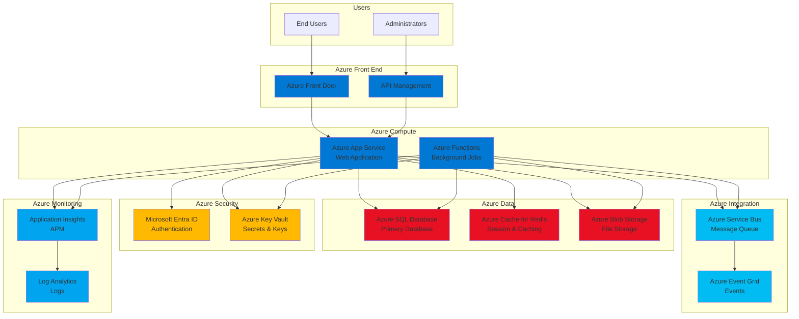

# Azure Service Recommendations - <!-- Solution name from codebase -->

> This document provides Azure-specific service recommendations based on analysis of the current codebase, architecture patterns, technologies, and requirements. All recommendations are grounded in discovered application characteristics and aligned with Azure best practices.

## Table of Contents

- [Executive Summary](#executive-summary)
- [Service Mapping Overview](#service-mapping-overview)
- [Compute Services](#compute-services)
- [Data & Storage Services](#data--storage-services)
- [Messaging & Integration Services](#messaging--integration-services)
- [Security & Identity Services](#security--identity-services)
- [Monitoring & Management Services](#monitoring--management-services)
- [Networking Services](#networking-services)
- [Developer & DevOps Services](#developer--devops-services)
- [Cost Estimation](#cost-estimation)
- [Migration Patterns](#migration-patterns)
- [Architecture Diagrams](#architecture-diagrams)
- [Evidence Sources](#evidence-sources)

---

## Executive Summary

**Assessment Date:** (To be set upon document creation/update)  
**Application Version:** <!-- Version or commit from repository -->

**Primary Recommended Services:**
- **Compute**: `[Azure App Service / Azure Container Apps / Azure Kubernetes Service / Azure Functions]`
- **Database**: `[Azure SQL Database / Azure Cosmos DB / Azure Database for PostgreSQL/MySQL]`
- **Storage**: `[Azure Blob Storage / Azure Files / Azure Data Lake]`
- **Cache**: `[Azure Cache for Redis]`
- **Messaging**: `[Azure Service Bus / Azure Event Grid / Azure Event Hubs]`

**Architecture Pattern**: `[Microservices / Monolith / Serverless / Hybrid]`

**Estimated Monthly Cost**: `$[X,XXX] - $[Y,YYY]` (based on [assumptions])

**Evidence Basis**: Analysis of <!-- number from codebase --> source files, <!-- number from codebase --> configuration files, deployment artifacts, and infrastructure topology

---

## Service Mapping Overview

### Current State to Azure Service Mapping

| Current Component | Current Technology | Recommended Azure Service | Service Tier | Rationale |
|-------------------|-------------------|---------------------------|--------------|-----------|
| **Web Application** | `<!-- ASP.NET / Node.js / Java from codebase -->` | `[Azure App Service / Container Apps]` | `[Standard S1 / Premium P1v3]` | `<!-- Reasoning based on workload characteristics from codebase -->` |
| **API Layer** | `<!-- REST API / GraphQL from codebase -->` | `[Azure App Service / API Management]` | `<!-- Tier from analysis -->` | `<!-- Reasoning from codebase -->` |
| **Background Jobs** | `<!-- Windows Service / Cron from codebase -->` | `[Azure Functions / WebJobs / Container Apps Jobs]` | `<!-- Tier from analysis -->` | `<!-- Reasoning from codebase -->` |
| **Database** | `<!-- SQL Server / MySQL / MongoDB from codebase -->` | `[Azure SQL / Cosmos DB / PostgreSQL]` | `<!-- Tier from analysis -->` | `<!-- Reasoning from codebase -->` |
| **File Storage** | `<!-- Local files / NAS from codebase -->` | `[Azure Blob Storage / Azure Files]` | `<!-- Tier from analysis -->` | `<!-- Reasoning from codebase -->` |
| **Cache** | `<!-- In-memory / Redis from codebase -->` | `[Azure Cache for Redis]` | `[Basic / Standard / Premium]` | `<!-- Reasoning from codebase -->` |
| **Message Queue** | `<!-- RabbitMQ / MSMQ from codebase -->` | `[Azure Service Bus / Storage Queues]` | `<!-- Tier from analysis -->` | `<!-- Reasoning from codebase -->` |
| **Authentication** | `<!-- Forms Auth / JWT from codebase -->` | `[Microsoft Entra ID / Azure AD B2C]` | `<!-- Tier from analysis -->` | `<!-- Reasoning from codebase -->` |
| **Secrets Management** | `<!-- Config files / env vars from codebase -->` | `[Azure Key Vault]` | `[Standard / Premium HSM]` | `<!-- Reasoning from codebase -->` |
| **Monitoring** | `<!-- Application Insights / custom from codebase -->` | `[Application Insights / Log Analytics]` | `<!-- Tier from analysis -->` | `<!-- Reasoning from codebase -->` |

**Evidence**: [Source: Technology inventory, architectural analysis, integration point discovery]

---

## Compute Services

### Recommendation: <!-- Primary Compute Service -->

**Recommended Service**: `[Azure App Service / Azure Container Apps / Azure Kubernetes Service / Azure Functions]`

**Service Tier**: `<!-- Specific SKU recommendation -->`

**Justification**:
`<!-- Provide detailed reasoning based on discovered characteristics from codebase:
- Application architecture (monolith vs microservices)
- Language and framework compatibility
- Scaling requirements (horizontal/vertical)
- Containerization readiness
- State management patterns
- Integration requirements
-->`

**Configuration Recommendations**:

```yaml
# Example Azure App Service configuration
resource_group: <!-- rg-[project-name]-[environment] -->
app_service_plan:
  name: <!-- asp-[project-name]-[environment] -->
  sku: <!-- Based on workload from codebase -->
  tier: <!-- Standard / Premium / Isolated -->
  os: <!-- Windows / Linux based on application -->
  
web_app:
  name: <!-- app-[project-name]-[environment] -->
  runtime: <!-- e.g., .NET 8 / Node 20 / Python 3.11 from codebase -->
  always_on: true # <!-- Based on availability requirements -->
  health_check_path: /health # <!-- Based on discovered endpoints -->
  
autoscale:
  enabled: true
  min_instances: <!-- Based on analysis -->
  max_instances: <!-- Based on analysis -->
  rules:
    - cpu_threshold: 70%
    - memory_threshold: 80%
```

**Migration Complexity**: `[Low / Medium / High]`

**Migration Pattern**: `<!-- Rehost / Replatform / Refactor based on analysis -->`

**Evidence**: `<!-- Cite specific files, patterns, or characteristics from codebase -->`

---

### Alternative Options

#### Option 2: <!-- Alternative Compute Service -->

**Service**: `[Azure Container Apps / AKS]`
**When to Use**: `<!-- Specific scenarios from codebase analysis -->`
**Trade-offs**: `<!-- Benefits vs drawbacks -->`

#### Option 3: <!-- Another Alternative -->

**Service**: `[Azure Functions / Azure Batch]`
**When to Use**: `<!-- Specific scenarios from codebase analysis -->`
**Trade-offs**: `<!-- Benefits vs drawbacks -->`

---

## Data & Storage Services

### Database Recommendations

#### Primary Database: <!-- Recommended Azure Database Service -->

**Recommended Service**: `[Azure SQL Database / Azure Cosmos DB / Azure Database for PostgreSQL/MySQL]`

**Service Tier**: `<!-- General Purpose / Business Critical / Hyperscale -->`

**Sizing Recommendation**:
- **Compute**: `<!-- vCores / DTUs based on workload analysis -->`
- **Storage**: `<!-- GB/TB based on current database size from codebase -->`
- **Backup Retention**: `<!-- Days based on requirements -->`

**Justification**:
`<!-- Based on discovered characteristics:
- Current database technology and version
- Database size and growth patterns
- Transaction volume
- Query patterns (OLTP vs OLAP)
- High availability requirements
- Geo-replication needs
-->`

**Configuration Example**:

```yaml
azure_sql_database:
  server_name: <!-- sql-[project-name]-[environment] -->
  database_name: <!-- sqldb-[project-name] -->
  edition: <!-- GeneralPurpose / BusinessCritical -->
  compute_tier: <!-- Provisioned / Serverless -->
  compute_size: <!-- Based on workload from codebase -->
  max_size_gb: <!-- Based on current size -->
  zone_redundant: <!-- true/false based on requirements -->
  backup_retention_days: 35
  geo_replication: <!-- enabled/disabled based on requirements -->
  
connection_policy:
  connection_mode: <!-- Proxy / Redirect -->
  ssl_enforcement: true
  min_tls_version: 1.2
```

**Migration Approach**:
1. `<!-- Database migration method based on technology -->`
2. `<!-- Data migration strategy -->`
3. `<!-- Cutover approach -->`

**Evidence**: `<!-- Database technology, size, query patterns from codebase -->`

---

### Blob Storage Recommendations

**Recommended Service**: `[Azure Blob Storage]`

**Storage Tier**: `[Hot / Cool / Archive]` - `<!-- Based on access patterns from codebase -->`

**Use Cases Identified**:
- `<!-- File uploads/downloads from codebase -->`
- `<!-- Document management from codebase -->`
- `<!-- Backup storage from codebase -->`
- `<!-- Static content hosting from codebase -->`

**Configuration**:

```yaml
storage_account:
  name: <!-- st[projectname][environment] (lowercase, no hyphens) -->
  account_tier: Standard # or Premium for high IOPS
  replication: <!-- LRS / GRS / RA-GRS based on requirements -->
  access_tier: <!-- Hot / Cool based on access patterns -->
  
  containers:
    - name: <!-- uploads -->
      public_access: <!-- None / Blob / Container based on requirements -->
      
    - name: <!-- documents -->
      public_access: None
      lifecycle_policy:
        - move_to_cool_after_days: 30
        - move_to_archive_after_days: 90
```

**Evidence**: `<!-- File storage patterns, directories, upload handlers from codebase -->`

---

### File Storage Recommendations

**Recommended Service**: `[Azure Files]`

**Use Cases**:
- `<!-- Shared configuration files from codebase -->`
- `<!-- Legacy file share requirements from codebase -->`
- `<!-- SMB protocol requirements from codebase -->`

**Configuration**:

```yaml
file_share:
  name: <!-- fileshare-[purpose] -->
  quota_gb: <!-- Based on current usage from codebase -->
  tier: <!-- TransactionOptimized / Hot / Cool -->
  protocol: <!-- SMB / NFS based on requirements -->
```

**Evidence**: `<!-- File share usage, UNC paths, SMB references from codebase -->`

---

## Messaging & Integration Services

### Message Queue Recommendations

**Recommended Service**: `[Azure Service Bus / Azure Storage Queues]`

**Service Tier**: `[Basic / Standard / Premium]`

**Justification**:
`<!-- Based on discovered characteristics:
- Message patterns (pub/sub, queuing)
- Message size and volume
- Ordering requirements
- Transaction support needs
- Dead-letter queue requirements
-->`

**Configuration**:

```yaml
service_bus_namespace:
  name: <!-- sb-[project-name]-[environment] -->
  sku: <!-- Standard / Premium -->
  capacity: <!-- Message units for Premium -->
  
queues:
  - name: <!-- Based on discovered queue patterns from codebase -->
    max_delivery_count: 10
    lock_duration: 30s
    dead_lettering: true
    
topics:
  - name: <!-- Based on pub/sub patterns from codebase -->
    subscriptions:
      - name: <!-- subscription-name -->
        filters: <!-- Based on message routing from codebase -->
```

**Migration from**: `<!-- Current messaging technology from codebase -->`

**Evidence**: `<!-- Message queue usage, async patterns from codebase -->`

---

### Event-Driven Recommendations

**Recommended Service**: `[Azure Event Grid / Azure Event Hubs]`

**Use Cases**:
- `<!-- Event-driven workflows from codebase -->`
- `<!-- System notifications from codebase -->`
- `<!-- Real-time data streaming from codebase -->`

**Configuration**:

```yaml
event_grid_topic:
  name: <!-- evgt-[project-name] -->
  subscriptions:
    - endpoint_type: <!-- webhook / function / service-bus -->
      filter_pattern: <!-- Based on event types from codebase -->
```

**Evidence**: `<!-- Event handlers, webhooks, notifications from codebase -->`

---

### API Management

**Recommended Service**: `[Azure API Management]`

**When to Use**: `<!-- Based on API governance needs from analysis -->`

**Service Tier**: `[Developer / Basic / Standard / Premium]`

**Features Required**:
- `<!-- Rate limiting based on requirements -->`
- `<!-- API versioning based on patterns from codebase -->`
- `<!-- Authentication/Authorization based on security from codebase -->`
- `<!-- Caching based on performance requirements -->`
- `<!-- Analytics and monitoring -->`

**Configuration**:

```yaml
api_management:
  name: <!-- apim-[project-name] -->
  sku: <!-- Based on requirements -->
  virtual_network: <!-- External / Internal / None -->
  
  apis:
    - name: <!-- Based on discovered APIs from codebase -->
      path: <!-- /api/v1 -->
      protocols: [https]
      policies:
        - rate_limit: <!-- Based on requirements -->
        - caching: <!-- Based on requirements -->
        - jwt_validation: <!-- Based on auth from codebase -->
```

**Evidence**: `<!-- API endpoints, controllers, routes from codebase -->`

---

## Security & Identity Services

### Identity & Access Management

**Recommended Service**: `[Microsoft Entra ID (Azure AD) / Azure AD B2C]`

**Use Case**: `<!-- Based on authentication patterns from codebase -->`

**Configuration**:

```yaml
entra_id:
  tenant_id: <!-- Organization tenant -->
  app_registrations:
    - name: <!-- Based on application from codebase -->
      redirect_uris: <!-- Based on auth flow from codebase -->
      api_permissions: <!-- Based on requirements -->
      
  authentication_flows:
    - type: <!-- OAuth 2.0 / OpenID Connect based on current auth -->
    - grant_type: <!-- authorization_code / client_credentials -->
```

**Migration from**: `<!-- Current auth mechanism from codebase -->`

**Evidence**: `<!-- Authentication code, login flows from codebase -->`

---

### Secrets & Key Management

**Recommended Service**: `[Azure Key Vault]`

**Service Tier**: `[Standard / Premium with HSM]`

**Use Cases**:
- `<!-- Database connection strings from codebase -->`
- `<!-- API keys and secrets from codebase -->`
- `<!-- Certificates from codebase -->`
- `<!-- Encryption keys from codebase -->`

**Configuration**:

```yaml
key_vault:
  name: <!-- kv-[project-name]-[environment] -->
  sku: <!-- standard / premium -->
  enabled_for_deployment: true
  enabled_for_disk_encryption: false
  
  access_policies:
    - principal: <!-- Managed Identity / Service Principal -->
      secret_permissions: [Get, List]
      
  secrets:
    - name: <!-- Based on discovered secrets from codebase -->
    - name: <!-- SQL-Connection-String -->
    - name: <!-- API-Key -->
```

**Migration Approach**: `<!-- How to migrate secrets from current storage -->`

**Evidence**: `<!-- Configuration files, secret storage patterns from codebase -->`

---

## Monitoring & Management Services

### Application Monitoring

**Recommended Service**: `[Azure Application Insights]`

**Features to Enable**:
- Application performance monitoring (APM)
- Distributed tracing
- Custom metrics and events
- Availability tests
- Smart detection and alerts

**Configuration**:

```yaml
application_insights:
  name: <!-- appi-[project-name]-[environment] -->
  workspace_id: <!-- Link to Log Analytics workspace -->
  
  instrumentation:
    auto_instrumentation: <!-- true for supported runtimes -->
    connection_string: <!-- From Key Vault -->
    
  monitoring:
    - performance_counters: true
    - dependencies: true
    - exceptions: true
    - custom_events: <!-- Based on business metrics from codebase -->
    
  alerts:
    - response_time_threshold: <!-- Based on SLA from requirements -->
    - error_rate_threshold: <!-- Based on SLA -->
    - availability_threshold: 99.9%
```

**Evidence**: `<!-- Current monitoring, logging patterns from codebase -->`

---

### Logging & Analytics

**Recommended Service**: `[Azure Log Analytics]`

**Configuration**:

```yaml
log_analytics_workspace:
  name: <!-- log-[project-name]-[environment] -->
  retention_days: <!-- Based on compliance requirements -->
  
  data_sources:
    - application_logs: <!-- From App Service / Container Apps -->
    - platform_logs: <!-- Azure resource logs -->
    - custom_logs: <!-- Based on application logging from codebase -->
    
  queries:
    - name: <!-- Error-Analysis -->
      query: <!-- KQL query based on log patterns -->
    - name: <!-- Performance-Metrics -->
      query: <!-- KQL query -->
```

**Evidence**: `<!-- Logging patterns, log levels from codebase -->`

---

## Networking Services

### Network Architecture

**Recommended Services**:
- `[Azure Virtual Network]` - `<!-- If required based on isolation requirements -->`
- `[Azure Application Gateway]` - `<!-- If WAF or advanced routing needed -->`
- `[Azure Front Door]` - `<!-- If global distribution needed -->`
- `[Azure Private Link]` - `<!-- For secure service access -->`

**Configuration**:

```yaml
virtual_network:
  name: <!-- vnet-[project-name]-[environment] -->
  address_space: <!-- 10.0.0.0/16 -->
  
  subnets:
    - name: <!-- subnet-web -->
      address_prefix: <!-- 10.0.1.0/24 -->
      
    - name: <!-- subnet-data -->
      address_prefix: <!-- 10.0.2.0/24 -->
      service_endpoints: [Microsoft.Sql]
      
    - name: <!-- subnet-integration -->
      address_prefix: <!-- 10.0.3.0/24 -->
      delegation: <!-- Microsoft.Web/serverFarms for VNet integration -->

network_security_groups:
  - name: <!-- nsg-web -->
    rules:
      - allow_https_inbound: <!-- Rule based on requirements -->
      - deny_all_inbound: <!-- Rule -->
```

**When Required**: `<!-- Based on security/compliance requirements from analysis -->`

**Evidence**: `<!-- Network architecture, isolation requirements from codebase -->`

---

## Developer & DevOps Services

### CI/CD Recommendations

**Recommended Service**: `[Azure DevOps / GitHub Actions]`

**Pipeline Configuration**:

```yaml
# Azure DevOps Pipeline Example
trigger:
  branches:
    include:
      - main
      - develop

stages:
  - stage: Build
    jobs:
      - job: BuildApp
        pool:
          vmImage: <!-- Based on platform from codebase -->
        steps:
          - task: <!-- Build task based on technology from codebase -->
          - task: <!-- Test task -->
          - task: <!-- Publish artifacts -->
          
  - stage: Deploy_Dev
    dependsOn: Build
    jobs:
      - deployment: DeployToDev
        environment: <!-- dev -->
        strategy:
          runOnce:
            deploy:
              steps:
                - task: <!-- AzureWebApp / AzureContainerApps deployment -->
```

**Evidence**: `<!-- Current build process, scripts from codebase -->`

---

### Container Registry

**Recommended Service**: `[Azure Container Registry]`

**When Required**: `<!-- If containerization identified from analysis -->`

**Configuration**:

```yaml
container_registry:
  name: <!-- acr[projectname][environment] -->
  sku: <!-- Basic / Standard / Premium -->
  admin_enabled: false
  
  geo_replication: <!-- If multi-region deployment -->
    - location: <!-- eastus2 -->
    - location: <!-- westus2 -->
```

**Evidence**: `<!-- Dockerfiles, container orchestration from codebase -->`

---

## Cost Estimation

> **⚠️ CRITICAL - Evidence-Based Estimates Only**:
> - **DO NOT** provide cost estimates unless they can be **immediately derived** from actual usage data, resource requirements, and transaction volumes discovered in the codebase
> - **MUST** document all assumptions with specific evidence from code analysis (e.g., "based on 50,000 requests/month found in logs", "database size of 500GB from current metrics")
> - **MUST** include calculation methodology showing how estimates were derived
> - **If data is unavailable**: Clearly explain WHY estimation cannot be provided and WHAT specific data is needed
>   - Example: "Cost estimation not possible because: (1) No production logs available to determine request volume, (2) Database size metrics not accessible from static code analysis, (3) Peak load patterns require runtime monitoring. Required data: 30-day application logs, database size query results, CloudWatch/monitoring metrics."
> - **ACCEPTABLE**: Linking to Azure pricing calculator with specific configurations identified from codebase
> - **NOT ACCEPTABLE**: Placeholder amounts, ranges without justification, estimates based on assumptions rather than evidence, vague statements like "data not available" without explanation

### Monthly Cost Breakdown (Evidence-Based)

**Prerequisites for Cost Estimation**:
- Actual workload characteristics (requests/second, peak load) from monitoring data
- Current resource utilization metrics (CPU, memory, storage)
- Transaction volumes from application logs or database statistics
- Data retention and storage growth patterns from historical analysis
- Regional deployment requirements from business/compliance requirements

**Evidence-Based Assumptions** (document all):
- `<!-- Workload: X requests/second (derived from: application logs showing Y requests/day) -->`
- `<!-- Peak load: Z concurrent users (derived from: current monitoring showing N users) -->`
- `<!-- Data volume: A GB current + B GB/month growth (derived from: database size trend analysis) -->`
- `<!-- Region: East US 2 (derived from: compliance requirements/current deployment location) -->`

| Service | Configuration | Evidence-Based Monthly Cost | Calculation Method |
|---------|---------------|------------------------------|-------------------|
| **Azure App Service** | `<!-- Plan tier and instances -->` | `<!-- $XXX if calculable -->` | `<!-- Show: tier × instances × hours × rate -->` |
| **Azure SQL Database** | `<!-- vCores/DTUs and storage -->` | `<!-- $XXX if calculable -->` | `<!-- Show: vCores × rate + storage GB × rate -->` |
| **Azure Blob Storage** | `<!-- GB and transactions -->` | `<!-- $XX if calculable -->` | `<!-- Show: GB × storage rate + transactions × operation rate -->` |
| **Azure Cache for Redis** | `<!-- Cache tier and size -->` | `<!-- $XX if calculable -->` | `<!-- Show: tier × cache size × hours × rate -->` |
| **Azure Service Bus** | `<!-- Standard/Premium tier -->` | `<!-- $XX if calculable -->` | `<!-- Show: tier rate + messaging operations × operation rate -->` |
| **Application Insights** | `<!-- Data ingestion GB/month -->` | `<!-- $XX if calculable -->` | `<!-- Show: GB ingested × ingestion rate -->` |
| **Azure Key Vault** | `<!-- Operations/month -->` | `<!-- $XX if calculable -->` | `<!-- Show: operations × operation rate -->` |
| **Networking** | `<!-- Data transfer GB/month -->` | `<!-- $XX if calculable -->` | `<!-- Show: GB transferred × transfer rate -->` |
| **Total** | | `<!-- $X,XXX (if all above calculable) -->` | `<!-- Sum of all services -->` |

**Cost Optimization Opportunities** (evidence-based):
1. `<!-- Azure Reservations for predictable workloads (if usage patterns show consistent baseline) -->`
2. `<!-- Autoscaling configuration (if load patterns show peaks/valleys - cite specific patterns) -->`
3. `<!-- Storage tiering (if data access patterns show infrequently accessed data - cite %) -->`
4. `<!-- Right-sizing resources (if current metrics show over/under-provisioning - cite utilization %) -->`

**Evidence Sources**: 
- `<!-- Link to actual monitoring dashboards, log analytics queries, database statistics -->`
- `<!-- Reference specific files: application logs, performance metrics, database size queries -->`

---

## Migration Patterns

### Recommended Migration Strategy

> **⚠️ CRITICAL - Timeline Estimates Require Evidence**:
> - **DO NOT** specify phase durations (weeks, months) unless based on actual project scope, team capacity, and complexity analysis
> - Phase labels below (e.g., "Week X-Y") are **examples only** and must be replaced with evidence-based timelines
> - **MUST** document: team size, skill levels, parallel vs sequential work, dependencies, risk factors
> - **If timeline cannot be estimated**: Clearly explain WHY and WHAT data is needed
>   - Example: "Timeline estimation not possible because: (1) Team composition and availability not determined, (2) Azure expertise level unknown, (3) Task complexity requires detailed breakdown. Required: team roster with skill assessment, detailed task list with complexity ratings, dependency mapping."
> - **ACCEPTABLE**: Logical sequencing and dependencies between phases without time estimates
> - **NOT ACCEPTABLE**: Generic week/month ranges without specific justification, vague statements like "timeline TBD" without explaining what's needed

**Primary Pattern**: `[Rehost / Replatform / Refactor]`

**Phased Approach** (logical sequence - replace with evidence-based timelines if available):

**Phase 1: Foundation** `<!-- Duration: Based on infrastructure complexity and team capacity -->`
- Set up Azure subscriptions and resource groups
- Configure networking (if required)
- Provision Azure Key Vault and migrate secrets
- Set up Application Insights and Log Analytics
- **Dependencies**: Azure subscription approval, network design completion
- **Success Criteria**: Infrastructure provisioned and tested

**Phase 2: Data Migration** `<!-- Duration: Based on database size, validation requirements, team capacity -->`
- Migrate database to Azure SQL Database
- Set up replication and validation
- Migrate file storage to Azure Blob Storage
- Validate data integrity
- **Dependencies**: Phase 1 complete, database schema compatibility verified
- **Success Criteria**: Data migrated, validated, performance benchmarked

**Phase 3: Application Migration** `<!-- Duration: Based on application complexity, integration points, testing needs -->`
- Deploy application to Azure App Service (or chosen compute)
- Configure authentication with Entra ID
- Set up caching with Azure Cache for Redis
- Validate functionality
- **Dependencies**: Phase 2 complete, application compatibility testing done
- **Success Criteria**: Application functional in Azure, integration tests passing

**Phase 4: Integration** `<!-- Duration: Based on number of integrations, external dependencies -->`
- Migrate message queues to Azure Service Bus
- Set up event-driven workflows
- Configure API Management
- Validate integrations
- **Dependencies**: Phase 3 complete, external system access configured
- **Success Criteria**: All integrations functional, end-to-end testing complete

**Phase 5: Optimization** `<!-- Duration: Based on performance requirements, optimization scope -->`
- Enable autoscaling
- Configure CDN (if applicable)
- Implement performance optimizations
- Cost optimization review
- **Dependencies**: Phase 4 complete, baseline performance metrics captured
- **Success Criteria**: Performance targets met, cost optimization opportunities identified

**Evidence**: `<!-- Application architecture, dependencies, team capacity from project analysis -->`

---

### Azure-Specific Best Practices

1. **Use Managed Identities**
   - Eliminate credential management
   - Secure service-to-service authentication
   - `<!-- Based on security requirements from analysis -->`

2. **Implement Infrastructure as Code**
   - Azure Bicep or Terraform templates
   - Version control infrastructure
   - Repeatable deployments

3. **Enable Diagnostic Logging**
   - All resources send logs to Log Analytics
   - Centralized monitoring and alerting
   - Compliance audit trails

4. **Apply Resource Tagging**
   ```yaml
   tags:
     environment: <!-- dev/staging/prod -->
     project: <!-- project-name -->
     cost-center: <!-- based on requirements -->
     managed-by: <!-- terraform/bicep/manual -->
   ```

5. **Implement Well-Architected Framework**
   - Cost optimization
   - Operational excellence
   - Performance efficiency
   - Reliability
   - Security

**Evidence**: `<!-- Current practices, gaps identified from analysis -->`

---

## Architecture Diagrams

### Proposed Azure Architecture



**Diagram Notes**:
- `<!-- Customize based on discovered architecture from codebase -->`
- `<!-- Add/remove services based on recommendations -->`
- `<!-- Show data flow and dependencies -->`

---

## Evidence Sources

### Analysis Inputs

**Codebase Analysis**:
- Source code repository: `<!-- Repository URL or path -->`
- Commit/Version: `<!-- Commit hash or version -->`
- Files analyzed: `<!-- Count and types -->`

**Configuration Analysis**:
- Configuration files: `<!-- List key config files from codebase -->`
- Deployment scripts: `<!-- List deployment artifacts from codebase -->`
- Infrastructure documentation: `<!-- List docs from codebase -->`

**Architecture Analysis**:
- Integration points: `<!-- Count and types from analysis -->`
- API endpoints: `<!-- Count from discovery -->`
- Database schemas: `<!-- Databases analyzed from codebase -->`

### Recommendation Methodology

All recommendations follow this process:
1. **Discovery**: Analyze codebase for technologies, patterns, and requirements
2. **Mapping**: Map discovered elements to Azure service capabilities
3. **Evaluation**: Assess service tiers and configurations based on workload
4. **Validation**: Cross-check recommendations against Azure best practices
5. **Documentation**: Document evidence and rationale for each recommendation

---

## Appendices

### Appendix A: Azure Naming Conventions

Follow Azure naming best practices:
- Resource Group: `rg-[project]-[environment]`
- App Service: `app-[project]-[environment]`
- SQL Server: `sql-[project]-[environment]`
- Storage Account: `st[project][environment]` (lowercase, no hyphens)
- Key Vault: `kv-[project]-[environment]`

### Appendix B: Azure Well-Architected Framework Alignment

`<!-- Document how recommendations align with each pillar -->`

### Appendix C: Azure Service Limits and Quotas

`<!-- Document relevant service limits to be aware of -->`

### Appendix D: Migration Checklist

`<!-- Detailed pre-migration, during-migration, and post-migration checklist -->`

---

**Document Generation Notes**: All `<!-- -->` placeholders must be replaced with actual evidence from codebase analysis. All recommendations must be grounded in discovered application characteristics, not assumptions.
