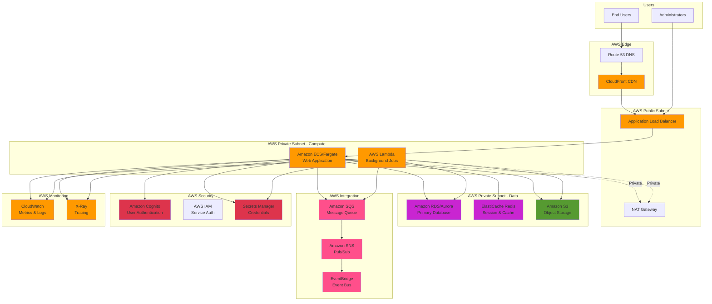

# AWS Service Recommendations - <!-- Solution name from codebase -->

> This document provides AWS-specific service recommendations based on analysis of the current codebase, architecture patterns, technologies, and requirements. All recommendations are grounded in discovered application characteristics and aligned with AWS Well-Architected Framework principles.

## Table of Contents

- [Executive Summary](#executive-summary)
- [Service Mapping Overview](#service-mapping-overview)
- [Compute Services](#compute-services)
- [Data & Storage Services](#data--storage-services)
- [Messaging & Integration Services](#messaging--integration-services)
- [Security & Identity Services](#security--identity-services)
- [Monitoring & Management Services](#monitoring--management-services)
- [Networking Services](#networking-services)
- [Developer & DevOps Services](#developer--devops-services)
- [Cost Estimation](#cost-estimation)
- [Migration Patterns](#migration-patterns)
- [Architecture Diagrams](#architecture-diagrams)
- [Evidence Sources](#evidence-sources)

---

## Executive Summary

**Assessment Date:** (To be set upon document creation/update)  
**Application Version:** <!-- Version or commit from repository -->

**Primary Recommended Services:**
- **Compute**: `[Amazon EC2 / AWS Elastic Beanstalk / Amazon ECS / Amazon EKS / AWS Lambda]`
- **Database**: `[Amazon RDS / Amazon Aurora / Amazon DynamoDB / Amazon DocumentDB]`
- **Storage**: `[Amazon S3 / Amazon EFS / Amazon FSx]`
- **Cache**: `[Amazon ElastiCache for Redis / Memcached]`
- **Messaging**: `[Amazon SQS / Amazon SNS / Amazon EventBridge / Amazon MQ]`

**Architecture Pattern**: `[Microservices / Monolith / Serverless / Hybrid]`

**Estimated Monthly Cost**: `$[X,XXX] - $[Y,YYY]` (based on [assumptions])

**Evidence Basis**: Analysis of <!-- number from codebase --> source files, <!-- number from codebase --> configuration files, deployment artifacts, and infrastructure topology

---

## Service Mapping Overview

### Current State to AWS Service Mapping

| Current Component | Current Technology | Recommended AWS Service | Service Tier | Rationale |
|-------------------|-------------------|------------------------|--------------|-----------|
| **Web Application** | `<!-- ASP.NET / Node.js / Java from codebase -->` | `[Elastic Beanstalk / ECS / EKS]` | `[Standard / HA Multi-AZ]` | `<!-- Reasoning based on workload characteristics from codebase -->` |
| **API Layer** | `<!-- REST API / GraphQL from codebase -->` | `[API Gateway / Application Load Balancer]` | `<!-- Tier from analysis -->` | `<!-- Reasoning from codebase -->` |
| **Background Jobs** | `<!-- Windows Service / Cron from codebase -->` | `[AWS Lambda / ECS Tasks / Batch]` | `<!-- Tier from analysis -->` | `<!-- Reasoning from codebase -->` |
| **Database** | `<!-- SQL Server / MySQL / MongoDB from codebase -->` | `[RDS / Aurora / DynamoDB / DocumentDB]` | `<!-- Instance type from analysis -->` | `<!-- Reasoning from codebase -->` |
| **File Storage** | `<!-- Local files / NAS from codebase -->` | `[Amazon S3 / EFS / FSx]` | `<!-- Storage class from analysis -->` | `<!-- Reasoning from codebase -->` |
| **Cache** | `<!-- In-memory / Redis from codebase -->` | `[ElastiCache for Redis]` | `[cache.t3.medium / cache.r6g.large]` | `<!-- Reasoning from codebase -->` |
| **Message Queue** | `<!-- RabbitMQ / MSMQ from codebase -->` | `[Amazon SQS / Amazon MQ]` | `<!-- Standard / FIFO from analysis -->` | `<!-- Reasoning from codebase -->` |
| **Authentication** | `<!-- Forms Auth / JWT from codebase -->` | `[Amazon Cognito / IAM]` | `<!-- User pool type from analysis -->` | `<!-- Reasoning from codebase -->` |
| **Secrets Management** | `<!-- Config files / env vars from codebase -->` | `[AWS Secrets Manager / Systems Manager Parameter Store]` | `<!-- Standard from analysis -->` | `<!-- Reasoning from codebase -->` |
| **Monitoring** | `<!-- Application monitoring from codebase -->` | `[CloudWatch / X-Ray]` | `<!-- Standard from analysis -->` | `<!-- Reasoning from codebase -->` |

**Evidence**: [Source: Technology inventory, architectural analysis, integration point discovery]

---

## Compute Services

### Recommendation: <!-- Primary Compute Service -->

**Recommended Service**: `[AWS Elastic Beanstalk / Amazon ECS / Amazon EKS / AWS Lambda]`

**Instance Type/Configuration**: `<!-- Specific instance or configuration recommendation -->`

**Justification**:
`<!-- Provide detailed reasoning based on discovered characteristics from codebase:
- Application architecture (monolith vs microservices)
- Language and framework compatibility
- Scaling requirements (horizontal/vertical)
- Containerization readiness
- State management patterns
- Integration requirements
-->`

**Configuration Recommendations**:

```yaml
# Example AWS Elastic Beanstalk configuration
application:
  name: <!-- [project-name]-app -->
  
environment:
  name: <!-- [project-name]-[environment] -->
  platform: <!-- e.g., .NET on Windows / Node.js / Python from codebase -->
  instance_type: <!-- t3.medium / t3.large based on workload -->
  
  autoscaling:
    min_instances: <!-- Based on analysis -->
    max_instances: <!-- Based on analysis -->
    scaling_trigger: <!-- CPU / Network / Request Count -->
    
  load_balancer:
    type: application # ALB for HTTP/HTTPS
    health_check_path: /health # <!-- Based on discovered endpoints -->
    
  environment_properties:
    # <!-- Application settings from analysis -->
    ASPNETCORE_ENVIRONMENT: <!-- Production -->
    # Secrets from Secrets Manager
```

**Alternative: Amazon ECS Configuration**

```yaml
# ECS Fargate Example
cluster:
  name: <!-- [project-name]-cluster -->
  
service:
  name: <!-- [project-name]-service -->
  launch_type: FARGATE # or EC2 for more control
  
  task_definition:
    family: <!-- [project-name]-task -->
    cpu: <!-- 256 / 512 / 1024 / 2048 based on workload -->
    memory: <!-- 512 / 1024 / 2048 / 4096 MB -->
    
    containers:
      - name: <!-- app-container -->
        image: <!-- ECR image URL -->
        port_mappings:
          - container_port: <!-- Based on application from codebase -->
        
        environment:
          # <!-- From Parameter Store / Secrets Manager -->
          
  autoscaling:
    min_tasks: <!-- Based on analysis -->
    max_tasks: <!-- Based on analysis -->
    target_cpu_utilization: 70%
```

**Migration Complexity**: `[Low / Medium / High]`

**Migration Pattern**: `<!-- Rehost / Replatform / Refactor based on analysis -->`

**Evidence**: `<!-- Cite specific files, patterns, or characteristics from codebase -->`

---

### Alternative Options

#### Option 2: Amazon EKS (Kubernetes)

**Service**: `[Amazon EKS]`
**When to Use**: `<!-- If container orchestration or Kubernetes expertise exists -->`
**Trade-offs**: 
- Benefits: `<!-- Full Kubernetes compatibility, portability -->`
- Drawbacks: `<!-- Increased complexity, higher operational overhead -->`

#### Option 3: AWS Lambda (Serverless)

**Service**: `[AWS Lambda]`
**When to Use**: `<!-- Event-driven workloads, variable traffic patterns -->`
**Trade-offs**:
- Benefits: `<!-- No server management, pay per use -->`
- Drawbacks: `<!-- Cold starts, execution time limits, state management -->`

---

## Data & Storage Services

### Database Recommendations

#### Primary Database: <!-- Recommended AWS Database Service -->

**Recommended Service**: `[Amazon RDS / Amazon Aurora / Amazon DynamoDB]`

**Instance Type**: `<!-- db.t3.medium / db.r5.large / db.m5.xlarge -->`

**Sizing Recommendation**:
- **Instance Class**: `<!-- Based on workload analysis -->`
- **Storage**: `<!-- GB/TB based on current database size from codebase -->`
- **Storage Type**: `[gp3 / io1 / io2]` - `<!-- Based on IOPS requirements -->`
- **Backup Retention**: `<!-- Days based on requirements -->`

**Justification**:
`<!-- Based on discovered characteristics:
- Current database technology and version
- Database size and growth patterns
- Transaction volume (read/write ratio)
- Query patterns (OLTP vs OLAP)
- High availability requirements
- Multi-region needs
-->`

**Configuration Example**:

```yaml
rds_instance:
  identifier: <!-- [project-name]-[environment]-db -->
  engine: <!-- postgres / mysql / sqlserver from codebase -->
  engine_version: <!-- Latest compatible version -->
  instance_class: <!-- db.t3.large -->
  allocated_storage: <!-- GB based on current size -->
  storage_type: gp3 # General Purpose SSD
  iops: <!-- Provisioned IOPS if needed -->
  
  multi_az: true # <!-- For production environments -->
  backup_retention_period: 35 # days
  backup_window: "03:00-04:00" # UTC
  maintenance_window: "sun:04:00-sun:05:00" # UTC
  
  deletion_protection: true
  storage_encrypted: true
  kms_key_id: <!-- Customer managed key -->
  
  parameter_group: <!-- Custom parameters based on workload -->
  option_group: <!-- Database-specific options -->
```

**Alternative: Amazon Aurora Configuration**

```yaml
aurora_cluster:
  cluster_identifier: <!-- [project-name]-[environment]-aurora -->
  engine: <!-- aurora-postgresql / aurora-mysql -->
  engine_mode: provisioned # or serverless for variable workloads
  
  instances:
    - instance_class: <!-- db.r6g.large -->
      count: 2 # Primary + Replica
      
  storage:
    encrypted: true
    auto_scaling: true
    min_capacity: <!-- Based on analysis -->
    max_capacity: <!-- Based on analysis -->
    
  backup_retention_period: 35
  global_cluster: <!-- true for multi-region -->
```

**Migration Approach**:
1. **Database Migration Service (DMS)**
   - Schema conversion (if needed with SCT)
   - Continuous replication during migration
   - Minimal downtime cutover
   
2. **Native Tools**
   - `<!-- Database-specific migration tools from current platform -->`

**Evidence**: `<!-- Database technology, size, query patterns from codebase -->`

---

### Object Storage Recommendations

**Recommended Service**: `[Amazon S3]`

**Storage Class**: `[S3 Standard / S3 Intelligent-Tiering / S3 Glacier]` - `<!-- Based on access patterns from codebase -->`

**Use Cases Identified**:
- `<!-- File uploads/downloads from codebase -->`
- `<!-- Document management from codebase -->`
- `<!-- Backup storage from codebase -->`
- `<!-- Static content hosting from codebase -->`

**Configuration**:

```yaml
s3_bucket:
  name: <!-- [project-name]-[purpose]-[account-id] -->
  region: <!-- us-east-1 or closest region -->
  
  versioning: enabled
  encryption:
    type: AES256 # or aws:kms for customer-managed keys
    
  lifecycle_policies:
    - id: transition-to-ia
      transitions:
        - days: 30
          storage_class: STANDARD_IA
        - days: 90
          storage_class: GLACIER
          
  public_access_block:
    block_public_acls: true
    block_public_policy: true
    ignore_public_acls: true
    restrict_public_buckets: true
    
  cors_configuration: # <!-- If web access needed from codebase -->
    - allowed_origins: ["https://example.com"]
      allowed_methods: [GET, PUT, POST]
      allowed_headers: ["*"]
```

**Evidence**: `<!-- File storage patterns, directories, upload handlers from codebase -->`

---

### File Storage Recommendations

**Recommended Service**: `[Amazon EFS / Amazon FSx]`

**Use Cases**:
- **EFS**: `<!-- Shared POSIX file system for Linux workloads from codebase -->`
- **FSx for Windows**: `<!-- Windows file shares, SMB protocol from codebase -->`
- **FSx for Lustre**: `<!-- High-performance computing workloads from codebase -->`

**Configuration**:

```yaml
# Amazon EFS Example
efs_file_system:
  name: <!-- [project-name]-efs -->
  performance_mode: <!-- generalPurpose / maxIO based on workload -->
  throughput_mode: <!-- bursting / provisioned based on requirements -->
  
  encryption: true
  kms_key_id: <!-- Customer managed key -->
  
  lifecycle_policy:
    transition_to_ia: AFTER_30_DAYS
    
# Amazon FSx for Windows Example
fsx_windows:
  name: <!-- [project-name]-fsx -->
  storage_capacity: <!-- GB based on current usage -->
  throughput_capacity: <!-- MB/s based on workload -->
  deployment_type: MULTI_AZ_1 # For HA
  
  active_directory_id: <!-- AWS Managed AD or self-managed -->
  backup_retention_days: 35
```

**Evidence**: `<!-- File share usage, SMB references, shared directories from codebase -->`

---

## Messaging & Integration Services

### Message Queue Recommendations

**Recommended Service**: `[Amazon SQS / Amazon MQ]`

**Queue Type**: `[Standard / FIFO]`

**Justification**:
`<!-- Based on discovered characteristics:
- Message patterns (queuing, pub/sub)
- Message size and volume
- Ordering requirements (FIFO vs Standard)
- Message retention needs
- Dead-letter queue requirements
-->`

**Configuration**:

```yaml
# Amazon SQS Configuration
sqs_queue:
  name: <!-- [project-name]-[queue-purpose] -->
  queue_type: <!-- Standard / FIFO based on ordering requirements -->
  
  message_retention_period: 345600 # 4 days (max 14 days)
  visibility_timeout: 30 # seconds
  receive_wait_time: 20 # Long polling
  
  dead_letter_queue:
    max_receive_count: 3
    target_arn: <!-- DLQ ARN -->
    
  encryption:
    kms_master_key_id: <!-- Customer managed key -->
    
  tags:
    environment: <!-- dev/staging/prod -->
```

**Alternative: Amazon MQ (for RabbitMQ/ActiveMQ compatibility)**

```yaml
amazon_mq:
  broker_name: <!-- [project-name]-mq -->
  engine_type: <!-- RabbitMQ / ActiveMQ based on current system -->
  engine_version: <!-- Latest compatible version -->
  
  deployment_mode: <!-- ACTIVE_STANDBY_MULTI_AZ / CLUSTER_MULTI_AZ -->
  instance_type: <!-- mq.t3.micro / mq.m5.large -->
  
  users:
    - username: <!-- admin -->
      groups: [admins]
```

**Migration from**: `<!-- Current messaging technology from codebase -->`

**Evidence**: `<!-- Message queue usage, async patterns from codebase -->`

---

### Pub/Sub & Event-Driven Recommendations

**Recommended Service**: `[Amazon SNS / Amazon EventBridge]`

**Use Cases**:
- **SNS**: `<!-- Fan-out messaging, mobile notifications from codebase -->`
- **EventBridge**: `<!-- Event-driven architectures, application events from codebase -->`

**Configuration**:

```yaml
# Amazon SNS Topic
sns_topic:
  name: <!-- [project-name]-[topic-name] -->
  display_name: <!-- Human-readable name -->
  
  encryption:
    kms_master_key_id: <!-- Customer managed key -->
    
  subscriptions:
    - protocol: sqs
      endpoint: <!-- SQS queue ARN -->
      filter_policy: <!-- Message filtering based on attributes -->
      
    - protocol: lambda
      endpoint: <!-- Lambda function ARN -->

# Amazon EventBridge
eventbridge_bus:
  name: <!-- [project-name]-event-bus -->
  
  rules:
    - name: <!-- [event-type]-rule -->
      event_pattern: <!-- Based on event structure from codebase -->
      targets:
        - lambda_function_arn: <!-- Handler function -->
        - sqs_queue_arn: <!-- Queue target -->
```

**Evidence**: `<!-- Event handlers, webhooks, notifications from codebase -->`

---

### API Gateway

**Recommended Service**: `[Amazon API Gateway]`

**API Type**: `[REST API / HTTP API / WebSocket API]`

**When to Use**: `<!-- Based on API requirements from analysis -->`

**Configuration**:

```yaml
api_gateway:
  name: <!-- [project-name]-api -->
  protocol_type: <!-- HTTP / REST based on requirements -->
  
  stages:
    - name: <!-- prod -->
      throttling:
        rate_limit: <!-- Based on requirements -->
        burst_limit: <!-- Based on requirements -->
        
  authorizers:
    - type: <!-- JWT / Lambda / IAM based on auth from codebase -->
      
  integrations:
    - type: <!-- HTTP / Lambda / ECS based on backend -->
      uri: <!-- Backend service URI -->
      
  features:
    - request_validation: true
    - caching: <!-- Based on performance requirements -->
    - api_keys: <!-- If API key management needed -->
    - usage_plans: <!-- For rate limiting per client -->
```

**Evidence**: `<!-- API endpoints, controllers, routes from codebase -->`

---

## Security & Identity Services

### Identity & Access Management

**Recommended Service**: `[Amazon Cognito / AWS IAM / AWS IAM Identity Center]`

**Use Case**: 
- **Cognito**: `<!-- User authentication for web/mobile apps from codebase -->`
- **IAM**: `<!-- Service-to-service authentication -->`
- **IAM Identity Center**: `<!-- Enterprise SSO requirements -->`

**Configuration**:

```yaml
# Amazon Cognito User Pool
cognito_user_pool:
  name: <!-- [project-name]-users -->
  
  username_attributes: [email]
  auto_verified_attributes: [email]
  
  password_policy:
    minimum_length: 12
    require_uppercase: true
    require_lowercase: true
    require_numbers: true
    require_symbols: true
    
  mfa_configuration: OPTIONAL # or REQUIRED
  
  email_configuration:
    source_arn: <!-- SES identity ARN -->
    
  app_clients:
    - name: <!-- web-client -->
      auth_flows:
        - ALLOW_USER_PASSWORD_AUTH
        - ALLOW_REFRESH_TOKEN_AUTH
        - ALLOW_USER_SRP_AUTH
```

**Migration from**: `<!-- Current auth mechanism from codebase -->`

**Evidence**: `<!-- Authentication code, login flows from codebase -->`

---

### Secrets & Key Management

**Recommended Service**: `[AWS Secrets Manager / Systems Manager Parameter Store]`

**Service Choice**:
- **Secrets Manager**: `<!-- Automatic rotation, database credentials from codebase -->`
- **Parameter Store**: `<!-- Configuration values, non-rotated secrets -->`

**Use Cases**:
- `<!-- Database connection strings from codebase -->`
- `<!-- API keys and secrets from codebase -->`
- `<!-- Certificates from codebase -->`
- `<!-- Application configuration from codebase -->`

**Configuration**:

```yaml
# AWS Secrets Manager
secrets:
  - name: <!-- [project-name]/[environment]/db-credentials -->
    description: <!-- Database connection credentials -->
    kms_key_id: <!-- Customer managed key -->
    rotation:
      enabled: true
      rotation_lambda_arn: <!-- Auto-rotation function -->
      rotation_rules:
        automatically_after_days: 30
        
  - name: <!-- [project-name]/[environment]/api-keys -->
    kms_key_id: <!-- Customer managed key -->

# Systems Manager Parameter Store
parameters:
  - name: <!-- /[project-name]/[environment]/config/api-url -->
    type: String
    tier: Standard
    
  - name: <!-- /[project-name]/[environment]/config/feature-flags -->
    type: StringList
    tier: Standard
```

**Migration Approach**: `<!-- How to migrate secrets from current storage -->`

**Evidence**: `<!-- Configuration files, secret storage patterns from codebase -->`

---

### Encryption & Key Management

**Recommended Service**: `[AWS KMS]`

**Configuration**:

```yaml
kms_keys:
  - alias: <!-- alias/[project-name]-[environment] -->
    description: <!-- Application encryption key -->
    key_spec: SYMMETRIC_DEFAULT
    key_usage: ENCRYPT_DECRYPT
    
    key_policy:
      - principals: <!-- Service roles that can use key -->
        actions:
          - kms:Decrypt
          - kms:Encrypt
          - kms:GenerateDataKey
          
    rotation: enabled # Automatic annual rotation
```

**Evidence**: `<!-- Encryption requirements, compliance needs from analysis -->`

---

## Monitoring & Management Services

### Application Monitoring

**Recommended Service**: `[Amazon CloudWatch / AWS X-Ray]`

**Features to Enable**:
- CloudWatch Logs for application logging
- CloudWatch Metrics for custom metrics
- CloudWatch Alarms for proactive alerting
- X-Ray for distributed tracing

**Configuration**:

```yaml
# CloudWatch Logs
log_groups:
  - name: <!-- /aws/[service]/[project-name] -->
    retention_days: <!-- 30 / 90 / 365 based on requirements -->
    kms_key_id: <!-- Customer managed key for encryption -->
    
# CloudWatch Metrics
custom_metrics:
  namespace: <!-- [project-name] -->
  metrics:
    - name: <!-- BusinessTransactionCount -->
      unit: Count
      dimensions:
        - name: Environment
          value: <!-- production -->
          
# CloudWatch Alarms
alarms:
  - name: <!-- [project-name]-high-error-rate -->
    metric_name: Errors
    threshold: <!-- Based on SLA from requirements -->
    comparison_operator: GreaterThanThreshold
    evaluation_periods: 2
    alarm_actions:
      - <!-- SNS topic ARN for notifications -->
      
  - name: <!-- [project-name]-high-latency -->
    metric_name: ResponseTime
    threshold: <!-- Based on SLA -->
    statistic: Average
    
# AWS X-Ray
xray:
  enabled: true
  sampling_rules:
    - name: <!-- Default rule -->
      priority: 1000
      fixed_rate: 0.05 # 5% sampling
      reservoir_size: 1
```

**Evidence**: `<!-- Current monitoring, logging patterns from codebase -->`

---

### CloudWatch Dashboards

**Configuration**:

```yaml
dashboard:
  name: <!-- [project-name]-[environment] -->
  
  widgets:
    - type: metric
      title: Application Performance
      metrics:
        - ResponseTime
        - RequestCount
        - ErrorRate
        
    - type: log
      title: Recent Errors
      log_group: <!-- /aws/[service]/[project-name] -->
      query: <!-- CloudWatch Insights query for errors -->
```

**Evidence**: `<!-- Monitoring requirements, KPIs from codebase -->`

---

## Networking Services

### Network Architecture

**Recommended Services**:
- `[Amazon VPC]` - Virtual Private Cloud
- `[Application Load Balancer]` - Layer 7 load balancing
- `[Network Load Balancer]` - Layer 4 load balancing
- `[AWS PrivateLink]` - Private connectivity to services
- `[AWS Transit Gateway]` - Network hub for multiple VPCs

**Configuration**:

```yaml
vpc:
  name: <!-- [project-name]-vpc -->
  cidr_block: <!-- 10.0.0.0/16 -->
  enable_dns_support: true
  enable_dns_hostnames: true
  
  subnets:
    public:
      - cidr: <!-- 10.0.1.0/24 -->
        availability_zone: <!-- us-east-1a -->
      - cidr: <!-- 10.0.2.0/24 -->
        availability_zone: <!-- us-east-1b -->
        
    private:
      - cidr: <!-- 10.0.11.0/24 -->
        availability_zone: <!-- us-east-1a -->
      - cidr: <!-- 10.0.12.0/24 -->
        availability_zone: <!-- us-east-1b -->
        
    database:
      - cidr: <!-- 10.0.21.0/24 -->
        availability_zone: <!-- us-east-1a -->
      - cidr: <!-- 10.0.22.0/24 -->
        availability_zone: <!-- us-east-1b -->
        
  route_tables:
    public:
      routes:
        - destination: 0.0.0.0/0
          gateway: <!-- Internet Gateway -->
          
    private:
      routes:
        - destination: 0.0.0.0/0
          gateway: <!-- NAT Gateway -->
          
  security_groups:
    - name: <!-- [project-name]-web-sg -->
      ingress:
        - from_port: 443
          to_port: 443
          protocol: tcp
          cidr_blocks: [0.0.0.0/0]
          
    - name: <!-- [project-name]-app-sg -->
      ingress:
        - from_port: <!-- App port from codebase -->
          to_port: <!-- App port -->
          protocol: tcp
          source_security_group: <!-- web-sg -->
          
    - name: <!-- [project-name]-db-sg -->
      ingress:
        - from_port: <!-- Database port from codebase -->
          protocol: tcp
          source_security_group: <!-- app-sg -->

# Application Load Balancer
alb:
  name: <!-- [project-name]-alb -->
  scheme: internet-facing
  security_groups: [<!-- web-sg -->]
  subnets: [<!-- public subnet IDs -->]
  
  target_groups:
    - name: <!-- [project-name]-targets -->
      port: <!-- From application -->
      protocol: HTTP
      health_check:
        path: /health
        interval: 30
        timeout: 5
        healthy_threshold: 2
        unhealthy_threshold: 3
        
  listeners:
    - port: 443
      protocol: HTTPS
      certificate_arn: <!-- ACM certificate -->
      default_action:
        type: forward
        target_group: <!-- [project-name]-targets -->
```

**When Required**: `<!-- Based on security/compliance requirements from analysis -->`

**Evidence**: `<!-- Network architecture, isolation requirements from codebase -->`

---

## Developer & DevOps Services

### CI/CD Recommendations

**Recommended Service**: `[AWS CodePipeline / AWS CodeBuild / GitHub Actions with AWS]`

**Pipeline Configuration**:

```yaml
# AWS CodePipeline
pipeline:
  name: <!-- [project-name]-pipeline -->
  
  stages:
    - name: Source
      actions:
        - name: SourceAction
          action_type: Source
          provider: <!-- CodeCommit / GitHub / S3 -->
          configuration:
            repository: <!-- Repository name -->
            branch: <!-- main -->
            
    - name: Build
      actions:
        - name: BuildAction
          action_type: Build
          provider: CodeBuild
          input_artifacts: [SourceOutput]
          output_artifacts: [BuildOutput]
          
    - name: Deploy
      actions:
        - name: DeployAction
          action_type: Deploy
          provider: <!-- ECS / Elastic Beanstalk / S3 / CloudFormation -->
          input_artifacts: [BuildOutput]

# AWS CodeBuild Project
codebuild_project:
  name: <!-- [project-name]-build -->
  
  source:
    type: <!-- CODEPIPELINE / GITHUB -->
    buildspec: buildspec.yml # <!-- In repository -->
    
  environment:
    type: <!-- LINUX_CONTAINER -->
    image: <!-- aws/codebuild/standard:7.0 or custom -->
    compute_type: <!-- BUILD_GENERAL1_SMALL / MEDIUM / LARGE -->
    privileged_mode: <!-- true if Docker build needed -->
    
    environment_variables:
      - name: <!-- AWS_REGION -->
        value: <!-- us-east-1 -->
      # <!-- Additional variables from analysis -->
      
  artifacts:
    type: CODEPIPELINE
    
  cache:
    type: S3
    location: <!-- S3 bucket for build cache -->
```

**Buildspec Example**:

```yaml
# buildspec.yml
version: 0.2

phases:
  pre_build:
    commands:
      - echo Logging in to Amazon ECR...
      - <!-- Login commands based on technology from codebase -->
      
  build:
    commands:
      - echo Build started on `date`
      - <!-- Build commands based on technology from codebase -->
      
  post_build:
    commands:
      - echo Build completed on `date`
      - <!-- Push to ECR / upload to S3 -->

artifacts:
  files:
    - <!-- Artifact files based on application type -->
```

**Evidence**: `<!-- Current build process, scripts from codebase -->`

---

### Container Registry

**Recommended Service**: `[Amazon ECR]`

**When Required**: `<!-- If containerization identified from analysis -->`

**Configuration**:

```yaml
ecr_repository:
  name: <!-- [project-name]/[service-name] -->
  
  image_scanning:
    scan_on_push: true
    
  encryption:
    type: KMS
    kms_key: <!-- Customer managed key -->
    
  lifecycle_policy:
    rules:
      - rule_priority: 1
        description: Keep last 10 images
        selection:
          tag_status: any
          count_type: imageCountMoreThan
          count_number: 10
        action:
          type: expire
```

**Evidence**: `<!-- Dockerfiles, container orchestration from codebase -->`

---

## Cost Estimation

> **⚠️ CRITICAL - Evidence-Based Estimates Only**:
> - **DO NOT** provide cost estimates unless they can be **immediately derived** from actual usage data, resource requirements, and transaction volumes discovered in the codebase
> - **MUST** document all assumptions with specific evidence from code analysis (e.g., "based on 50,000 requests/month found in logs", "database size of 500GB from current metrics")
> - **MUST** include calculation methodology showing how estimates were derived
> - **If data is unavailable**: Clearly explain WHY estimation cannot be provided and WHAT specific data is needed
>   - Example: "Cost estimation not possible because: (1) No production CloudWatch logs available to determine request volume, (2) RDS storage metrics not accessible from static code analysis, (3) Data transfer patterns require network monitoring. Required data: 30-day CloudWatch metrics, RDS performance insights, VPC flow logs."
> - **ACCEPTABLE**: Linking to AWS Pricing Calculator with specific configurations identified from codebase
> - **NOT ACCEPTABLE**: Placeholder amounts, ranges without justification, estimates based on assumptions rather than evidence, vague statements like "data not available" without explanation

### Monthly Cost Breakdown (Evidence-Based)

**Prerequisites for Cost Estimation**:
- Actual workload characteristics (requests/second, peak load) from monitoring data
- Current resource utilization metrics (CPU, memory, storage)
- Transaction volumes from application logs or database statistics
- Data retention and storage growth patterns from historical analysis
- Regional deployment requirements from business/compliance requirements

**Evidence-Based Assumptions** (document all):
- `<!-- Workload: X requests/second (derived from: application logs showing Y requests/day) -->`
- `<!-- Peak load: Z concurrent users (derived from: current monitoring showing N users) -->`
- `<!-- Data volume: A GB current + B GB/month growth (derived from: database size trend analysis) -->`
- `<!-- Region: US East (N. Virginia) - us-east-1 (derived from: compliance requirements/current deployment location) -->`

| Service | Configuration | Evidence-Based Monthly Cost | Calculation Method |
|---------|---------------|------------------------------|--------------------|
| **Compute (ECS/EB/EC2)** | `<!-- Instance types and count -->` | `<!-- $XXX if calculable -->` | `<!-- Show: instance type × count × hours × rate -->` |
| **Amazon RDS** | `<!-- Instance type and storage -->` | `<!-- $XXX if calculable -->` | `<!-- Show: instance rate × hours + storage GB × rate + IOPS × rate -->` |
| **Amazon S3** | `<!-- GB stored and requests -->` | `<!-- $XX if calculable -->` | `<!-- Show: GB × storage rate + requests × request rate -->` |
| **ElastiCache** | `<!-- Node type and count -->` | `<!-- $XX if calculable -->` | `<!-- Show: node type × count × hours × rate -->` |
| **Amazon SQS** | `<!-- Requests per month -->` | `<!-- $XX if calculable -->` | `<!-- Show: (requests - free tier) × request rate -->` |
| **CloudWatch** | `<!-- Logs ingested GB/month -->` | `<!-- $XX if calculable -->` | `<!-- Show: GB ingested × ingestion rate + metrics × metric rate -->` |
| **Secrets Manager** | `<!-- Secrets count and API calls -->` | `<!-- $XX if calculable -->` | `<!-- Show: secrets × secret rate + API calls × call rate -->` |
| **Data Transfer** | `<!-- GB out to internet -->` | `<!-- $XX if calculable -->` | `<!-- Show: GB transferred × transfer rate -->` |
| **Load Balancer** | `<!-- ALB hours and LCUs -->` | `<!-- $XX if calculable -->` | `<!-- Show: hours × hourly rate + LCU × LCU rate -->` |
| **Total** | | `<!-- $X,XXX (if all above calculable) -->` | `<!-- Sum of all services -->` |

**Cost Optimization Opportunities**:
1. **Savings Plans / Reserved Instances**
   - 1-year commitment: Up to 40% savings
   - 3-year commitment: Up to 60% savings
   
2. **Auto Scaling**
   - Scale down during off-peak hours
   - Right-size instances based on actual usage
   
3. **S3 Intelligent-Tiering**
   - Automatic movement between access tiers
   - No retrieval fees
   
4. **Compute Optimizer Recommendations**
   - Right-sizing recommendations
   - Instance type recommendations

**Evidence**: `<!-- Resource usage patterns, transaction volumes from codebase -->`

---

## Migration Patterns

### Recommended Migration Strategy

**Primary Pattern**: `[Rehost / Replatform / Refactor]`

**AWS Migration Tools**:
- **AWS Application Migration Service (MGN)**: For lift-and-shift
- **AWS Database Migration Service (DMS)**: For database migration
- **AWS DataSync**: For data transfer
- **AWS Schema Conversion Tool (SCT)**: For database schema conversion

**Phased Approach** (logical sequence - replace with evidence-based timelines if available):

> **⚠️ CRITICAL - Timeline Estimates Require Evidence**:
> - **DO NOT** specify phase durations (weeks, months) unless based on actual project scope, team capacity, and complexity analysis
> - Phase labels below (e.g., "Week X-Y") are **examples only** and must be replaced with evidence-based timelines
> - **MUST** document: team size, skill levels, parallel vs sequential work, dependencies, risk factors
> - **ACCEPTABLE**: Logical sequencing and dependencies between phases without time estimates
> - **NOT ACCEPTABLE**: Generic week/month ranges without specific justification

**Phase 1: Foundation** `<!-- Duration: Based on infrastructure complexity and team capacity -->`
- Set up AWS Organization and accounts
- Configure networking (VPC, subnets, security groups)
- Provision AWS Secrets Manager and migrate secrets
- Set up CloudWatch logging and monitoring
- **Dependencies**: AWS account approval, network design completion
- **Success Criteria**: Infrastructure provisioned and tested

**Phase 2: Data Migration** `<!-- Duration: Based on database size, DMS performance, validation requirements -->`
- Set up DMS replication tasks
- Migrate database to RDS/Aurora
- Validate data integrity
- Migrate file storage to S3/EFS
- Test database connectivity
- **Dependencies**: Phase 1 complete, database schema compatibility verified
- **Success Criteria**: Data migrated, validated, performance benchmarked

**Phase 3: Application Migration** `<!-- Duration: Based on application complexity, integration points, testing needs -->`
- Deploy application to ECS/Elastic Beanstalk
- Configure authentication (Cognito/IAM)
- Set up ElastiCache for Redis
- Validate application functionality
- Performance testing
- **Dependencies**: Phase 2 complete, application compatibility testing done
- **Success Criteria**: Application functional in AWS, integration tests passing

**Phase 4: Integration** `<!-- Duration: Based on number of integrations, external dependencies -->`
- Migrate message queues to SQS
- Set up SNS/EventBridge for events
- Configure API Gateway
- Validate end-to-end integrations
- Security testing
- **Dependencies**: Phase 3 complete, external system access configured
- **Success Criteria**: All integrations functional, security testing complete

**Phase 5: Cutover & Optimization** `<!-- Duration: Based on cutover complexity, optimization scope -->`
- DNS cutover
- Decommission old infrastructure
- Enable auto-scaling
- Cost optimization review
- Performance tuning
- **Dependencies**: Phase 4 complete, cutover plan approved
- **Success Criteria**: Production live, old infrastructure decommissioned, optimization complete

**Evidence**: `<!-- Application architecture, dependencies, team capacity from project analysis -->`

---

### AWS-Specific Best Practices

1. **Use IAM Roles and Instance Profiles**
   - No hardcoded credentials
   - Temporary security credentials
   - Principle of least privilege

2. **Implement Infrastructure as Code**
   - AWS CloudFormation or Terraform
   - Version control infrastructure
   - Repeatable deployments
   - AWS CDK for programmatic IaC

3. **Enable AWS Config**
   - Track resource configurations
   - Compliance monitoring
   - Configuration change history

4. **Apply Resource Tagging Strategy**
   ```yaml
   tags:
     Environment: <!-- dev/staging/prod -->
     Project: <!-- project-name -->
     CostCenter: <!-- based on requirements -->
     ManagedBy: <!-- terraform/cloudformation/manual -->
     Owner: <!-- team-name -->
   ```

5. **Follow Well-Architected Framework**
   - **Operational Excellence**: Automation, monitoring
   - **Security**: Defense in depth, encryption
   - **Reliability**: Multi-AZ, backups, DR
   - **Performance Efficiency**: Right-sizing, caching
   - **Cost Optimization**: Resource optimization
   - **Sustainability**: Efficient resource usage

6. **Enable AWS Security Hub**
   - Centralized security findings
   - Compliance checks
   - Integration with GuardDuty, Inspector

**Evidence**: `<!-- Current practices, gaps identified from analysis -->`

---

## Architecture Diagrams

### Proposed AWS Architecture



**Diagram Notes**:
- `<!-- Customize based on discovered architecture from codebase -->`
- `<!-- Add/remove services based on recommendations -->`
- `<!-- Show Multi-AZ deployment if applicable -->`

---

## Evidence Sources

### Analysis Inputs

**Codebase Analysis**:
- Source code repository: `<!-- Repository URL or path -->`
- Commit/Version: `<!-- Commit hash or version -->`
- Files analyzed: `<!-- Count and types -->`

**Configuration Analysis**:
- Configuration files: `<!-- List key config files from codebase -->`
- Deployment scripts: `<!-- List deployment artifacts from codebase -->`
- Infrastructure documentation: `<!-- List docs from codebase -->`

**Architecture Analysis**:
- Integration points: `<!-- Count and types from analysis -->`
- API endpoints: `<!-- Count from discovery -->`
- Database schemas: `<!-- Databases analyzed from codebase -->`

### Recommendation Methodology

All recommendations follow this process:
1. **Discovery**: Analyze codebase for technologies, patterns, and requirements
2. **Mapping**: Map discovered elements to AWS service capabilities
3. **Evaluation**: Assess service configurations based on workload
4. **Validation**: Cross-check recommendations against AWS Well-Architected Framework
5. **Documentation**: Document evidence and rationale for each recommendation

---

## Appendices

### Appendix A: AWS Naming Conventions

Follow AWS naming best practices:
- Resource naming: `[project-name]-[resource-type]-[environment]`
- IAM roles: `[project-name]-[service]-role`
- S3 buckets: `[project-name]-[purpose]-[account-id]`
- Tags: Consistent tagging across all resources

### Appendix B: AWS Well-Architected Framework Alignment

`<!-- Document how recommendations align with each pillar -->`

### Appendix C: AWS Service Limits and Quotas

`<!-- Document relevant service limits and request increases if needed -->`

### Appendix D: Migration Checklist

`<!-- Detailed pre-migration, during-migration, and post-migration checklist -->`

### Appendix E: AWS Landing Zone Considerations

`<!-- Multi-account strategy, AWS Organizations, Control Tower -->`

---

**Document Generation Notes**: All `<!-- -->` placeholders must be replaced with actual evidence from codebase analysis. All recommendations must be grounded in discovered application characteristics, not assumptions.
