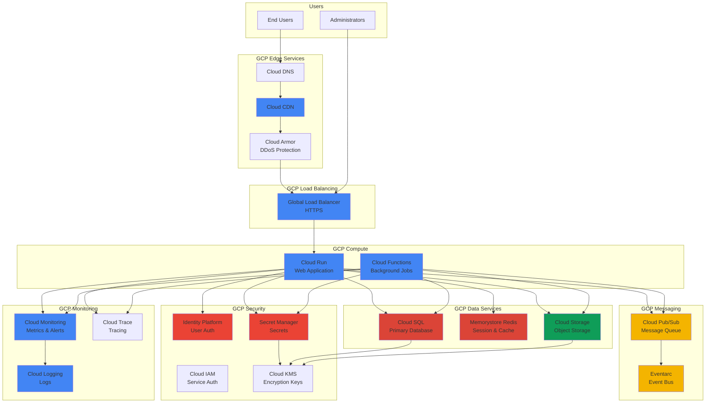

# GCP Service Recommendations - <!-- Solution name from codebase -->

> This document provides GCP-specific service recommendations based on analysis of the current codebase, architecture patterns, technologies, and requirements. All recommendations are grounded in discovered application characteristics and aligned with Google Cloud's best practices and Well-Architected Framework.

## Table of Contents

- [Executive Summary](#executive-summary)
- [Service Mapping Overview](#service-mapping-overview)
- [Compute Services](#compute-services)
- [Data & Storage Services](#data--storage-services)
- [Messaging & Integration Services](#messaging--integration-services)
- [Security & Identity Services](#security--identity-services)
- [Monitoring & Management Services](#monitoring--management-services)
- [Networking Services](#networking-services)
- [Developer & DevOps Services](#developer--devops-services)
- [Cost Estimation](#cost-estimation)
- [Migration Patterns](#migration-patterns)
- [Architecture Diagrams](#architecture-diagrams)
- [Evidence Sources](#evidence-sources)

---

## Executive Summary

**Assessment Date:** (To be set upon document creation/update)  
**Application Version:** <!-- Version or commit from repository -->

**Primary Recommended Services:**
- **Compute**: `[Cloud Run / Google Kubernetes Engine (GKE) / Compute Engine / Cloud Functions / App Engine]`
- **Database**: `[Cloud SQL / Cloud Spanner / Firestore / Cloud Bigtable]`
- **Storage**: `[Cloud Storage / Filestore / Persistent Disk]`
- **Cache**: `[Memorystore for Redis / Memcached]`
- **Messaging**: `[Cloud Pub/Sub / Cloud Tasks]`

**Architecture Pattern**: `[Microservices / Monolith / Serverless / Hybrid]`

**Estimated Monthly Cost**: `$[X,XXX] - $[Y,YYY]` (based on [assumptions])

**Evidence Basis**: Analysis of <!-- number from codebase --> source files, <!-- number from codebase --> configuration files, deployment artifacts, and infrastructure topology

---

## Service Mapping Overview

### Current State to GCP Service Mapping

| Current Component | Current Technology | Recommended GCP Service | Service Tier | Rationale |
|-------------------|-------------------|------------------------|--------------|-----------|
| **Web Application** | `<!-- ASP.NET / Node.js / Java from codebase -->` | `[Cloud Run / GKE / App Engine]` | `<!-- Configuration from analysis -->` | `<!-- Reasoning based on workload characteristics from codebase -->` |
| **API Layer** | `<!-- REST API / GraphQL from codebase -->` | `[Cloud Run / API Gateway / Apigee]` | `<!-- Tier from analysis -->` | `<!-- Reasoning from codebase -->` |
| **Background Jobs** | `<!-- Windows Service / Cron from codebase -->` | `[Cloud Functions / Cloud Run Jobs / Cloud Tasks]` | `<!-- Tier from analysis -->` | `<!-- Reasoning from codebase -->` |
| **Database** | `<!-- SQL Server / MySQL / MongoDB from codebase -->` | `[Cloud SQL / Firestore / Spanner]` | `<!-- Tier from analysis -->` | `<!-- Reasoning from codebase -->` |
| **File Storage** | `<!-- Local files / NAS from codebase -->` | `[Cloud Storage / Filestore]` | `<!-- Storage class from analysis -->` | `<!-- Reasoning from codebase -->` |
| **Cache** | `<!-- In-memory / Redis from codebase -->` | `[Memorystore for Redis]` | `[Basic / Standard / Standard HA]` | `<!-- Reasoning from codebase -->` |
| **Message Queue** | `<!-- RabbitMQ / MSMQ from codebase -->` | `[Cloud Pub/Sub / Cloud Tasks]` | `<!-- Configuration from analysis -->` | `<!-- Reasoning from codebase -->` |
| **Authentication** | `<!-- Forms Auth / JWT from codebase -->` | `[Identity Platform / Cloud Identity]` | `<!-- Tier from analysis -->` | `<!-- Reasoning from codebase -->` |
| **Secrets Management** | `<!-- Config files / env vars from codebase -->` | `[Secret Manager]` | `<!-- Standard from analysis -->` | `<!-- Reasoning from codebase -->` |
| **Monitoring** | `<!-- Application monitoring from codebase -->` | `[Cloud Monitoring / Cloud Trace]` | `<!-- Standard from analysis -->` | `<!-- Reasoning from codebase -->` |

**Evidence**: [Source: Technology inventory, architectural analysis, integration point discovery]

---

## Compute Services

### Recommendation: <!-- Primary Compute Service -->

**Recommended Service**: `[Cloud Run / Google Kubernetes Engine (GKE) / App Engine / Cloud Functions]`

**Configuration**: `<!-- Specific configuration recommendation -->`

**Justification**:
`<!-- Provide detailed reasoning based on discovered characteristics from codebase:
- Application architecture (monolith vs microservices)
- Language and framework compatibility
- Scaling requirements (horizontal/vertical)
- Containerization readiness
- State management patterns
- Integration requirements
- Traffic patterns (steady vs variable)
-->`

**Configuration Recommendations**:

```yaml
# Cloud Run Example
cloud_run_service:
  name: <!-- [project-name]-service -->
  region: <!-- us-central1 or closest region -->
  
  template:
    containers:
      - image: <!-- gcr.io/[project-id]/[image-name] -->
        resources:
          limits:
            cpu: <!-- 1 / 2 / 4 / 8 based on workload -->
            memory: <!-- 512Mi / 1Gi / 2Gi / 4Gi / 8Gi -->
          
        ports:
          - container_port: <!-- Based on application from codebase -->
          
        env:
          # <!-- From Secret Manager -->
          
    scaling:
      min_instances: <!-- 0 for cost optimization or higher for latency -->
      max_instances: <!-- Based on expected load from analysis -->
      
    timeout: <!-- 60s - 3600s based on request patterns -->
    
    vpc_access:
      connector: <!-- If VPC access needed -->
      egress: <!-- all-traffic / private-ranges-only -->
    
  ingress: <!-- all / internal / internal-and-cloud-load-balancing -->
  
  autoscaling:
    concurrency: <!-- Requests per instance: 1-1000 -->
    cpu_utilization: 60 # Target CPU %
```

**Alternative: Google Kubernetes Engine (GKE) Configuration**

```yaml
# GKE Cluster
gke_cluster:
  name: <!-- [project-name]-cluster -->
  location: <!-- us-central1 (regional) or us-central1-a (zonal) -->
  
  release_channel: REGULAR # RAPID / REGULAR / STABLE
  
  node_pools:
    - name: <!-- default-pool -->
      initial_node_count: <!-- Based on workload from analysis -->
      autoscaling:
        min_node_count: <!-- Based on requirements -->
        max_node_count: <!-- Based on expected growth -->
        
      machine_type: <!-- e2-standard-2 / n2-standard-4 -->
      disk_size_gb: 100
      disk_type: pd-standard # or pd-ssd for better performance
      
      management:
        auto_upgrade: true
        auto_repair: true
        
  workload_identity: true # For secure GCP service access
  
  network_policy: true
  binary_authorization: true # For container security
  
  addons:
    http_load_balancing: true
    horizontal_pod_autoscaling: true
    cloud_monitoring: true

# Kubernetes Deployment
deployment:
  name: <!-- [app-name] -->
  replicas: <!-- Based on analysis -->
  
  containers:
    - name: <!-- app-container -->
      image: <!-- gcr.io/[project-id]/[image-name] -->
      resources:
        requests:
          cpu: <!-- 250m / 500m / 1000m -->
          memory: <!-- 256Mi / 512Mi / 1Gi -->
        limits:
          cpu: <!-- 500m / 1000m / 2000m -->
          memory: <!-- 512Mi / 1Gi / 2Gi -->
          
  horizontal_pod_autoscaler:
    min_replicas: <!-- Based on analysis -->
    max_replicas: <!-- Based on analysis -->
    target_cpu_utilization: 70
```

**Migration Complexity**: `[Low / Medium / High]`

**Migration Pattern**: `<!-- Rehost / Replatform / Refactor based on analysis -->`

**Evidence**: `<!-- Cite specific files, patterns, or characteristics from codebase -->`

---

### Alternative Options

#### Option 2: App Engine

**Service**: `[App Engine Flexible / Standard]`
**When to Use**: `<!-- Fully managed PaaS, minimal infrastructure management -->`
**Trade-offs**:
- Benefits: `<!-- Fully managed, automatic scaling, version management -->`
- Drawbacks: `<!-- Less control, environment limitations -->`

#### Option 3: Cloud Functions

**Service**: `[Cloud Functions (2nd gen)]`
**When to Use**: `<!-- Event-driven, short-lived executions, minimal state -->`
**Trade-offs**:
- Benefits: `<!-- Pay per invocation, automatic scaling to zero -->`
- Drawbacks: `<!-- Execution time limits, cold starts, stateless -->`

---

## Data & Storage Services

### Database Recommendations

#### Primary Database: <!-- Recommended GCP Database Service -->

**Recommended Service**: `[Cloud SQL / Cloud Spanner / Firestore]`

**Machine Type/Configuration**: `<!-- Specific configuration -->`

**Sizing Recommendation**:
- **Machine Type**: `<!-- db-n1-standard-1 / db-n1-standard-4 / db-n2-highmem-8 based on workload -->`
- **Storage**: `<!-- GB/TB based on current database size from codebase -->`
- **Storage Type**: `[SSD / HDD]` - `<!-- Based on IOPS requirements -->`
- **Backup Retention**: `<!-- Days based on requirements -->`

**Justification**:
`<!-- Based on discovered characteristics:
- Current database technology and version
- Database size and growth patterns
- Transaction volume (read/write ratio)
- Query patterns (OLTP vs OLAP)
- High availability requirements
- Global distribution needs
-->`

**Configuration Example**:

```yaml
# Cloud SQL Instance
cloud_sql_instance:
  name: <!-- [project-name]-[environment]-db -->
  database_version: <!-- POSTGRES_15 / MYSQL_8_0 / SQLSERVER_2019 from codebase -->
  region: <!-- us-central1 -->
  
  tier: <!-- db-n1-standard-1 / db-n1-standard-2 / db-n1-highmem-4 -->
  
  settings:
    disk_size: <!-- GB based on current size from codebase -->
    disk_type: PD_SSD # or PD_HDD for cost savings
    disk_autoresize: true
    disk_autoresize_limit: <!-- Max GB -->
    
    availability_type: REGIONAL # For HA with automatic failover
    
    backup_configuration:
      enabled: true
      start_time: "03:00" # UTC
      point_in_time_recovery: true
      retained_backups: 35
      
    maintenance_window:
      day: 7 # Sunday
      hour: 4 # 4 AM UTC
      
    ip_configuration:
      ipv4_enabled: false # Use private IP
      private_network: <!-- projects/[project-id]/global/networks/[vpc-name] -->
      require_ssl: true
      
    database_flags:
      # <!-- Custom flags based on workload analysis -->
      
  encryption:
    kms_key_name: <!-- Customer-managed encryption key -->
```

**Alternative: Cloud Spanner Configuration**

```yaml
# Cloud Spanner Instance (for global, strongly consistent database)
cloud_spanner_instance:
  name: <!-- [project-name]-spanner -->
  config: <!-- regional-us-central1 / nam-eur-asia1 for multi-region -->
  display_name: <!-- [Project Name] Database -->
  
  node_count: <!-- Nodes based on throughput requirements -->
  # Each node provides ~10,000 QPS reads and ~2,000 QPS writes
  
  processing_units: <!-- Or use processing units for finer granularity -->
  
  databases:
    - name: <!-- [database-name] -->
      ddl_statements:
        # <!-- Schema from current database -->
        
  autoscaling:
    enabled: true
    min_processing_units: <!-- Based on baseline load -->
    max_processing_units: <!-- Based on peak load -->
    high_priority_cpu_target: 65
```

**Migration Approach**:
1. **Database Migration Service (DMS)**
   - Continuous replication
   - Minimal downtime migration
   
2. **Native Tools**
   - `<!-- Database-specific import/export tools -->`
   
3. **Datastream for Change Data Capture**
   - Real-time replication
   - Zero-downtime migration

**Evidence**: `<!-- Database technology, size, query patterns from codebase -->`

---

### Object Storage Recommendations

**Recommended Service**: `[Cloud Storage]`

**Storage Class**: `[Standard / Nearline / Coldline / Archive]` - `<!-- Based on access patterns from codebase -->`

**Use Cases Identified**:
- `<!-- File uploads/downloads from codebase -->`
- `<!-- Document management from codebase -->`
- `<!-- Backup storage from codebase -->`
- `<!-- Static content hosting from codebase -->`

**Configuration**:

```yaml
storage_bucket:
  name: <!-- [project-name]-[purpose] (globally unique) -->
  location: <!-- us-central1 (regional) / US (multi-region) -->
  storage_class: <!-- STANDARD / NEARLINE / COLDLINE / ARCHIVE -->
  
  uniform_bucket_level_access: true # Recommended for IAM-only access
  
  versioning: true
  
  lifecycle_rules:
    - action:
        type: SetStorageClass
        storage_class: NEARLINE
      condition:
        age: 30 # days
        
    - action:
        type: SetStorageClass
        storage_class: COLDLINE
      condition:
        age: 90
        
    - action:
        type: Delete
      condition:
        age: 365
        num_newer_versions: 3
        
  encryption:
    default_kms_key_name: <!-- projects/[project-id]/locations/[location]/keyRings/[ring]/cryptoKeys/[key] -->
    
  cors_configuration: # <!-- If web access needed from codebase -->
    - origins: ["https://example.com"]
      methods: [GET, POST, PUT]
      response_headers: ["Content-Type"]
      max_age_seconds: 3600
      
  labels:
    environment: <!-- dev/staging/prod -->
    project: <!-- project-name -->
```

**Evidence**: `<!-- File storage patterns, directories, upload handlers from codebase -->`

---

### File Storage Recommendations

**Recommended Service**: `[Filestore / Persistent Disk]`

**Use Cases**:
- **Filestore**: `<!-- NFS-compatible shared file storage from codebase -->`
- **Persistent Disk**: `<!-- Block storage for VM/GKE workloads from codebase -->`

**Configuration**:

```yaml
# Filestore Instance
filestore_instance:
  name: <!-- [project-name]-filestore -->
  tier: <!-- BASIC_HDD / BASIC_SSD / HIGH_SCALE_SSD / ENTERPRISE -->
  
  file_shares:
    - name: <!-- share1 -->
      capacity_gb: <!-- Based on current usage from codebase -->
      
  networks:
    - network: <!-- VPC network name -->
      modes: [MODE_IPV4]
      
  location: <!-- us-central1-a -->
  
  labels:
    environment: <!-- dev/staging/prod -->
```

**Evidence**: `<!-- File share usage, NFS mounts, shared directories from codebase -->`

---

## Messaging & Integration Services

### Message Queue & Pub/Sub Recommendations

**Recommended Service**: `[Cloud Pub/Sub / Cloud Tasks]`

**Service Choice**:
- **Cloud Pub/Sub**: `<!-- Asynchronous messaging, pub/sub patterns from codebase -->`
- **Cloud Tasks**: `<!-- Task queue with scheduling, HTTP targets from codebase -->`

**Justification**:
`<!-- Based on discovered characteristics:
- Message patterns (queuing, pub/sub, streaming)
- Message size and volume
- Ordering requirements
- Delivery guarantees needed
- Subscriber patterns
-->`

**Configuration**:

```yaml
# Cloud Pub/Sub
pubsub_topic:
  name: <!-- projects/[project-id]/topics/[topic-name] -->
  
  message_retention_duration: 604800s # 7 days (max)
  
  schema:
    name: <!-- [schema-name] -->
    type: <!-- AVRO / PROTOCOL_BUFFER -->
    definition: <!-- Schema definition from message structure -->
    
  message_storage_policy:
    allowed_persistence_regions:
      - <!-- us-central1 -->
      
subscriptions:
  - name: <!-- [subscription-name] -->
    topic: <!-- projects/[project-id]/topics/[topic-name] -->
    
    ack_deadline_seconds: 60
    message_retention_duration: 604800s
    
    retain_acked_messages: false
    
    expiration_policy:
      ttl: 2678400s # 31 days
      
    dead_letter_policy:
      dead_letter_topic: <!-- projects/[project-id]/topics/[dlq-topic] -->
      max_delivery_attempts: 5
      
    retry_policy:
      minimum_backoff: 10s
      maximum_backoff: 600s
      
    push_config:
      push_endpoint: <!-- https://[cloud-run-url]/messages -->
      oidc_token:
        service_account_email: <!-- [service-account]@[project-id].iam.gserviceaccount.com -->
```

**Alternative: Cloud Tasks Configuration**

```yaml
# Cloud Tasks Queue
cloud_tasks_queue:
  name: <!-- projects/[project-id]/locations/[location]/queues/[queue-name] -->
  
  rate_limits:
    max_dispatches_per_second: <!-- Based on processing capacity -->
    max_concurrent_dispatches: <!-- Based on capacity -->
    
  retry_config:
    max_attempts: 5
    max_retry_duration: 3600s
    min_backoff: 10s
    max_backoff: 300s
    max_doublings: 5
    
  stackdriver_logging_config:
    sampling_ratio: 1.0 # Log all tasks
```

**Migration from**: `<!-- Current messaging technology from codebase -->`

**Evidence**: `<!-- Message queue usage, async patterns from codebase -->`

---

### Event-Driven Recommendations

**Recommended Service**: `[Eventarc]`

**Use Cases**:
- `<!-- Cloud Storage events from codebase -->`
- `<!-- Pub/Sub message triggers from codebase -->`
- `<!-- Audit log triggers from codebase -->`
- `<!-- Custom application events from codebase -->`

**Configuration**:

```yaml
eventarc_trigger:
  name: <!-- [trigger-name] -->
  location: <!-- us-central1 -->
  
  event_filters:
    - attribute: type
      value: <!-- google.cloud.storage.object.v1.finalized -->
    - attribute: bucket
      value: <!-- [bucket-name] -->
      
  destination:
    cloud_run:
      service: <!-- [cloud-run-service] -->
      path: /events
      region: <!-- us-central1 -->
      
  service_account: <!-- [service-account]@[project-id].iam.gserviceaccount.com -->
```

**Evidence**: `<!-- Event handlers, webhooks, notifications from codebase -->`

---

### API Management

**Recommended Service**: `[Cloud Endpoints / API Gateway / Apigee]`

**Service Choice**:
- **Cloud Endpoints**: `<!-- Simple API management for Cloud Run/GKE/Compute Engine -->`
- **API Gateway**: `<!-- Managed gateway for serverless backends -->`
- **Apigee**: `<!-- Enterprise API management with advanced features -->`

**When to Use**: `<!-- Based on API requirements from analysis -->`

**Configuration**:

```yaml
# API Gateway
api_gateway:
  api:
    name: <!-- [project-name]-api -->
    display_name: <!-- [Project Name] API -->
    
  config:
    name: <!-- [config-name] -->
    openapi_spec: <!-- OpenAPI 2.0/3.0 specification from codebase -->
    
    gateway:
      name: <!-- [gateway-name] -->
      location: <!-- us-central1 -->
      
    service_account: <!-- [service-account]@[project-id].iam.gserviceaccount.com -->
    
# Example OpenAPI snippet
openapi: "3.0.0"
info:
  title: <!-- API Title -->
  version: <!-- 1.0.0 -->
  
paths:
  /api/v1/resource:
    get:
      x-google-backend:
        address: <!-- https://[cloud-run-service]-[hash]-uc.a.run.app -->
        jwt_audience: <!-- [cloud-run-service] -->
      security:
        - api_key: []
```

**Evidence**: `<!-- API endpoints, controllers, routes from codebase -->`

---

## Security & Identity Services

### Identity & Access Management

**Recommended Service**: `[Identity Platform / Cloud Identity / Workforce Identity Federation]`

**Use Case**:
- **Identity Platform**: `<!-- Consumer identity (CIAM) from codebase -->`
- **Cloud Identity**: `<!-- Enterprise workforce identity -->`
- **Workforce Identity Federation**: `<!-- External IdP integration -->`

**Configuration**:

```yaml
# Identity Platform
identity_platform_config:
  project: <!-- [project-id] -->
  
  sign_in:
    email:
      enabled: true
      password_required: true
      
    phone_number:
      enabled: <!-- true/false based on requirements -->
      
  multi_factor:
    state: ENABLED # or DISABLED
    provider_configs:
      - state: ENABLED
        totp_provider_config: {}
        
  notification:
    send_email:
      method: DEFAULT # or custom SMTP
      
  password_policy:
    min_length: 12
    require_uppercase: true
    require_lowercase: true
    require_numeric: true
    require_non_alphanumeric: true
    
  authorized_domains:
    - <!-- yourdomain.com -->
    - <!-- localhost (for development) -->
    
  client:
    web:
      redirect_uris:
        - <!-- https://yourdomain.com/auth/callback -->
```

**Migration from**: `<!-- Current auth mechanism from codebase -->`

**Evidence**: `<!-- Authentication code, login flows from codebase -->`

---

### Secrets & Key Management

**Recommended Service**: `[Secret Manager]`

**Use Cases**:
- `<!-- Database connection strings from codebase -->`
- `<!-- API keys and secrets from codebase -->`
- `<!-- Certificates from codebase -->`
- `<!-- OAuth client secrets from codebase -->`

**Configuration**:

```yaml
secrets:
  - name: <!-- projects/[project-id]/secrets/[secret-name] -->
    replication:
      automatic: {} # or user_managed for specific regions
      
    versions:
      - payload: <!-- base64-encoded secret value -->
        state: ENABLED
        
    labels:
      environment: <!-- dev/staging/prod -->
      
    rotation:
      next_rotation_time: <!-- timestamp -->
      rotation_period: 2592000s # 30 days
      
# Access Control
iam_binding:
  resource: <!-- projects/[project-id]/secrets/[secret-name] -->
  role: roles/secretmanager.secretAccessor
  members:
    - serviceAccount:[service-account]@[project-id].iam.gserviceaccount.com
```

**Migration Approach**: `<!-- How to migrate secrets from current storage -->`

**Evidence**: `<!-- Configuration files, secret storage patterns from codebase -->`

---

### Encryption & Key Management

**Recommended Service**: `[Cloud KMS]`

**Configuration**:

```yaml
kms_key_ring:
  name: <!-- projects/[project-id]/locations/[location]/keyRings/[ring-name] -->
  location: <!-- us-central1 / global -->
  
  crypto_keys:
    - name: <!-- [key-name] -->
      purpose: ENCRYPT_DECRYPT
      
      version_template:
        algorithm: GOOGLE_SYMMETRIC_ENCRYPTION
        protection_level: SOFTWARE # or HSM for hardware protection
        
      rotation_period: 7776000s # 90 days
      next_rotation_time: <!-- timestamp -->
      
      labels:
        environment: <!-- dev/staging/prod -->
        
# IAM Binding
iam_binding:
  resource: <!-- crypto_key resource name -->
  role: roles/cloudkms.cryptoKeyEncrypterDecrypter
  members:
    - serviceAccount:[service-account]@[project-id].iam.gserviceaccount.com
```

**Evidence**: `<!-- Encryption requirements, compliance needs from analysis -->`

---

## Monitoring & Management Services

### Application Monitoring

**Recommended Service**: `[Cloud Monitoring / Cloud Trace / Cloud Profiler]`

**Features to Enable**:
- Cloud Monitoring for metrics and alerting
- Cloud Logging for centralized logging
- Cloud Trace for distributed tracing
- Cloud Profiler for performance profiling
- Error Reporting for error aggregation

**Configuration**:

```yaml
# Cloud Monitoring Alert Policies
alert_policy:
  display_name: <!-- [project-name] High Error Rate -->
  
  conditions:
    - display_name: Error rate above threshold
      condition_threshold:
        filter: |
          resource.type="cloud_run_revision"
          AND resource.labels.service_name="[service-name]"
          AND metric.type="run.googleapis.com/request_count"
          AND metric.labels.response_code_class="5xx"
        
        comparison: COMPARISON_GT
        threshold_value: <!-- Based on SLA from requirements -->
        duration: 60s
        
        aggregations:
          - alignment_period: 60s
            per_series_aligner: ALIGN_RATE
            cross_series_reducer: REDUCE_SUM
            
  notification_channels:
    - <!-- projects/[project-id]/notificationChannels/[channel-id] -->
    
  alert_strategy:
    auto_close: 604800s # 7 days

# Cloud Trace Configuration
trace_config:
  project: <!-- [project-id] -->
  
  sampling_config:
    sampling_rate: 0.1 # 10% sampling
    
# Cloud Profiler
profiler_config:
  service_name: <!-- [service-name] -->
  service_version: <!-- [version] -->
  
  profiler_types:
    - CPU
    - HEAP
    - THREADS
    - CONTENTION
```

**Evidence**: `<!-- Current monitoring, logging patterns from codebase -->`

---

### Logging & Analytics

**Recommended Service**: `[Cloud Logging / Log Analytics]`

**Configuration**:

```yaml
# Log Sink for long-term storage
log_sink:
  name: <!-- [sink-name] -->
  destination: <!-- storage.googleapis.com/[bucket-name] -->
  
  filter: |
    resource.type="cloud_run_revision"
    AND resource.labels.service_name="[service-name]"
    AND severity>=ERROR
    
  include_children: true
  
# Log-based Metric
log_metric:
  name: <!-- [metric-name] -->
  description: <!-- Custom metric description -->
  
  filter: |
    resource.type="cloud_run_revision"
    AND jsonPayload.event_type="business_transaction"
    
  metric_descriptor:
    metric_kind: DELTA
    value_type: INT64
    
  label_extractors:
    transaction_type: EXTRACT(jsonPayload.transaction_type)
    
# Log Exclusion (to reduce costs)
log_exclusion:
  name: <!-- exclude-health-checks -->
  filter: |
    resource.type="cloud_run_revision"
    AND httpRequest.requestUrl=~"/health.*"
  
  disabled: false
```

**Evidence**: `<!-- Logging patterns, log levels from codebase -->`

---

## Networking Services

### Network Architecture

**Recommended Services**:
- `[VPC (Virtual Private Cloud)]` - Network isolation
- `[Cloud Load Balancing]` - Global/regional load balancing
- `[Cloud Armor]` - DDoS protection and WAF
- `[Cloud CDN]` - Content delivery network
- `[Private Service Connect]` - Private service access

**Configuration**:

```yaml
# VPC Network
vpc_network:
  name: <!-- [project-name]-vpc -->
  auto_create_subnetworks: false
  routing_mode: REGIONAL # or GLOBAL
  
  subnetworks:
    - name: <!-- [project-name]-subnet-app -->
      region: <!-- us-central1 -->
      ip_cidr_range: <!-- 10.0.1.0/24 -->
      private_ip_google_access: true
      
      secondary_ip_ranges:
        - range_name: <!-- pods -->
          ip_cidr_range: <!-- 10.4.0.0/14 (for GKE pods) -->
        - range_name: <!-- services -->
          ip_cidr_range: <!-- 10.8.0.0/20 (for GKE services) -->
          
    - name: <!-- [project-name]-subnet-data -->
      region: <!-- us-central1 -->
      ip_cidr_range: <!-- 10.0.2.0/24 -->
      private_ip_google_access: true
      
  firewall_rules:
    - name: <!-- allow-internal -->
      direction: INGRESS
      priority: 1000
      source_ranges:
        - <!-- 10.0.0.0/8 -->
      allowed:
        - protocol: tcp
          ports: [0-65535]
        - protocol: udp
          ports: [0-65535]
        - protocol: icmp
          
    - name: <!-- allow-https -->
      direction: INGRESS
      priority: 1000
      source_ranges: [0.0.0.0/0]
      target_tags: [https-server]
      allowed:
        - protocol: tcp
          ports: [443]

# Cloud Load Balancer
load_balancer:
  name: <!-- [project-name]-lb -->
  load_balancing_scheme: EXTERNAL_MANAGED # Global load balancer
  
  backend_services:
    - name: <!-- [project-name]-backend -->
      protocol: HTTPS
      port_name: http
      
      backends:
        - group: <!-- Cloud Run NEG / GKE NEG / Instance Group -->
          balancing_mode: RATE
          max_rate_per_endpoint: <!-- Based on capacity -->
          
      health_checks:
        - name: <!-- [project-name]-health -->
          type: HTTPS
          request_path: /health
          check_interval_sec: 10
          timeout_sec: 5
          
      cdn_policy:
        cache_mode: CACHE_ALL_STATIC # or USE_ORIGIN_HEADERS
        default_ttl: 3600
        
      iap:
        enabled: <!-- true for identity-aware proxy -->
        oauth2_client_id: <!-- [client-id] -->
        
  url_map:
    default_service: <!-- [backend-service] -->
    
    host_rules:
      - hosts: [<!-- yourdomain.com -->]
        path_matcher: <!-- path-matcher-1 -->
        
    path_matchers:
      - name: <!-- path-matcher-1 -->
        default_service: <!-- [backend-service] -->
        path_rules:
          - paths: [/api/*]
            service: <!-- [api-backend-service] -->
            
  ssl_certificates:
    - name: <!-- [cert-name] -->
      managed:
        domains:
          - <!-- yourdomain.com -->
          - <!-- www.yourdomain.com -->

# Cloud Armor Security Policy
cloud_armor_policy:
  name: <!-- [project-name]-security-policy -->
  
  rules:
    - priority: 1000
      match:
        expr:
          expression: origin.region_code == "CN"
      action: deny(403)
      description: Block traffic from specific regions
      
    - priority: 2000
      match:
        expr:
          expression: evaluatePreconfiguredExpr('sqli-stable')
      action: deny(403)
      description: SQL injection protection
      
    - priority: 2147483647
      match:
        versioned_expr: SRC_IPS_V1
        config:
          src_ip_ranges: ["*"]
      action: allow
      description: Default allow rule
```

**When Required**: `<!-- Based on security/compliance requirements from analysis -->`

**Evidence**: `<!-- Network architecture, isolation requirements from codebase -->`

---

## Developer & DevOps Services

### CI/CD Recommendations

**Recommended Service**: `[Cloud Build / GitHub Actions with GCP / GitLab CI with GCP]`

**Pipeline Configuration**:

```yaml
# Cloud Build Configuration (cloudbuild.yaml)
steps:
  # Build step
  - name: 'gcr.io/cloud-builders/docker'
    id: 'build'
    args:
      - 'build'
      - '-t'
      - 'gcr.io/$PROJECT_ID/[image-name]:$COMMIT_SHA'
      - '-t'
      - 'gcr.io/$PROJECT_ID/[image-name]:latest'
      - '.'
      
  # Push to Container Registry
  - name: 'gcr.io/cloud-builders/docker'
    id: 'push'
    args:
      - 'push'
      - '--all-tags'
      - 'gcr.io/$PROJECT_ID/[image-name]'
      
  # Deploy to Cloud Run
  - name: 'gcr.io/google.com/cloudsdktool/cloud-sdk'
    id: 'deploy'
    entrypoint: gcloud
    args:
      - 'run'
      - 'deploy'
      - '[service-name]'
      - '--image'
      - 'gcr.io/$PROJECT_ID/[image-name]:$COMMIT_SHA'
      - '--region'
      - 'us-central1'
      - '--platform'
      - 'managed'
      - '--allow-unauthenticated'
      
  # Run tests
  - name: 'gcr.io/cloud-builders/docker'
    id: 'test'
    args:
      - 'run'
      - 'gcr.io/$PROJECT_ID/[image-name]:$COMMIT_SHA'
      - 'npm'
      - 'test'
      
images:
  - 'gcr.io/$PROJECT_ID/[image-name]:$COMMIT_SHA'
  - 'gcr.io/$PROJECT_ID/[image-name]:latest'
  
options:
  machineType: 'N1_HIGHCPU_8'
  logging: CLOUD_LOGGING_ONLY
  
timeout: 1800s # 30 minutes

# Cloud Build Trigger
triggers:
  - name: <!-- [trigger-name] -->
    description: <!-- Build and deploy on push to main -->
    
    trigger_template:
      branch_name: main
      repo_name: <!-- [repo-name] -->
      
    filename: cloudbuild.yaml
    
    substitutions:
      _ENVIRONMENT: production
```

**Evidence**: `<!-- Current build process, scripts from codebase -->`

---

### Container Registry

**Recommended Service**: `[Artifact Registry]`

**When Required**: `<!-- If containerization identified from analysis -->`

**Configuration**:

```yaml
artifact_registry_repository:
  name: <!-- [repository-name] -->
  format: DOCKER # or MAVEN, NPM, PYTHON, etc.
  location: <!-- us-central1 -->
  
  description: <!-- Repository description -->
  
  docker_config:
    immutable_tags: true # Prevent tag overwriting
    
  cleanup_policies:
    - id: <!-- keep-minimum-versions -->
      action: KEEP
      most_recent_versions:
        keep_count: 10
        
    - id: <!-- delete-old-untagged -->
      action: DELETE
      condition:
        tag_state: UNTAGGED
        older_than: 2592000s # 30 days
        
  labels:
    environment: <!-- dev/staging/prod -->
```

**Evidence**: `<!-- Dockerfiles, container orchestration from codebase -->`

---

## Cost Estimation

> **⚠️ CRITICAL - Evidence-Based Estimates Only**:
> - **DO NOT** provide cost estimates unless they can be **immediately derived** from actual usage data, resource requirements, and transaction volumes discovered in the codebase
> - **MUST** document all assumptions with specific evidence from code analysis (e.g., "based on 50,000 requests/month found in logs", "database size of 500GB from current metrics")
> - **MUST** include calculation methodology showing how estimates were derived
> - **If data is unavailable**: Clearly explain WHY estimation cannot be provided and WHAT specific data is needed
>   - Example: "Cost estimation not possible because: (1) No Cloud Monitoring data available to determine request patterns, (2) Cloud SQL storage metrics not accessible from static code analysis, (3) Network egress patterns require VPC flow logs. Required data: 30-day Cloud Monitoring metrics, Cloud SQL insights, network telemetry."
> - **ACCEPTABLE**: Linking to GCP Pricing Calculator with specific configurations identified from codebase
> - **NOT ACCEPTABLE**: Placeholder amounts, ranges without justification, estimates based on assumptions rather than evidence, vague statements like "data not available" without explanation

### Monthly Cost Breakdown (Evidence-Based)

**Prerequisites for Cost Estimation**:
- Actual workload characteristics (requests/second, peak load) from monitoring data
- Current resource utilization metrics (CPU, memory, storage)
- Transaction volumes from application logs or database statistics
- Data retention and storage growth patterns from historical analysis
- Regional deployment requirements from business/compliance requirements

**Evidence-Based Assumptions** (document all):
- `<!-- Workload: X requests/second (derived from: application logs showing Y requests/day) -->`
- `<!-- Peak load: Z concurrent users (derived from: current monitoring showing N users) -->`
- `<!-- Data volume: A GB current + B GB/month growth (derived from: database size trend analysis) -->`
- `<!-- Region: us-central1 (derived from: compliance requirements/current deployment location) -->`

| Service | Configuration | Evidence-Based Monthly Cost | Calculation Method |
|---------|---------------|------------------------------|-------------------|
| **Cloud Run** | `<!-- vCPU, memory, requests -->` | `<!-- $XXX if calculable -->` | `<!-- Show: (requests × request rate) + (vCPU-seconds × CPU rate) + (GB-seconds × memory rate) -->` |
| **Cloud SQL** | `<!-- Machine type and storage -->` | `<!-- $XXX if calculable -->` | `<!-- Show: instance hours × instance rate + storage GB × storage rate -->` |
| **Cloud Storage** | `<!-- GB stored and operations -->` | `<!-- $XX if calculable -->` | `<!-- Show: GB × storage rate + operations × operation rate -->` |
| **Memorystore** | `<!-- Tier and capacity -->` | `<!-- $XX if calculable -->` | `<!-- Show: capacity GB × hourly rate × hours -->` |
| **Cloud Pub/Sub** | `<!-- Messages per month -->` | `<!-- $XX if calculable -->` | `<!-- Show: (messages - free tier) × message rate + (GB - free tier) × data rate -->` |
| **Cloud Monitoring** | `<!-- Metrics and logs -->` | `<!-- $XX if calculable -->` | `<!-- Show: metrics × metric rate + log GB × log rate -->` |
| **Secret Manager** | `<!-- Secrets and access operations -->` | `<!-- $XX if calculable -->` | `<!-- Show: secrets × secret rate + (access operations - free tier) × access rate -->` |
| **Network Egress** | `<!-- GB to internet -->` | `<!-- $XX if calculable -->` | `<!-- Show: GB transferred × egress rate -->` |
| **Load Balancer** | `<!-- Forwarding rules and processed GB -->` | `<!-- $XX if calculable -->` | `<!-- Show: rules × rule rate + GB processed × processing rate -->` |
| **Total** | | `<!-- $X,XXX (if all above calculable) -->` | `<!-- Sum of all services -->` |

**Cost Optimization Opportunities** (evidence-based):
1. **Committed Use Discounts (CUDs)** `<!-- If usage patterns show consistent baseline load - cite specific utilization % -->`
   - 1-year commitment: Up to 37% savings
   - 3-year commitment: Up to 55% savings
   
2. **Sustained Use Discounts**
   - Automatic discounts for consistent usage
   - Up to 30% for Compute Engine
   
3. **Cloud Run Minimum Instances** `<!-- If cold start analysis shows impact - cite startup time metrics -->`
   - Set to 0 for cost savings (accept cold starts)
   - Or use minimum instances for latency-sensitive apps
   
4. **Storage Class Optimization** `<!-- If data access patterns show infrequent access - cite access frequency % -->`
   - Use Nearline/Coldline for infrequent access
   - Lifecycle policies for automatic tiering
   
5. **Preemptible VMs / Spot VMs** `<!-- If workload analysis shows fault tolerance - cite retry/recovery capabilities -->`
   - Up to 80% savings for fault-tolerant workloads

**Evidence Sources**:
- `<!-- Link to actual monitoring dashboards, log analytics queries, database statistics -->`
- `<!-- Reference specific files: application logs, performance metrics, database size queries -->`

---

## Migration Patterns

### Recommended Migration Strategy

**Primary Pattern**: `[Rehost / Replatform / Refactor]`

**GCP Migration Tools**:
- **Migrate for Compute Engine**: VM migration (lift-and-shift)
- **Database Migration Service**: Database migration with minimal downtime
- **Transfer Service**: Data migration to Cloud Storage
- **Migrate for Anthos**: Containerize and migrate VMs to containers

**Phased Approach** (logical sequence - replace with evidence-based timelines if available):

> **⚠️ CRITICAL - Timeline Estimates Require Evidence**:
> - **DO NOT** specify phase durations (weeks, months) unless based on actual project scope, team capacity, and complexity analysis
> - Phase labels below (e.g., "Week X-Y") are **examples only** and must be replaced with evidence-based timelines
> - **MUST** document: team size, skill levels, parallel vs sequential work, dependencies, risk factors
> - **ACCEPTABLE**: Logical sequencing and dependencies between phases without time estimates
> - **NOT ACCEPTABLE**: Generic week/month ranges without specific justification

**Phase 1: Foundation** `<!-- Duration: Based on infrastructure complexity and team capacity -->`
- Set up GCP Organization and projects
- Configure VPC networking and firewall rules
- Set up Secret Manager and migrate secrets
- Enable Cloud Monitoring and Logging
- **Dependencies**: GCP organization approval, network design completion
- **Success Criteria**: Infrastructure provisioned and tested

**Phase 2: Data Migration** `<!-- Duration: Based on database size, DMS performance, validation requirements -->`
- Set up Database Migration Service
- Migrate database to Cloud SQL/Spanner
- Validate data integrity and performance
- Migrate files to Cloud Storage/Filestore
- Test database connectivity
- **Dependencies**: Phase 1 complete, database schema compatibility verified
- **Success Criteria**: Data migrated, validated, performance benchmarked

**Phase 3: Application Migration** `<!-- Duration: Based on application complexity, containerization effort, testing needs -->`
- Build container images
- Deploy to Cloud Run/GKE
- Configure Identity Platform/IAM
- Set up Memorystore for Redis
- Validate application functionality
- **Dependencies**: Phase 2 complete, containers tested locally
- **Success Criteria**: Application functional in GCP, integration tests passing

**Phase 4: Integration** `<!-- Duration: Based on number of integrations, external dependencies -->`
- Migrate messaging to Cloud Pub/Sub
- Set up Eventarc for events
- Configure API Gateway/Endpoints
- Validate integrations
- Security and performance testing
- **Dependencies**: Phase 3 complete, external system access configured
- **Success Criteria**: All integrations functional, security testing complete

**Phase 5: Cutover & Optimization** `<!-- Duration: Based on cutover complexity, optimization scope -->`
- Configure Cloud Load Balancing
- DNS cutover
- Decommission old infrastructure
- Enable autoscaling
- Cost optimization review
- Performance tuning

**Evidence**: `<!-- Application architecture, dependencies from codebase -->`

---

### GCP-Specific Best Practices

1. **Use Service Accounts and Workload Identity**
   - No credential files
   - Automatic credential rotation
   - Fine-grained IAM permissions

2. **Implement Infrastructure as Code**
   - Terraform or Cloud Deployment Manager
   - Version control infrastructure
   - Repeatable deployments

3. **Enable Organization Policies**
   - Enforce security controls
   - Prevent misconfiguration
   - Compliance guardrails

4. **Apply Resource Labeling Strategy**
   ```yaml
   labels:
     environment: <!-- dev/staging/prod -->
     project: <!-- project-name -->
     cost-center: <!-- based on requirements -->
     managed-by: <!-- terraform/manual -->
     team: <!-- team-name -->
   ```

5. **Follow Google Cloud Architecture Framework**
   - **Operational Excellence**: Automation, monitoring, SRE practices
   - **Security, Privacy & Compliance**: Defense in depth, encryption
   - **Reliability**: SLOs, error budgets, fault tolerance
   - **Cost Optimization**: Right-sizing, committed use
   - **Performance Optimization**: Caching, CDN, regional deployment

6. **Enable Security Command Center**
   - Security health analytics
   - Vulnerability scanning
   - Compliance monitoring

**Evidence**: `<!-- Current practices, gaps identified from analysis -->`

---

## Architecture Diagrams

### Proposed GCP Architecture



**Diagram Notes**:
- `<!-- Customize based on discovered architecture from codebase -->`
- `<!-- Add/remove services based on recommendations -->`
- `<!-- Show multi-region deployment if applicable -->`

---

## Evidence Sources

### Analysis Inputs

**Codebase Analysis**:
- Source code repository: `<!-- Repository URL or path -->`
- Commit/Version: `<!-- Commit hash or version -->`
- Files analyzed: `<!-- Count and types -->`

**Configuration Analysis**:
- Configuration files: `<!-- List key config files from codebase -->`
- Deployment scripts: `<!-- List deployment artifacts from codebase -->`
- Infrastructure documentation: `<!-- List docs from codebase -->`

**Architecture Analysis**:
- Integration points: `<!-- Count and types from analysis -->`
- API endpoints: `<!-- Count from discovery -->`
- Database schemas: `<!-- Databases analyzed from codebase -->`

### Recommendation Methodology

All recommendations follow this process:
1. **Discovery**: Analyze codebase for technologies, patterns, and requirements
2. **Mapping**: Map discovered elements to GCP service capabilities
3. **Evaluation**: Assess service configurations based on workload
4. **Validation**: Cross-check recommendations against Google Cloud best practices
5. **Documentation**: Document evidence and rationale for each recommendation

---

## Appendices

### Appendix A: GCP Naming Conventions

Follow Google Cloud naming best practices:
- Project ID: `[company]-[project]-[environment]`
- Resources: `[project-name]-[resource-type]-[environment]`
- Service accounts: `[service-name]@[project-id].iam.gserviceaccount.com`
- Labels: Use consistent labeling across all resources

### Appendix B: Google Cloud Architecture Framework Alignment

`<!-- Document how recommendations align with each pillar -->`

### Appendix C: GCP Service Limits and Quotas

`<!-- Document relevant service quotas and request increases if needed -->`

### Appendix D: Migration Checklist

`<!-- Detailed pre-migration, during-migration, and post-migration checklist -->`

### Appendix E: GCP Organization and Project Structure

`<!-- Organization hierarchy, folders, projects, billing accounts -->`

---

**Document Generation Notes**: All `<!-- -->` placeholders must be replaced with actual evidence from codebase analysis. All recommendations must be grounded in discovered application characteristics, not assumptions.
