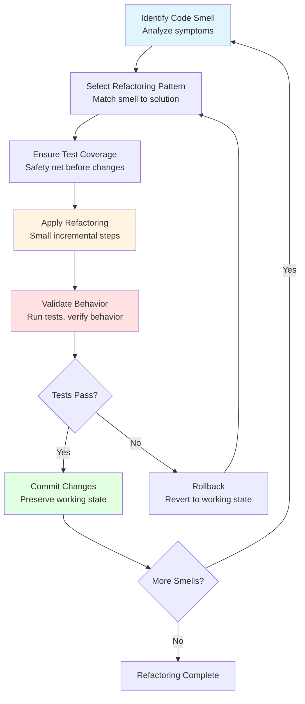
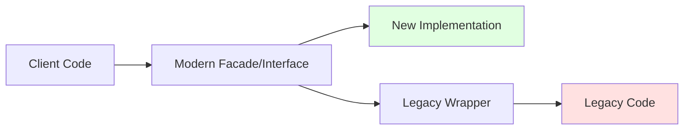

# Refactoring Patterns Catalog - <!-- Solution name from codebase -->

> This document provides a comprehensive catalog of refactoring patterns applicable to <!-- Solution name from codebase -->, including code-level refactorings, design pattern applications, architectural refactorings, and strategies for systematic code improvement during modernization.

**Reference**: Based on Martin Fowler's refactoring catalog, Gang of Four design patterns, Robert C. Martin's Clean Code principles, and architectural refactoring patterns.

**Citations**:
- Fowler, M. (2018). *Refactoring: Improving the Design of Existing Code* (2nd Edition). Addison-Wesley.
- Gamma, E., Helm, R., Johnson, R., & Vlissides, J. (1994). *Design Patterns: Elements of Reusable Object-Oriented Software*. Addison-Wesley.
- Martin, R. C. (2008). *Clean Code: A Handbook of Agile Software Craftsmanship*. Prentice Hall.
- Kerievsky, J. (2004). *Refactoring to Patterns*. Addison-Wesley.
- Feathers, M. (2004). *Working Effectively with Legacy Code*. Prentice Hall.

## Table of Contents

- [Executive Summary](#executive-summary)
- [Refactoring Strategy](#refactoring-strategy)
- [Code Smells Identification](#code-smells-identification)
- [Method-Level Refactorings](#method-level-refactorings)
- [Class-Level Refactorings](#class-level-refactorings)
- [Design Pattern Applications](#design-pattern-applications)
- [Architectural Refactorings](#architectural-refactorings)
- [Modernization-Specific Patterns](#modernization-specific-patterns)
- [Refactoring Safety and Testing](#refactoring-safety-and-testing)
- [Prioritization Framework](#prioritization-framework)
- [Evidence Sources](#evidence-sources)

---

## Executive Summary

### Purpose

This refactoring patterns catalog provides systematic guidance for improving code quality, design, and architecture of <!-- Solution name from codebase --> during modernization. It identifies common code smells, prescribes appropriate refactoring patterns, and provides practical application guidance.

**Reasoning**: Refactoring is essential component of modernization - legacy code often contains accumulated technical debt that must be systematically addressed. This catalog enables consistent, effective refactoring across the team.

### Refactoring Principles

**Core Tenets** (from Fowler's *Refactoring*):

1. **Preserve Behavior**: Refactoring changes internal structure without altering external behavior
   - **Reasoning**: Behavior preservation prevents introducing bugs while improving code

2. **Small Steps**: Make small, incremental changes rather than large rewrites
   - **Reasoning**: Small steps reduce risk, enable frequent validation, maintain working code

3. **Test-Supported**: Comprehensive tests enable confident refactoring
   - **Reasoning**: Tests catch behavior changes immediately; without tests, refactoring is dangerous

4. **Continuous**: Refactor continuously as part of regular development, not separate phase
   - **Reasoning**: Continuous small improvements prevent debt accumulation

5. **Scout Rule**: Leave code better than you found it
   - **Reference**: Robert C. Martin's "Boy Scout Rule"
   - **Reasoning**: Small improvements by every developer compound into significant enhancement

### When to Refactor

**Refactoring Opportunities**:
- **Before adding feature**: Clean up area where new feature will be added
- **During code review**: Identify and address code smells
- **When fixing bugs**: Refactor to make bug impossible
- **Dedicated refactoring time**: Address accumulated technical debt

**When NOT to refactor**:
- Code works and won't be modified (if it ain't broke...)
- Rewrite would be faster (threshold: refactoring >50% of component)
- Just before release (risk/reward unfavorable)

**Reasoning**: Strategic refactoring timing maximizes value while minimizing risk.

---

## Refactoring Strategy

### Systematic Approach



**Reasoning**: Systematic process ensures safe, effective refactoring with continuous validation.

### Refactoring Workflow

1. **Identify**: Find code smell or improvement opportunity
2. **Analyze**: Understand why smell exists, what problems it causes
3. **Select Pattern**: Choose appropriate refactoring from catalog
4. **Ensure Tests**: Verify test coverage or add tests first
5. **Refactor**: Apply pattern in small steps
6. **Validate**: Run tests after each small change
7. **Commit**: Preserve working state frequently
8. **Repeat**: Continue until code meets quality standards

**Reasoning**: Structured workflow prevents common refactoring mistakes (breaking behavior, inadequate testing, excessive changes).

---

## Code Smells Identification

**Reference**: Fowler's refactoring book catalogs 24 code smells

**Reasoning**: Code smells are symptoms of deeper problems; identifying smells guides appropriate refactoring selection.

### Method-Level Smells

| Code Smell | Description | Impact | Refactoring Solution |
|------------|-------------|--------|---------------------|
| **Long Method** | Method >20-30 lines, does too much | Hard to understand, test, reuse | Extract Method, Decompose Conditional |
| **Long Parameter List** | Method takes >3-4 parameters | Hard to call, understand, maintain | Introduce Parameter Object, Preserve Whole Object |
| **Duplicated Code** | Same/similar code in multiple places | Multiplies bugs, maintenance effort | Extract Method, Pull Up Method |
| **Complex Conditionals** | Deeply nested if/else, complex boolean logic | Hard to understand, error-prone | Decompose Conditional, Replace Conditional with Polymorphism |
| **Dead Code** | Unreachable or unused code | Confuses readers, false complexity | Remove Dead Code |
| **Magic Numbers** | Unexplained literal constants | Unclear meaning, hard to change | Replace Magic Number with Symbolic Constant |

### Class-Level Smells

| Code Smell | Description | Impact | Refactoring Solution |
|------------|-------------|--------|---------------------|
| **Large Class** | Class has too many responsibilities | Violates Single Responsibility Principle | Extract Class, Extract Subclass |
| **Feature Envy** | Method uses more features of other class than its own | Wrong location, tight coupling | Move Method |
| **Data Clumps** | Same group of data items appears together | Missed abstraction opportunity | Extract Class, Introduce Parameter Object |
| **Primitive Obsession** | Using primitives instead of small objects | Missed domain modeling | Replace Data Value with Object |
| **Switch Statements** | Type code with switch/case logic | Violates Open/Closed Principle | Replace Conditional with Polymorphism |
| **Lazy Class** | Class that doesn't do enough to justify existence | Unnecessary complexity | Collapse Hierarchy, Inline Class |

### Architecture-Level Smells

| Code Smell | Description | Impact | Refactoring Solution |
|------------|-------------|--------|---------------------|
| **Shotgun Surgery** | Change requires modifying many classes | High change cost, error risk | Move Method, Move Field, Inline Class |
| **Divergent Change** | One class changes for different reasons | Violates SRP, high churn | Extract Class |
| **Parallel Inheritance Hierarchies** | Adding subclass requires adding another | Maintenance burden | Move Method and Field to collapse hierarchy |
| **Inappropriate Intimacy** | Classes too coupled, accessing internals | Fragile design, hard to change | Move Method/Field, Change Bidirectional to Unidirectional |
| **Middle Man** | Class delegates most work to another | Unnecessary indirection | Remove Middle Man, Inline Method |
| **Message Chains** | client.getA().getB().getC().doSomething() | Fragile to intermediate changes | Hide Delegate |

**Reasoning**: Categorization by scope (method/class/architecture) helps identify appropriate refactoring level.

---

## Method-Level Refactorings

### Extract Method

**Code Smell**: Long Method, Duplicated Code, Complex Logic

**Problem**: Method does too much or contains duplicated logic

**Solution**: Extract cohesive fragment into separate method with descriptive name

**Before**:
```<!-- language from codebase -->
func ProcessOrder(order Order) error {
    // Validate order
    if order == nil {
        return errors.New("order cannot be nil")
    }
    if len(order.Items) == 0 {
        return errors.New("order cannot be empty")
    }
    
    // Calculate total
    var total decimal.Decimal
    for _, item := range order.Items {
        itemTotal := item.Price.Mul(decimal.NewFromInt(int64(item.Quantity)))
        discount := decimal.NewFromFloat(1.0 - item.Discount)
        total = total.Add(itemTotal.Mul(discount))
    }
    
    // Apply shipping
    if total.LessThan(decimal.NewFromInt(100)) {
        total = total.Add(decimal.NewFromInt(10))
    }
    
    order.Total = total
    return nil
}
```

**After**:
```<!-- language from codebase -->
func ProcessOrder(order Order) error {
    if err := ValidateOrder(order); err != nil {
        return err
    }
    subtotal := CalculateSubtotal(order.Items)
    order.Total = ApplyShipping(subtotal)
    return nil
}

func ValidateOrder(order Order) error {
    if order == nil {
        return errors.New("order cannot be nil")
    }
    if len(order.Items) == 0 {
        return errors.New("order cannot be empty")
    }
    return nil
}

func CalculateSubtotal(items []OrderItem) decimal.Decimal {
    var total decimal.Decimal
    for _, item := range items {
        itemTotal := item.Price.Mul(decimal.NewFromInt(int64(item.Quantity)))
        discount := decimal.NewFromFloat(1.0 - item.Discount)
        total = total.Add(itemTotal.Mul(discount))
    }
    return total
}

func ApplyShipping(subtotal decimal.Decimal) decimal.Decimal {
    const freeShippingThreshold = 100
    const shippingCost = 10
    if subtotal.LessThan(decimal.NewFromInt(freeShippingThreshold)) {
        return subtotal.Add(decimal.NewFromInt(shippingCost))
    }
    return subtotal
}
```

**Benefits**: Improved readability, reusability, testability
**When to Apply**: Method >15-20 lines, doing multiple things, or contains comments explaining sections

**Reasoning**: Small, well-named methods are self-documenting and easier to understand, test, and reuse.

### Decompose Conditional

**Code Smell**: Complex Conditionals

**Problem**: Complex boolean expressions that are hard to understand

**Solution**: Extract condition and each branch into descriptively-named methods

**Before**:
```<!-- language from codebase -->
if date.Month() == 12 || date.Month() == 1 || date.Month() == 2 {
    charge = quantity * winterRate + winterServiceCharge
} else {
    charge = quantity * summerRate
}
```

**After**:
```<!-- language from codebase -->
if IsWinter(date) {
    charge = WinterCharge(quantity)
} else {
    charge = SummerCharge(quantity)
}

func IsWinter(date time.Time) bool {
    return date.Month() == 12 || date.Month() == 1 || date.Month() == 2
}

func WinterCharge(quantity int) decimal.Decimal {
    return decimal.NewFromInt(int64(quantity)).Mul(winterRate).Add(winterServiceCharge)
}

func SummerCharge(quantity int) decimal.Decimal {
    return decimal.NewFromInt(int64(quantity)).Mul(summerRate)
}
```

**Benefits**: Improved readability, reusable condition checking
**When to Apply**: Complex boolean expressions, nested conditionals

**Reasoning**: Named conditions express intent; branches become units that can be modified independently.

### Introduce Parameter Object

**Code Smell**: Long Parameter List, Data Clumps

**Problem**: Methods take many related parameters

**Solution**: Replace parameter list with object containing parameters

**Before**:
```<!-- language from codebase -->
func CreateAccount(firstName, lastName, email, phone, address, city, state, zip string) error {
    // Implementation
}
```

**After**:
```<!-- language from codebase -->
type CustomerInfo struct {
    FirstName string
    LastName  string
    Email     string
    Phone     string
    Address   Address
}

type Address struct {
    Street string
    City   string
    State  string
    Zip    string
}

func CreateAccount(customerInfo CustomerInfo) error {
    // Implementation
}
```

**Benefits**: Reduces parameter coupling, enables adding related behavior to object
**When to Apply**: >3-4 parameters, especially if parameters often passed together

**Reasoning**: Parameter objects become domain concepts, reducing coupling and enabling future extension.

---

## Class-Level Refactorings

### Extract Class

**Code Smell**: Large Class, Divergent Change

**Problem**: Class has multiple responsibilities or reasons to change

**Solution**: Create new class and move related fields/methods to it

**Reasoning**: Single Responsibility Principle - each class should have one reason to change. Extraction enables independent evolution.

### Replace Conditional with Polymorphism

**Code Smell**: Switch Statements, Type Codes

**Problem**: Conditional logic based on object type

**Solution**: Create subclasses for each type, move behavior to subclass

**Reference**: Gang of Four Strategy Pattern, Template Method Pattern

**Reasoning**: Polymorphism eliminates conditional complexity, enables Open/Closed Principle (open for extension, closed for modification).

---

## Design Pattern Applications

### Strategy Pattern

**When to Use**: Multiple algorithms for same task, need to vary algorithm at runtime

**Problem**: Switch statements or conditional logic selecting between behaviors

**Solution**: Encapsulate each algorithm in separate class implementing common interface

**Reference**: Gamma et al., *Design Patterns* (1994)

**Reasoning**: Strategy pattern eliminates conditional logic, enabling extension without modification.

### Repository Pattern

**When to Use**: Data access logic scattered throughout application

**Problem**: Direct database queries mixed with business logic

**Solution**: Create repository abstraction for data access

**Reference**: Evans, *Domain-Driven Design* (2003)

**Reasoning**: Repository centralizes data access, enables testability through mocking, isolates persistence concerns.

### Dependency Injection

**When to Use**: Tight coupling between components

**Problem**: Classes create their own dependencies

**Solution**: Inject dependencies through constructor or properties

**Reference**: Fowler, "Inversion of Control Containers and the Dependency Injection pattern" (2004)

**Reasoning**: Dependency injection enables loose coupling, testability, and flexibility in component composition.

---

## Architectural Refactorings

### Extract Service

**When to Use**: Large class/module with multiple responsibilities

**Problem**: God class, violation of Single Responsibility Principle

**Solution**: Extract cohesive functionality into separate service class

**Reasoning**: Service extraction enables modular evolution and independent scaling.

### Strangler Fig Pattern

**Reference**: Martin Fowler's Strangler Fig Application pattern

**When to Use**: Gradual replacement of legacy system

**Problem**: Cannot rewrite entire system at once; need incremental migration

**Solution**: Create facade around legacy code, gradually replace implementations



**Implementation Steps**:
1. Create interface representing desired API
2. Implement wrapper that delegates to legacy code
3. Migrate clients to use new interface
4. Gradually replace wrapper implementations with new code
5. Remove legacy code when fully replaced

**Reasoning**: Strangler pattern enables safe, incremental migration with continuous production deployment.

---

## Modernization-Specific Patterns

### Database Refactoring

**Reference**: Ambler & Sadalage, *Refactoring Databases* (2006)

**Challenge**: Database schema changes affect multiple applications

**Pattern**: Transition Period
- Implement both old and new schema during migration
- Synchronize data between representations
- Gradually migrate applications
- Remove old schema when all applications migrated

**Reasoning**: Transition period enables zero-downtime database migrations.

### API Versioning

**When to Use**: Breaking changes to public API

**Pattern**: Support multiple API versions simultaneously
- Version 1: Legacy clients
- Version 2: New clients with improved design
- Sunset version 1 after migration period

**Reasoning**: API versioning enables gradual client migration without breaking existing integrations.

---

## Refactoring Safety and Testing

### Test-Driven Refactoring

**Process**:
1. **Add Tests**: Ensure comprehensive test coverage before refactoring
2. **Refactor**: Make small changes to internal structure
3. **Test**: Run all tests after each change
4. **Commit**: Preserve working state frequently

**Test Coverage Requirements**:
- Unit tests: Cover all logic paths
- Integration tests: Verify component interactions
- Acceptance tests: Validate business behavior

**Golden Rule**: Never refactor without tests; never add tests and refactor simultaneously

**Reasoning**: Tests are safety net; without them, refactoring risks breaking behavior.

### Characterization Tests

**Reference**: Feathers, *Working Effectively with Legacy Code* (2004)

**When to Use**: Refactoring legacy code without existing tests

**Approach**: Write tests that characterize current behavior (even if buggy) before refactoring

**Reasoning**: Characterization tests enable safe refactoring of untested legacy code by preserving existing behavior.

### Refactoring Tools

**IDE Refactoring Support**:
- Automated refactorings (rename, extract method, etc.)
- Safer than manual changes (syntax-aware)
- Instant feedback on compilation errors

**Static Analysis**:
- SonarQube, ReSharper, CodeClimate, golangci-lint
- Identifies code smells automatically
- Tracks technical debt trends

**Reasoning**: Tooling reduces human error and accelerates refactoring.

---

## Prioritization Framework

### Refactoring Priority Matrix

| Benefit | Effort Low | Effort Medium | Effort High |
|---------|-----------|---------------|-------------|
| **High Impact** | **P1: Do Now** | **P2: Schedule Soon** | **P3: Plan Carefully** |
| **Medium Impact** | **P2: When Convenient** | **P3: Consider** | **P4: Probably Skip** |
| **Low Impact** | **P3: Nice to Have** | **P4: Skip** | **P5: Definitely Skip** |

**Impact Assessment Criteria**:
- **Frequency of modification**: High-churn code benefits most from refactoring
- **Bug density**: Problematic code gets priority
- **Strategic importance**: Core business logic prioritized
- **Team pain points**: Friction areas improve morale and velocity

**Effort Assessment**:
- Lines of code affected
- Complexity of dependencies
- Test coverage gaps that must be filled
- Coordination required across teams

**Reasoning**: Prioritization ensures refactoring effort focuses on highest-value improvements.

### Refactoring Velocity

**Continuous Refactoring**: Small improvements during regular development
- **Time allocation**: 10-20% of sprint capacity
- **Scope**: File-level, method-level refactorings
- **When**: As part of feature work

**Dedicated Refactoring Sprints**: Address accumulated technical debt
- **Time allocation**: Periodic (e.g., every 4-6 sprints)
- **Scope**: Architectural refactorings, major restructuring
- **When**: After major feature releases or before new initiatives

**Reasoning**: Balanced approach maintains code quality while delivering features.

---

## Evidence Sources

### Refactoring and Design Pattern References

1. **Fowler, M. (2018)**. *Refactoring: Improving the Design of Existing Code* (2nd Edition). Addison-Wesley Professional.
   - **Used for**: Refactoring catalog, code smells, refactoring mechanics

2. **Gamma, E., Helm, R., Johnson, R., & Vlissides, J. (1994)**. *Design Patterns: Elements of Reusable Object-Oriented Software*. Addison-Wesley.
   - **Used for**: Gang of Four design patterns, pattern applications

3. **Martin, R. C. (2008)**. *Clean Code: A Handbook of Agile Software Craftsmanship*. Prentice Hall.
   - **Used for**: Code quality principles, clean code practices

4. **Kerievsky, J. (2004)**. *Refactoring to Patterns*. Addison-Wesley.
   - **Used for**: Pattern-directed refactoring strategies

5. **Feathers, M. (2004)**. *Working Effectively with Legacy Code*. Prentice Hall.
   - **Used for**: Legacy code refactoring strategies, characterization tests

6. **Martin, R. C. (2017)**. *Clean Architecture: A Craftsman's Guide to Software Structure and Design*. Prentice Hall.
   - **Used for**: Architectural refactoring patterns, dependency management

7. **Evans, E. (2003)**. *Domain-Driven Design: Tackling Complexity in the Heart of Software*. Addison-Wesley.
   - **Used for**: Domain modeling refactorings, ubiquitous language

8. **Ambler, S. W., & Sadalage, P. J. (2006)**. *Refactoring Databases: Evolutionary Database Design*. Addison-Wesley.
   - **Used for**: Database refactoring patterns, transition periods

### Modernization Pattern References

- **Fowler, M.**: Strangler Fig Application pattern - incremental migration strategy
- **Newman, S. (2021)**. *Monolith to Microservices*. O'Reilly Media - decomposition patterns
- **Richardson, C. (2018)**. *Microservices Patterns*. Manning - microservices refactoring patterns

### Industry Best Practices

- **SOLID Principles**: Single Responsibility, Open/Closed, Liskov Substitution, Interface Segregation, Dependency Inversion
- **Clean Code**: Meaningful names, small functions, minimal side effects, clear abstractions
- **Test-Driven Development**: Write tests first, refactor with confidence
- **Continuous Integration**: Frequent integration reduces merge conflicts during refactoring

---

## Document Metadata

- **Document Version:** 1.0
- **Status:** Draft
- **Maintained By:** Development Team / Technical Leads
- **Review Frequency**: Quarterly or as refactoring patterns evolve
- **Next Review Date**: (Set upon approval - 3 months from approval)
- **Related Documents:**
  - Coding Standards
  - Architecture Guidelines
  - Technical Debt Assessment
  - Developer Guide

---

## Document History

| Version | Date | Author | Changes |
|---------|------|--------|----------|
| 1.0 | (Initial creation date) | <!-- Author/team name from documentation --> | Initial refactoring patterns catalog creation |

---

**Note**: This refactoring patterns catalog should be treated as living document, updated as team discovers new patterns or refines existing approaches. Regular review ensures patterns remain relevant and effective for ongoing modernization work.
