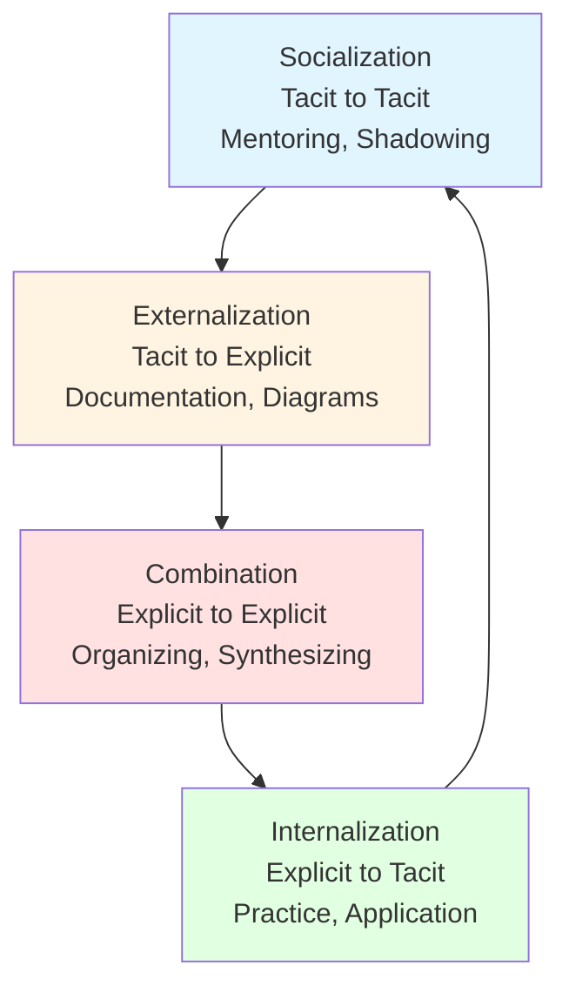
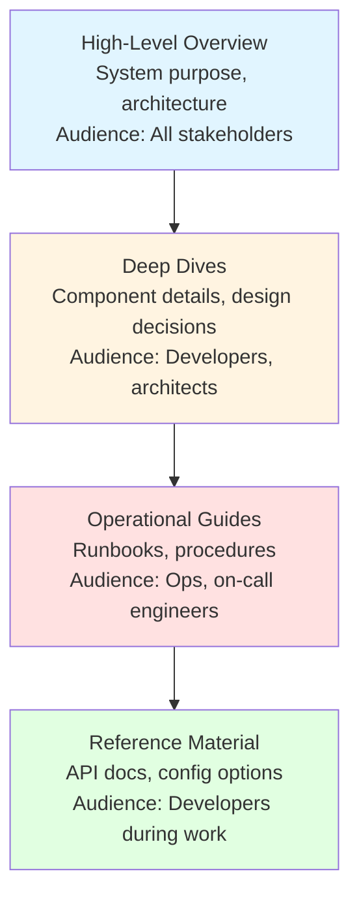

# Knowledge Transfer Plan - <!-- Solution name from codebase -->

> This document establishes a structured knowledge transfer program to ensure sustainable capability development, minimize dependency on key individuals, and enable successful transition from legacy to modernized system operations.

**Reference**: Based on knowledge management frameworks including SECI model (Nonaka & Takeuchi), Communities of Practice (Wenger), and organizational learning theory.

**Citations**:
- Nonaka, I., & Takeuchi, H. (1995). *The Knowledge-Creating Company*. Oxford University Press.
- Wenger, E. (1998). *Communities of Practice: Learning, Meaning, and Identity*. Cambridge University Press.
- Senge, P. (1990). *The Fifth Discipline: The Art & Practice of The Learning Organization*. Doubleday.

## Table of Contents

- [Executive Summary](#executive-summary)
- [Knowledge Transfer Framework](#knowledge-transfer-framework)
- [Knowledge Inventory](#knowledge-inventory)
- [Transfer Methods and Strategies](#transfer-methods-and-strategies)
- [Documentation Strategy](#documentation-strategy)
- [Training and Onboarding Programs](#training-and-onboarding-programs)
- [Mentoring and Shadowing](#mentoring-and-shadowing)
- [Knowledge Validation and Assessment](#knowledge-validation-and-assessment)
- [Transition Planning](#transition-planning)
- [Risk Mitigation](#risk-mitigation)
- [Success Criteria](#success-criteria)
- [Evidence Sources](#evidence-sources)

---

## Executive Summary

### Purpose

This knowledge transfer plan ensures systematic capture, documentation, and transfer of critical knowledge from <!-- current team/consultants from codebase --> to <!-- target team from codebase -->, enabling sustainable operation and evolution of <!-- Solution name from codebase --> post-modernization.

**Reasoning**: Knowledge transfer is critical success factor in modernization projects. Failure to adequately transfer knowledge results in continued dependency on external resources, reduced team velocity, and increased risk of operational issues.

### Knowledge Transfer Objectives

1. **Eliminate Key Person Dependencies**: Distribute critical knowledge across team members
   - **Reference**: "Bus factor" risk mitigation - industry best practice for team resilience
   - **Reasoning**: Concentration of knowledge creates single points of failure; distribution enables team redundancy

2. **Enable Autonomous Operations**: Build team capability to operate and evolve system independently
   - **Reference**: Self-organizing team principles from Agile methodologies
   - **Reasoning**: Long-term success requires team autonomy without external dependencies

3. **Preserve Institutional Knowledge**: Capture tacit and explicit knowledge in accessible formats
   - **Reference**: Nonaka's SECI model - Socialization, Externalization, Combination, Internalization
   - **Reasoning**: Tacit knowledge (know-how) must be externalized to survive personnel changes

4. **Accelerate New Team Member Onboarding**: Reduce ramp-up time for future team additions
   - **Reference**: Cognitive load theory in learning and development
   - **Reasoning**: Structured onboarding reduces cognitive overload and accelerates productivity

### Transfer Approach

**Multi-Modal Strategy**: Combining multiple knowledge transfer methods for comprehensive coverage
- **Documentation**: Explicit knowledge capture
- **Hands-on Training**: Practical skill development
- **Mentoring/Pairing**: Tacit knowledge transfer
- **Shadowing**: Observation-based learning
- **Practice**: Learning by doing with support

**Reasoning**: Different knowledge types require different transfer methods; single-method approaches fail to capture full knowledge spectrum.

---

## Knowledge Transfer Framework

### SECI Model Application

**Reference**: Nonaka, I., & Takeuchi, H. (1995). *The Knowledge-Creating Company*

**Reasoning**: SECI model provides systematic framework for converting between tacit (personal, experiential) and explicit (codified, documented) knowledge.

#### Socialization (Tacit → Tacit)
**Methods**: Pair programming, shadowing, mentoring, communities of practice
**Application**: <!-- Team members from codebase --> work directly with <!-- experts from codebase --> to absorb tacit knowledge
**Reasoning**: Tacit knowledge (judgment, intuition, context) cannot be fully documented; requires social interaction

#### Externalization (Tacit → Explicit)
**Methods**: Documentation, diagrams, recorded demos, decision logs
**Application**: Convert expert knowledge into documented form (architecture docs, runbooks, decision records)
**Reasoning**: Externalization makes tacit knowledge shareable and persistent beyond individual experts

#### Combination (Explicit → Explicit)
**Methods**: Organizing documentation, creating learning paths, building knowledge bases
**Application**: Structure documentation into coherent learning resources
**Reasoning**: Organized explicit knowledge is more accessible and learnable than scattered documents

#### Internalization (Explicit → Tacit)
**Methods**: Hands-on practice, exercises, real-world problem solving
**Application**: Team applies documented knowledge in actual development/operations scenarios
**Reasoning**: Reading documentation alone doesn't build capability; practice converts explicit knowledge to tacit expertise

### Knowledge Types

| Knowledge Type | Description | Transfer Method | Example |
|----------------|-------------|-----------------|----------|
| **Explicit Knowledge** | Codified, documented, transferable through formal language | Documentation, training materials | Architecture diagrams, API specifications, coding standards |
| **Tacit Knowledge** | Personal, experiential, difficult to formalize | Mentoring, shadowing, pairing | Design judgment, debugging intuition, architectural trade-off decisions |
| **Embedded Knowledge** | Knowledge within processes, systems, routines | Process documentation, automation | Deployment procedures, incident response workflows |
| **Cultural Knowledge** | Organizational norms, values, practices | Immersion, participation | Team collaboration patterns, decision-making processes |

**Reasoning**: Different knowledge types require different transfer approaches; comprehensive program addresses all types.

---

## Knowledge Inventory

### Critical Knowledge Areas

**Priority System**:
- **P0 (Critical)**: Required for basic system operation; failure to transfer causes operational issues
- **P1 (High)**: Required for effective development and evolution
- **P2 (Medium)**: Improves efficiency and quality
- **P3 (Low)**: Nice-to-have, can be learned over time

| Knowledge Area | Priority | Current Holders | Complexity | Transfer Method | Status |
|----------------|----------|-----------------|------------|-----------------|--------|
| **System Architecture** | P0 | <!-- Architects from codebase --> | High | Documentation + walkthroughs | In Progress |
| **Database Schema & Migrations** | P0 | <!-- DBAs from codebase --> | Medium | Documentation + pairing | Not Started |
| **Deployment Procedures** | P0 | <!-- DevOps from codebase --> | Medium | Runbooks + shadowing | Not Started |
| **Incident Response** | P0 | <!-- On-call engineers from codebase --> | High | Playbooks + joint response | Not Started |
| **Business Domain Logic** | P1 | <!-- Domain experts from codebase --> | High | Documentation + pairing | Not Started |
| **Integration Points** | P1 | <!-- Integration engineers from codebase --> | Medium | Diagrams + testing | Not Started |
| **Security & Compliance** | P1 | <!-- Security team from codebase --> | Medium | Documentation + training | Not Started |
| **Performance Optimization** | P2 | <!-- Performance experts from codebase --> | High | Case studies + profiling sessions | Not Started |
| **Development Tooling** | P2 | <!-- Senior developers from codebase --> | Low | Documentation + demos | Not Started |
| **Testing Strategies** | P2 | <!-- QA leads from codebase --> | Medium | Examples + pairing | Not Started |

**Reasoning**: Prioritization ensures critical knowledge transfers first; parallel tracks enable efficient resource utilization.

### Knowledge Gaps Analysis

**Current Team Capabilities**:
- Assess existing knowledge through <!-- assessment method from codebase -->
- Identify gaps between current and required knowledge
- Prioritize gap closure based on operational needs

**Gap Identification Method**:
1. Skills inventory survey
2. Technical interviews/assessments
3. Observation during paired work
4. Self-assessment against competency framework

**Reasoning**: Understanding current capabilities enables targeted knowledge transfer rather than generic training.

---

## Transfer Methods and Strategies

### 1. Documentation-Based Transfer

**What**: Creation and maintenance of comprehensive written documentation

**When to Use**: Explicit knowledge that can be codified (procedures, specifications, standards)

**Deliverables**:
- System architecture documentation
- API documentation (OpenAPI/Swagger specs)
- Runbooks for operational procedures
- Decision records (ADRs)
- Code comments and inline documentation

**Quality Criteria**:
- **Completeness**: Covers all essential information
- **Accuracy**: Reflects current system state
- **Clarity**: Understandable by target audience
- **Accessibility**: Easy to find and search
- **Currency**: Includes last-updated date and review schedule

**Reference**: *Docs for Developers* (MacNamara, 2021) - technical documentation best practices

**Reasoning**: Documentation provides persistent, scalable knowledge resource but insufficient alone for tacit knowledge.

### 2. Hands-On Training Sessions

**What**: Structured workshops covering specific technical topics

**Format**:
- Duration: 2-4 hours per session
- Structure: 40% presentation, 60% hands-on exercises
- Group size: 4-8 participants for interaction

**Example Topics**:
- System architecture deep dive
- Database design and query optimization
- Deployment and rollback procedures
- Debugging and troubleshooting techniques
- Security best practices implementation

**Effectiveness Measures**:
- Pre/post training assessments
- Hands-on exercise completion
- Follow-up application in real work

**Reference**: Cognitive load theory - active learning more effective than passive listening

**Reasoning**: Structured training provides foundation; hands-on practice builds retention and capability.

### 3. Pair Programming / Pairing

**What**: Two developers working together on same task at one workstation

**Approach**:
- **Driver**: Writes code
- **Navigator**: Reviews, suggests, asks questions
- **Rotation**: Switch roles every 30-60 minutes

**Benefits**:
- Real-time knowledge transfer
- Immediate feedback and correction
- Context and rationale shared naturally
- Builds team relationships

**When to Use**:
- Complex features requiring deep domain knowledge
- Unfamiliar codebase areas
- Critical system components
- Debugging difficult issues

**Reference**: Williams, L., & Kessler, R. (2003). *Pair Programming Illuminated* - empirical benefits of pairing

**Reasoning**: Pairing transfers tacit knowledge (judgment, problem-solving approaches) that documentation cannot capture.

### 4. Shadowing and Observation

**What**: Learner observes expert performing actual work

**Application Scenarios**:
- **Incident Response**: Observe expert diagnosing and resolving production issues
- **Architecture Reviews**: Participate in design decision discussions
- **Customer Interactions**: Shadow support calls or stakeholder meetings
- **Deployment Activities**: Observe release process execution

**Structure**:
1. **Pre-shadow**: Expert explains what will happen and why
2. **Shadow**: Observer watches, takes notes, asks clarifying questions
3. **Debrief**: Expert explains decisions, trade-offs, judgment calls
4. **Documentation**: Capture learnings in notes/runbooks

**Reasoning**: Observation reveals real-world application of knowledge including decision-making processes and contextual factors.

### 5. Reverse Shadowing (Expert Observes Learner)

**What**: Expert observes learner performing task, providing guidance

**Benefits**:
- Validates knowledge transfer effectiveness
- Identifies misunderstandings early
- Builds learner confidence through supported practice
- Expert available for questions during actual work

**Progression**:
- Phase 1: Learner attempts with expert ready to intervene
- Phase 2: Learner performs independently with expert reviewing
- Phase 3: Learner fully autonomous, expert available if needed

**Reasoning**: Validates internalization of knowledge; catches gaps before they cause issues.

### 6. Communities of Practice

**What**: Groups of practitioners sharing knowledge around common domain

**Reference**: Wenger, E. (1998). *Communities of Practice*

**Implementation**:
- **Regular meetings**: Weekly or bi-weekly knowledge sharing
- **Focus areas**: <!-- Technology areas from codebase --> (e.g., frontend, backend, DevOps, security)
- **Activities**: Tech talks, code reviews, problem solving, tool demos

**Benefits**:
- Continuous learning beyond formal transfer
- Cross-pollination of knowledge
- Builds team cohesion
- Creates support network

**Reasoning**: Communities provide sustainable knowledge sharing mechanism beyond one-time transfer events.

---

## Documentation Strategy

### Documentation Hierarchy

### Essential Documentation

| Document Type | Purpose | Update Frequency | Owner |
|---------------|---------|------------------|-------|
| **System Architecture** | Overall structure, major components, design decisions | After significant changes | Architecture team |
| **Component Deep Dives** | Detailed component design and implementation | With component changes | Component owners |
| **API Documentation** | Interface specifications, usage examples | Automated from code | API developers |
| **Database Schema** | Entity relationships, constraints, indexes | With schema changes | Database team |
| **Deployment Runbooks** | Step-by-step deployment procedures | After process changes | DevOps team |
| **Incident Playbooks** | Response procedures for common incidents | After incidents or changes | On-call rotation |
| **Developer Onboarding** | Setup guide, development workflow | Quarterly or as needed | Tech leads |
| **Architecture Decision Records** | Context and rationale for key decisions | When decisions made | Decision makers |
| **Troubleshooting Guides** | Common problems and solutions | Continuous based on incidents | All team members |

**Reasoning**: Layered documentation serves different audiences and use cases; comprehensive coverage enables self-service learning.

### Documentation Quality Standards

**Every document must include**:
- **Purpose**: Why this document exists
- **Audience**: Who should read it
- **Last Updated**: Currency indicator
- **Owner**: Who maintains it
- **Related Docs**: Links to connected information

**Writing Standards**:
- **Clarity**: Plain language, defined terms
- **Structure**: Logical organization with clear headings
- **Examples**: Concrete illustrations of concepts
- **Diagrams**: Visual representations where helpful
- **Searchability**: Keywords and tags for discovery

**Reference**: *Docs for Developers* (MacNamara, 2021)

**Reasoning**: Quality standards ensure documentation is actually useful rather than nominally existing.

---

## Training and Onboarding Programs

### Structured Learning Path

> **⚠️ CRITICAL - Training Timeline Customization Required**:
> - Week-based timelines below are **examples only** and must be customized based on:
>   - Team members' existing knowledge and experience levels
>   - System complexity and scope
>   - Available training time and learning capacity
>   - Parallel work commitments
> - **MUST** adjust durations based on actual team assessment and learning progress
> - **ACCEPTABLE**: Logical progression sequence without specific week numbers if team assessment pending
> - **NOT ACCEPTABLE**: Using generic week ranges without validation against actual team needs

**Foundation Phase** `<!-- Duration: Adjust based on team experience level and system complexity -->`
- System overview and business context
- Development environment setup
- Codebase orientation and structure
- Basic deployment to development environment
- **Assessment**: Can set up environment and explain system purpose

**Core Competency Phase** `<!-- Duration: Adjust based on architecture complexity and team background -->`
- Architecture deep dive
- Database and data flows
- Key business workflows
- Testing strategies and practices
- **Assessment**: Can explain architecture and implement basic features

**Operational Skills Phase** `<!-- Duration: Adjust based on operational complexity and team DevOps experience -->`
- Deployment procedures
- Monitoring and observability
- Incident response basics
- Security and compliance requirements
- **Assessment**: Can deploy and monitor applications independently

**Advanced Topics Phase** `<!-- Duration: Adjust based on performance requirements and team seniority -->`
- Performance optimization
- Integration points and dependencies
- Advanced debugging techniques
- Architecture decision-making
- **Assessment**: Can handle complex issues and make architectural decisions

**Reasoning**: Structured progression from basics to advanced prevents cognitive overload while building comprehensive capability. Actual timeline depends on team composition and system characteristics.

**Timeline Determination Factors**:
- Prior experience with similar technologies/architecture
- Team size and availability for training
- System complexity and documentation quality
- Hands-on practice opportunities

### Competency Framework

**Skill Levels**:
- **Level 1 (Awareness)**: Understands concept, can discuss it
- **Level 2 (Assisted Performance)**: Can perform with guidance
- **Level 3 (Independent Performance)**: Can perform without guidance
- **Level 4 (Expert)**: Can teach others, handles edge cases

**Target Competencies** (by role):

| Skill Area | Junior Developer | Senior Developer | Tech Lead |
|------------|------------------|------------------|------------|
| System Architecture | Level 1 | Level 3 | Level 4 |
| Domain Logic | Level 2 | Level 3 | Level 4 |
| Database | Level 2 | Level 3 | Level 3 |
| Deployment | Level 2 | Level 3 | Level 4 |
| Incident Response | Level 1 | Level 3 | Level 4 |
| Security | Level 1 | Level 2 | Level 3 |

**Assessment Method**: Combination of self-assessment, peer evaluation, and practical demonstration

**Reasoning**: Explicit competency levels enable gap identification and targeted development.

---

## Mentoring and Shadowing

### Mentorship Program Structure

**Pairing Strategy**:
- Each <!-- new team member from codebase --> assigned experienced mentor
- Mentor-mentee meetings: Weekly 1-on-1 sessions
- Duration: First 3 months minimum

**Mentor Responsibilities**:
- Answer questions and provide guidance
- Review code and provide feedback
- Share context and institutional knowledge
- Connect mentee with other experts
- Monitor progress and identify gaps

**Mentee Responsibilities**:
- Prepare questions for meetings
- Apply feedback in work
- Document learnings
- Provide feedback on transfer effectiveness

**Reference**: Formal mentoring programs show measurably faster ramp-up and higher retention

**Reasoning**: Structured mentoring provides personalized knowledge transfer and builds team relationships.

### Shadowing Schedule

| Activity | Duration | Participants | Focus |
|----------|----------|--------------|-------|
| **Architecture Review** | 2-4 hours | <!-- Architects, senior developers from codebase --> | Design decision-making process |
| **Code Review Session** | 1-2 hours | <!-- Senior developers from codebase --> | Code quality standards, feedback approach |
| **Incident Response** | Duration of incident | <!-- On-call engineer, observers from codebase --> | Diagnosis and resolution process |
| **Deployment** | 1-3 hours | <!-- DevOps team, observers from codebase --> | Deployment execution and monitoring |
| **Stakeholder Meeting** | 1 hour | <!-- Product owner, technical lead from codebase --> | Requirement gathering, prioritization |

**Reasoning**: Exposure to diverse activities builds well-rounded understanding of system and organization.

---

## Knowledge Validation and Assessment

### Assessment Methods

1. **Written Assessments**: Quiz-style tests on explicit knowledge
   - When: After documentation-based training
   - Purpose: Validate understanding of documented material

2. **Practical Exercises**: Hands-on tasks in safe environment
   - Examples: Deploy to staging, debug test issue, add feature
   - Purpose: Validate capability to apply knowledge

3. **Code Reviews**: Review of actual work output
   - Frequency: All code commits
   - Purpose: Assess quality and identify knowledge gaps

4. **Incident Participation**: Performance during real incidents
   - Observation during incident response
   - Purpose: Validate under-pressure application of knowledge

5. **Peer Evaluation**: Feedback from team members
   - 360-degree feedback
   - Purpose: Assess collaboration and communication skills

**Reasoning**: Multiple assessment methods provide comprehensive view of knowledge transfer effectiveness.

### Knowledge Gaps Remediation

**When gaps identified**:
1. **Immediate**: Provide additional pairing/mentoring
2. **Short-term**: Schedule targeted training session
3. **Medium-term**: Add to personal development plan
4. **Continuous**: Monitor progress in regular 1-on-1s

**Reasoning**: Early gap identification and remediation prevents knowledge deficits from causing operational issues.

---

## Transition Planning

### Phased Transition Approach

**Phase 1: Knowledge Transfer**
- Comprehensive documentation creation
- Structured training delivery
- Pairing and shadowing activities
- Knowledge assessment and gap remediation

**Phase 2: Supervised Independence**
- <!-- Target team from codebase --> performs tasks with <!-- current team from codebase --> available for questions
- Gradual reduction of expert involvement
- Focus on building confidence and autonomy

**Phase 3: Full Transition**
- <!-- Target team from codebase --> fully responsible
- <!-- Current team from codebase --> available for exceptional escalations only
- Knowledge retention validated through independent operation

**Phase 4: Post-Transition Support**
- On-call support for complex issues
- Periodic check-ins
- Knowledge reinforcement as needed

**Reasoning**: Phased approach reduces risk while building team capability progressively.

### Transition Readiness Criteria

**Ready to transition when**:
- ✓ All P0 knowledge areas transferred and validated
- ✓ All P1 knowledge areas transferred (may still be developing proficiency)
- ✓ Team demonstrates capability in assessments and real work
- ✓ Documentation complete and accessible
- ✓ Team confidence level high (self-reported readiness)
- ✓ Stakeholder approval obtained

**Reasoning**: Clear criteria prevent premature transition that could cause operational issues.

---

## Risk Mitigation

### Knowledge Transfer Risks

| Risk | Impact | Probability | Mitigation Strategy |
|------|--------|-------------|---------------------|
| **Key expert unavailability** | High | Medium | Record sessions, create redundancy with multiple knowledge holders |
| **Insufficient time allocated** | High | Medium | Explicit time allocation in project plan, management commitment |
| **Documentation becomes outdated** | Medium | High | Establish documentation maintenance process, review schedule |
| **Tacit knowledge not captured** | High | High | Emphasis on pairing, shadowing, mentoring beyond documentation |
| **Learner cognitive overload** | Medium | Medium | Phased learning path, spaced repetition, manageable chunks |
| **Knowledge gaps discovered post-transition** | High | Medium | Thorough assessment, extended support period, escalation path |
| **Team member turnover** | High | Low | Documentation, knowledge distribution, continuous onboarding |

**Reasoning**: Proactive risk identification and mitigation prevents knowledge transfer failures.

### Contingency Plans

**If key expert becomes unavailable**:
- Leverage recorded sessions and documentation
- Engage alternate experts from <!-- backup resources from codebase -->
- Extend timeline if necessary

**If knowledge gaps discovered post-transition**:
- Escalation path to original experts
- On-demand training sessions
- Additional pairing time

**Reasoning**: Contingency plans enable graceful handling of unexpected issues.

---

## Success Criteria

### Knowledge Transfer Success Metrics

| Metric | Target | Measurement Method | Reasoning |
|--------|--------|-------------------|------------|
| **Documentation Completeness** | 100% of P0/P1 areas covered | Documentation audit checklist | Comprehensive coverage ensures no critical gaps |
| **Assessment Pass Rate** | >90% on competency assessments | Written and practical test scores | Validates knowledge internalization |
| **Independent Task Completion** | >80% tasks completed without assistance | Task completion tracking | Demonstrates practical capability |
| **Team Confidence** | >4.0/5.0 average self-reported readiness | Team survey | Confidence correlates with actual capability |
| **Incident Response Capability** | Team handles incidents independently | Incident tracking (escalation rate < 20%) | Ultimate test of operational knowledge |
| **Onboarding Time** | New team member productive within 4 weeks | Time-to-productivity tracking | Validates documentation and process quality |
| **Knowledge Retention** | >90% retention at 3-month follow-up | Follow-up assessment | Ensures knowledge persists beyond initial transfer |

**Reasoning**: Multi-dimensional success criteria ensure comprehensive knowledge transfer, not just nominal completion.

---

## Evidence Sources

### Knowledge Management and Transfer References

1. **Nonaka, I., & Takeuchi, H. (1995)**. *The Knowledge-Creating Company: How Japanese Companies Create the Dynamics of Innovation*. Oxford University Press.
   - **Used for**: SECI model, tacit vs explicit knowledge, knowledge creation processes

2. **Wenger, E. (1998)**. *Communities of Practice: Learning, Meaning, and Identity*. Cambridge University Press.
   - **Used for**: Communities of practice framework, social learning theory

3. **Senge, P. (1990)**. *The Fifth Discipline: The Art & Practice of The Learning Organization*. Doubleday.
   - **Used for**: Learning organization principles, systems thinking

4. **Williams, L., & Kessler, R. (2003)**. *Pair Programming Illuminated*. Addison-Wesley.
   - **Used for**: Pair programming practices, empirical benefits

5. **MacNamara, R. (2021)**. *Docs for Developers: An Engineer's Field Guide to Technical Writing*. Apress.
   - **Used for**: Technical documentation best practices

6. **Hunt, D., & Thomas, A. (2019)**. *The Pragmatic Programmer* (20th Anniversary Edition). Addison-Wesley.
   - **Used for**: Knowledge sharing, mentoring, team development

7. **Kim, G., et al. (2016)**. *The DevOps Handbook*. IT Revolution Press.
   - **Used for**: Knowledge sharing in DevOps context, documentation practices

8. **Sweller, J. (1988)**. "Cognitive Load During Problem Solving: Effects on Learning." *Cognitive Science*, 12(2).
   - **Used for**: Cognitive load theory, learning design principles

### Industry Best Practices

- **Agile Methodologies**: Knowledge sharing through pairing, retrospectives, demos
- **DevOps Practices**: Documentation as code, runbooks, blameless postmortems
- **Site Reliability Engineering**: Incident response knowledge capture, on-call rotations for knowledge distribution
- **Apprenticeship Patterns**: Software craftsmanship approach to skill development

---

## Document Metadata

- **Document Version:** 1.0
- **Status:** Draft
- **Maintained By:** <!-- Knowledge transfer lead from codebase -->
- **Review Frequency**: After each major milestone, minimum quarterly
- **Next Review Date**: (Set upon approval - aligned with transition phase milestones)
- **Related Documents:**
  - System Architecture Documentation
  - Developer Onboarding Guide
  - Operational Runbooks
  - Modernization Strategy

---

## Document History

| Version | Date | Author | Changes |
|---------|------|--------|----------|
| 1.0 | (Initial creation date) | <!-- Author/team name from documentation --> | Initial knowledge transfer plan creation |

---

**Note**: This knowledge transfer plan should be adapted to the specific context including team size, complexity, timeline, and organizational culture. Regular assessment and adjustment ensure the plan remains effective throughout the transfer process.
