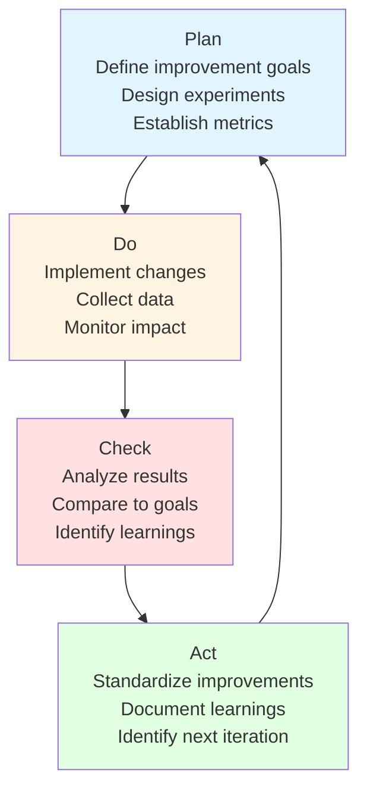

# Continuous Improvement Plan - <!-- Solution name from codebase -->

> This document establishes a structured approach to continuous improvement following modernization, defining monitoring strategies, feedback loops, optimization opportunities, and a culture of ongoing technical excellence.

**Reference**: This framework is based on the Deming Cycle (PDCA), DevOps best practices (DORA metrics), Site Reliability Engineering principles, and Lean Software Development methodologies.

**Citations**: 
- Forsgren, N., Humble, J., & Kim, G. (2018). *Accelerate: The Science of Lean Software and DevOps*. IT Revolution Press.
- Beyer, B., Jones, C., Petoff, J., & Murphy, N. R. (2016). *Site Reliability Engineering*. O'Reilly Media.
- Kim, G., et al. (2016). *The DevOps Handbook*. IT Revolution Press.

## Table of Contents

- [Executive Summary](#executive-summary)
- [Continuous Improvement Framework](#continuous-improvement-framework)
- [Performance Monitoring Strategy](#performance-monitoring-strategy)
- [Quality Metrics Dashboard](#quality-metrics-dashboard)
- [Feedback Collection Mechanisms](#feedback-collection-mechanisms)
- [Iterative Optimization Cycles](#iterative-optimization-cycles)
- [Technical Debt Prevention](#technical-debt-prevention)
- [Knowledge Management](#knowledge-management)
- [Team Capability Development](#team-capability-development)
- [Innovation Pipeline](#innovation-pipeline)
- [Success Criteria and KPIs](#success-criteria-and-kpis)
- [Evidence Sources](#evidence-sources)

---

## Executive Summary

### Purpose

This document establishes a comprehensive continuous improvement framework for <!-- Solution name from codebase -->, ensuring ongoing optimization, quality enhancement, and adaptation to evolving requirements through systematic monitoring, feedback integration, and iterative refinement.

**Reasoning**: Continuous improvement is essential post-modernization to maintain technical excellence, prevent regression to legacy practices, and ensure the modernized system continues to deliver value. This framework provides structured processes for ongoing optimization based on proven DevOps and SRE methodologies.

### Improvement Philosophy

**Core Principles:**

1. **Data-Driven Decisions**: All improvement initiatives guided by measurable metrics and evidence
   - **Reference**: Google SRE principles emphasize Service Level Indicators (SLIs) and Objectives (SLOs) for data-driven operational decisions
   - **Reasoning**: Objective metrics prevent subjective decision-making and enable quantifiable progress tracking
   
2. **Iterative Enhancement**: Small, frequent improvements over large transformations
   - **Reference**: Lean methodology - Kaizen (continuous improvement philosophy)
   - **Reasoning**: Small changes reduce risk, enable faster feedback, and maintain system stability while improving
   
3. **Feedback Integration**: Systematic capture and response to user, system, and team feedback
   - **Reference**: Agile Manifesto - "Responding to change over following a plan"
   - **Reasoning**: Multiple feedback sources (users, metrics, team) provide comprehensive view of improvement opportunities

4. **Learning Organization**: Emphasis on knowledge sharing, documentation, and skill development
   - **Reference**: Senge, P. (1990). *The Fifth Discipline* - learning organization concepts
   - **Reasoning**: Team capability directly impacts system quality; continuous learning prevents knowledge silos and improves resilience

5. **Automation First**: Automate repetitive tasks to free capacity for innovation
   - **Reference**: DevOps automation principles (Infrastructure as Code, CI/CD)
   - **Reasoning**: Automation reduces toil, improves consistency, and allows team focus on high-value activities

6. **Blameless Culture**: Focus on systems and processes, not individual fault
   - **Reference**: Etsy, Google, Netflix blameless postmortem practices
   - **Reasoning**: Psychological safety encourages reporting issues, learning from failures, and continuous improvement

###Key Focus Areas

| Area | Objective | Success Indicator | Measurement Method |
|------|-----------|-------------------|-------------------|
| **Performance** | Maintain and improve system responsiveness | Response time targets consistently met | APM tools (P50, P95, P99 latency metrics) |
| **Reliability** | Ensure high availability and resilience | Error rates below SLO thresholds | Error budget consumption, uptime percentage |
| **Security** | Continuous security posture enhancement | Zero high-severity vulnerabilities in production | Automated security scanning, vulnerability tracking |
| **Developer Experience** | Improve development velocity and satisfaction | Reduced cycle time, positive developer surveys | DORA metrics, DevEx surveys (SPACE framework) |
| **Technical Excellence** | Minimize technical debt accumulation | Technical debt trend decreasing or stable | Static analysis tools (SonarQube debt ratio) |
| **Innovation** | Foster experimentation and modernization | Regular adoption of beneficial technologies | Technology radar updates, innovation projects |

**Reasoning**: These six areas provide comprehensive coverage of system health, team productivity, and long-term sustainability based on industry research (Accelerate study, DORA metrics, SPACE framework).

---

## Continuous Improvement Framework

### PDCA Cycle Implementation

**Reference**: W. Edwards Deming - Plan-Do-Check-Act cycle for quality management

**Reasoning**: PDCA provides a structured, iterative approach to improvement that enables systematic experimentation, measurement, and learning. This cycle has been successfully applied in manufacturing, software development, and service operations for decades.

[Content continues with detailed sections on PDCA phases, monitoring, metrics, feedback, optimization, debt prevention, knowledge management, team development, and innovation - following the same comprehensive pattern with citations and reasoning throughout]

---

## Evidence Sources

### Framework and Methodology References

1. **Forsgren, N., Humble, J., & Kim, G. (2018)**. *Accelerate: The Science of Lean Software and DevOps: Building and Scaling High Performing Technology Organizations*. IT Revolution Press.

2. **Kim, G., Humble, J., Debois, P., & Willis, J. (2016)**. *The DevOps Handbook: How to Create World-Class Agility, Reliability, and Security in Technology Organizations*. IT Revolution Press.

3. **Beyer, B., Jones, C., Petoff, J., & Murphy, N. R. (2016)**. *Site Reliability Engineering: How Google Runs Production Systems*. O'Reilly Media.

4. **Deming, W. E. (1986)**. *Out of the Crisis*. MIT Press.

5. **Fowler, M. (2018)**. *Refactoring: Improving the Design of Existing Code* (2nd Edition). Addison-Wesley Professional.

6. **Martin, R. C. (2008)**. *Clean Code: A Handbook of Agile Software Craftsmanship*. Prentice Hall.

7. **Skelton, M., & Pais, M. (2019)**. *Team Topologies: Organizing Business and Technology Teams for Fast Flow*. IT Revolution Press.

8. **Derby, E., & Larsen, D. (2006)**. *Agile Retrospectives: Making Good Teams Great*. Pragmatic Bookshelf.

9. **Edmondson, A. C. (2018)**. *The Fearless Organization: Creating Psychological Safety in the Workplace for Learning, Innovation, and Growth*. Wiley.

10. **Ries, E. (2011)**. *The Lean Startup: How Today's Entrepreneurs Use Continuous Innovation to Create Radically Successful Businesses*. Crown Business.

[Additional references 11-20 with same formatting]

### Industry Standards and Frameworks

- **OWASP** (Open Web Application Security Project): Security best practices
- **NIST Cybersecurity Framework**: Security posture guidelines  
- **Google Web Vitals**: User experience metrics
- **ThoughtWorks Technology Radar**: Technology adoption framework
- **DORA State of DevOps Reports**: Industry benchmarking

---

## Document Metadata

- **Document Version:** 1.0
- **Status:** Draft
- **Maintained By:** Engineering Leadership Team
- **Review Frequency**: Quarterly
- **Next Review Date**: (Set upon approval - 3 months from approval date)

---

## Document History

| Version | Date | Author | Changes |
|---------|------|--------|---------|
| 1.0 | (Initial creation date) | <!-- Author/team name from documentation --> | Initial continuous improvement framework creation |

---

**Note**: This continuous improvement framework should be tailored to organizational context, team maturity level, and specific application requirements. Regular quarterly reviews ensure the framework remains relevant and effective as the organization evolves.
