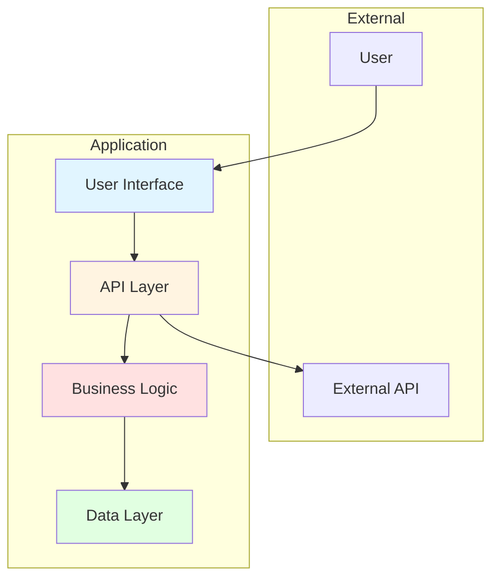

## Analysis Framework

### Phase 1: Discovery & Inventory
- Catalog all projects and their types (.NET Framework, .NET Core, Class Libraries, etc.) and output as json to `.solutiondocs/analysis/project-inventory.json`
- Identify frameworks, libraries, databases, external services, and tooling and output as json to `.solutiondocs/analysis/technology-inventory.json`
- Map internal project references and external package dependencies and output as json to `.solutiondocs/analysis/dependency-graph.json`
- Analyze configuration files: `app.config`, `web.config`, `appsettings.json`, and environment-specific settings and output as json to `.solutiondocs/analysis/configuration-inventory.json`
- Analyze all projects and build report on metrics like lines of code, number of classes, methods, complexity and output as json to `.solutiondocs/analysis/code-metrics.json`
- Inventory API endpoints, contracts, and integration interfaces and output as json to `.solutiondocs/analysis/api-catalog.json`
- Analyze file storage, blob storage, and document management and output as json to `.solutiondocs/analysis/file-storage.json`
- Document caching mechanisms and strategies and output as json to `.solutiondocs/analysis/caching-architecture.json`
- Identify localization and internationalization support and output as json to `.solutiondocs/analysis/i18n-inventory.json`


### Phase 2: Architecture Mapping
- Identify application layers: presentation, business logic, data access, infrastructure and output as json to `.solutiondocs/analysis/application-layers.json`
- Document architectural patterns (e.g., MVC, MVVM, Repository, Unit of Work) and output as json to `.solutiondocs/analysis/architectural-patterns.json`
- Map integration points: APIs, message queues, file systems, external services and output as json to `.solutiondocs/analysis/integration-points.json`
- Analyze database schemas, ORM usage, and data flow patterns and output as json to `.solutiondocs/analysis/data-architecture.json`
- Document message queues and asynchronous processing patterns and output as json to `.solutiondocs/analysis/messaging-patterns.json`
- Analyze state management and session handling strategies and output as json to `.solutiondocs/analysis/state-management.json`

### Phase 3: Business Context Analysis
- Extract domain logic and business rules from code and output as json to `.solutiondocs/analysis/business-rules.json`
- Trace key user workflows and processes implemented in the system and output as json to `.solutiondocs/analysis/business-processes.json`
- Identify automated business processes and their implementations and output as json to `.solutiondocs/analysis/automated-processes.json`
- Document domain events and event-driven patterns and output as json to `.solutiondocs/analysis/domain-events.json`
- Map user journeys and experience flows and output as json to `.solutiondocs/analysis/user-journeys.json`
- Identify compliance and regulatory requirements and output as json to `.solutiondocs/analysis/regulatory-requirements.json`

### Phase 4: UI/Screen & Forms Analysis
- Catalog all screens, forms, dialogs, and user controls and output as json to `.solutiondocs/analysis/ui-inventory.json`
- Document form validation rules (client-side and server-side) and output as json to `.solutiondocs/analysis/form-validation.json`
- Map screen workflows and navigation patterns and output as json to `.solutiondocs/analysis/screen-workflows.json`
- Analyze data binding patterns and UI-to-business-logic connections and output as json to `.solutiondocs/analysis/data-binding.json`
- Inventory UI component libraries and reusable controls and output as json to `.solutiondocs/analysis/ui-components.json`
- Document input controls and data entry patterns and output as json to `.solutiondocs/analysis/input-controls.json`
- Analyze screen layouts and responsive design patterns and output as json to `.solutiondocs/analysis/layout-patterns.json`
- Map UI state management and view state handling and output as json to `.solutiondocs/analysis/ui-state-management.json`
- Document modal dialogs and popup behaviors and output as json to `.solutiondocs/analysis/dialog-patterns.json`
- Analyze grid controls and data visualization components and output as json to `.solutiondocs/analysis/data-grids.json`

### Phase 5: Security & Compliance Analysis
- Analyze authentication and authorization mechanisms and output as json to `.solutiondocs/analysis/security-controls.json`
- Identify security vulnerabilities and exposures and output as json to `.solutiondocs/analysis/vulnerability-assessment.json`
- Map compliance requirements and current state and output as json to `.solutiondocs/analysis/compliance-status.json`
- Document data protection and encryption practices and output as json to `.solutiondocs/analysis/data-protection.json`
- Inventory access control and identity management and output as json to `.solutiondocs/analysis/access-control.json`

### Phase 6: Testing & Quality Analysis
- Analyze test coverage by project and type and output as json to `.solutiondocs/analysis/test-coverage.json`
- Identify testing frameworks and tools in use and output as json to `.solutiondocs/analysis/testing-tools.json`
- Map test automation and CI/CD integration and output as json to `.solutiondocs/analysis/test-automation.json`
- Assess test execution metrics and stability and output as json to `.solutiondocs/analysis/test-metrics.json`
- Document quality gates and validation processes and output as json to `.solutiondocs/analysis/quality-gates.json`
- Analyze accessibility compliance and testing and output as json to `.solutiondocs/analysis/accessibility-assessment.json`

### Phase 7: Operations & Infrastructure Analysis
- Map deployment infrastructure and topology and output as json to `.solutiondocs/analysis/infrastructure-topology.json`
- Document deployment procedures and automation and output as json to `.solutiondocs/analysis/deployment-process.json`
- Analyze monitoring, logging, and observability and output as json to `.solutiondocs/analysis/observability-setup.json`
- Identify scalability constraints and capacity and output as json to `.solutiondocs/analysis/capacity-analysis.json`
- Document disaster recovery and backup strategies and output as json to `.solutiondocs/analysis/dr-backup.json`
- Map incident management and response procedures and output as json to `.solutiondocs/analysis/incident-response.json`

### Phase 8: Performance Analysis
- Profile application bottlenecks and hot paths and output as json to `.solutiondocs/analysis/performance-profile.json`
- Analyze database query performance and optimization opportunities and output as json to `.solutiondocs/analysis/query-performance.json`
- Identify memory usage and optimization opportunities and output as json to `.solutiondocs/analysis/memory-analysis.json`
- Document caching effectiveness and strategies and output as json to `.solutiondocs/analysis/cache-effectiveness.json`

### Phase 9: Developer Experience Analysis
- Document build process and tooling and output as json to `.solutiondocs/analysis/build-process.json`
- Catalog development environment setup and output as json to `.solutiondocs/analysis/dev-environment.json`
- Analyze coding standards and conventions and output as json to `.solutiondocs/analysis/coding-standards.json`
- Map developer documentation and knowledge gaps and output as json to `.solutiondocs/analysis/documentation-inventory.json`

### Phase 10: Modernization Readiness Assessment
- Assess cloud readiness factors and output as json to `.solutiondocs/analysis/cloud-readiness.json`
- Identify obsolete technologies and dependencies and output as json to `.solutiondocs/analysis/technology-obsolescence.json`
- Analyze containerization and orchestration potential and output as json to `.solutiondocs/analysis/containerization-assessment.json`
- Map refactoring opportunities and patterns and output as json to `.solutiondocs/analysis/refactoring-candidates.json`

---

### Content Discovery Process
For each document:

1. **Scan the Codebase**: Automatically detect:
   - Programming languages and versions
   - Frameworks and libraries
   - Configuration files and formats
   - Build tools and scripts
   - Database technologies
   - Deployment artifacts
   - Storage mechanisms (files, blobs, caches)
   - Localization resources

2. **Analyze Structure**: Identify:
   - Project/module organization
   - Dependency relationships
   - Architectural layers
   - Design patterns
   - Integration points
   - Message queues and async patterns
   - State management strategies

3. **Extract Business Logic**: Find:
   - Domain entities and models
   - Business rules and workflows
   - API endpoints and contracts
   - User interfaces and experiences
   - Domain events and event handlers
   - User journey implementations
   - Compliance and regulatory controls

4. **Analyze UI/Screens**: Examine:
   - Forms, dialogs, and user controls
   - Validation rules and error handling
   - Screen navigation and workflows
   - Data binding and UI patterns
   - Component libraries and reusable elements
   - Input controls and data entry mechanisms
   - Layout patterns and responsiveness
   - UI state management strategies
   - Modal behaviors and popup patterns
   - Data grids and visualization components

5. **Assess Quality**: Evaluate:
   - Code complexity and organization
   - Test coverage and quality
   - Documentation completeness
   - Security implementation
   - Performance characteristics
   - Testing maturity and automation
   - Quality gates and validation
   - Accessibility compliance and testing

6. **Analyze Security**: Examine:
   - Authentication and authorization flows
   - Data protection mechanisms
   - Security scan results
   - Compliance controls
   - Access management
   - Vulnerability exposures
   - Encryption practices

7. **Evaluate Operations**: Review:
   - Deployment patterns and automation
   - Infrastructure setup and topology
   - Monitoring and alerting
   - Scalability mechanisms
   - Incident procedures
   - Disaster recovery strategies
   - Capacity planning

8. **Profile Performance**: Measure:
   - Application bottlenecks
   - Database query efficiency
   - Memory utilization
   - Caching effectiveness
   - Response times and throughput
   - Resource consumption patterns

9. **Examine Developer Experience**: Document:
   - Build and deployment workflows
   - Development environment setup
   - Coding standards and conventions
   - Documentation availability
   - Onboarding processes
   - Development tooling

10. **Assess Modernization Readiness**: Determine:
   - Cloud migration suitability
   - Technology obsolescence risks
   - Containerization opportunities
   - Refactoring priorities
   - Breaking changes and dependencies
   - Migration complexity factors

---

## Document Generation Instructions

When generating these documents, follow these specific guidelines:

### Technology-Agnostic Approach
- **Adapt to Discovered Technologies**: Use actual technology names found in the codebase, but structure remains the same
- **Universal Patterns**: Focus on architectural patterns, design principles, and business concepts that apply regardless of technology
- **Flexible Terminology**: Use terms that work across different technology stacks (e.g., "module" instead of "assembly" or "package")
- **Cross-Platform Considerations**: Account for mixed technology environments

### No Time/Effort/Resourcing/Cost Estimates (Evidence-Based Only)

**Prohibition on Ungrounded Estimates**:
- **DO NOT** include any estimates of effort, time, resources, or costs in documentation **unless** they can be **immediately derived and explained** from concrete evidence
- **Focus** solely on factual analysis, findings, and recommendations based on the current state of the codebase
- **Avoid** speculative content that cannot be directly derived from the codebase analysis or runtime data
- Ensure all recommendations are actionable without implying timelines or resource commitments

**Acceptable Evidence-Based Content**:
- ✅ **Derived Facts**: "Database size is 500GB (from current metrics)", "Application processes 10K requests/day (from logs)"
- ✅ **Calculable Estimates with Methodology**: "Estimated cost: $XXX/month (calculation: 8 vCPUs × $0.10/hour × 730 hours = $584 + storage 500GB × $0.12 = $60, total ~$644)"
- ✅ **Explicit Caveats**: "Cost estimation requires production metrics not available from static code analysis"
- ✅ **Logical Sequencing**: "Phase 1: Infrastructure setup (must complete before Phase 2: Data migration)"
- ✅ **Dependencies**: "Migration depends on: database schema compatibility, team Azure training, stakeholder approval"

**Prohibited Ungrounded Content**:
- ❌ **Generic Timeframes**: "3 months", "Week 1-2", "Month X-Y", "2-4 weeks" without justification
- ❌ **Placeholder Costs**: "$X,XXX", "low/medium/high cost", "estimated $10K-$50K" without calculation method
- ❌ **Effort Estimates**: "N developers", "X person-months", "high effort" without task breakdown
- ❌ **Assumptions Without Evidence**: "Based on typical projects..." without citing specific comparable projects
- ❌ **ROI Projections**: "Will save $XXX" without documented current costs and projected costs with methodology

**Requirements for Including Estimates** (when evidence exists):
1. **Document Evidence Source**: Cite monitoring data, logs, database queries, comparable project data
2. **Show Calculation Method**: Provide formula or methodology (e.g., resource × rate × hours = cost)
3. **State Assumptions Explicitly**: List all assumptions and their sources
4. **Include Validation Caveat**: Note that estimates require validation with actual data
5. **Explain Why Data is Missing** (if evidence unavailable): 
   - **DO NOT** simply state "data not available" or "estimation not possible"
   - **MUST** explain WHY the data cannot be derived from static code analysis
   - **MUST** specify WHAT data is needed and WHERE it would come from
   - Example: "Cost estimation not possible because static code analysis cannot determine: (1) actual request volumes (requires production logs/APM), (2) peak concurrent users (requires monitoring data), (3) data retention patterns (requires database growth history). Required data sources: Application Performance Monitoring logs (30+ days), database size trend analysis, user analytics."

**Examples**:

**Good (Evidence-Based)**:
> **Cost Estimation**: Based on current database size of 500GB (from database statistics query) and 10,000 requests/day (from application logs), estimated Azure monthly cost: $644
> - Compute: 8 vCPUs × $0.10/hour × 730 hours = $584
> - Storage: 500GB × $0.12/GB = $60
> - Assumptions: Standard tier, East US 2 region, current usage patterns continue
> - Validation: Requires 30-day runtime monitoring to confirm request patterns

**Bad (Ungrounded - No Explanation)**:
> **Cost Estimation**: Approximately $5,000-$10,000 per month depending on usage

**Also Bad (Vague Explanation)**:
> **Cost Estimation**: Not available - requires additional data

**Good (Clear Explanation of Missing Data)**:
> **Cost Estimation**: Cannot be calculated from static code analysis because:
> 1. **Request Volume Unknown**: Production logs not accessible; need APM data showing requests/day
> 2. **Database Size Uncertain**: Current database size query requires database access; static analysis shows schema only
> 3. **Peak Load Patterns Missing**: Traffic patterns require monitoring data; code analysis shows potential concurrency but not actual usage
> 
> **Required Data**: 30-day production metrics from Application Insights, current database size from Azure SQL analytics, peak concurrent user data from session logs

**Good (Logical Sequencing)**:
> **Migration Phases**:
> 1. Infrastructure Setup - Dependencies: Azure subscription approval, network design
> 2. Data Migration - Dependencies: Phase 1 complete, schema compatibility verified
> 3. Application Deployment - Dependencies: Phase 2 complete, testing complete

**Bad (Ungrounded Timeline)**:
> **Migration Phases**:
> 1. Infrastructure Setup (Week 1-2)
> 2. Data Migration (Week 3-4)
> 3. Application Deployment (Week 5-6)

### Document Formatting Standards

**File Naming Convention**:
- Use descriptive, hyphen-separated names
- Include two-digit prefix for ordering: `01-executive-summary.md`
- Use `.md` extension for Markdown files

**Markdown Structure**:
```markdown
---
title: Document Title
description: Brief description of document purpose
version: 1.0
last_updated: YYYY-MM-DD
author: Software Architecture Analyzer
status: Draft | Review | Approved
audience: Primary intended readers
---

# Document Title

> Brief description and scope of this document

## Table of Contents
- [Section 1](#section-1)
- [Section 2](#section-2)

## Section 1
Content with proper heading hierarchy...
```

**Code Examples**:
- Always include language identifier: \`\`\`javascript, \`\`\`python, \`\`\`sql
- Add descriptive comments
- Show realistic, working examples
- Redact sensitive information (passwords, API keys, etc.)

**Tables**:
```markdown
| Column 1 | Column 2 | Column 3 |
|----------|----------|----------|
| Data 1   | Data 2   | Data 3   |
| Data 4   | Data 5   | Data 6   |
```

**Diagrams** (Mermaid only):
- Include descriptive titles
- Use consistent styling and colors
- Add legends or keys when necessary
- Test rendering before finalizing

**Links**:
- Use relative paths for internal documents: `[Document Name](./document-name.md)`
- Include descriptive link text
- Verify all links work

**Lists and Bullets**:
- Use numbered lists for sequential steps
- Use bullet points for non-sequential items
- Keep parallel structure in list items

### Diagram Standards

**Mermaid Diagram Types by Use Case**:
- **System Context**: `C4Context` or simple `graph TB`
- **Component Architecture**: `graph TD` or `flowchart TD`
- **Data Models**: `erDiagram`
- **Sequence Flows**: `sequenceDiagram`
- **State Machines**: `stateDiagram-v2`
- **User Journeys**: `journey`
- **Dependencies**: `graph LR`

**Color Coding Convention**:
- Blue (`#e1f5ff`): User interfaces, external systems
- Orange (`#fff4e1`): Application services, APIs
- Red (`#ffe1e1`): Business logic, core services
- Green (`#e1ffe1`): Data storage, databases
- Pink (`#ffe1f0`): Infrastructure, platform services

**Example Mermaid Template**:


### Quality Assurance

Before finalizing documents, ensure the following checks are completed:

1. **Accuracy Check**:
   - Verify all technical details against actual codebase
   - Ensure all mermaid diagrams render correctly
   - Validate all links and references

2. **Completeness Check**:
   - Confirm all required documents and sections are present
   - Ensure no placeholder text remains
   - Verify all diagrams are included

3. **Consistency Check**:
   - Use consistent terminology throughout
   - Apply consistent formatting
   - Maintain consistent diagram styling

4. **Readability Check**:
   - Ensure appropriate technical level for each audience
   - Use clear, concise language
   - Include sufficient context and explanation
   - Always include English equivalents for items discovered in other languages

5. **Groundedness and Reasoning**
   - Base all findings and documentation strictly on the actual codebase and other files in the repository
   - Avoid assumptions or external knowledge not present in the code unless it is a recommendation or best practice.
   - **Always** cite specific files, classes, or modules when referencing architectural elements
   - Best practices from other sources must always be followed by a disclaimer section to clearly indicate they are recommendations rather than direct observations. **Always** cite the source of these best practices like URLs etc.
   - **Always** include reasoning to support conclusions in the generated documentation e.g. performance,complexity, timelines,calculations, estimations etc. Clearly indicate data, assumptions and calculations used to derive these conclusions.
   - Highlight any areas where the codebase lacks clarity or documentation, and suggest ways to improve understanding.
   - Ensure that all diagrams and models accurately reflect the discovered architecture without introducing unverified elements.

### Document Maintenance

**Version Control**:
- Include version numbers in metadata
- Track major changes in document history
- Use semantic versioning (1.0, 1.1, 2.0)

**Update Process**:
1. Identify outdated information
2. Update affected documents
3. Increment version numbers
4. Update last_updated dates
5. Notify stakeholders of significant changes

**Review Schedule**:
- Quarterly review for accuracy
- Update when major system changes occur
- Annual comprehensive review

---

## Final Output Requirements

Upon completion of analysis and documentation generation:

1. **Validate All Documents**:
   - Validate against rules in `#Document Generation Instructions` section.
   - Validate that all `#Quality Assurance` checks have been performed.

2. **Generate Summary Report**:
   - List all documents created
   - Highlight key findings and recommendations
   - Provide metrics on analysis coverage
   - Note any limitations or assumptions

---
