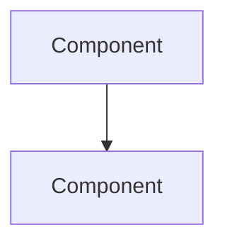
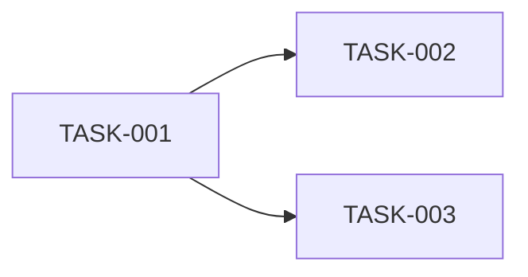

# Migration Plan Generation Template

## ⚠️ MANDATORY USAGE

**FOR ALL MIGRATION PLAN AGENTS**: This template is the **REQUIRED** standard for generating migration plans. All agents involved in migration planning MUST reference and follow this template.

### Agent Requirements

**Primary Plan Generator Agent** (`vb6-dotnetmvc-plan` or equivalent):
- ✅ MUST read this template file BEFORE generating any migration plan
- ✅ MUST ensure all subagents follow this template
- ✅ MUST validate final output against the Document Quality Checklist (Section below)
- ✅ MUST NOT deviate from the standard structure without explicit user approval

**Section Subagents** (`planner-helper-architecturecomparison`, `planner-helper-strategy`, etc.):
- ✅ MUST read the relevant section of this template for their assigned work
- ✅ MUST follow the exact structure and formatting rules
- ✅ MUST include all REQUIRED subsections
- ✅ MUST exclude all PROHIBITED content
- ✅ MUST use consistent terminology with other sections

**Final Output Requirement**:
> **The completed migration plan MUST conform to this template in structure, formatting, content requirements, and restrictions. Non-compliance is considered a defect.**

---

## Purpose
This template provides the standardized structure, formatting rules, and content requirements for generating comprehensive migration plans. All migration planning agents and subagents MUST follow this template to ensure consistency, completeness, and agent-execution readiness.

---

## Critical Restrictions

### ⛔ ABSOLUTE PROHIBITIONS
1. **NO Timelines**: Do NOT include any time-based estimates, durations, or schedules
   - ❌ Prohibited: "Est. Hours", "Duration", "Timeline", "Expected Completion", "Working Days"
   - ❌ Prohibited: Date ranges, sprint numbers, week numbers in task context
   - ✅ Allowed: "Execution Sequence" based on dependencies only

2. **NO Effort Estimates**: Do NOT include hour/day/week estimates for any task
   - ❌ Prohibited: Task tables with "Est. Hours" columns
   - ❌ Prohibited: Phrases like "2-3 hours", "1 week", "40 hours"
   - ✅ Allowed: Complexity levels (Low, Medium, High)

3. **NO Resource Allocation**: Do NOT assign human resources or team sizes
   - ❌ Prohibited: "1 developer", "2 team members", "Full-time resource"
   - ✅ Allowed: Agent-based execution model

### ✅ REQUIRED ELEMENTS
1. **Agent-Based Execution Disclaimer**: Every plan MUST include agent execution context
2. **Human Involvement Section**: Clearly state post-migration human tasks
3. **Dependency-Based Sequencing**: Use task dependencies, not time estimates
4. **Complexity Indicators**: Use Low/Medium/High complexity ratings
5. **Document Metadata**: Include version, date, and status
6. **🔴 Test-Driven Task Sequencing**: Every implementation task MUST be immediately followed by its corresponding unit test task to ensure all code is tested before moving forward

---

## Standard Document Structure

### 1. Document Header (REQUIRED)
```markdown
# [Source Technology] to [Target Technology] Migration Plan
## [Application Name]

---

**Document Metadata**
- **Project**: [Project Name] Migration
- **Source**: [Source Technology/Platform]
- **Target**: [Target Technology/Platform]
- **Version**: [X.Y]
- **Date**: [YYYY-MM-DD]
- **Status**: [Draft | Ready for Execution | In Progress | Completed]

---
```

### 2. Executive Summary (REQUIRED)
Must include:
- Project scope overview
- Migration approach summary
- Key deliverables
- Agent-based execution disclaimer
- Human developer involvement section

**Template**:
```markdown
## Executive Summary

This document provides a comprehensive technical migration plan for transforming [Application Name] from [Source Technology] to [Target Technology].

### Project Scope
- **Source Application**: [Description, size, complexity metrics]
- **Database Migration**: [Source DB] to [Target DB]
- **Architecture Transformation**: [Source Architecture] to [Target Architecture]
- **Migration Execution**: Agent-based migration across [X] granular tasks

### Migration Approach
This plan follows a **[strategy name]** migration strategy, [brief description].

### Key Deliverables
- [Deliverable 1]
- [Deliverable 2]
- [Deliverable 3]

### Important Notes

**Agent-Based Migration**: This plan is designed to be executed by the `[agent-name]` agent. The agent will autonomously implement the migration tasks following the technical specifications outlined in this document.

**Human Developer Involvement**: While the migration agent will complete the majority of the implementation work, additional actions may be required by a human developer after the agent has completed the migration. These may include:
- Final testing and validation in production-like environments
- UI/UX refinements and styling adjustments
- Business-specific customizations not covered in the base migration
- Security hardening and compliance validation
- Production deployment and monitoring setup
- Performance tuning and optimization
- Documentation review and updates

The developer can use the `[developer-agent-name]` agent for assistance with these post-migration tasks.
```

### 3. Table of Contents (REQUIRED)
Link to all major sections:
```markdown
## Table of Contents

1. [Architecture Comparison](#section-1-architecture-comparison)
2. [Migration Strategy](#section-2-migration-strategy)
3. [Implementation Steps](#section-3-implementation-steps)
4. [Task List](#section-4-task-list)
5. [Appendices](#appendices)
```

### 4. Section 1: Architecture Comparison (REQUIRED)
**Purpose**: Provide side-by-side comparison of source and target architectures

**Required Subsections**:
- Current [Source] Architecture
  - System characteristics table
  - Architecture diagram (Mermaid preferred)
  - Component descriptions
  
- Target [Target] Architecture
  - System characteristics table
  - Architecture diagram (Mermaid preferred)
  - Component descriptions
  
- Component Mapping Table
  - Map source components to target equivalents
  - Include transformation patterns
  
- Data Flow Comparison
  - Source system data flow
  - Target system data flow
  - Key differences

**Formatting Rules**:
- Use Mermaid diagrams for architecture visualization
- Use tables for characteristics and mapping
- Highlight breaking changes or major transformations

### 5. Section 2: Migration Strategy (REQUIRED)
**Purpose**: Define the overall migration approach and transformation patterns

**Required Subsections**:
- Overall Approach
  - Strategy name (e.g., "Layer-by-Layer", "Strangler Fig", "Big Bang")
  - Rationale for approach
  - Success criteria
  
- Layer-by-Layer Strategy (or applicable strategy)
  - Execution order
  - Layer descriptions
  - Integration points
  
- Technology Transformation Patterns
  - Source → Target pattern mappings (e.g., VB6 Forms → MVC Controllers)
  - Code transformation examples
  - Best practices
  
- Risk Mitigation
  - Identified risks
  - Mitigation strategies
  - Validation approaches

### 6. Section 3: Implementation Steps (REQUIRED)
**Purpose**: Break down migration into logical phases with execution sequence

**Required Structure**:
- Phases (typically 7-12 phases)
- Each phase must include:
  - Phase number and name
  - Objectives (bulleted list)
  - Key Actions (bulleted list)
  - Validation Criteria (bulleted list)
  - Tasks table (reference Task IDs)

**Phase Template**:
```markdown
## Phase [X]: [Phase Name]

### Objectives
- [Objective 1]
- [Objective 2]

### Key Actions
- [Action 1]
- [Action 2]

### Tasks

| Task ID | Task Description | Complexity | Dependencies |
|---------|-----------------|------------|--------------|
| TASK-XXX | [Description] | [Low/Medium/High] | [Dependencies] |

### Validation Criteria
- [ ] [Criterion 1]
- [ ] [Criterion 2]
```

**⛔ DO NOT INCLUDE**:
- "Estimated Timeline" sections
- "Duration" columns
- Week/Sprint assignments

**✅ INCLUDE INSTEAD**:
- "Execution Sequence" section (dependency-based)
- Dependency graphs
- Parallel execution opportunities

### 7. Section 4: Task List (REQUIRED)
**Purpose**: Granular task breakdown for agent execution

**Required Subsections**:

#### 7.1 Task Breakdown by Phase
For each phase, provide task table:

```markdown
## Phase [X]: [Phase Name] (TASK-XXX to TASK-YYY)

### [Subsection Name]

| Task ID | Task Description | [Source Column]* | [Target Column]* | Complexity | Status | Dependencies |
|---------|-----------------|------------------|------------------|------------|--------|--------------||
| TASK-XXX | [Description] | [Source reference] | [Target reference] | [Low/Medium/High] | Not Started | [TASK-IDs or "None"] |
```

**⛔ PROHIBITED COLUMNS**: Est. Hours, Duration, Assigned To, Sprint

**✅ REQUIRED COLUMNS**: Task ID, Task Description, Complexity, Status, Dependencies

**✅ RECOMMENDED COLUMNS**: 
- Source-specific column (e.g., "VB6 Form", "Java Class", "Legacy Module", "Source API")
- Target-specific column (e.g., ".NET Output", "Spring Component", "New Module", "Target Endpoint")

*Customize column headers based on migration context

**🔴 CRITICAL REQUIREMENT - TEST-DRIVEN TASK SEQUENCING**:

**Every implementation task MUST be immediately followed by its corresponding unit test task.** This ensures all code is tested before moving to the next feature or component.

**Task Pairing Pattern**:
- TASK-XXX: Implement [Component/Feature Name]
- TASK-XXX+1: Write unit tests for [Component/Feature Name]

**Example**:
```markdown
| TASK-005 | Implement User repository | N/A | UserRepository.cs | Medium | Not Started | TASK-004 |
| TASK-006 | Write unit tests for User repository | N/A | UserRepositoryTests.cs | Low | Not Started | TASK-005 |
| TASK-007 | Implement Product repository | N/A | ProductRepository.cs | Medium | Not Started | TASK-004 |
| TASK-008 | Write unit tests for Product repository | N/A | ProductRepositoryTests.cs | Low | Not Started | TASK-007 |
```

**Dependency Rules for Test Tasks**:
1. Each unit test task MUST depend on its corresponding implementation task
2. Subsequent implementation tasks SHOULD depend on the previous test task (to ensure prior code is tested)
3. Unit tests for a component MUST be completed before starting the next component implementation

**Exceptions**:
- Infrastructure/setup tasks (e.g., project creation, package installation) may not require unit tests
- Pure configuration tasks (e.g., appsettings.json updates) may not require unit tests
- Documentation tasks do not require unit tests
- Integration test tasks are separate and follow after all unit tests

When an implementation task does not require unit testing, add a note explaining why in the task description or in a separate "Notes" column.

#### 7.2 Dependency Graph Summary (REQUIRED)
```markdown
## Dependency Graph Summary

### Critical Path Tasks (Must Complete First)
1. **TASK-XXX**: [Description] (foundation for [other tasks])
2. **TASK-YYY**: [Description]

### Parallel Execution Opportunities
**Can be done in parallel after [milestone]:**
- [Group of tasks]
- [Group of tasks]
```

#### 7.3 Task Execution Guidelines for Agent (REQUIRED)
```markdown
## Task Execution Guidelines

### For Developer Agent

1. **Sequential Execution**: Follow task dependencies strictly. Do not start a task until its dependencies are complete.
2. **Status Updates**: Mark task status as "In Progress" when starting, "Completed" when done.
3. **Test-Driven Development**: Every implementation task MUST be followed by its corresponding unit test task. Complete both before moving to the next feature.
4. **Code Quality**: Follow [target technology] coding standards, use [patterns], proper error handling, logging.
5. **Testing Requirements**: 
   - Write unit tests immediately after implementing each component/feature
   - Ensure all tests pass before marking implementation tasks as "Completed"
   - Aim for meaningful test coverage of critical business logic
   - Include both positive and negative test cases
6. **Commit Frequency**: Commit after completing each implementation + unit test pair, or logical group of related tasks.
7. **Validation**: Test each feature locally and ensure all unit tests pass before marking task complete.
8. **Do Not Skip Tests**: If a unit test task is listed, it is mandatory. Do not proceed to the next implementation without completing tests.

### Commit Message Format

```
[TASK-XXX, TASK-YYY] Brief description of implementation and tests

- Implemented: [detailed change 1]
- Implemented: [detailed change 2]
- Tested: [test scenarios covered]

Related [Source] files: [files]
Completes: TASK-XXX, TASK-YYY
```

### Definition of Done (Per Implementation + Test Pair)

**For Implementation Task (TASK-XXX):**
- [ ] Code implemented and compiles without errors
- [ ] No build warnings introduced
- [ ] Code follows [target] best practices
- [ ] Changes committed to version control (can be combined with test commit)

**For Unit Test Task (TASK-XXX+1):**
- [ ] Unit tests written for all public methods/functions
- [ ] Tests cover both happy path and error scenarios
- [ ] All tests passing (100% of written tests)
- [ ] Test code follows testing best practices
- [ ] Code coverage meets minimum threshold (if defined)
- [ ] Changes committed to version control
- [ ] Both implementation and test tasks marked as "Completed"

**Both Tasks Must Be Complete Before:**
- [ ] Starting the next implementation task
- [ ] Marking the feature/component as done
- [ ] Moving to the next component in sequence
```

#### 7.4 High-Priority / High-Risk Tasks (REQUIRED)
```markdown
## High-Priority / High-Risk Tasks

These tasks require extra attention:

| Task ID | Why High-Priority/Risk | Mitigation Strategy |
|---------|------------------------|---------------------|
| **TASK-XXX** | [Risk description] | [Mitigation approach] |
```

#### 7.5 Component Mapping Tables (RECOMMENDED)
Provide quick reference tables mapping source components to tasks:

**Generic Template:**
```markdown
## [Source Component Type] to [Target Component Type] Task Mapping

Quick reference for tracing [source technology] components to migration tasks:

| [Source Component] | Related Task IDs | Notes |
|-------------------|------------------|-------|
| **[Component 1]** | TASK-XXX, TASK-YYY | [Transformation notes] |
```

**Examples by Technology:**
- **VB6 to .NET**: "VB6 Form to .NET MVC Task Mapping"
- **Java EE to Spring**: "EJB to Spring Bean Task Mapping"
- **Monolith to Microservices**: "Monolith Module to Microservice Task Mapping"
- **Database Migration**: "Legacy Table to Target Schema Task Mapping"

#### 7.6 Code Patterns and Examples (RECOMMENDED)
For agent guidance, include common code patterns in the target technology:

**Generic Template:**
```markdown
## Notes for Developer Agent

### Code Style Guidelines
- **Naming**: [Convention - e.g., PascalCase, camelCase, snake_case]
- **Async/Concurrency**: [Guidelines - e.g., async/await, Promises, Futures]
- **Error Handling**: [Approach - e.g., try/catch, Result types, error middleware]
- **Logging**: [Framework and levels]
- **Comments**: [Documentation style - e.g., JSDoc, XML docs, docstrings]

### Common Patterns

**[Pattern Name - e.g., Repository Method, Service Layer, Controller Action]:**
```[language]
[code example showing typical implementation in target technology]
```
```

**Examples by Technology:**

*C# (.NET):*
```markdown
**Repository Method:**
```csharp
public async Task<Product?> GetByIdAsync(int id)
{
    return await _context.Products
        .Include(p => p.Category)
        .FirstOrDefaultAsync(p => p.ProductId == id);
}
```
```

*Java (Spring):*
```markdown
**Service Method:**
```java
@Service
public class ProductService {
    @Autowired
    private ProductRepository repository;
    
    public Product findById(Long id) {
        return repository.findById(id)
            .orElseThrow(() -> new ResourceNotFoundException("Product not found"));
    }
}
```
```

*Python (Django):*
```markdown
**View Function:**
```python
from django.shortcuts import get_object_or_404

def product_detail(request, product_id):
    product = get_object_or_404(Product, pk=product_id)
    return render(request, 'product_detail.html', {'product': product})
```
```

#### 7.7 Success Criteria (REQUIRED)
```markdown
## Success Criteria

### Migration Complete When:

1. ✅ [Criterion 1]
2. ✅ [Criterion 2]
3. ✅ [Criterion 3]
```

### 8. Appendices (REQUIRED)

#### 8.1 Glossary
Define key terms and acronyms

#### 8.2 References
List relevant documentation, tools, and resources

### 9. Document Footer (REQUIRED)
```markdown
---

## End of Task List

---

**Document Version**: [X.Y] | **Last Updated**: [YYYY-MM-DD] | **Total Tasks**: [XXX]
```

---

## Task Numbering Conventions

1. **Format**: `TASK-XXX` (three digits, zero-padded)
2. **Sequence**: Start at TASK-001, increment sequentially
3. **Grouping**: Group related tasks in phases
4. **Dependencies**: Use task IDs for dependency references
5. **Implementation + Test Pairing**: 
   - Implementation tasks should use even or odd numbers consistently within a phase (or vice versa for tests)
   - Alternatively, pair tasks sequentially: TASK-XXX (implementation) → TASK-XXX+1 (unit test)
   - Example: TASK-005 (Implement UserRepository) → TASK-006 (Test UserRepository) → TASK-007 (Implement ProductRepository) → TASK-008 (Test ProductRepository)

---

## Complexity Rating Guidelines

| Rating | Description | Indicators |
|--------|-------------|-----------|
| **Low** | Simple, well-defined task | Single file, straightforward logic, no dependencies |
| **Medium** | Moderate complexity | Multiple files, some logic complexity, few dependencies |
| **High** | Complex or critical task | Many files, complex logic, many dependencies, high risk |

---

## Status Values

Use these exact status values:
- `Not Started`
- `In Progress`
- `Completed`
- `Blocked` (with blocker task ID in notes)

---

## Mermaid Diagram Standards

### Architecture Diagrams
Use flowchart or C4 diagrams:
```markdown


### Dependency Graphs
Use flowchart:
```markdown


---

## Document Quality Checklist

Before finalizing any migration plan, verify:

- [ ] All REQUIRED sections present
- [ ] NO timeline/effort estimates anywhere
- [ ] Agent-based execution disclaimer included
- [ ] Human involvement section included
- [ ] All tasks have IDs, descriptions, complexity, status, dependencies
- [ ] **Test-Driven Task Sequencing**: Every implementation task is immediately followed by its corresponding unit test task
- [ ] Unit test tasks properly depend on their implementation tasks
- [ ] Dependency graph provided
- [ ] Task execution guidelines for agent included (with emphasis on test-driven approach)
- [ ] Success criteria defined
- [ ] Document metadata present (header and footer)
- [ ] Table of contents links work
- [ ] Mermaid diagrams render correctly
- [ ] Technology-specific patterns and examples included
- [ ] Component mapping tables provided
- [ ] Code quality guidelines specified
- [ ] Testing requirements clearly specified

---

## Technology-Specific Guidance

### Desktop to Web Migrations (VB6, WinForms, WPF → Web)
Include:
- Form/Window to Web Page/Component mapping
- UI event handling transformation patterns
- State management migration (session, local storage)
- Database migration (Access/LocalDB → Server DB)
- Client-side validation patterns

### Java Migrations
**Java EE to Spring Boot:**
- EJB → Spring Bean transformation
- Servlet → Spring MVC Controller mapping
- JPA/Hibernate migration patterns
- Dependency injection updates (CDI → Spring DI)

**Monolith to Microservices:**
- Module decomposition strategy
- Service boundary identification
- Inter-service communication patterns (REST, messaging)
- Distributed transaction handling
- Configuration management migration

### Python Migrations
**Python 2 to 3:**
- Print statement → function conversion
- Unicode/string handling changes
- Iterator protocol updates
- Library compatibility matrix

**Framework Upgrades (Django, Flask):**
- Breaking changes by version
- Deprecated API replacements
- Dependency compatibility
- Migration script generation

### Database Migrations
Include:
- Schema comparison tables (source vs target)
- Data type mapping matrix
- Stored procedure/function migration strategy
- Constraint and index migration
- Data migration and validation tasks
- Cutover strategy

### Cloud Migrations
**On-Premise to Cloud (AWS, Azure, GCP):**
- Service equivalency mapping
- Authentication/authorization transformation
- Storage migration (file system → blob storage)
- Configuration externalization
- Monitoring and logging setup

### API Migrations
**SOAP to REST:**
- Endpoint mapping
- Message format transformation (XML → JSON)
- Authentication mechanism updates
- Error handling standardization

**REST to GraphQL:**
- Schema design from REST endpoints
- Query optimization patterns
- Resolver implementation
- Migration strategy (parallel running)

### Frontend Migrations
**Legacy to Modern Framework (jQuery → React/Vue/Angular):**
- Component identification
- State management migration
- Routing migration
- Build system setup
- Progressive migration strategy

### Message Queue/Event-Driven Migrations
**RabbitMQ → Kafka, ActiveMQ → Azure Service Bus:**
- Queue/topic mapping
- Message format compatibility
- Producer/consumer migration
- Error handling and retry logic
- Monitoring and alerting setup

---

## Agent Coordination Guidelines

### For Primary Plan Generator Agent

**CRITICAL**: Before generating any migration plan:
1. ✅ **Read this entire template file** - Familiarize yourself with all requirements, restrictions, and structure
2. ✅ **Analyze the migration context** - Understand source technology, target technology, and application characteristics
3. ✅ **Select appropriate technology-specific guidance** - Refer to the Technology-Specific Guidance section
4. ✅ **Brief all subagents** - Ensure each subagent knows which section of this template to follow

**Execution Workflow**:
1. Call subagents in this order:
   - Architecture Comparison subagent → Generate Section 1
   - Migration Strategy subagent → Generate Section 2
   - Implementation Steps subagent → Generate Section 3
   - Task List subagent → Generate Section 4
   
2. Compile sections using file concatenation (not subagent to avoid token limits)

3. Add required wrapper sections:
   - Document Header (Section 1 of template)
   - Executive Summary (Section 2 of template)
   - Table of Contents (Section 3 of template)
   - Appendices (Section 8 of template)
   - Document Footer (Section 9 of template)

4. **Validate final output** against Document Quality Checklist before presenting to user

5. If validation fails, regenerate non-compliant sections

**Reference This Template**:
- When invoking subagents, include: "Follow the [Section Name] requirements in migration-plan-template.instructions.md"
- Provide technology-specific context (e.g., "This is a VB6 to .NET migration")
- Ensure all subagents exclude prohibited content (timelines, effort estimates)

### For Section Subagents

**CRITICAL**: When invoked to generate a migration plan section:

1. ✅ **Read this template** - Specifically read the section assigned to you (e.g., Section 5 for Migration Strategy)
2. ✅ **Follow the structure exactly** - Include all REQUIRED subsections for your section
3. ✅ **Apply restrictions** - Exclude ALL prohibited content (timelines, effort estimates, resource allocation)
4. ✅ **Use provided examples** - Adapt examples from the Technology-Specific Guidance section
5. ✅ **Maintain consistency** - Use terminology consistent with the migration context (source tech, target tech)
6. ✅ **Format correctly** - Follow Mermaid diagram standards, table formatting, markdown conventions

**Your Section Must Include**:
- All REQUIRED subsections as defined in the template
- Technology-appropriate examples and patterns
- Proper markdown formatting
- No prohibited content

**Handoff to Plan Generator**:
- Return ONLY your section content
- Do NOT add document headers/footers
- Ensure your section can be concatenated with others seamlessly

### Validation Checkpoint

**Before finalizing any plan, the primary agent MUST verify**:
- [ ] Template reference: "I have read migration-plan-template.instructions.md"
- [ ] All 9 required sections present
- [ ] All PROHIBITED content excluded (grep for: timeline, effort, hours, weeks, Est\.)
- [ ] All REQUIRED content included (agent disclaimer, human involvement, dependencies)
- [ ] **Test-Driven Task Sequencing Verified**: Every implementation task has an immediate unit test follow-up task
- [ ] Test tasks have proper dependencies on implementation tasks
- [ ] No implementation tasks skip their corresponding test tasks (unless explicitly justified)
- [ ] Document Quality Checklist 100% passed
- [ ] Technology-specific sections customized appropriately

---

## Example Task Tables (By Scenario)

### Example 1: VB6 to .NET Migration
```markdown
| Task ID | Task Description | VB6 Source | .NET Output | Complexity | Status | Dependencies |
|---------|-----------------|------------|-------------|------------|--------|--------------||
| TASK-001 | Create ASP.NET Core MVC project | N/A | ProjectName.csproj | Low | Not Started | None |
| TASK-002 | Configure Entity Framework Core | N/A | appsettings.json, Startup.cs | Medium | Not Started | TASK-001 |
| TASK-003 | Create User entity model | users table | Models/User.cs | Low | Not Started | TASK-002 |
| TASK-004 | Write unit tests for User entity model | N/A | Models.Tests/UserTests.cs | Low | Not Started | TASK-003 |
| TASK-005 | Create Product entity model | products table | Models/Product.cs | Low | Not Started | TASK-002 |
| TASK-006 | Write unit tests for Product entity model | N/A | Models.Tests/ProductTests.cs | Low | Not Started | TASK-005 |
| TASK-007 | Implement User repository | N/A | Repositories/UserRepository.cs | Medium | Not Started | TASK-004 |
| TASK-008 | Write unit tests for User repository | N/A | Repositories.Tests/UserRepositoryTests.cs | Low | Not Started | TASK-007 |
```

**Note**: Each implementation is immediately followed by its unit test task.

### Example 2: Java Monolith to Spring Microservices
```markdown
| Task ID | Task Description | Legacy Component | Target Service | Complexity | Status | Dependencies |
|---------|-----------------|------------------|----------------|------------|--------|--------------||
| TASK-001 | Create user-service microservice | UserModule.java | user-service/ | Low | Not Started | None |
| TASK-002 | Migrate UserRepository | UserDAO.java | UserRepository.java | Medium | Not Started | TASK-001 |
| TASK-003 | Write unit tests for UserRepository | N/A | UserRepositoryTest.java | Low | Not Started | TASK-002 |
| TASK-004 | Create REST API for user operations | UserServlet.java | UserController.java | Medium | Not Started | TASK-003 |
| TASK-005 | Write unit tests for UserController | N/A | UserControllerTest.java | Low | Not Started | TASK-004 |
| TASK-006 | Implement user service layer | UserModule.java | UserService.java | Medium | Not Started | TASK-003 |
| TASK-007 | Write unit tests for UserService | N/A | UserServiceTest.java | Low | Not Started | TASK-006 |
```

**Note**: Each implementation is immediately followed by its unit test task.

### Example 3: Python 2 to Python 3 Migration
```markdown
| Task ID | Task Description | Python 2 Module | Python 3 Module | Complexity | Status | Dependencies |
|---------|-----------------|-----------------|-----------------|------------|--------|--------------||
| TASK-001 | Update print statements | legacy_module.py | legacy_module.py | Low | Not Started | None |
| TASK-002 | Write unit tests for legacy_module | N/A | tests/test_legacy_module.py | Low | Not Started | TASK-001 |
| TASK-003 | Replace urllib with urllib.request | network_util.py | network_util.py | Medium | Not Started | TASK-002 |
| TASK-004 | Write unit tests for network_util | N/A | tests/test_network_util.py | Low | Not Started | TASK-003 |
| TASK-005 | Update dictionary iteration | data_processor.py | data_processor.py | Medium | Not Started | TASK-004 |
| TASK-006 | Write unit tests for data_processor | N/A | tests/test_data_processor.py | Low | Not Started | TASK-005 |
```

**Note**: Each implementation is immediately followed by its unit test task.

**Note**: Customize column headers based on the specific migration scenario and technology stack.

---

## Validation Rules

### Task List Validation
- Total task count must match metadata
- All task IDs sequential with no gaps
- All dependencies reference valid task IDs
- Each task assigned to exactly one phase
- Critical path identified and documented

### Section Validation
- All sections link correctly from TOC
- All Mermaid diagrams valid syntax
- All tables properly formatted
- No orphaned sections

### Content Validation
- No prohibited terms (timeline, effort, hours, weeks, etc.)
- Agent disclaimer present
- Human involvement section present
- Dependency-based sequencing only

---

## Notes

- This template is designed for **agent-generated** migration plans
- The plan should be **actionable** by a developer agent without human interpretation
- Complexity and dependency information replace time-based planning
- Focus on **what** needs to be done and **in what order**, not **how long** it takes
- Always include sufficient code examples and patterns for agent guidance

---

**Template Version**: 1.0  
**Created**: December 13, 2025  
**Purpose**: Standardize migration plan generation for all migration scenarios
