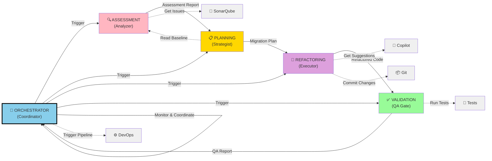
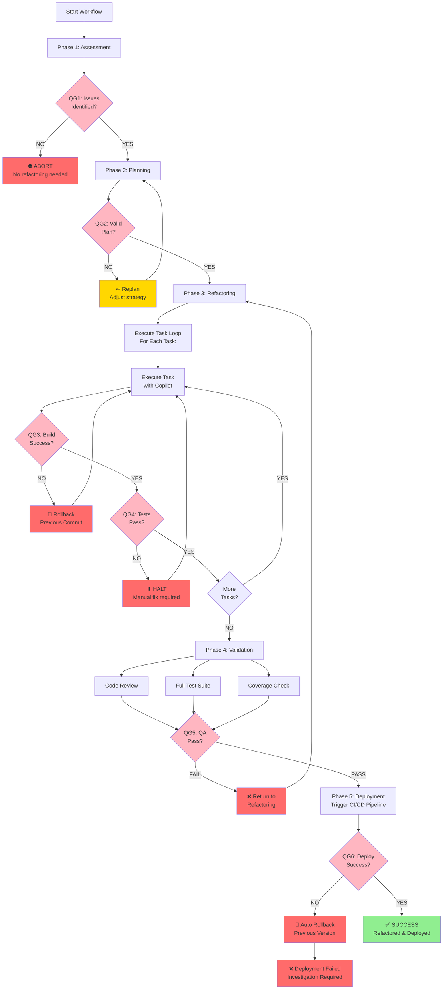
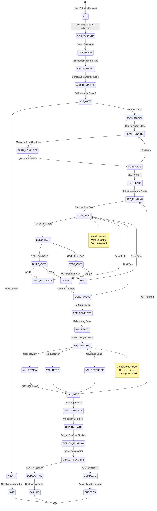
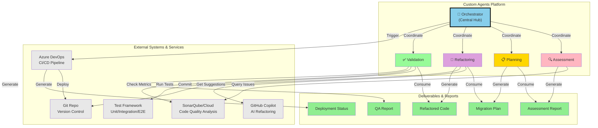
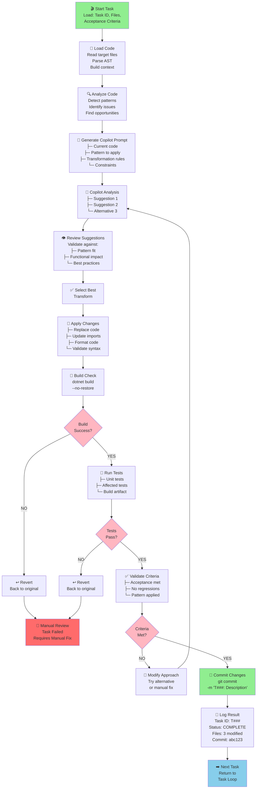
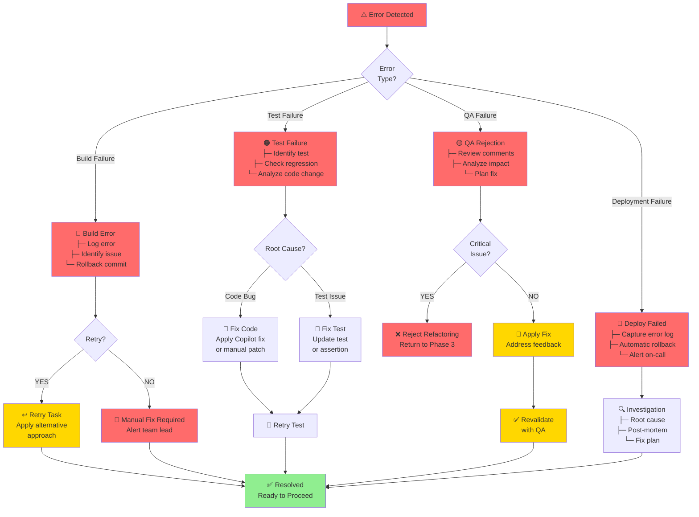
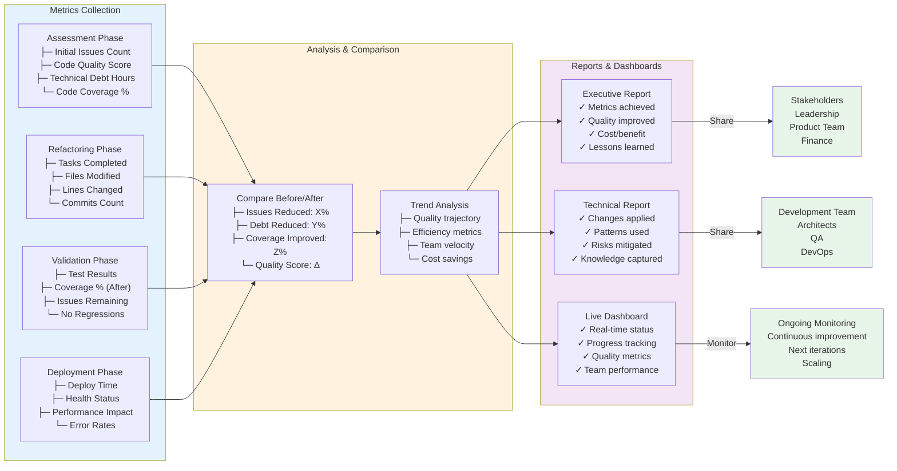
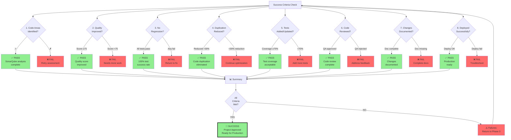

# Agent Orchestration Flow & Architecture Diagrams
## Visual Reference for Custom Refactoring Agent Platform

---

## 1. COMPLETE WORKFLOW ORCHESTRATION

```mermaid
graph TD
    A["🚀 START: User Input & Validation"] --> B["📋 ORCHESTRATOR Agent<br/>Receives Application Context<br/>Initializes Project State"]
    
    B -->|Handoff-1| C["🔍 ASSESSMENT Agent<br/>├─ Connect SonarQube<br/>├─ Analyze Code Quality<br/>├─ Generate Baseline<br/>└─ Identify Issues"]
    
    C -->|Output| C1["📊 Assessment Report<br/>├─ 47 Blocker/Critical Issues<br/>├─ 240 hrs Tech Debt<br/>├─ 45% Code Coverage<br/>├─ Priority Issue List<br/>└─ Patterns Detected"]
    
    C1 --> QG1{Quality Gate 1:<br/>Issues Found?}
    QG1 -->|NO| X["⛔ ABORT<br/>No Refactoring Needed"]
    QG1 -->|YES| D
    
    D["📊 PLANNING Agent<br/>├─ Design Strategy<br/>├─ Sequence Tasks<br/>├─ Analyze Dependencies<br/>└─ Create Roadmap"]
    
    D -->|Output| D1["📋 Migration Plan<br/>├─ Phase 1: Quick Wins (12 tasks)<br/>├─ Phase 2: Complex (18 tasks)<br/>├─ Phase 3: Validation (8 tasks)<br/>├─ Dependencies Map<br/>└─ Patterns Library"]
    
    D1 --> QG2{Quality Gate 2:<br/>Plan Valid?}
    QG2 -->|NO| D_RETRY["↩️ Return to Planning<br/>Reanalyze & Refine"]
    D_RETRY --> D
    QG2 -->|YES| E
    
    E["🔧 REFACTORING Agent<br/>├─ Load Plan<br/>├─ Execute Tasks<br/>├─ Apply Copilot Suggestions<br/>├─ Manage Git<br/>└─ Track Progress"]
    
    E -->|Per Task| E1["⚙️ Task Execution<br/>├─ Code Analysis<br/>├─ Copilot Prompt Generation<br/>├─ Apply Transformation<br/>├─ Run Tests<br/>├─ Commit Changes<br/>└─ Move to Next"]
    
    E1 --> QG3{Quality Gate 3:<br/>Build Success?}
    QG3 -->|NO| ROLLBACK["🔄 ROLLBACK<br/>Revert Commit<br/>Alert Team<br/>Manual Fix Required"]
    ROLLBACK --> E
    QG3 -->|YES| F
    
    E -->|Output| F["📝 Refactored Code<br/>├─ 38 Atomic Commits<br/>├─ 23 Files Modified<br/>├─ +340/-210 Lines<br/>├─ Branch: refactor/phase-1<br/>└─ Change Log"]
    
    F --> QG4{Quality Gate 4:<br/>All Tests Pass?}
    QG4 -->|NO| FAIL1["❌ TEST FAILURE<br/>Halt & Investigate"]
    FAIL1 --> E
    QG4 -->|YES| G
    
    G["✅ VALIDATION Agent<br/>├─ Code Review<br/>├─ Run Test Suites<br/>├─ Check Coverage<br/>├─ Detect Regressions<br/>└─ Generate QA Report"]
    
    G -->|Code Review| G1["📋 Code Review<br/>├─ 2 Minor Suggestions<br/>├─ Pattern Compliance<br/>└─ Best Practices Check"]
    
    G -->|Testing| G2["🧪 Test Execution<br/>├─ Unit: 156 pass<br/>├─ Integration: 45 pass<br/>└─ E2E: All pass"]
    
    G -->|Metrics| G3["📊 Metrics Validation<br/>├─ Coverage: 72% ↑27%<br/>├─ Blocker: 0 ↓47<br/>├─ Tech Debt: 145h ↓95h<br/>└─ Code Smells: 28 ↓17"]
    
    G1 --> QG5{Quality Gate 5:<br/>QA Approved?}
    QG5 -->|NO| FAIL2["❌ QA FAILED<br/>Return to Refactoring"]
    FAIL2 --> E
    QG5 -->|YES| H
    
    G2 --> G3
    G3 --> QG5
    
    G -->|Output| G4["✅ QA Report<br/>├─ All Gates: PASS<br/>├─ No Regressions<br/>├─ Deployment Ready<br/>└─ Sign-off: APPROVED"]
    
    G4 --> H["☁️ ORCHESTRATOR (Final)<br/>├─ Approve Deployment<br/>├─ Trigger CI/CD<br/>├─ Monitor Deployment<br/>└─ Verify Health"]
    
    H -->|Deploy| I["🚀 Azure DevOps Pipeline<br/>├─ Build<br/>├─ Test<br/>├─ Deploy to App Service<br/>└─ Health Check"]
    
    I --> QG6{Deployment<br/>Success?}
    QG6 -->|NO| ROLLBACK_PROD["🔄 AUTO ROLLBACK<br/>Restore Previous Version<br/>Alert Team<br/>Investigation"]
    ROLLBACK_PROD --> END_FAIL["❌ DEPLOYMENT FAILED"]
    QG6 -->|YES| J
    
    J["🎉 COMPLETION<br/>├─ Update Metrics<br/>├─ Team Notification<br/>├─ Documentation Updated<br/>├─ Knowledge Recorded<br/>└─ Project Closed"]
    
    J --> END_SUCCESS["✅ SUCCESS<br/>Application Refactored<br/>Quality Improved<br/>Ready for Next Phase"]
    
    style A fill:#90EE90
    style B fill:#87CEEB
    style C fill:#FFB6C1
    style E fill:#FFD700
    style G fill:#DDA0DD
    style H fill:#87CEEB
    style I fill:#FFA500
    style END_SUCCESS fill:#90EE90
    style END_FAIL fill:#FF6B6B
    style X fill:#FF6B6B
    style ROLLBACK fill:#FF6B6B
    style ROLLBACK_PROD fill:#FF6B6B
```

---

## 2. AGENT INTERACTION MATRIX

---

## 3. DATA FLOW ARCHITECTURE

```mermaid
graph TB
    INPUT["📥 User Input<br/>Application Path<br/>Target Framework<br/>Acceptance Criteria"]
    
    INPUT --> ORK["ORCHESTRATOR<br/>Initializes Project"]
    
    ORK --> ASS["ASSESSMENT Agent<br/>Phase 1: Discover & Assess"]
    
    ASS -->|Query| SONAR["SonarQube MCP<br/>Project Issues<br/>Metrics Export"]
    SONAR -->|Issues Data| ASS_OUT["Assessment Output<br/>├─ Issues by Category<br/>├─ Baseline Metrics<br/>├─ Priority List<br/>└─ Risk Matrix"]
    
    ASS_OUT --> PLAN["PLANNING Agent<br/>Phase 2: Plan Refactoring"]
    
    PLAN -->|Analyze| ARCH["Application Architecture<br/>Dependencies<br/>Modules<br/>Patterns"]
    ARCH -->|Input| PLAN_OUT["Planning Output<br/>├─ Migration Plan<br/>├─ Task Sequence<br/>├─ Quality Gates<br/>└─ Pattern Library"]
    
    PLAN_OUT --> REF["REFACTORING Agent<br/>Phase 3: Execute Transformation"]
    
    REF -->|For Each Task| COPILOT["GitHub Copilot API<br/>Code Analysis<br/>Suggestions<br/>Transformations"]
    COPILOT -->|Suggestions| REF
    
    REF -->|Version Control| GIT["Git Repository<br/>Create Branch<br/>Commit Changes<br/>Push Updates"]
    GIT -->|Refactored Code| REF_OUT["Refactoring Output<br/>├─ Modified Files<br/>├─ Commit History<br/>├─ Feature Branch<br/>└─ Change Log"]
    
    REF_OUT --> VAL["VALIDATION Agent<br/>Phase 4: Review & Validate"]
    
    VAL -->|Run| TESTS["Test Framework<br/>Unit Tests<br/>Integration Tests<br/>E2E Tests"]
    TESTS -->|Results| VAL
    
    VAL -->|Check| METRICS["SonarQube Metrics<br/>Coverage<br/>Code Smells<br/>Technical Debt"]
    METRICS -->|Data| VAL
    
    VAL -->|Output| VAL_OUT["Validation Output<br/>├─ QA Report<br/>├─ Test Results<br/>├─ Coverage Report<br/>└─ Sign-off"]
    
    VAL_OUT --> DEPLOY["ORCHESTRATOR<br/>Phase 5: Deploy"]
    
    DEPLOY -->|Trigger| PIPELINE["Azure DevOps Pipeline<br/>├─ Build Stage<br/>├─ Test Stage<br/>└─ Deploy Stage"]
    
    PIPELINE -->|Deploy To| APP["Azure App Service<br/>Production Application<br/>Live Environment"]
    
    APP -->|Final Output| SUCCESS["✅ SUCCESS<br/>Refactored Application<br/>Metrics Improved<br/>Ready for Use"]
    
    style INPUT fill:#90EE90
    style ORK fill:#87CEEB
    style ASS fill:#FFB6C1
    style PLAN fill:#FFD700
    style REF fill:#DDA0DD
    style VAL fill:#98FB98
    style DEPLOY fill:#87CEEB
    style SUCCESS fill:#90EE90
    style SONAR fill:#F0F0F0
    style COPILOT fill:#F0F0F0
    style GIT fill:#F0F0F0
    style TESTS fill:#F0F0F0
    style METRICS fill:#F0F0F0
    style PIPELINE fill:#F0F0F0
```

---

## 4. QUALITY GATES CHECKPOINT FLOW

---

## 5. AGENT STATE MACHINE & TRANSITIONS

---

## 6. INTEGRATION ARCHITECTURE OVERVIEW

---

## 7. TASK EXECUTION LOOP (Refactoring Agent Detail)

---

## 8. ERROR HANDLING & RECOVERY FLOW

---

## 9. METRICS TRACKING & REPORTING

---

## 10. SUCCESS CRITERIA VALIDATION MATRIX

---

## Quick Reference: Agent Responsibilities Summary

| Agent | Phase | Input | Primary Action | Output | Next Agent |
|-------|-------|-------|-----------------|--------|------------|
| **Orchestrator** | All | User request | Coordinate flow, enforce gates | Project status | All |
| **Assessment** | 1 | App path + SonarQube key | Analyze code quality | Assessment report | Planning |
| **Planning** | 2 | Assessment report | Design strategy, sequence tasks | Migration plan | Refactoring |
| **Refactoring** | 3 | Migration plan | Apply Copilot suggestions | Refactored code | Validation |
| **Validation** | 4 | Refactored code | Code review + testing | QA report | Orchestrator |
| **Orchestrator** | 5 | QA approval | Trigger deployment | Deployment status | Users |

---

**Document Version**: 1.0  
**Last Updated**: May 21, 2026  
**Status**: Ready for Review
