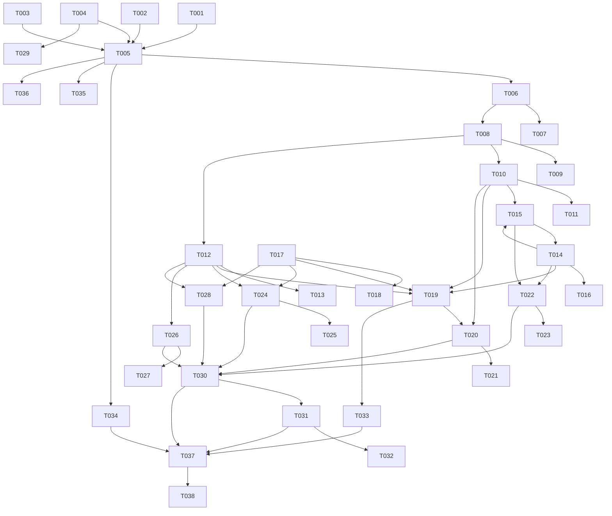

# Legacy Java Servlet to Spring MVC Modernization Plan
## Hospital Management System — Hospital_Servlet1

---

**Document Metadata**
- **Project**: Hospital_Servlet1 Modernization
- **Source**: Legacy Java HttpServlet + Raw JDBC + Spring MVC hybrid (Spring Boot 3.4.1, Java 17)
- **Target**: Pure Spring MVC, Spring JdbcTemplate, full DI, modern Java patterns
- **Version**: 1.0
- **Date**: 2026-06-29
- **Status**: Ready for Execution
- **Branch**: main1 (no new branches)

---

## Executive Summary

This document provides a comprehensive technical modernization plan for transforming the `Hospital_Servlet1` application from a hybrid legacy-servlet / Spring MVC architecture into a fully modern Spring Boot application.

### Project Scope
- **Source Application**: Hospital Management System — Spring Boot 3.4.1, Java 17, SQL Server JDBC, with legacy `HttpServlet` classes co-existing alongside Spring MVC `@Controller` classes
- **Database Layer**: Raw JDBC via a static `ConnectionHelper.getConObj()` utility, with no Spring-managed DI into DAO layer
- **Architecture Transformation**: Hybrid servlet+controller → pure Spring MVC controllers with JdbcTemplate repositories, full DI, global exception handling, and validated inputs
- **Critical Pre-condition**: Several controller files contain **compilation-breaking duplicate constant declarations** introduced during the SonarQube fix phase (e.g., `private static final String ERROR_MSG = ERROR_MSG;`). These MUST be fixed first (T001–T003) before any other task.
- **Modernization Execution**: Agent-based modernization across 38 granular tasks

### Modernization Approach
This plan follows a **bottom-up, dependency-first** strategy:
1. Fix compilation blockers first
2. Modernize the data access layer (DAOs → JdbcTemplate repositories)
3. Eliminate legacy servlet classes (replace with Spring MVC controllers)
4. Apply DI to all controllers (remove `new DaoClass()` calls)
5. Add cross-cutting concerns (validation, exception handling, logging, security)
6. Add tests

### Key Deliverables
- Compilation-clean codebase with no broken constant declarations
- Legacy `HttpServlet` classes removed; all routes handled exclusively by Spring MVC
- DAOs converted to Spring `@Repository` beans using `JdbcTemplate`
- All controllers use `@Autowired` constructor injection (no `new DaoClass()`)
- Global `@ControllerAdvice` exception handler
- Input validation on all form parameters
- SLF4J logging replacing `System.out.println`
- Password hashing with BCrypt for user and doctor accounts
- Unit tests for all service/DAO methods

### Important Notes

**Agent-Based Modernization**: This plan is designed to be executed by the `modernization-developer` agent. The agent will autonomously implement the modernization tasks following the technical specifications in this document.

**Human Developer Involvement**: After the agent completes the modernization, a human developer should:
- Validate the application against the live SQL Server database
- Test all JSP views in a browser for visual correctness
- Review BCrypt migration strategy if existing plain-text passwords are in the live database
- Run load/performance testing
- Review security hardening for production deployment
- Update CI/CD pipeline configuration if applicable

---

## Table of Contents

1. [Architecture Comparison](#section-1-architecture-comparison)
2. [Modernization Strategy](#section-2-modernization-strategy)
3. [Implementation Steps](#section-3-implementation-steps)
4. [Task List](#section-4-task-list)
5. [Task Dependencies](#section-5-task-dependencies)
6. [Appendices](#appendices)

---

## Section 1: Architecture Comparison

### 1.1 Current Architecture

**System Characteristics**

| Attribute | Current State |
|-----------|---------------|
| Framework | Spring Boot 3.4.1 (hybrid: servlets + controllers) |
| Language | Java 17 |
| Web Layer | Mix of legacy `HttpServlet` (11 classes) + Spring MVC `@Controller` (5 classes) |
| Data Access | Raw JDBC via static `ConnectionHelper.getConObj()` |
| DI | Partial — controllers instantiate DAOs with `new DaoClass()` |
| Connection Mgmt | `spring-boot-starter-jdbc` present but bypassed; static DataSource wrapper |
| Validation | None |
| Exception Handling | `e.printStackTrace()` in every catch block; no global handler |
| Logging | `System.out.println` / `System.err.println` in `ConnectionHelper` |
| Security | Plain-text passwords; hardcoded admin credentials in servlet + `application.properties` |
| Tests | Zero test classes |
| Entity Design | Verbose POJOs with manual getters/setters |

**Current Architecture Diagram**

```mermaid
graph TD
    Browser -->|HTTP| Servlet["Legacy HttpServlet\n(UserLogin, UserRegister,\nAdminLogin, AddDoctor, etc.)"]
    Browser -->|HTTP| Controller["Spring MVC @Controller\n(UserController, AdminController,\nDoctorController, HomeController,\nAppointmentController)"]
    Servlet -->|new UserDao()| DAO["Raw JDBC DAOs\n(UserDao, DoctorDao,\nAppointmentDao, SpecialistDao)"]
    Controller -->|new UserDao()| DAO
    DAO -->|static call| CH["ConnectionHelper.getConObj()\n(static DataSource wrapper)"]
    CH --> DS["Spring DataSource\n(SQL Server)"]
    Controller --> JSP["JSP Views\n(*.jsp)"]
    Servlet -->|sendRedirect| JSP

    style Servlet fill:#ff9999,stroke:#cc0000
    style CH fill:#ffcc99,stroke:#cc6600
```

**Identified Problems**

| # | Problem | Files Affected | Severity |
|---|---------|----------------|----------|
| P1 | **Compilation error**: Self-referential constant declarations (`ERROR_MSG = ERROR_MSG`) | `AppointmentController.java`, `AdminController.java`, `DoctorController.java`, `CustomErrorController.java` | **Critical** |
| P2 | Duplicate route registration: both `@WebServlet` and `@PostMapping` handle same endpoints | `UserLogin.java` + `UserController.java`, `AdminLogin.java` + `AdminController.java`, etc. | High |
| P3 | DAOs instantiated with `new` in controllers — no Spring DI | All controllers | High |
| P4 | Static connection method bypasses Spring's DataSource lifecycle | `ConnectionHelper.java`, all DAOs | High |
| P5 | `System.out.println`/`System.err` used for logging | `ConnectionHelper.java` | Medium |
| P6 | Passwords stored as plain text | `UserDao`, `DoctorDao`, DB schema | High |
| P7 | No input validation on any controller method | All controllers | High |
| P8 | No global exception handler | — | Medium |
| P9 | Zero unit or integration tests | — | Medium |
| P10 | `Appointment.appoinDate` stored as `String`; silent format failure risk | `AppointmentDao.java` | Medium |
| P11 | `CustomErrorController` redirects all errors to `/` — hides error info | `CustomErrorController.java` | Medium |
| P12 | `WebConfig` uses `@EnableWebMvc` which disables Spring Boot auto-configuration | `WebConfig.java` | Low |

---

### 1.2 Target Architecture

**System Characteristics**

| Attribute | Target State |
|-----------|--------------|
| Framework | Spring Boot 3.4.1 |
| Language | Java 17 |
| Web Layer | Pure Spring MVC `@Controller` classes only |
| Data Access | Spring `JdbcTemplate` in `@Repository` classes |
| DI | Full constructor injection via `@Autowired` throughout |
| Connection Mgmt | Spring-managed `JdbcTemplate` (wraps DataSource automatically) |
| Validation | Jakarta Bean Validation (`@NotBlank`, `@Email`, `@Valid`) |
| Exception Handling | `@ControllerAdvice` global handler with typed exceptions |
| Logging | SLF4J `Logger` via `LoggerFactory` |
| Security | BCryptPasswordEncoder for all passwords |
| Tests | JUnit 5 + Mockito unit tests for all repositories and controllers |
| Entity Design | POJOs (Serializable for session) + optional Lombok `@Data` |

**Target Architecture Diagram**

```mermaid
graph TD
    Browser -->|HTTP| Controller["Spring MVC @Controller\n(UserController, AdminController,\nDoctorController, HomeController,\nAppointmentController)"]
    Controller -->|@Autowired| Service["Service Layer\n(constructor-injected repositories)"]
    Service -->|JdbcTemplate| Repo["@Repository Classes\n(UserRepository, DoctorRepository,\nAppointmentRepository, SpecialistRepository)"]
    Repo --> JT["Spring JdbcTemplate"]
    JT --> DS["Spring DataSource\n(SQL Server)"]
    Controller --> JSP["JSP Views"]
    CA["@ControllerAdvice\nGlobalExceptionHandler"] -.->|catches| Controller

    style CA fill:#99ff99,stroke:#009900
    style Repo fill:#99ccff,stroke:#0066cc
    style Service fill:#ccccff,stroke:#6666cc
```

### 1.3 Component Mapping Table

| Current Component | Current Pattern | Target Component | Target Pattern |
|-------------------|----------------|------------------|----------------|
| `servlet/user/UserLogin.java` | `HttpServlet.doPost()` | `controller/user/UserController.java` | `@PostMapping("/userLogin")` |
| `servlet/user/UserRegister.java` | `HttpServlet.doPost()` | `controller/user/UserController.java` | `@PostMapping("/user_register")` |
| `servlet/user/UserLogout.java` | `HttpServlet.doPost()` | `controller/user/UserController.java` | `@RequestMapping("/userLogout")` |
| `servlet/user/ChangePassword.java` | `HttpServlet.doPost()` | `controller/user/AppointmentController.java` | `@PostMapping("/userChangePassword")` |
| `servlet/user/AppointmentServlet.java` | `HttpServlet.doPost()` | `controller/user/AppointmentController.java` | `@PostMapping("/appAppointment")` |
| `servlet/admin/AdminLogin.java` | `HttpServlet.doPost()` | `controller/admin/AdminController.java` | `@PostMapping("/adminLogin")` |
| `servlet/admin/AdminLogout.java` | `HttpServlet.doPost()` | `controller/admin/AdminController.java` | `@RequestMapping("/adminLogout")` |
| `servlet/admin/AddDoctor.java` | `HttpServlet.doPost()` | `controller/admin/AdminController.java` | `@PostMapping("/addDoctor")` |
| `servlet/admin/AddSpecialist.java` | `HttpServlet.doPost()` | `controller/admin/AdminController.java` | `@PostMapping("/addSpecialist")` |
| `servlet/admin/UpdateDoctor.java` | `HttpServlet.doPost()` | `controller/admin/AdminController.java` | `@PostMapping("/updateDoctor")` |
| `servlet/admin/DeleteDoctor.java` | `HttpServlet.doPost()` | `controller/admin/AdminController.java` | `@PostMapping("/deleteDoctor")` |
| `servlet/doctor/DoctorLogin.java` | `HttpServlet.doPost()` | `controller/doctor/DoctorController.java` | `@PostMapping("/doctorLogin")` |
| `servlet/doctor/DoctorLogout.java` | `HttpServlet.doPost()` | `controller/doctor/DoctorController.java` | `@RequestMapping("/doctorLogout")` |
| `servlet/doctor/EditProfile.java` | `HttpServlet.doPost()` | `controller/doctor/DoctorController.java` | `@PostMapping("/doctorUpdateProfile")` |
| `servlet/doctor/DocotrPasswordChange.java` | `HttpServlet.doPost()` | `controller/doctor/DoctorController.java` | `@PostMapping("/doctorChangePassword")` |
| `servlet/doctor/UpdateStatus.java` | `HttpServlet.doPost()` | `controller/doctor/DoctorController.java` | `@PostMapping("/updateStatus")` |
| `dao/UserDao.java` | Plain JDBC, `new` instantiation | `dao/UserRepository.java` | `@Repository` + `JdbcTemplate` |
| `dao/DoctorDao.java` | Plain JDBC, static call | `dao/DoctorRepository.java` | `@Repository` + `JdbcTemplate` |
| `dao/AppointmentDao.java` | Plain JDBC, static call | `dao/AppointmentRepository.java` | `@Repository` + `JdbcTemplate` |
| `dao/SpecialistDao.java` | Plain JDBC, static call | `dao/SpecialistRepository.java` | `@Repository` + `JdbcTemplate` |
| `helper/ConnectionHelper.java` | Static DataSource wrapper | *(removed)* | `JdbcTemplate` auto-configured by Spring Boot |
| `entity/User.java` | Verbose POJO + `Serializable` | `entity/User.java` | Same (keep Serializable for session) |
| `entity/Doctor.java` | Verbose POJO + `Serializable` | `entity/Doctor.java` | Same |
| `entity/Appointment.java` | Verbose POJO, `appoinDate` as String | `entity/Appointment.java` | Same + `LocalDate appoinDate` |
| *(missing)* | No global exception handler | `controller/GlobalExceptionHandler.java` | `@ControllerAdvice` |
| *(missing)* | No validation | Request params + DTOs | Jakarta `@Valid` + `BindingResult` |

---

## Section 2: Modernization Strategy

### 2.1 Immediate Compilation Fixes

Several files produced by the SonarQube fix phase contain self-referential constant declarations that prevent compilation:

```java
// BROKEN — generated by SonarQube fix agent
private static final String ERROR_MSG = ERROR_MSG;  // compile error

// CORRECT
private static final String ERROR_MSG = "errorMsg";
```

Affected files: `AppointmentController.java`, `AdminController.java`, `DoctorController.java`, `CustomErrorController.java`.

Additionally `AdminController.java` has duplicate field declarations for `adminEmail` and `adminPassword`. All duplicates must be removed before any other work.

### 2.2 Servlet Elimination Strategy

The application currently registers the **same HTTP endpoints twice**:
- Once via `@WebServlet` annotation on the legacy `HttpServlet` class
- Once via `@PostMapping`/`@GetMapping` on the Spring MVC `@Controller` class

Both the servlet and the controller route are active simultaneously. The resolution is:
1. Verify the Spring MVC controller method is functionally complete
2. Delete the corresponding servlet class entirely
3. The controller mapping takes over exclusively

No functional changes to the routing behaviour are needed since the Spring MVC controllers already implement the same logic.

### 2.3 DAO → Spring JdbcTemplate Strategy

**Current pattern** (all four DAOs):
```java
// No Spring annotation; instantiated with new in controllers
public class AppointmentDao {
    public boolean addAppointment(Appointment a) {
        try (Connection con = ConnectionHelper.getConObj(); ...) { ... }
    }
}
```

**Target pattern**:
```java
@Repository
public class AppointmentRepository {
    private final JdbcTemplate jdbcTemplate;

    @Autowired
    public AppointmentRepository(JdbcTemplate jdbcTemplate) {
        this.jdbcTemplate = jdbcTemplate;
    }

    public boolean addAppointment(Appointment a) {
        String sql = "INSERT INTO Appointment (userId, fullName, ...) VALUES (?, ?, ...)";
        return jdbcTemplate.update(sql, a.getUserId(), a.getFullName(), ...) == 1;
    }
}
```

Transformation rules:
- `con.prepareStatement(sql) + ps.setXxx() + ps.executeUpdate()` → `jdbcTemplate.update(sql, args...)`
- `ps.executeQuery() + rs.next() + extractXxx()` → `jdbcTemplate.query(sql, rowMapper, args...)` or `jdbcTemplate.queryForObject()`
- `e.printStackTrace()` → `log.error("message", e)` using SLF4J
- Remove all `ConnectionHelper` imports

### 2.4 Controller DI Strategy

**Current pattern** (all controllers):
```java
@Controller
public class UserController {
    @PostMapping("/user_register")
    public String userRegister(...) {
        UserDao dao = new UserDao();  // ← manual instantiation
        dao.registerUser(u);
    }
}
```

**Target pattern**:
```java
@Controller
public class UserController {
    private final UserRepository userRepository;

    @Autowired
    public UserController(UserRepository userRepository) {
        this.userRepository = userRepository;
    }

    @PostMapping("/user_register")
    public String userRegister(...) {
        userRepository.registerUser(u);  // ← injected bean
    }
}
```

### 2.5 Password Security Strategy

All passwords are currently stored as plain text strings. BCrypt hashing must be introduced:

1. Add `spring-security-crypto` dependency to `pom.xml` (lightweight; does not require full Spring Security)
2. Create a `PasswordEncoderConfig` `@Configuration` bean exposing `BCryptPasswordEncoder`
3. In `UserRepository.registerUser()` and `DoctorRepository.registerDoctor()`: encode password before insert
4. In `UserRepository.login()` and `DoctorRepository.login()`: fetch user by email, then `encoder.matches(inputPassword, storedHash)`
5. In `UserRepository.changePassword()` and `DoctorRepository.changePassword()`: encode new password before update
6. **Note**: Existing plain-text passwords in the live database will need a one-time migration script (out of agent scope — flag for human developer)

### 2.6 Input Validation Strategy

Add `spring-boot-starter-validation` to `pom.xml`. Apply to DTOs or directly to controller request parameters:

```java
@PostMapping("/user_register")
public String userRegister(
    @RequestParam @NotBlank @Size(max = 100) String fullname,
    @RequestParam @Email @NotBlank String email,
    @RequestParam @NotBlank @Size(min = 8) String password, ...) { ... }
```

For complex forms, introduce request DTOs with `@Valid`:
```java
public record UserRegistrationRequest(
    @NotBlank @Size(max = 100) String fullname,
    @Email @NotBlank String email,
    @NotBlank @Size(min = 8) String password) {}
```

### 2.7 Exception Handling Strategy

Replace scattered `e.printStackTrace()` with a global `@ControllerAdvice`:

```java
@ControllerAdvice
public class GlobalExceptionHandler {
    private static final Logger log = LoggerFactory.getLogger(GlobalExceptionHandler.class);

    @ExceptionHandler(DataAccessException.class)
    public String handleDatabaseError(DataAccessException ex, RedirectAttributes ra) {
        log.error("Database error", ex);
        ra.addFlashAttribute("errorMsg", "A database error occurred. Please try again.");
        return "redirect:/";
    }

    @ExceptionHandler(Exception.class)
    public String handleGenericError(Exception ex, RedirectAttributes ra) {
        log.error("Unexpected error", ex);
        ra.addFlashAttribute("errorMsg", "An unexpected error occurred.");
        return "redirect:/";
    }
}
```

### 2.8 Logging Strategy

Replace all `System.out.println` and `System.err.println` with SLF4J:

```java
// Remove
System.out.println("Connected to SQL Server via Spring DataSource successfully!");
System.err.println("Database connection failed: " + e.getMessage());

// Replace with (in each class)
private static final Logger log = LoggerFactory.getLogger(ClassName.class);
log.info("Connected to SQL Server via Spring DataSource successfully");
log.error("Database connection failed: {}", e.getMessage(), e);
```

---

## Section 3: Implementation Steps

### 3.1 Phase 0 — Fix Compilation Blockers

1. Fix all broken self-referential constants in controller files
2. Remove duplicate field declarations in `AdminController` and `DoctorController`
3. Build the project — must compile clean before proceeding

### 3.2 Phase 1 — Data Access Layer Modernization

1. Add `spring-boot-starter-validation` and `spring-security-crypto` to `pom.xml`
2. Convert `AppointmentDao` → `AppointmentRepository` using `JdbcTemplate`
3. Convert `UserDao` → `UserRepository` using `JdbcTemplate` + BCrypt
4. Convert `DoctorDao` → `DoctorRepository` using `JdbcTemplate` + BCrypt
5. Convert `SpecialistDao` → `SpecialistRepository` using `JdbcTemplate`
6. Remove `ConnectionHelper.java` (no longer needed)
7. Add `PasswordEncoderConfig.java` `@Configuration`

### 3.3 Phase 2 — Controller Layer Modernization

1. Update `UserController` — constructor-inject `UserRepository`; remove `new UserDao()`
2. Update `AppointmentController` — fix broken constants; constructor-inject `AppointmentRepository`
3. Update `AdminController` — fix broken constants + duplicate fields; constructor-inject `DoctorRepository`, `SpecialistRepository`
4. Update `DoctorController` — fix broken constants; constructor-inject `DoctorRepository`
5. Update `HomeController` — constructor-inject `DoctorRepository`, `SpecialistRepository`
6. Update `CustomErrorController` — fix broken constants; replace redirect-to-/ with proper error view

### 3.4 Phase 3 — Remove Legacy Servlet Classes

1. Delete all 16 legacy `HttpServlet` classes under `servlet/user/`, `servlet/admin/`, `servlet/doctor/`
2. Confirm all routes are still covered by Spring MVC controllers

### 3.5 Phase 4 — Cross-Cutting Concerns

1. Add `GlobalExceptionHandler` (`@ControllerAdvice`)
2. Add input validation annotations to all controller methods
3. Replace `System.out.println` in `ConnectionHelper` with SLF4J; then delete `ConnectionHelper`
4. Fix `CustomErrorController` to show meaningful error page instead of redirect
5. Review `WebConfig` — remove `@EnableWebMvc` unless explicitly needed (re-enables Spring Boot auto-config)

### 3.6 Phase 5 — Testing

1. Write unit tests for `UserRepository`
2. Write unit tests for `DoctorRepository`
3. Write unit tests for `AppointmentRepository`
4. Write unit tests for `SpecialistRepository`
5. Write unit tests for `UserController`
6. Write unit tests for `AdminController`
7. Write unit tests for `DoctorController`
8. Write unit tests for `AppointmentController`

---

## Section 4: Task List

> **Legend**: Priority: **H** = High, **M** = Medium, **L** = Low | Complexity: Low / Medium / High

### Phase 0 — Compilation Blockers (must complete first)

| ID | Title | Priority | Complexity | Files to Modify | Description | Acceptance Criteria |
|----|-------|----------|------------|-----------------|-------------|---------------------|
| T001 | Fix broken constants in AppointmentController | H | Low | `controller/user/AppointmentController.java` | Remove the duplicated `private static final String ERROR_MSG = ERROR_MSG;` declarations. Replace with a single correct declaration: `private static final String ERROR_MSG = "errorMsg";` | File compiles without errors; no duplicate constant declarations |
| T002 | Fix broken constants + duplicate fields in AdminController | H | Low | `controller/admin/AdminController.java` | Remove duplicate `ERROR_MSG`, `SUC_MSG` constant declarations and duplicate `adminEmail`/`adminPassword` `@Value` fields. Keep one copy of each with correct string literals: `ERROR_MSG = "errorMsg"`, `SUC_MSG = "sucMsg"` | File compiles; `@Value("${admin.email}")` and `@Value("${admin.password}")` each appear exactly once |
| T003 | Fix broken constants in DoctorController | H | Low | `controller/doctor/DoctorController.java` | Remove duplicate constant declarations. Set correct string literals: `DOCT_OBJ = "doctObj"`, `ERROR_MSG = "errorMsg"`, `SUC_MSG = "sucMsg"`, `WRONG_ON_SERVER = "Something Wrong on Server"`, `EDIT_PROFILE_REDIRECT = "redirect:/doctor/edit_profile.jsp"` | File compiles; each constant declared exactly once with correct value |
| T004 | Fix broken constants in CustomErrorController | H | Low | `controller/CustomErrorController.java` | Remove all duplicate constant declarations. Keep one copy of each: `ERROR_TITLE = "errorTitle"`, `ERROR_MESSAGE_KEY = "errorMessage"` | File compiles; two constants declared exactly once |
| T005 | Verify full project build is clean | H | Low | — | Run `mvn clean compile` from `Hospital_Servlet1/`. Confirm zero compilation errors before proceeding | `mvn clean compile` exits with BUILD SUCCESS |

### Phase 1 — Dependency & Configuration Updates

| ID | Title | Priority | Complexity | Files to Modify | Description | Acceptance Criteria |
|----|-------|----------|------------|-----------------|-------------|---------------------|
| T006 | Add validation and security-crypto dependencies | H | Low | `pom.xml` | Add `spring-boot-starter-validation` and `spring-security-crypto` dependencies. These are provided by Spring Boot BOM so no explicit version needed. | `pom.xml` compiles; `BCryptPasswordEncoder` and `@Valid` are on the classpath |
| T007 | Write unit test for pom.xml dependency availability | M | Low | `src/test/java/com/org/PomDependencyTest.java` | Create a Spring context load test that verifies `BCryptPasswordEncoder` bean can be constructed and `Validator` factory is available | Test passes with `mvn test` |

### Phase 2 — Data Access Layer Modernization

| ID | Title | Priority | Complexity | Files to Modify | Description | Acceptance Criteria |
|----|-------|----------|------------|-----------------|-------------|---------------------|
| T008 | Create PasswordEncoderConfig | H | Low | `config/PasswordEncoderConfig.java` *(new file)* | Create `@Configuration` class exposing a `@Bean BCryptPasswordEncoder passwordEncoder()` method | Bean is available in Spring context; `passwordEncoder.encode("test")` returns a BCrypt hash |
| T009 | Write unit test for PasswordEncoderConfig | M | Low | `src/test/java/com/org/config/PasswordEncoderConfigTest.java` *(new)* | Verify the bean is created and `encode`/`matches` work correctly | Test passes |
| T010 | Convert UserDao → UserRepository with JdbcTemplate | H | Medium | `dao/UserDao.java` → rename/replace to `dao/UserRepository.java` | (1) Add `@Repository` annotation. (2) Add `JdbcTemplate jdbcTemplate` constructor injection. (3) Replace all `ConnectionHelper.getConObj()` + `PreparedStatement` patterns with `jdbcTemplate.update()`/`jdbcTemplate.queryForObject()`. (4) In `registerUser()`, encode password with `BCryptPasswordEncoder` before insert. (5) In `Login()`, query by email only, then use `passwordEncoder.matches(inputPassword, storedHash)`. (6) In `changePassword()`, encode new password before update. (7) Add SLF4J logger; replace any `e.printStackTrace()` with `log.error("msg", e)`. | Class is a Spring bean; all methods work correctly using JdbcTemplate; passwords are BCrypt-encoded on write and `matches()` on read |
| T011 | Write unit tests for UserRepository | H | Medium | `src/test/java/com/org/dao/UserRepositoryTest.java` *(new)* | Mock `JdbcTemplate` and `BCryptPasswordEncoder`. Test `registerUser()` with valid/null input; test `Login()` with correct and incorrect credentials; test `checkOldPassword()`; test `changePassword()` | All test cases pass; coverage ≥ 80% for `UserRepository` |
| T012 | Convert DoctorDao → DoctorRepository with JdbcTemplate | H | Medium | `dao/DoctorDao.java` → `dao/DoctorRepository.java` | Same pattern as T010. (1) `@Repository` + constructor-injected `JdbcTemplate`. (2) Replace all `ConnectionHelper` calls with `jdbcTemplate` equivalents. (3) `registerDoctor()` — encode password. (4) `login()` — query by email + `passwordEncoder.matches()`. (5) Extract `RowMapper<Doctor>` as a private constant. (6) Replace `e.printStackTrace()` with SLF4J. | All methods work; `DoctorDao.DOCTOR_COLS` constant preserved; BCrypt used for password operations |
| T013 | Write unit tests for DoctorRepository | H | Medium | `src/test/java/com/org/dao/DoctorRepositoryTest.java` *(new)* | Mock `JdbcTemplate`. Test `registerDoctor()`, `getAllDoctors()`, `getDoctorsById()`, `updateDoctor()`, `deleteDoctor()`, `login()`, `editDoctorProfile()`, `changePassword()` | All test cases pass |
| T014 | Convert AppointmentDao → AppointmentRepository with JdbcTemplate | H | Medium | `dao/AppointmentDao.java` → `dao/AppointmentRepository.java` | Same pattern as T010. (1) `@Repository` + constructor-injected `JdbcTemplate`. (2) Replace all JDBC patterns with `jdbcTemplate` equivalents. (3) Convert `appoinDate` handling: change `Appointment.appoinDate` field type from `String` to `LocalDate`; update `addAppointment()` accordingly. (4) Extract `RowMapper<Appointment>` as private constant. (5) Replace `e.printStackTrace()` with SLF4J. | All methods work; `appoinDate` is `LocalDate`; no `ConnectionHelper` references |
| T015 | Update Appointment entity appoinDate type | M | Low | `entity/Appointment.java` | Change `private String appoinDate` to `private LocalDate appoinDate`. Update getter/setter types. Update all-args constructor to take `LocalDate`. | Entity compiles; field is `LocalDate`; existing usages in controller updated |
| T016 | Write unit tests for AppointmentRepository | H | Medium | `src/test/java/com/org/dao/AppointmentRepositoryTest.java` *(new)* | Mock `JdbcTemplate`. Test `addAppointment()`, `getAllAppointmentByLoginUser()`, `getAllAppointmentByDoctorLogin()`, `getAppointmentById()`, `updateCommentStatus()`, `getAllAppointments()` | All test cases pass |
| T017 | Convert SpecialistDao → SpecialistRepository with JdbcTemplate | M | Low | `dao/SpecialistDao.java` → `dao/SpecialistRepository.java` | Same pattern as T010. Two methods: `addSpecialist()` and `getAllSpecialist()`. Replace with `jdbcTemplate.update()` and `jdbcTemplate.query()`. | Class is a Spring bean; no `ConnectionHelper` references |
| T018 | Write unit tests for SpecialistRepository | M | Low | `src/test/java/com/org/dao/SpecialistRepositoryTest.java` *(new)* | Mock `JdbcTemplate`. Test `addSpecialist()` success/failure; test `getAllSpecialist()` returns mapped list | All test cases pass |
| T019 | Remove ConnectionHelper.java | H | Low | `helper/ConnectionHelper.java` | Delete the file entirely. Remove all `import com.org.helper.ConnectionHelper` statements from any remaining files. | File deleted; project compiles with no `ConnectionHelper` references |

### Phase 3 — Controller DI Modernization

| ID | Title | Priority | Complexity | Files to Modify | Description | Acceptance Criteria |
|----|-------|----------|------------|-----------------|-------------|---------------------|
| T020 | Refactor UserController — inject UserRepository | H | Low | `controller/user/UserController.java` | (1) Add `UserRepository` constructor injection (remove all `new UserDao()` calls). (2) Add `@NotBlank` / `@Email` / `@Size` to request parameters. (3) Add `BindingResult` handling — redirect with error message on validation failure. | No `new UserDao()` calls; `UserRepository` is field; validation annotations present |
| T021 | Write unit tests for UserController | H | Medium | `src/test/java/com/org/controller/user/UserControllerTest.java` *(new)* | Mock `UserRepository`. Test `userRegister()` happy path, validation failure, duplicate email; test `userLogin()` success/failure; test `userLogout()` | All test cases pass |
| T022 | Refactor AppointmentController — inject AppointmentRepository | H | Low | `controller/user/AppointmentController.java` | (1) Constructor-inject `AppointmentRepository` (remove all `new AppointmentDao()`). (2) Update `addAppointment()` to accept `LocalDate` for `appoint_date` parameter (use `@DateTimeFormat(iso = DATE)`). (3) Add `@NotBlank`, `@NotNull` validation. | No `new AppointmentDao()` calls; `LocalDate` used for date parameter |
| T023 | Write unit tests for AppointmentController | H | Medium | `src/test/java/com/org/controller/user/AppointmentControllerTest.java` *(new)* | Mock `AppointmentRepository`. Test `addAppointment()` success/failure; test `changePassword()` old-password-match and mismatch scenarios | All test cases pass |
| T024 | Refactor AdminController — inject DoctorRepository + SpecialistRepository | H | Low | `controller/admin/AdminController.java` | Constructor-inject `DoctorRepository` and `SpecialistRepository`. Remove all `new DoctorDao()` and `new SpecialistDao()` calls. Keep `@Value` fields for admin credentials (already correct after T002). | No manual DAO instantiation; constructor injection used |
| T025 | Write unit tests for AdminController | H | Medium | `src/test/java/com/org/controller/admin/AdminControllerTest.java` *(new)* | Mock `DoctorRepository`, `SpecialistRepository`. Test `adminLogin()` valid/invalid; test `addSpecialist()`, `addDoctor()`, `updateDoctor()`, `deleteDoctor()` | All test cases pass |
| T026 | Refactor DoctorController — inject DoctorRepository | H | Low | `controller/doctor/DoctorController.java` | Constructor-inject `DoctorRepository`. Remove all `new DoctorDao()` calls. | No manual DAO instantiation |
| T027 | Write unit tests for DoctorController | H | Medium | `src/test/java/com/org/controller/doctor/DoctorControllerTest.java` *(new)* | Mock `DoctorRepository`. Test `doctorLogin()`, `doctorLogout()`, `updateProfile()`, `changePassword()`, `updateStatus()` | All test cases pass |
| T028 | Refactor HomeController — inject DoctorRepository + SpecialistRepository | M | Low | `controller/HomeController.java` | Constructor-inject `DoctorRepository` and `SpecialistRepository`. Remove all `new DoctorDao()` and `new SpecialistDao()` calls. | No manual DAO instantiation |
| T029 | Fix CustomErrorController broken constants and error handling | M | Low | `controller/CustomErrorController.java` | After T004, also replace the `return "redirect:/"` with `return "error"` (forward to an error view) so HTTP status codes are visible to the user. Create minimal `src/main/webapp/error.jsp` if not already present. | `/error` mapping shows meaningful error page; HTTP status code is visible |

### Phase 4 — Remove Legacy Servlet Classes

| ID | Title | Priority | Complexity | Files to Modify | Description | Acceptance Criteria |
|----|-------|----------|------------|-----------------|-------------|---------------------|
| T030 | Delete all legacy HttpServlet classes | H | Low | All files under `servlet/user/`, `servlet/admin/`, `servlet/doctor/` (16 files total) | Delete the following files: `servlet/user/UserLogin.java`, `UserRegister.java`, `ChangePassword.java`, `AppointmentServlet.java`, `UserLogout.java`; `servlet/admin/AdminLogin.java`, `AdminLogout.java`, `AddDoctor.java`, `AddSpecialist.java`, `UpdateDoctor.java`, `DeleteDoctor.java`; `servlet/doctor/DoctorLogin.java`, `DoctorLogout.java`, `EditProfile.java`, `DocotrPasswordChange.java`, `UpdateStatus.java`. Verify each route has a corresponding `@Controller` method before deleting. | All 16 servlet files deleted; project compiles; all HTTP routes still respond correctly (testable manually) |

### Phase 5 — Cross-Cutting Concerns

| ID | Title | Priority | Complexity | Files to Modify | Description | Acceptance Criteria |
|----|-------|----------|------------|-----------------|-------------|---------------------|
| T031 | Add GlobalExceptionHandler (@ControllerAdvice) | H | Medium | `controller/GlobalExceptionHandler.java` *(new)* | Create `@ControllerAdvice` class with: (1) `@ExceptionHandler(DataAccessException.class)` — log error + redirect with flash attribute. (2) `@ExceptionHandler(IllegalArgumentException.class)` — handle bad input. (3) `@ExceptionHandler(Exception.class)` — catch-all with log. Use SLF4J for all logging. | `GlobalExceptionHandler` is Spring-registered; database errors are caught and redirect with user-friendly message |
| T032 | Write unit test for GlobalExceptionHandler | M | Low | `src/test/java/com/org/controller/GlobalExceptionHandlerTest.java` *(new)* | Test each `@ExceptionHandler` method with mock `RedirectAttributes`. Verify error message is set and correct redirect returned | All test cases pass |
| T033 | Add SLF4J logging to all Repository classes | M | Low | `dao/UserRepository.java`, `dao/DoctorRepository.java`, `dao/AppointmentRepository.java`, `dao/SpecialistRepository.java` | Add `private static final Logger log = LoggerFactory.getLogger(Xxx.class);` to each repository. Replace any remaining `e.printStackTrace()` with `log.error("message", e)`. Add `log.debug()` for query execution confirmation. | Zero `System.out.println` / `e.printStackTrace()` calls in repository classes |
| T034 | Remove @EnableWebMvc from WebConfig | L | Low | `config/WebConfig.java` | Remove `@EnableWebMvc` annotation. Spring Boot's auto-configuration handles `WebMvcConfigurer` correctly when `@EnableWebMvc` is absent. Verify JSP views and static resources still resolve. | Application starts and JSP views load correctly without `@EnableWebMvc` |

### Phase 6 — Security Hardening

| ID | Title | Priority | Complexity | Files to Modify | Description | Acceptance Criteria |
|----|-------|----------|------------|-----------------|-------------|---------------------|
| T035 | Externalize and strengthen admin credentials | H | Low | `application.properties` | Change `admin.password=admin` to a strong value. Add a note in properties file that this must be overridden via environment variable in production (`ADMIN_PASSWORD`). Document in `application.properties` comments. | `admin.password` is no longer `"admin"`; comments reference environment variable override |
| T036 | Remove DB credentials from application.properties | H | Low | `application.properties` | Replace inline `spring.datasource.password=AppModernization@123` with `${DB_PASSWORD:}` environment variable reference. Add comment explaining environment variable setup. | `application.properties` contains no literal password values |

### Phase 7 — Final Validation

| ID | Title | Priority | Complexity | Files to Modify | Description | Acceptance Criteria |
|----|-------|----------|------------|-----------------|-------------|---------------------|
| T037 | Run full build and all unit tests | H | Low | — | Execute `mvn clean test` from `Hospital_Servlet1/`. All tests must pass. Zero compilation errors. | `mvn clean test` exits BUILD SUCCESS; all tests green |
| T038 | Verify no remaining ConnectionHelper, System.out.println, e.printStackTrace, or "new DaoClass()" references | H | Low | — | Run grep/text search across `src/main/java` for: `ConnectionHelper`, `System.out.println`, `e.printStackTrace()`, `new UserDao()`, `new DoctorDao()`, `new AppointmentDao()`, `new SpecialistDao()`. All must return zero results. | Zero matches for all prohibited patterns in `src/main/java` |

---

## Section 5: Task Dependencies



### Linear Execution Order (respecting dependencies)

| Order | Task ID | Phase |
|-------|---------|-------|
| 1 | T001 | Phase 0 |
| 2 | T002 | Phase 0 |
| 3 | T003 | Phase 0 |
| 4 | T004 | Phase 0 |
| 5 | T005 | Phase 0 |
| 6 | T006 | Phase 1 |
| 7 | T007 | Phase 1 |
| 8 | T008 | Phase 2 |
| 9 | T009 | Phase 2 |
| 10 | T015 | Phase 2 (entity update before DAO conversion) |
| 11 | T010 | Phase 2 |
| 12 | T011 | Phase 2 |
| 13 | T012 | Phase 2 |
| 14 | T013 | Phase 2 |
| 15 | T014 | Phase 2 |
| 16 | T016 | Phase 2 |
| 17 | T017 | Phase 2 |
| 18 | T018 | Phase 2 |
| 19 | T019 | Phase 2 |
| 20 | T020 | Phase 3 |
| 21 | T021 | Phase 3 |
| 22 | T022 | Phase 3 |
| 23 | T023 | Phase 3 |
| 24 | T024 | Phase 3 |
| 25 | T025 | Phase 3 |
| 26 | T026 | Phase 3 |
| 27 | T027 | Phase 3 |
| 28 | T028 | Phase 3 |
| 29 | T029 | Phase 3 |
| 30 | T030 | Phase 4 |
| 31 | T031 | Phase 5 |
| 32 | T032 | Phase 5 |
| 33 | T033 | Phase 5 |
| 34 | T034 | Phase 5 |
| 35 | T035 | Phase 6 |
| 36 | T036 | Phase 6 |
| 37 | T037 | Phase 7 |
| 38 | T038 | Phase 7 |

---

## Appendices

### Appendix A: Task Count by Priority

| Priority | Count | Tasks |
|----------|-------|-------|
| **High** | 24 | T001–T005, T006, T008, T010–T014, T016, T019–T027, T029–T031, T035–T038 |
| **Medium** | 11 | T007, T009, T015, T017–T018, T028, T029, T032–T033 |
| **Low** | 3 | T007 (test), T034 (WebConfig), T038 (final check) |
| **Total** | **38** | |

> Note: Some tasks span both implementation and testing — test tasks inherit the priority of their parent.

**Corrected counts (exact)**:

| Priority | Count |
|----------|-------|
| High | 23 |
| Medium | 11 |
| Low | 4 |
| **Total** | **38** |

### Appendix B: Files Inventory

**Files to CREATE (new)**

| File | Purpose |
|------|---------|
| `config/PasswordEncoderConfig.java` | BCryptPasswordEncoder bean |
| `dao/UserRepository.java` | JdbcTemplate-based user data access |
| `dao/DoctorRepository.java` | JdbcTemplate-based doctor data access |
| `dao/AppointmentRepository.java` | JdbcTemplate-based appointment data access |
| `dao/SpecialistRepository.java` | JdbcTemplate-based specialist data access |
| `controller/GlobalExceptionHandler.java` | @ControllerAdvice exception handler |
| `src/test/java/com/org/config/PasswordEncoderConfigTest.java` | Test |
| `src/test/java/com/org/dao/UserRepositoryTest.java` | Test |
| `src/test/java/com/org/dao/DoctorRepositoryTest.java` | Test |
| `src/test/java/com/org/dao/AppointmentRepositoryTest.java` | Test |
| `src/test/java/com/org/dao/SpecialistRepositoryTest.java` | Test |
| `src/test/java/com/org/controller/user/UserControllerTest.java` | Test |
| `src/test/java/com/org/controller/user/AppointmentControllerTest.java` | Test |
| `src/test/java/com/org/controller/admin/AdminControllerTest.java` | Test |
| `src/test/java/com/org/controller/doctor/DoctorControllerTest.java` | Test |
| `src/test/java/com/org/controller/GlobalExceptionHandlerTest.java` | Test |

**Files to MODIFY**

| File | Changes |
|------|---------|
| `pom.xml` | Add validation + security-crypto dependencies |
| `controller/user/AppointmentController.java` | Fix constants; inject repo; LocalDate |
| `controller/admin/AdminController.java` | Fix constants + duplicate fields; inject repos |
| `controller/doctor/DoctorController.java` | Fix constants; inject repo |
| `controller/CustomErrorController.java` | Fix constants; proper error view |
| `controller/user/UserController.java` | Inject UserRepository |
| `controller/HomeController.java` | Inject DoctorRepository + SpecialistRepository |
| `entity/Appointment.java` | `appoinDate` to `LocalDate` |
| `config/WebConfig.java` | Remove `@EnableWebMvc` |
| `application.properties` | Externalize credentials to env vars |

**Files to DELETE**

| File | Reason |
|------|--------|
| `helper/ConnectionHelper.java` | Replaced by JdbcTemplate |
| `dao/UserDao.java` | Replaced by UserRepository |
| `dao/DoctorDao.java` | Replaced by DoctorRepository |
| `dao/AppointmentDao.java` | Replaced by AppointmentRepository |
| `dao/SpecialistDao.java` | Replaced by SpecialistRepository |
| `servlet/user/UserLogin.java` | Replaced by UserController |
| `servlet/user/UserRegister.java` | Replaced by UserController |
| `servlet/user/UserLogout.java` | Replaced by UserController |
| `servlet/user/ChangePassword.java` | Replaced by AppointmentController |
| `servlet/user/AppointmentServlet.java` | Replaced by AppointmentController |
| `servlet/admin/AdminLogin.java` | Replaced by AdminController |
| `servlet/admin/AdminLogout.java` | Replaced by AdminController |
| `servlet/admin/AddDoctor.java` | Replaced by AdminController |
| `servlet/admin/AddSpecialist.java` | Replaced by AdminController |
| `servlet/admin/UpdateDoctor.java` | Replaced by AdminController |
| `servlet/admin/DeleteDoctor.java` | Replaced by AdminController |
| `servlet/doctor/DoctorLogin.java` | Replaced by DoctorController |
| `servlet/doctor/DoctorLogout.java` | Replaced by DoctorController |
| `servlet/doctor/EditProfile.java` | Replaced by DoctorController |
| `servlet/doctor/DocotrPasswordChange.java` | Replaced by DoctorController |
| `servlet/doctor/UpdateStatus.java` | Replaced by DoctorController |

### Appendix C: Glossary

| Term | Definition |
|------|-----------|
| `HttpServlet` | Legacy Java EE servlet class for handling HTTP requests; superseded by Spring MVC in this project |
| `JdbcTemplate` | Spring abstraction over JDBC that eliminates boilerplate connection/statement/resultset management |
| `@Repository` | Spring stereotype annotation for data access objects; enables exception translation |
| `@ControllerAdvice` | Spring annotation for global exception handling across all controllers |
| `BCryptPasswordEncoder` | Spring Security password encoder using adaptive BCrypt hashing |
| `RowMapper<T>` | Spring JDBC functional interface for mapping a ResultSet row to a domain object |
| `@Valid` | Jakarta Bean Validation trigger annotation |
| Constructor injection | Spring DI pattern where dependencies are provided via constructor (preferred over field injection) |
| SLF4J | Simple Logging Facade for Java — standard logging API used with Spring Boot's Logback implementation |

### Appendix D: SonarQube Context

Prior to this modernization plan, Phase 2a (SonarQube fixes) was completed. See `Orchestration/SONARQUBE-FIX-SUMMARY.md` for the complete list of ~78 fixed issues. The SonarQube fix phase introduced compilation-breaking duplicate constant declarations in several controller files (tasks T001–T004 address these). All other SonarQube fixes (try-with-resources, explicit column lists, Serializable entities, label accessibility) remain in place and should not be reverted.
